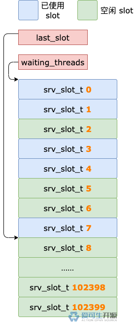

# 19 期 | 锁模块里有什么？什么样？

**原文链接**: https://opensource.actionsky.com/19-%e6%9c%9f-%e9%94%81%e6%a8%a1%e5%9d%97%e9%87%8c%e6%9c%89%e4%bb%80%e4%b9%88%ef%bc%9f%e4%bb%80%e4%b9%88%e6%a0%b7%ef%bc%9f/
**分类**: 技术干货
**发布时间**: 2024-06-05T16:18:08-08:00

---

InnoDB 中管理表锁和行锁的锁模块，也就是传说中的锁子系统，在内存里是什么样的？
> 作者：操盛春，爱可生技术专家，公众号『一树一溪』作者，专注于研究 MySQL 和 OceanBase 源码。
爱可生开源社区出品，原创内容未经授权不得随意使用，转载请联系小编并注明来源。
本文基于 MySQL 8.0.32 源码，存储引擎为 InnoDB。
## 1. 引言
前面三篇文章，我们分别介绍了 InnoDB 表锁、行锁，以及它们的锁结构。
表锁结构和行锁结构是锁模块的基础组成部分，它们就像一块砖，哪里需要哪里搬。
然而，要盖房子，光有砖不行，还得有钢筋、水泥等材料，这些材料就由锁模块结构提供。
锁模块结构只有一个对象（`lock_sys`），在 InnoDB 中是全局唯一的。
## 2. 锁模块结构
锁模块结构类型为 `lock_sys_t`，去掉注释以及两个无关紧要的属性之后，简化如下：
`struct lock_sys_t {
locksys::Latches latches;
hash_table_t *rec_hash;
hash_table_t *prdt_hash;
hash_table_t *prdt_page_hash;
Lock_mutex wait_mutex;
srv_slot_t *waiting_threads;
srv_slot_t *last_slot;
bool rollback_complete;
std::chrono::steady_clock::duration n_lock_max_wait_time;
os_event_t timeout_event;
}
`
单从属性数量上看，锁模块结构并不复杂，甚至可以说比较简单。
其实，锁模块的复杂性，不在于表锁结构、行锁结构，也不在于锁模块结构，而是在于各个事务、各种加锁场景相互交错导致的错综复杂的加锁结果。
例如，一个事务等待获得另一个事务持有的锁，虽然会出现或长或短的等待链，但也不算太坏的情况。更坏的情况是出现了环形的等待链，也就是出现了死锁。
如果出现死锁，我们又需要被动复现死锁，以解释形成死锁的原因，那简直头大了。
为了不滑入复杂的深渊，我们就此打住，先来介绍锁模块结构的属性。
锁模块结构中有三个类型为 hash_table_t 的属性，分别是 `rec_hash`、`prdt_hash`、`prdt_page_hash`。
其中，prdt_hash、prdt_page_hash 由谓词锁使用。我们并不打算介绍谓词锁，忽略这两个属性，也就顺理成章了。
**n_lock_max_wait_time** 属性的值是 MySQL 本次启动以来，`行锁`的最长等待时间。通过以下命令可以查询到这个属性的值：
`show status like 'innodb_row_lock_time_max';
+--------------------------+-------+
| Variable_name            | Value |
+--------------------------+-------+
| Innodb_row_lock_time_max | 50157 |
+--------------------------+-------+
`
**rollback_complete** 属性，用于 MySQL 启动过程中，标识从 undo 日志中恢复出来的、需要回滚的事务是否已全部回滚完成。
如果 rollback_complete = false，说明从 undo 日志中恢复出来的、需要回滚的事务还没有全部回滚完成，InnoDB 会遍历读写事务链表（`trx_sys->rw_trx_list`），释放这些事务加的表锁和行锁。
这些事务全部回滚完成之后，rollback_complete 会被修改为 true。
前面介绍了锁模块结构中两个比较简单的属性，剩下的其它属性，我们分为几个小节一一介绍。
### 2.1 谁来管理行锁结构？
上一篇文章，我们介绍过，事务对多条记录加行锁，满足条件时，可以共用一个行锁结构。
虽然共用能减少行锁结构的数量，但是，同一时刻，InnoDB 中可能还是有很多行锁结构。
这么多行锁结构，要怎么组织，用到时才能方便、快速的找到呢？
这就需要用到锁模块结构的 rec_hash 属性了。
**rec_hash** 属性是个哈希表，它的类型为 `hash_table_t`，创建锁模块对象（`lock_sys`）之后分配内存：
`void lock_sys_create(ulint n_cells)
{
...
// 创建锁模块对象，分配内存
lock_sys = static_cast<lock_sys_t *>(
ut::zalloc_withkey(...));
...
// 创建哈希表（rec_hash），分配内存
lock_sys->rec_hash =
ut::new_<hash_table_t>(n_cells);
...
}
`
lock_sys_create() 由 srv_start() 调用：
`dberr_t srv_start(bool create_new_db) {
...
lock_sys_create(srv_lock_table_size);
...
}
`
变量 srv_lock_table_size 在 innodb_init_params() 中赋值，它的值会传递给 lock_sys_create() 的参数 n_cells。
`static int innodb_init_params() {
...
srv_lock_table_size = 
5 * (srv_buf_pool_size / UNIV_PAGE_SIZE);
...
}
`
`srv_buf_pool_size` 是 buffer pool 的大小，`UNIV_PAGE_SIZE` 是一个数据页的大小，它们的单位都是字节。
以 buffer pool 大小为 128M、数据页大小为 16K 为例，变量 srv_lock_table_size 的值计算如下：
`// 128M = 134217728 字节
// 16K  = 16384 字节
srv_lock_table_size = 5 * (134217728 / 16384) 
= 40960
`
变量 srv_lock_table_size 的值（40960）最终会传递给 lock_sys_create() 的参数 n_cells。用 40960 替换 n_cells 之后如下：
`void lock_sys_create(ulint n_cells)
{
...
lock_sys->rec_hash = 
ut::new_<hash_table_t>(40960);
...
}
`
以上代码说明 buffer pool 大小为 128M，数据页大小为 16K 时，锁模块结构的 rec_hash 属性有 40960 个格子。
每个格子都有编号，从 0 开始，一直到 40959。

这些格子并不是用来存储行锁结构，而是用来管理行锁结构，它们的作用相当于线头，找到了线头就能牵出一根线。
创建行锁结构之后，会先根据行锁结构中那些记录所属数据页的页号和表空间 ID，计算得到哈希值，再根据哈希值计算得到格子的编号。
多个行锁结构可能计算得到相同的哈希值，从而得到相同的编号，对应到同一个格子，这些行锁结构通过各自的 `hash` 属性形成一个行锁结构链表。如果我们把这个链表看成一根线，这个格子就是这根线的线头。
计算出格子编号之后，行锁结构会插入到格子对应的行锁结构链表的最前面。
想要找到某个行锁结构，也需要根据同样的规则，计算得到格子编号，再根据编号找到格子，最后遍历这个格子对应的行锁结构链表，以找到目标行锁结构。
### 2.2 谁来保护表锁和行锁结构？
前面我们介绍了 rec_hash 是个哈希表，分为很多格子，每个格子管理一个行锁结构链表。同一个链表的所有行锁结构，计算得到的哈希值相同。
事务加行锁时，会优先考虑共用已有的行锁结构，这就要先找到一个可以共用的行锁结构。
首先，需要找到 rec_hash 的某个格子。
然后，遍历这个格子对应的行锁结构链表，并根据共用条件，判断某个行锁结构是否可以共用。
事务加行锁时，如果生成了新的行锁结构，需要找到 rec_hash 的某个格子，把行锁结构插入到这个格子对应的行锁结构链表的最前面。
事务提交或回滚时，释放所有行锁，需要找到每个锁结构在哪个格子对应的行锁结构链表中，并从链表中删除这个行锁结构。
事务加表锁时，会遍历这个表对象的 locks 链表，以判断可以立即获得表锁，还是需要进入等待状态。
事务提交或回滚时，释放所有表锁，需要从每个表对象的 locks 链表中删除这个表锁结构。
多个事务执行上面这些操作，可能会同时读写 rec_hash 中某个格子对应的行锁结构链表，也可能同时读写某个表对象的 locks 链表。
为了避免并发操作同时读写同一个行锁结构链表、或者同时读写同一个表对象的 locks 链表出现冲突，需要有个什么东西，来限制同一时刻只有一个事务读写某个行锁结构链表、或者某个表对象的 locks 链表。
于是，就有了锁模块结构的 `latches` 属性，它的类型为 locksys::Latches。
`class Latches {
private:
...
Unique_sharded_rw_lock global_latch;
Page_shards page_shards;
Table_shards table_shards;
...
}
`
latches 也是一个对象，有三个属性，分别为 `global_latch`、`page_shards`、`table_shards`。
事务提交或回滚时，释放所有行锁和表锁会用到 global_latch。
事务加行锁时，会用到 page_shards。
事务加表锁时，会用到 table_shards。
page_shards、table_shards 的类型分为 `Page_shards`、`Table_shards`，定义如下：
`static constexpr size_t SHARDS_COUNT = 512;
class Page_shards {
...
Padded_mutex mutexes[SHARDS_COUNT];
...
}
class Table_shards {
...
Padded_mutex mutexes[SHARDS_COUNT];
...
}
`
Page_shards 的 mutexes 属性是个数组，有 512 个元素。

有新的行锁结构需要加入某个行锁结构链表，或者需要遍历某个行锁结构链表以找到目标行锁结构时，会根据行锁结构中那些记录所属数据页的页号和表空间 ID，计算得到哈希值，再根据哈希值计算得到数组下标，到 mutexes 数组中拿到下标对应的互斥量，就可以保护需要读写的行锁结构链表了。
Table_shards 的 mutexes 属性也是个数组，同样有 512 个元素。

某个表对象的 locks 链表需要保护时，会直接用表 ID 对 512 取模（`table_id % 512`），得到的结果作为数组下标，到 mutexes 数组中拿到下标对应的互斥量，就可以保护这个表对象的 locks 链表了。
### 2.3 锁等待了怎么办？
锁模块结构中，有三个属性和锁等待相关，分别是 `wait_mutex`、`waiting_threads`、`last_slot`，它们的初始化代码如下：
`void lock_sys_create(ulint n_cells)
{
ulint lock_sys_sz;
// 锁模块结构占用的内存大小
// 加上 waiting_threads 指向的内存区域的大小
// 因为这两部分要一起分配内存
lock_sys_sz = sizeof(*lock_sys) 
+ srv_max_n_threads 
* sizeof(srv_slot_t);
...
void *ptr = &lock_sys[1];
lock_sys->waiting_threads = 
static_cast<srv_slot_t *>(ptr);
// 初始化时
// last_slot 和 waiting_threads 指向同一个位置
lock_sys->last_slot = 
lock_sys->waiting_threads;
mutex_create(LATCH_ID_LOCK_SYS_WAIT, 
&lock_sys->wait_mutex);
...
}
`
**waiting_threads** 属性是个指针，它指向一片内存区域，这片内存区域分为 srv_max_n_threads 个 slot，每个 slot 存放一个 srv_slot_t 对象。
srv_max_n_threads 在 innodb_init_params() 中赋值，硬编码为 102400。
也就是说，waiting_threads 属性指向的内存区域，最多可以存放 102400 个 srv_slot_t 对象。

如果某个事务不能立即获得锁（表锁或行锁），就会在这片内存区域中找到一个空闲的 slot，构造一个包含该事务以及锁信息的 srv_slot_t 对象放入这个 slot，并标记这个 slot 为已使用状态。
**last_slot** 属性也是个指针，初始化时，和 `waiting_threads` 属性指向相同的内存地址。

随着不断有事务进入锁等待状态、以及处于锁等待状态的事务获得锁，last_slot 会不断变化。
不过，不管怎么变化，last_slot 始终遵循一个原则，就是它指向的那个 slot，以及之后的所有 slot 都处于空闲状态。
为什么需要 last_slot？
因为后台线程检查锁等待是否超时，会从后往前遍历 waiting_threads 属性指向的内存区域。
如果没有 last_slot，每次遍历都需要从最后一个 slot 开始，到第一个 slot 为止，检查每个 slot 对应的锁等待是否超时。
然而，通常情况下，waiting_threads 属性指向的内存区域中的 102400 个 slot，其中大部分都是空闲的。
空闲 slot 没有被正在等待锁的事务占用，实际上不需要检查锁等待是否超时。
如果没有 last_slot，每次检查锁等待是否超时，都要遍历所有 slot，显然很浪费时间。
为了提升检查锁等待超时的效率，只需要遍历已使用状态的 slot 就可以了，这就需要有个东西来标识哪个范围内的 slot 是已使用状态，于是，就有了 last_slot。
**有一点需要说明**，如果某个事务曾经进入过锁等待状态，占用了某个 slot。某一轮检查锁等待超时之前，这个事务获得了锁，又会把它占用的那个 slot 重置为空闲状态。
所以，last_slot 之前的那些 slot，并不全部是已使用状态，也有一些是空闲的，但是这个数量应该不会很多，遍历这些少量的空闲 slot，也不会浪费太多时间。

介绍完 waiting_threads、last_slot，终于轮到 wait_mutex 属性了。
从属性名上看，**wait_mutex** 属性显然是个互斥量。
多个事务同时读写 last_slot 属性，可能造成冲突，这就需要有个东西来保证同一时刻只有一个线程读写 last_slot 属性，于是就有了 `wait_mutex`。
### 2.4 那就发个锁等待通知
事务想要加锁（表锁或行锁），如果发生了锁等待，新出现的锁等待，和原来那些锁等待搅和在一起，有可能会出现死锁。
为了及时发现死锁，事务进入锁等待状态之前，会触一个事件，通知后台线程出现了锁等待。
这个事件就保存在锁模块结构的 **timeout_event** 属性中。
监听 timeout_event 事件的后台线程收到通知之后，就会开始检查是否发生了死锁。如果检查发现了死锁，就及时解决。
## 3. 总结
锁模块结构的 rec_hash 属性是个哈希表，分为很多小格子，每个格子管理一个行锁结构链表。
latches 属性用于保证同一时刻只有一个线程读写 rec_hash 属性的同一个格子对应的行锁结构链表，以及同一时刻只有一个线程读写同一个表对象的 locks 链表。
waiting_threads 属性指向一片分为 102400 个 slot 的内存区域，每个等待获得锁的事务会占用其中一个 slot。
last_slot 属性用于减少检查锁等待超时需要遍历的 slot 数量，提升效率。
wait_mutex 属性用于保证同一时刻只有一个线程读写 last_sot 属性。
timeout_event 属性用于发生锁等待时，通知后台线程及时检查是否出现了死锁。