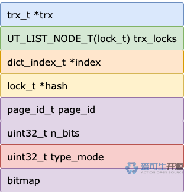
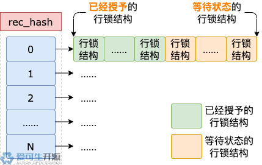

# 21 期 | 行锁 (1) 快速加锁

**原文链接**: https://opensource.actionsky.com/21-%e6%9c%9f-%e8%a1%8c%e9%94%81-1-%e5%bf%ab%e9%80%9f%e5%8a%a0%e9%94%81/
**分类**: 技术干货
**发布时间**: 2024-06-23T18:01:01-08:00

---

行锁有两种加锁逻辑，这一期我们聊聊其中之一的快速加锁。
> 作者：操盛春，爱可生技术专家，公众号『一树一溪』作者，专注于研究 MySQL 和 OceanBase 源码。
爱可生开源社区出品，原创内容未经授权不得随意使用，转载请联系小编并注明来源。
行锁有两种加锁逻辑，这一期我们聊聊其中之一的快速加锁。
> 本文基于 MySQL 8.0.32 源码，存储引擎为 InnoDB。
## 1. 两种加锁逻辑
更新、删除记录都需要加行锁，读取、插入记录有时候也需要加行锁，这意味着加行锁是个比较频繁的操作。
对于频繁的操作，为了性能着想，优化是件必须要做的事。
为此，InnoDB 把加行锁操作分为两种逻辑：快速加锁、慢速加锁。
每次加行锁，只要满足快速加锁条件，就会走快速加锁逻辑，提升加锁效率，不满足时，才走慢速加锁逻辑。
## 2. 先拿个令牌
前面我们介绍过锁模块结构，它有个 `rec_hash` 属性，是个哈希表，用于管理 InnoDB 中所有的行锁结构。
学习过哈希表的读者应该有所了解，哈希表通常使用数组作为底层数据结构，来管理加入其中的对象。
既然 rec_hash 是个哈希表，它自然也用数组来管理行锁结构了。
数组有多少个单元，由 InnoDB 的 buffer pool 大小和一个数据页大小共同决定。**计算公式如下：**
`// srv_buf_pool_size 为 buffer pool 大小
// UNIV_PAGE_SIZE 为一个数据页大小
// 两者的单位都是字节
5 * (srv_buf_pool_size / UNIV_PAGE_SIZE)
`
用一句话来概括上面的公式，那就是 buffer pool 中能存放的数据页数量的 5 倍。
对于哈希表，有一个必须要解决的问题是**哈希冲突**。
哈希冲突指的是加入哈希表的多个对象，有可能计算得到相同的哈希值，这种情况下，多个对象会映射到同一个数组单元。
rec_hash 解决冲突的方式，是把出现冲突的多个行锁结构串起来，形成一个链表。这样一来，出现冲突的那个数组单元，管理的就是包含多个行锁结构的链表，而不只是单个行锁结构。
没有出现冲突的数组单元怎么办？
它们各自管理的也是行锁结构链表，只是这些链表有点特殊，它们都只包含一个行锁结构。
每个数组单元都管理一个行锁结构链表，多个事务加行锁、事务提交或回滚时，如果同时读、写行锁结构链表，有可能会出现打架的情况。
> **读**，指的是遍历行锁结构链表。
**写**，指的是把行锁结构加入链表，或者从链表中删除行锁结构。
为了避免多个事务打架，每个事务读、写行锁结构链表之前，都需要先拿到一个令牌，然后才能读、写行锁结构链表。
这里说的令牌是个稀缺物件，rec_hash 的每个数组单元只对应一个令牌。
多个事务读、写同一个数组单元管理的行锁结构链表，需要等待前面拿到令牌的事务把令牌还回去之后，等待中的事务才能按照先来后到的顺序拿到令牌。
前面介绍加表锁的流程时，我们说过 InnoDB 使用**互斥量**实现令牌。
加行锁的流程也同样使用互斥量来实现令牌。
InnoDB 为 rec_hash 的数组准备了 512 个互斥量，保存到一个名为 `mutexes` 的数组里。
每个事务读、写一个行锁结构链表之前，都需要获得这个链表对应的令牌，也就是 mutexes 数组中保存的某个互斥量。获得互斥量的步骤如下：
- 根据数据页的页号、表空间 ID 计算得到哈希值。
- 上一步的哈希值，对 rec_hash 的数组单元数量取模（**哈希值 % 数组单元数量**），得到一个结果。
- 上一步的结果，对 mutexes 数组中保存的互斥量数量取模（**上一步的结果 % 512**），得到数组下标。
- 根据上一步的数组下标，找到 mutexes 数组中对应的互斥量，然后申请获得这个互斥量（这一步可能需要等待）。
上面的第一个步骤，没来由的出现了数据页的`页号`、`表空间 ID`，是不是有点莫名其妙？
别急，现在是时候介绍它们两个了。
前面说过，读行锁结构链表，指的就是遍历行锁结构链表。这个操作通常出现在加行锁之前。
每次加行锁，都只会对一条记录加锁。遍历行锁结构链表之前，需要获得互斥量，第一个步骤中数据页的页号、表空间 ID，指的就是加行锁的这条记录所属数据页的页号、表空间 ID。
写行锁结构链表，指的是把行锁结构加入链表，或者从链表中删除行锁结构。
每个行锁结构都有个 `page_id` 属性，里面保存了这个行锁结构对应数据页的页号、表空间 ID。
写行锁结构链表之前，需要获得互斥量，第一个步骤中数据页的页号、表空间 ID，指的就是要加入链表或者要从链表中删除的行锁结构的 page_id 属性中保存的数据页的页号、表空间 ID。
## 3. 再获取行锁结构
InnoDB 每次加行锁，都只会对一条记录加锁。
加行锁时，经过前面介绍的获得互斥量的步骤之后，接下来要做的，是看看 rec_hash 中有没有加锁记录所属数据页对应的锁结构。这个操作的流程如下。
**第 1 步**，根据加锁记录所属数据页的页号、表空间 ID 计算得到哈希值。
**第 2 步**，上一步的哈希值，对 rec_hash 的数组单元数量取模（**哈希值 % 数组单元数量**），得到 rec_hash 的数组下标。
**第 3 步**，根据上一步的数组下标，得到对应的行锁结构链表。
**第 4 步**，遍历行锁结构链表，每次取一个行锁结构，然后判断这个行锁结构对应的数据页，是否和加锁记录所属的数据页相同。
碰到满足这个条件的第一个行锁结构，就结束遍历，这个行锁结构作为本次遍历的结果。
当然了，还有一种可能，就是遍历完整个链表，都没有满足这个条件的行锁结构。
不管上面的流程有没有找到行锁结构，结果都非常重要，因为这个结果是 InnoDB 决定走快速加锁逻辑还是慢速加锁逻辑的关键。
## 4. 快速加锁之一
前面获取加锁记录所属数据页的第一个行锁结构，如果没有获取到，说明不会有任何事务阻塞本次加行锁操作，可以走快速加速逻辑。
因为没有获取到加锁记录所属数据页的行锁结构，也就没有可以共用的行锁结构，所以需要为加锁记录申请一个新的行锁结构。
和表锁结构一样，申请新的行锁结构也分为两种情况。
**情况 1**，使用预先创建的行锁结构。
每个事务对象初始化时，会创建 8 个行锁结构，供事务运行过程中加行锁使用。
事务加行锁需要新的锁结构时，只要预先创建的这些行锁结构，还有空闲的，就可以拿一个来使用。
如果预先创建的行锁结构都被已经被使用了，那就进入`情况 2`。
**情况 2**，创建新的行锁结构。
创建过程的第一步是申请一块内存，这块内存分为两部分。
`第一部分`，用于存储行锁结构，大小为 96 字节。
`第二部分`，是 bitmap 内存区域，用于标识这个行锁结构对应的数据页中有哪些记录加了锁。这部分的大小由加锁记录所属数据页中的记录数量决定。具体计算逻辑如下：
`static size_t lock_size(const page_t *page) {
// 数据页中的记录数量
ulint n_recs = page_dir_get_n_heap(page);
/* Make lock bitmap bigger by a safety margin */
return (1 + ((n_recs + LOCK_PAGE_BITMAP_MARGIN) / 8));
}
`
以上代码中，n_recs 为数据页中的记录数量，`LOCK_PAGE_BITMAP_MARGIN` 为 64。
以加锁记录所属数据页中包含 6 条记录为例，利用上面的公式来计算 bitmap 内存区域的大小。
`// 70 整除 8，结果为 8
1 + ((6 + 64) / 8) = 1 + (70 / 8) = 1 + 8 = 9
`
> 关于 bitmap 内存区域，前面介绍行锁结构时，我们有过详细介绍，这里不再赘述。
分配内存之后，接下来要初始化行锁结构的各属性，以及 bitmap 内存区域。各属性中，需要重点介绍的是 `type_mode`。
对于行锁结构，type_mode 属性的锁模式、锁类型、精确模式三个区域都会初始化。

type_mode 属性的第 1 ~ 4 位，是锁模式区域，本次加行锁的锁模式作为一个整数，写入这块区域中。
type_mode 属性的第 6 位会被设置为 1，表示这个锁结构对应的锁类型是行锁。
进入快速加锁逻辑，说明本次加行锁不需要等待，type_mode 属性的第 9 位**不会**被设置为 1。

上图是行锁结构的所有属性，除 type_mode 属性外，其它属性的初始化没有什么特殊的，不一一介绍了。
行锁结构的各属性初始化完成之后，就轮到 `bitmap` 内存区域了。
首先，这块内存区域的所有位都会被置为 0，然后本次加锁记录对应的位会被设置为 1。
后面的事务加行锁时，发现这个位被置为 1，就知道它对应的记录加了锁。
行锁结构的各属性、bitmap 内存区域初始化完成之后，就得到了一个已经初始化的行锁结构，接下来需要把它加入两个链表。
首先，把行锁结构加入 rec_hash 中某个数组单元对应的行锁结构链表，这个过程分为几个步骤：
- 根据加锁记录所属数据页的页号、表空间 ID 计算得到哈希值。
- 上一步的哈希值，对 rec_hash 的数组单元数量取模（**哈希值 % 数组单元数量**），得到 rec_hash 的数组下标。
- 根据上一步的数组下标，得到对应的行锁结构链表，并返回链表中的第一个行锁结构。
- 新的行锁结构放到第一个行锁结构之前，也就是加入链表的头部。

然后，新的行锁结构加入事务对象的 trx_locks 链表的尾部。

## 5. 快速加锁之二
前面获取加锁记录所属数据页的第一个行锁结构，如果获取到了，情况就复杂了一点点，因为既有可能走快速加锁逻辑，也有可能走慢速加锁逻辑。
如果这个锁结构命中了慢速加锁条件中的任何一个，就只能乖乖的走慢速加锁逻辑了，否则，也可以走快速加锁逻辑。
至于慢速加锁条件有哪些，先按下不表，稍后再说。
我们先来介绍第二种快速加锁逻辑，因为获取到了加锁记录所属数据页的第一个行锁结构，也就有了可以复用的行锁结构，本次加行锁不用再申请新的行锁结构。
因为不需要申请新的行锁结构，这种快速加锁逻辑比较简单，分为两种情况。
**情况 1**，如果获取到的行锁结构中，bitmap 内存区域对应本次加锁记录的位已经被设置为 1，说明当前事务已经对这条记录加了锁，本次加行锁的流程到此结束。
**情况 2**，如果获取到的行锁结构中，bitmap 内存区域对应本次加锁记录的位还是 0，那就把这个位设置为 1，本次加行锁的流程也就结束了。
## 6. 慢速加锁条件有哪些？
介绍第二种快速加锁逻辑时，我们提到了慢速加锁条件，现在是时候聊聊它们了。慢速加锁条件决定了走慢速加锁逻辑，还是走第二种快速加锁逻辑。
慢速加锁条件有四个，只要满足其中一个，就得乖乖的走慢速加锁逻辑。
**条件 1**，加锁记录所属的数据页，有两个或多个锁结构。这些锁结构有可能由一个或多个事务创建，这些事务可能包含，也可能不包含本次加锁的事务。
**条件 2**，前面获取到了加锁记录所属数据页的第一个行锁结构，但是这个锁结构不是当前事务创建的。
**条件 3**，获取到的第一个行锁结构的锁模式，和本次要加的行锁的锁模式不同。
**条件 4**，获取到的第一个行锁结构的 bitmap 内存区域空间不够，没有本次加锁记录对应的位，不能用于本次加锁操作。
## 7. 总结
快速条件的主要流程如下：
- 获取加锁记录所属数据页对应的第一个行锁结构（不管这个行锁结构是当前事务创建的，还是其它事务创建的）。
- 如果上一步没有获取到行锁结构，可以走第一种快速加锁逻辑。
首先，需要申请一个新的行锁结构，并初始化行锁结构的各属性、bitmap 内存区域。
然后，把行锁结构加入 rec_hash 中某个数组下标对应的行锁结构链表、当前事务对象的 trx_locks 链表。
- 如果上一步获取到了行锁结构，并且没有命中任何一个慢速加锁条件，可以走第二种快速加锁逻辑。
这种加锁逻辑很简单，只需要把行锁结构的 bitmap 内存区域中，本次加锁记录对应的位设置为 1（如果之前已经设置为 1，本次不需要重复操作）。