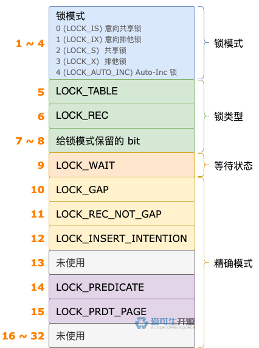

# 23 期 | 锁等待

**原文链接**: https://opensource.actionsky.com/23-%e6%9c%9f-%e9%94%81%e7%ad%89%e5%be%85/
**分类**: 技术干货
**发布时间**: 2024-07-02T23:51:07-08:00

---

> 本文基于 MySQL 8.0.32 源码，存储引擎为 InnoDB。
## 1. 先排队
不管是加表锁，还是加行锁，如果不能立即获得锁，加锁事务都需要进入锁等待状态。
事务进入锁等待状态，需要用锁结构来排队。和立即获得锁时的锁结构一样，这个锁结构的各属性都已经初始化完成。不同之处在于，它被设置为等待状态。
表锁、行锁处于等待状态时，都不能共用锁结构，而是需要申请一个新的锁结构。
每个事务对象初始化时，会预先创建 8 个表锁结构、8 个行锁结构。
事务执行过程中加锁，需要申请新的锁结构时，如果预先创建的表锁结构、行锁结构还有空闲的，可以直接找一个对应的空闲锁结构来使用，没有空闲的，则需要创建一个对应的锁结构。
事务拿到新的锁结构之后，会把 `type_mode` 属性的第 9 位设置为 1，表示这个锁结构处于等待状态。

> 关于申请新的表锁结构、行锁结构的详细逻辑，以及各属性的初始化，可以看前面对应的文章，这里不再赘述。
锁结构的各属性初始化完成之后，加锁事务就具备加入排队大军的条件了。
多个事务对同一个表加表锁，每个事务都会申请一个表锁结构。这些表锁结构通过各自的 `locks` 属性形成一个链表，我们称之为 **locks 链表**。
对于表锁，锁结构加入表对象的 locks 链表的末尾，排队过程就开始了。
多个事务对同一个数据页中的记录加行锁，一个事务对多个数据页中的记录加行锁，也会申请多个行锁结构。
映射到 rec_hash 的数组中同一个单元的多个行锁结构，通过各自的 `hash` 属性形成一个链表。
处于等待状态的行锁结构，加入这个链表的末尾，排队过程也就开始了。

同一个事务创建的一个或多个表锁结构、一个或多个行锁结构，通过各自的 `trx_locks` 属性形成一个链表，我们称之为 **trx_locks 链表**。
不管是表锁结构，还是行锁结构，都需要加入 `trx_locks 链表`。表锁结构会加入链表的头部，行锁结构会加入链表的末尾。

## 2. 再登记
开始排队之后，跟着队伍慢慢前进，等轮到自己获得锁不就行了，又搞出来个登记，岂不是多此一举？
我们可以通过生活中的场景来理解一下为什么要弄个登记逻辑。
某个周六，小明去找 Tony 老师剪头发。
距店一步之遥时，打眼一看：咦？店里没什么人，来的正是时候。
正美着呢，到了店门口，有个热情的小哥出来迎接。
小哥笑着说：哥，来拿个号。
小明面露不悦之色，嘀咕道：都没什么人，还拿什么号？
小哥依然笑魇如花，解释说：今天人很多，要等挺长时间。好多人不想干等，拿了号排队，留下手机号之后，都去逛了。快轮到他们时，我就打电话通知他们来。
听小哥说完，小明也只好拿了号排队，留下手机号，逛去了（看！他拉着谁的手？）。
书归正传，和上面的场景一样，加锁需要等待时，也要先排个队，然后登个记。
锁等待的登记，当然不是留手机号了，而是找到一个 slot，再把加锁的相关信息记录到这个 slot 的对象中。
前面介绍锁模块的初始化时，我们知道了锁模块有个 `waiting_threads` 属性，指向一片内存区域。
这片内存区域有 srv_max_n_threads 个 slot，每个 slot 存放一个 srv_slot_t 对象。
锁等待时，InnoDB 会从 waiting_threads 指向的第一个 slot 开始遍历，碰到第一个空闲的 slot（`in_use` 属性值为 false），就登记上。
登记的主要步骤如下：
- slot 的 in_use 属性值修改为 true，表示这个 slot 不再空闲。
- 锁等待的超时时间保存到 wait_timeout 属性中，供后台线程检查锁等待超时使用。
- 修改 slot 的其它属性，不一一介绍了。
- 通知后台线程发生了锁等待。
完成以上步骤之后，登记过程就结束了。
## 3. 坐等通知
登记完成之后，就可以坐等通知了吗？
别急，还有一件小小的情况需要做。
如果本次加的是行锁，InnoDB 还需要记录锁等待的开始时间，这个开始时间就是当前时间。
如果本次加的是表锁，不会记录锁等待的开始时间，因为 server 层触发 InnoDB 加表锁时，锁等待的开始时间由 server 层记录。
InnoDB 自己发起的加表锁操作，不计算锁等待消耗的时间，也就不需要记录开始时间了。
记录锁等待的开始时间这件小事完成了，就可以坐等通知了。
发生以下事件时，锁等待的事务会收到通知：
- 锁等待超时了。
- 其它事务释放锁时，当前事务获得了锁。
- 解决死锁时，当前事务被选择成为受害者。
## 4. 总结
锁等待的流程比较简单，主要步骤如下：
- 申请一个锁结构，加入链表，开始排队。
- 找到一个空闲的 slot，把加锁的相关信息记录到这个 slot 的对象中，完成登记工作。
- 如果加的是行锁，还需要记录锁等待的开始时间。
- 坐等通知。