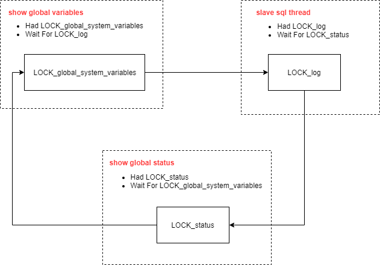

# GDB定位Percona MySQL5.7特定版本死锁hang死的故障分析#92108

**原文链接**: https://opensource.actionsky.com/20190325-percona-hang/
**分类**: 技术干货
**发布时间**: 2019-03-25T21:19:13-08:00

---

## 问题背景
某环境上有一组Percona MySQL 5.7.23-23的半同步主从. 我们采用Prometheus监控框架，按其接口规范自研了独立的exporter用于监控数据采集.类似于[mysqld_exporter](https://github.com/prometheus/mysqld_exporter),工作方式大致为:
* 开启一个http端口
* 采集本机MySQL状态(简单的show语句)
* 将状态发布到http端口.
exporter工作模式比较简单,理论上不会对数据库造成严重影响.
但在数据库节点上部署启动exporter后，发现数据库的连接状态异常,对业务产生了一定影响.
- 1.检查连接可用性
1.1通过TCP检查连接可用性 &#8212; 新连接无法建立!!
- 1.2通过Socket检查连接可用性 &#8212; 仍然无法建立连接
- 2.已连接的业务报错查询超时
- 3.检查mysql-error.log &#8212; 没有任何内容
- 4.检查系统日志 &#8212; 没有任何相关信息
- 5.观察系统资源占用,无异常占用
为何再正常不过的状态采集会导致如此大的问题? 由于日志中已经无法继续判断原因. 所以迅速采集调用栈信息:
`pstack $(pgrep -xn mysqld)
`
[如何采集mysql调用栈信息](https://www.ibm.com/developerworks/cn/linux/l-cn-deadlock/index.html)
## 问题分析
梳理exporter对数据库发起的SQL语句:
* show global variables
* show global status
* show master status
* show slave status
通过SQL语句列表和调用栈信息,大致可以观测出MySQL内部出现了Mutex死锁.
死锁关系如下:
[](https://i.loli.net/2019/03/26/5c99b4d82e960.png)
- 1.SHOW GLOBAL VARIABLES
持有LOCK_global_system_variables, 等待LOCK_log
- 2.SLAVE SQL THREAD
持有LOCK_log, 等待LOCK_status
- 3.SHOW GLOBAL STATUS
持有LOCK_status, 等待LOCK_global_system_variables
我们来看下每部分的调用栈信息.
`源码部分基于Percona MySQL 5.7.23-23`
### SHOW GLOBAL VARIABLES
`Thread 18 (Thread 0x7fad69737700 (LWP 3588)):
#0  0x00007fdd3527642d in __lll_lock_wait () from /lib64/libpthread.so.0
#1  0x00007fdd35271dcb in _L_lock_812 () from /lib64/libpthread.so.0
#2  0x00007fdd35271c98 in pthread_mutex_lock () from /lib64/libpthread.so.0
#3  0x0000000000d60a5e in PolyLock_lock_log::rdlock() ()
#4  0x0000000000c3e4d5 in sys_var::value_ptr(THD*, THD*, enum_var_type, st_mysql_lex_string*) ()
#5  0x0000000000d1ce70 in get_one_variable_ext(THD*, THD*, st_mysql_show_var const*, enum_var_type, enum_mysql_show_type, system_status_var*, charset_info_st const**, char*, unsigned long*) ()
#6  0x0000000000d1cee1 in get_one_variable(THD*, st_mysql_show_var const*, enum_var_type, enum_mysql_show_type, system_status_var*, charset_info_st const**, char*, unsigned long*) ()
#7  0x0000000000d2234c in show_status_array(THD*, char const*, st_mysql_show_var*, enum_var_type, system_status_var*, char const*, TABLE_LIST*, bool, Item*) ()
#8  0x0000000000d27ec6 in fill_variables(THD*, TABLE_LIST*, Item*) ()
#9  0x0000000000d1550c in do_fill_table(THD*, TABLE_LIST*, QEP_TAB*) ()
#10 0x0000000000d286ac in get_schema_tables_result(JOIN*, enum_schema_table_state) ()
#11 0x0000000000d0afed in JOIN::prepare_result() ()
#12 0x0000000000c9a2cf in JOIN::exec() ()
#13 0x0000000000d0b93d in handle_query(THD*, LEX*, Query_result*, unsigned long long, unsigned long long) ()
#14 0x00000000007625d8 in execute_sqlcom_select(THD*, TABLE_LIST*) ()
#15 0x0000000000ccd191 in mysql_execute_command(THD*, bool) ()
#16 0x0000000000cd06f5 in mysql_parse(THD*, Parser_state*) ()
#17 0x0000000000cd12bd in dispatch_command(THD*, COM_DATA const*, enum_server_command) ()
#18 0x0000000000cd2cff in do_command(THD*) ()
#19 0x0000000000d9c8f8 in handle_connection ()
#20 0x0000000000f18904 in pfs_spawn_thread ()
#21 0x00007fdd3526fe25 in start_thread () from /lib64/libpthread.so.0
#22 0x00007fdd3344434d in clone () from /lib64/libc.so.6
`
#### 关键代码
```
/**sql\set_var.cc:267**/
uchar *sys_var::value_ptr(THD *running_thd, ...)
{
mysql_mutex_assert_owner(&LOCK_global_system_variables);
}
/**sql\sys_vars.cc:3788**/
void PolyLock_lock_log::rdlock()
{
mysql_mutex_lock(mysql_bin_log.get_log_lock());
}
```
### SLAVE SQL THREAD
```
Thread 25 (Thread 0x7fad7c0f5700 (LWP 47842)):
#0  0x00007fdd3527642d in __lll_lock_wait () from /lib64/libpthread.so.0
#1  0x00007fdd35271e01 in _L_lock_1022 () from /lib64/libpthread.so.0
#2  0x00007fdd35271da2 in pthread_mutex_lock () from /lib64/libpthread.so.0
#3  0x0000000000e92d37 in MYSQL_BIN_LOG::publish_coordinates_for_global_status() const ()
#4  0x0000000000e99791 in MYSQL_BIN_LOG::ordered_commit(THD*, bool, bool) ()
#5  0x0000000000e9ccbf in MYSQL_BIN_LOG::commit(THD*, bool) ()
#6  0x00000000008084d1 in ha_commit_trans(THD*, bool, bool) ()
#7  0x0000000000d7c9c9 in trans_commit(THD*) ()
#8  0x0000000000e65efb in Xid_log_event::do_commit(THD*) ()
#9  0x0000000000e69b45 in Xid_apply_log_event::do_apply_event(Relay_log_info const*) ()
#10 0x0000000000e6f5dd in Log_event::apply_event(Relay_log_info*) ()
#11 0x0000000000eb87f6 in apply_event_and_update_pos(Log_event**, THD*, Relay_log_info*) ()
#12 0x0000000000ec4e90 in handle_slave_sql ()
#13 0x0000000000f18904 in pfs_spawn_thread ()
#14 0x00007fdd3526fe25 in start_thread () from /lib64/libpthread.so.0
#15 0x00007fdd3344434d in clone () from /lib64/libc.so.6
```
#### 关键代码
```
/**sql\binlog.cc:10424*//
void MYSQL_BIN_LOG::publish_coordinates_for_global_status(void) const
{
mysql_mutex_assert_owner(&LOCK_log);
mysql_mutex_lock(&LOCK_status);
}
```
### SHOW GLOBAL STATUS
```
Thread 14 (Thread 0x7fad69633700 (LWP 3613)):
#0  0x00007fdd3527642d in __lll_lock_wait () from /lib64/libpthread.so.0
#1  0x00007fdd35271e01 in _L_lock_1022 () from /lib64/libpthread.so.0
#2  0x00007fdd35271da2 in pthread_mutex_lock () from /lib64/libpthread.so.0
#3  0x0000000000d222eb in show_status_array(THD*, char const*, st_mysql_show_var*, enum_var_type, system_status_var*, char const*, TABLE_LIST*, bool, Item*) ()
#4  0x0000000000d29860 in fill_status(THD*, TABLE_LIST*, Item*) ()
#5  0x0000000000d1550c in do_fill_table(THD*, TABLE_LIST*, QEP_TAB*) ()
#6  0x0000000000d286ac in get_schema_tables_result(JOIN*, enum_schema_table_state) ()
#7  0x0000000000d0afed in JOIN::prepare_result() ()
#8  0x0000000000c9a2cf in JOIN::exec() ()
#9  0x0000000000d0b93d in handle_query(THD*, LEX*, Query_result*, unsigned long long, unsigned long long) ()
#10 0x00000000007625d8 in execute_sqlcom_select(THD*, TABLE_LIST*) ()
#11 0x0000000000cca8a6 in mysql_execute_command(THD*, bool) ()
#12 0x0000000000cd06f5 in mysql_parse(THD*, Parser_state*) ()
#13 0x0000000000cd12bd in dispatch_command(THD*, COM_DATA const*, enum_server_command) ()
#14 0x0000000000cd2cff in do_command(THD*) ()
#15 0x0000000000d9c8f8 in handle_connection ()
#16 0x0000000000f18904 in pfs_spawn_thread ()
#17 0x00007fdd3526fe25 in start_thread () from /lib64/libpthread.so.0
#18 0x00007fdd3344434d in clone () from /lib64/libc.so.6
```
#### 关键代码
```
/**sql\sql_show.cc:8020*//
int fill_status(THD *thd, TABLE_LIST *tables, Item *cond)
{
...
mysql_mutex_lock(&LOCK_status);
}
/**sql\sql_show.cc:3061**/
static bool show_status_array(THD *thd, const char *wild,SHOW_VAR *variables, ...)
{
...
mysql_mutex_lock(&LOCK_global_system_variables);
```
### 问题1: 新连接为什么无法建立?
#### 连接请求时的调用栈
```
Thread 6 (Thread 0x7fad6942b700 (LWP 4343)):
#0  0x00007fdd3527642d in __lll_lock_wait () from /lib64/libpthread.so.0
#1  0x00007fdd35271e01 in _L_lock_1022 () from /lib64/libpthread.so.0
#2  0x00007fdd35271da2 in pthread_mutex_lock () from /lib64/libpthread.so.0
#3  0x0000000000c88ff7 in THD::init() ()
#4  0x0000000000c8be9f in THD::THD(bool) ()
#5  0x0000000000e54a1a in Channel_info::create_thd() ()
#6  0x0000000000d9fede in Channel_info_tcpip_socket::create_thd() ()
#7  0x0000000000d9c7c2 in handle_connection ()
#8  0x0000000000f18904 in pfs_spawn_thread ()
#9  0x00007fdd3526fe25 in start_thread () from /lib64/libpthread.so.0
#10 0x00007fdd3344434d in clone () from /lib64/libc.so.6
```
连接的初始化需要LOCK_global_system_variables, 此mutex被占用.导致新连接无法初始化
`/**sql\sql_class.cc:1629**/
void THD::init(void)
{
mysql_mutex_lock(&LOCK_global_system_variables);
...
mysql_mutex_unlock(&LOCK_global_system_variables);
/*
`
新连接请求发起时一直被挂起,没有任何响应,现象如下:
`[root@localhost /]# mysql -uroot -p -S /mysql/data/mysqld.sock
Enter password:
^C^C^C^C^C
`
### 问题2:查询操作为什么超时?
#### 查询操作的调用栈
```
Thread 16 (Thread 0x7fad696b5700 (LWP 3597)):
#0  0x00007fdd3527642d in __lll_lock_wait () from /lib64/libpthread.so.0
#1  0x00007fdd35271e01 in _L_lock_1022 () from /lib64/libpthread.so.0
#2  0x00007fdd35271da2 in pthread_mutex_lock () from /lib64/libpthread.so.0
#3  0x0000000000876508 in Item_func_get_system_var::fix_length_and_dec() ()
#4  0x000000000087953d in Item_func::fix_fields(THD*, Item**) ()
#5  0x0000000000c72485 in setup_fields(THD*, Bounds_checked_array<Item*>, List<Item>&, unsigned long, List<Item>*, bool, bool) ()
#6  0x0000000000d072d5 in st_select_lex::prepare(THD*) ()
#7  0x0000000000d0ba79 in handle_query(THD*, LEX*, Query_result*, unsigned long long, unsigned long long) ()
#8  0x00000000007625d8 in execute_sqlcom_select(THD*, TABLE_LIST*) ()
#9  0x0000000000ccd191 in mysql_execute_command(THD*, bool) ()
#10 0x0000000000cd06f5 in mysql_parse(THD*, Parser_state*) ()
#11 0x0000000000cd12bd in dispatch_command(THD*, COM_DATA const*, enum_server_command) ()
#12 0x0000000000cd2cff in do_command(THD*) ()
#13 0x0000000000d9c8f8 in handle_connection ()
#14 0x0000000000f18904 in pfs_spawn_thread ()
#15 0x00007fdd3526fe25 in start_thread () from /lib64/libpthread.so.0
#16 0x00007fdd3344434d in clone () from /lib64/libc.so.6
```
SQL查询时也需要LOCK_global_system_variables, 此mutex被占用,导致查询被阻塞.
`/**sql\item_func.cc:7275**/
void Item_func_get_system_var::fix_length_and_dec()
{
...
mysql_mutex_lock(&LOCK_global_system_variables);
}
`
## 问题结论
经过一轮分析,我们基本找到问题原因. 但心中还存在疑问.
1. LOCK_global_system_variables是热点的mutex,大概率会出现争用,但不至于死锁.
2. show global variables操作为何需要LOCK_log?
3. 这样常用的查询真的会稳定导致数据库死锁么?
进一步搜索,发现社区已有类似的缺陷反馈:
https://bugs.mysql.com/bug.php?id=92108
该缺陷可理解为:
MySQL 5.7.22引入了如下两个参数:
* [binlog_transaction_dependency_tracking](https://dev.mysql.com/doc/refman/5.7/en/replication-options-binary-log.html#sysvar_binlog_transaction_dependency_tracking)
* [binlog_transaction_dependency_history_size](https://dev.mysql.com/doc/refman/5.7/en/replication-options-binary-log.html#sysvar_binlog_transaction_dependency_history_size)　
在5.7.23版本中,读取这两个参数需要LOCK_log.从而会导致各种各样的死锁(bug正文中提到了另外一种场景).
在5.7.25版本以后,这两个参数的读取使用了另外一种影响更低的lock,从而避免了本文以及bug中提到的死锁.
## 问题处理
对于环境中出现死锁的这一组Percona MySQL 5.7.23-23半同步主从,我们使用5.7.25-28版本进行了升级.升级后此问题消失.至此可以基本确定导致问题的根本原因