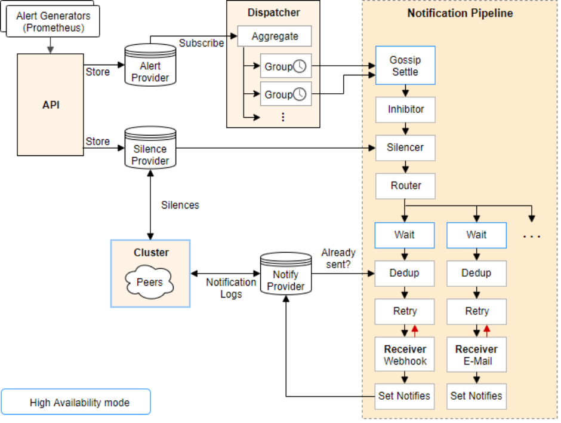

# 技术分享 | AlertManager 源码解析

**原文链接**: https://opensource.actionsky.com/20221116-alertmanager/
**分类**: 技术干货
**发布时间**: 2022-11-15T19:04:21-08:00

---

作者：石蓓蓓
爱可生研发工程师，主要负责爱可生产品云DMP树产品的研发工作。
本文来源：原创投稿
*爱可生开源社区出品，原创内容未经授权不得随意使用，转载请联系小编并注明来源。
AlertManager 是处理对应用程序的告警的，比如Promethus的服务端。对于输入的告警，会经过分组、抑制、静默、去重等步骤，最终并将告警发送到接受者（邮箱等）。
alertManager 的框架图如下：

今天主要是分享 AlertManager 中 Pipeline 相关的流程代码，pipeline 主要是用来处理分组后的告警，经过抑制、静默、去重，然后发送。
首先在创建 Pipeline 的时候，会创建 GossipSettleStage 、MuteStage（包含抑制和静默）、WaitStage 、DedupStage 、RetryStage 、SetNotifiesStage 。
// New returns a map of receivers to Stages.
func (pb *PipelineBuilder) New(
receivers map[string][]Integration,
wait func() time.Duration,
inhibitor *inhibit.Inhibitor,
silencer *silence.Silencer,
notificationLog NotificationLog,
peer *cluster.Peer,
) RoutingStage {
rs := make(RoutingStage, len(receivers))
ms := NewGossipSettleStage(peer)
is := NewMuteStage(inhibitor)
ss := NewMuteStage(silencer)
for name := range receivers {
st := createReceiverStage(name, receivers[name], wait, notificationLog, pb.metrics)
rs[name] = MultiStage{ms, is, ss, st}
}
return rs
}
// createReceiverStage creates a pipeline of stages for a receiver.
func createReceiverStage(
name string,
integrations []Integration,
wait func() time.Duration,
notificationLog NotificationLog,
metrics *metrics,
) Stage {
var fs FanoutStage
for i := range integrations {
recv := &nflogpb.Receiver{
GroupName:   name,
Integration: integrations[i].Name(),
Idx:         uint32(integrations[i].Index()),
}
var s MultiStage
s = append(s, NewWaitStage(wait))
s = append(s, NewDedupStage(&integrations[i], notificationLog, recv))
s = append(s, NewRetryStage(integrations[i], name, metrics))
s = append(s, NewSetNotifiesStage(notificationLog, recv))
fs = append(fs, s)
}
return fs
}
从上面的代码可以看到 AlertManager 在某一通道处理时会经过 GossipSettleStage 、MuteStage（包含抑制和静默）、WaitStage 、DedupStage 、RetryStage 、SetNotifiesStage 这7个 stage ，并且顺序执行。
Pipeline 的执行是遍历了所有的 stage ，每次执行 Exec 方法（见代码的第8行），且每次执行后返回的 alert 列表是下一步的参数（第8行的代码对传入的参数alerts赋予新的告警值，再下次执行Exec的时候传入的alerts的值是新的值），最终得到的alert列表是经过每次过滤后的告警列表
func (ms MultiStage) Exec(ctx context.Context, l log.Logger, alerts ...*types.Alert) (context.Context, []*types.Alert, error) {
var err error
for _, s := range ms {
if len(alerts) == 0 {
return ctx, nil, nil
}
ctx, alerts, err = s.Exec(ctx, l, alerts...)
if err != nil {
return ctx, nil, err
}
}
return ctx, alerts, nil
}
#### GossipSettle
等待集群准备完毕。
func (n *GossipSettleStage) Exec(ctx context.Context, l log.Logger, alerts ...*types.Alert) (context.Context, []*types.Alert, error) {
if n.peer != nil {
n.peer.WaitReady()
}
return ctx, alerts, nil
}
#### Inhibitor 抑制
抑制首先是会执行MuteStage的Exec，再匹配到后，就不会发送告警。主要是执行第6行的n.muter.Mutes方法来进行匹配：
func (n *MuteStage) Exec(ctx context.Context, l log.Logger, alerts ...*types.Alert) (context.Context, []*types.Alert, error) {
var filtered []*types.Alert
for _, a := range alerts {
// TODO(fabxc): increment total alerts counter.
// Do not send the alert if muted.
if !n.muter.Mutes(a.Labels) {
filtered = append(filtered, a)
} else {
n.postMuteHandle(a)
}
// TODO(fabxc): increment muted alerts counter if muted.
}
return ctx, filtered, nil
}
抑制条件是如何匹配的呢？
我们在设置抑制规则时，会设置抑制源和抑制目标。在启动 Inhibitor 的时候，会先匹配抑制源（也就是Source），如果某条告警的 label 满足抑制源的条件，则会被放入 scache 中（第17行进行匹配，在21行时匹配成功写入 scache 中）。
func (ih *Inhibitor) run(ctx context.Context) {
it := ih.alerts.Subscribe()
defer it.Close()
for {
select {
case <-ctx.Done():
return
case a := <-it.Next():
if err := it.Err(); err != nil {
level.Error(ih.logger).Log("msg", "Error iterating alerts", "err", err)
continue
}
// Update the inhibition rules' cache.
for _, r := range ih.rules {
if r.IsExpressionMatch {
if matched, err := r.SourceExpMatcher.Match(a.Labels); err != nil {
level.Error(ih.logger).Log("msg", "Error expression match alerts", "err", err)
continue
} else if matched {
if err := r.scache.Set(a); err != nil {
level.Error(ih.logger).Log("msg", "error on set alert", "err", err)
}
}
} else if r.SourceMatchers.Match(a.Labels) {
if err := r.scache.Set(a); err != nil {
level.Error(ih.logger).Log("msg", "error on set alert", "err", err)
}
}
}
}
}
}
此时如果有新产生的告警正好满足抑制规则的抑制目标（也就是 target）规则，那么这条规则会被通过方法 SetInhibited 设置成为抑制。在被设置为抑制时，被抑制的告警也会被设置抑制源告警的指纹。
// Mutes returns true if the given label set is muted. It implements the Muter
// interface.
func (ih *Inhibitor) Mutes(lset model.LabelSet) bool {
fp := lset.Fingerprint()
for _, r := range ih.rules {
if r.IsExpressionMatch {
if targetMatched, err := r.TargetExpMatcher.Match(lset); err != nil {
level.Error(ih.logger).Log("msg", "Error inhibitor expression match alerts", "err", err)
continue
} else {
if !targetMatched {
continue
}
}
} else {
if !r.TargetMatchers.Match(lset) {
// If target side of rule doesn't match, we don't need to look any further.
continue
}
}
// If we are here, the target side matches. If the source side matches, too, we
// need to exclude inhibiting alerts for which the same is true.
sourceMatched := false
if r.IsExpressionMatch {
if matched, err := r.SourceExpMatcher.Match(lset); err != nil {
level.Error(ih.logger).Log("msg", "Error inhibitor expression match alerts", "err", err)
continue
} else {
sourceMatched = matched
}
} else {
sourceMatched = r.SourceMatchers.Match(lset)
}
if inhibitedByFP, eq := r.hasEqual(ih.logger, lset, sourceMatched); eq {
ih.marker.SetInhibited(fp, inhibitedByFP.String())
return true
}
}
ih.marker.SetInhibited(fp)
return false
}
#### Silencer 静默
静默规则执行MuteStage的Exec，新的告警的labels匹配到静默规则的条件后，新的告警就会被静默，通过SetInhibited进行标记，同时会设置抑制源告警的指纹
// Mutes implements the Muter interface.
func (s *Silencer) Mutes(lset model.LabelSet) bool {
fp := lset.Fingerprint()
ids, markerVersion, _ := s.marker.Silenced(fp)
var (
err        error
sils       []*pb.Silence
newVersion = markerVersion
)
if markerVersion == s.silences.Version() {
// No new silences added, just need to check which of the old
// silences are still revelant.
if len(ids) == 0 {
// Super fast path: No silences ever applied to this
// alert, none have been added. We are done.
return false
}
// This is still a quite fast path: No silences have been added,
// we only need to check which of the applicable silences are
// currently active. Note that newVersion is left at
// markerVersion because the Query call might already return a
// newer version, which is not the version our old list of
// applicable silences is based on.
sils, _, err = s.silences.Query(
QIDs(ids...),
QState(types.SilenceStateActive),
)
} else {
// New silences have been added, do a full query.
sils, newVersion, err = s.silences.Query(
QState(types.SilenceStateActive),
QMatches(lset),
)
}
if err != nil {
level.Error(s.logger).Log("msg", "Querying silences failed, alerts might not get silenced correctly", "err", err)
}
if len(sils) == 0 {
s.marker.SetSilenced(fp, newVersion)
return false
}
idsChanged := len(sils) != len(ids)
if !idsChanged {
// Length is the same, but is the content the same?
for i, s := range sils {
if ids[i] != s.Id {
idsChanged = true
break
}
}
}
if idsChanged {
// Need to recreate ids.
ids = make([]string, len(sils))
for i, s := range sils {
ids[i] = s.Id
}
sort.Strings(ids) // For comparability.
}
if idsChanged || newVersion != markerVersion {
// Update marker only if something changed.
s.marker.SetSilenced(fp, newVersion, ids...)
}
return true
}
#### WaitStage
WaitStage 表示向其他实例发送 Notification Log 的时间间隔，只是单纯的时间等待。
// Exec implements the Stage interface.
func (ws *WaitStage) Exec(ctx context.Context, l log.Logger, alerts ...*types.Alert) (context.Context, []*types.Alert, error) {
select {
case <-time.After(ws.wait()):
case <-ctx.Done():
return ctx, nil, ctx.Err()
}
return ctx, alerts, nil
}
#### DedupStage
DedupStage 主要是通过计算告警的hash值来起到去重的作用。
func (n *DedupStage) Exec(ctx context.Context, l log.Logger, alerts ...*types.Alert) (context.Context, []*types.Alert, error) {
gkey, ok := GroupKey(ctx)
if !ok {
return ctx, nil, fmt.Errorf("group key missing")
}
repeatInterval, ok := RepeatInterval(ctx)
if !ok {
return ctx, nil, fmt.Errorf("repeat interval missing")
}
firingSet := map[uint64]struct{}{}
resolvedSet := map[uint64]struct{}{}
firing := []uint64{}
resolved := []uint64{}
var hash uint64
for _, a := range alerts {
hash = n.hash(a)
if a.Resolved() {
resolved = append(resolved, hash)
resolvedSet[hash] = struct{}{}
} else {
firing = append(firing, hash)
firingSet[hash] = struct{}{}
}
}
ctx = WithFiringAlerts(ctx, firing)
ctx = WithResolvedAlerts(ctx, resolved)
entries, err := n.nflog.Query(nflog.QGroupKey(gkey), nflog.QReceiver(n.recv))
if err != nil && err != nflog.ErrNotFound {
return ctx, nil, err
}
var entry *nflogpb.Entry
switch len(entries) {
case 0:
case 1:
entry = entries[0]
default:
return ctx, nil, fmt.Errorf("unexpected entry result size %d", len(entries))
}
if n.needsUpdate(entry, firingSet, resolvedSet, repeatInterval) {
return ctx, alerts, nil
}
return ctx, nil, nil
}
#### RetryStage
主要是根据不同的通道来发送告警，如果失败，会进行重试。
func (r RetryStage) Exec(ctx context.Context, l log.Logger, alerts ...*types.Alert) (context.Context, []*types.Alert, error) {
var sent []*types.Alert
// If we shouldn't send notifications for resolved alerts, but there are only
// resolved alerts, report them all as successfully notified (we still want the
// notification log to log them for the next run of DedupStage).
if !r.integration.SendResolved() {
firing, ok := FiringAlerts(ctx)
if !ok {
return ctx, nil, fmt.Errorf("firing alerts missing")
}
if len(firing) == 0 {
return ctx, alerts, nil
}
for _, a := range alerts {
if a.Status() != model.AlertResolved {
sent = append(sent, a)
}
}
} else {
sent = alerts
}
var (
i    = 0
b    = backoff.NewExponentialBackOff()
tick = backoff.NewTicker(b)
iErr error
)
defer tick.Stop()
for {
i++
// Always check the context first to not notify again.
select {
case <-ctx.Done():
if iErr != nil {
return ctx, nil, iErr
}
return ctx, nil, ctx.Err()
default:
}
select {
case <-tick.C:
now := time.Now()
retry, err := r.integration.Notify(ctx, sent...)
r.metrics.notificationLatencySeconds.WithLabelValues(r.integration.Name()).Observe(time.Since(now).Seconds())
r.metrics.numNotifications.WithLabelValues(r.integration.Name()).Inc()
if err != nil {
r.metrics.numFailedNotifications.WithLabelValues(r.integration.Name()).Inc()
level.Debug(l).Log("msg", "Notify attempt failed", "attempt", i, "integration", r.integration.Name(), "receiver", r.groupName, "err", err)
if !retry {
return ctx, alerts, fmt.Errorf("cancelling notify retry for %q due to unrecoverable error: %s", r.integration.Name(), err)
}
// Save this error to be able to return the last seen error by an
// integration upon context timeout.
iErr = err
} else {
return ctx, alerts, nil
}
case <-ctx.Done():
if iErr != nil {
return ctx, nil, iErr
}
return ctx, nil, ctx.Err()
}
}
}
#### SetNotifiesStage
SetNotifiesStage 主要是用来确保告警已经发送给 了通道，并记录到 alertManager 的日志中。
func (n SetNotifiesStage) Exec(ctx context.Context, l log.Logger, alerts ...*types.Alert) (context.Context, []*types.Alert, error) {
gkey, ok := GroupKey(ctx)
if !ok {
return ctx, nil, fmt.Errorf("group key missing")
}
firing, ok := FiringAlerts(ctx)
if !ok {
return ctx, nil, fmt.Errorf("firing alerts missing")
}
resolved, ok := ResolvedAlerts(ctx)
if !ok {
return ctx, nil, fmt.Errorf("resolved alerts missing")
}
return ctx, alerts, n.nflog.Log(n.recv, gkey, firing, resolved)
}