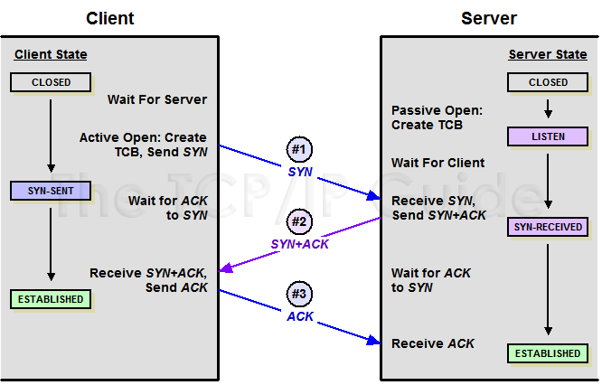
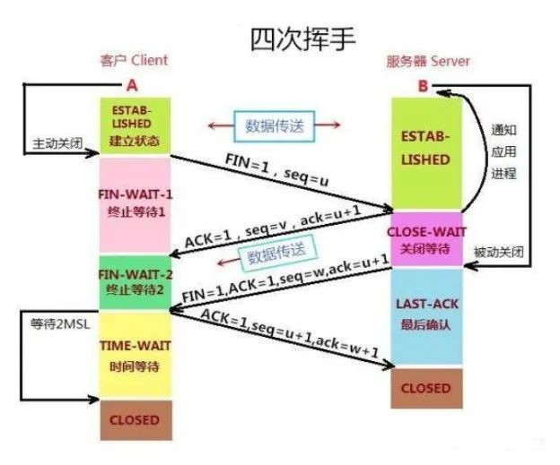
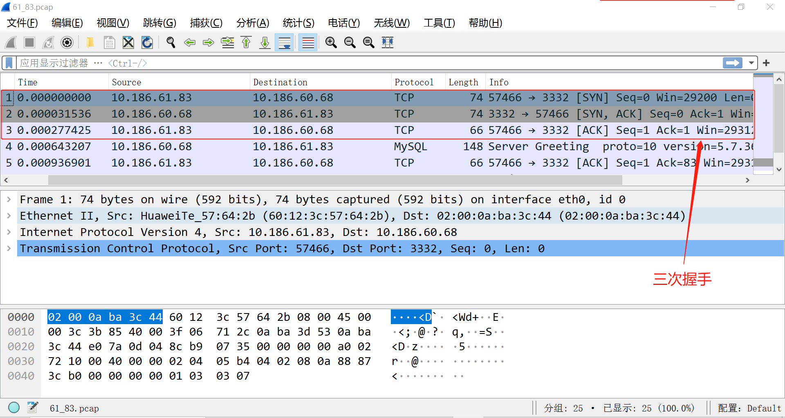
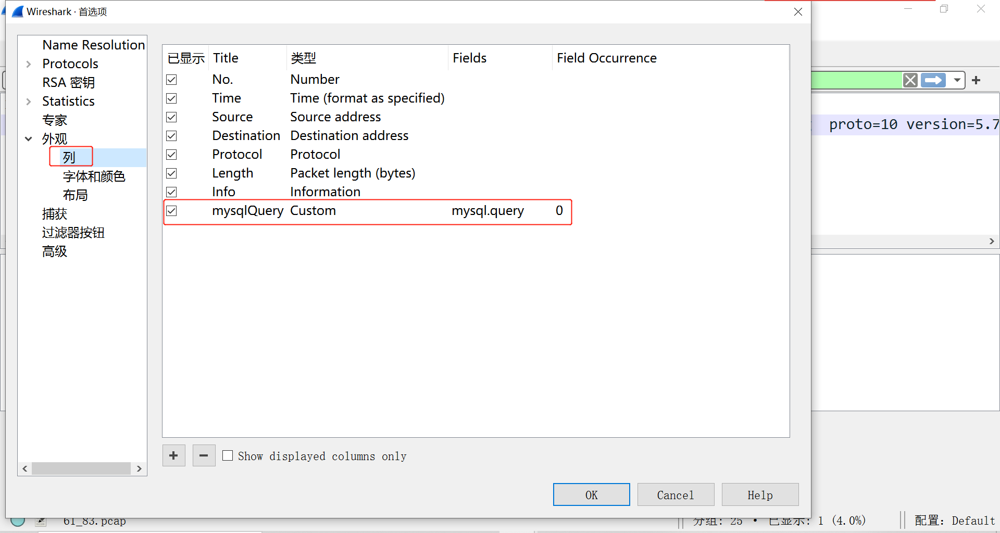
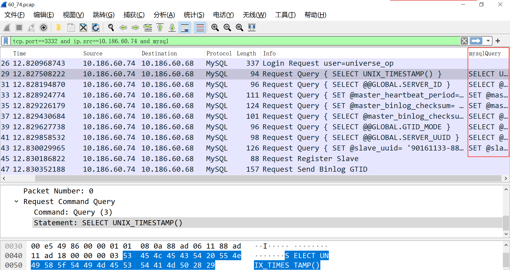

# 技术分享 | DBA 抓包神器 tshark 测评

**原文链接**: https://opensource.actionsky.com/%e6%8a%80%e6%9c%af%e5%88%86%e4%ba%ab-dba-%e6%8a%93%e5%8c%85%e7%a5%9e%e5%99%a8-tshark-%e6%b5%8b%e8%af%84/
**分类**: 技术干货
**发布时间**: 2023-06-13T02:02:35-08:00

---

> 
作者：赵黎明
爱可生 MySQL DBA 团队成员，熟悉 Oracle、MySQL 等数据库，擅长数据库性能问题诊断、事务与锁问题的分析等，负责处理客户 MySQL 及我司自研 DMP 平台日常运维中的问题，对开源数据库相关技术非常感兴趣。
本文来源：原创投稿
- 爱可生开源社区出品，原创内容未经授权不得随意使用，转载请联系小编并注明来源。
# 常用抓包工具
tshark、tcpdump 和 Wireshark 都是网络抓包工具，它们可以在网络上捕获和分析数据包。
## tcpdump
一个开源的，基于命令行的网络抓包工具。它可以捕获和分析网络数据包，运行在几乎所有的 Unix 和 Linux 系统上；可以抓取实时网络通信中的数据包，然后通过过滤器及其他参数，对数据包进行解析和处理。
## tshark
Wireshark 的命令行版本，也是一个开源的网络分析工具。它可以在命令行下捕获和分析网络流量数据，并使用 Wireshark 的过滤器来提取所需的数据，还支持与各种脚本语言（如 Python 和 Perl）结合使用，以自动化分析过程。
## Wireshark
是一个流行的网络协议分析器，支持从在线网络或本地文件中捕获数据包，并提供了图形化用户界面来展示数据包内容；可以解析并显示各种网络协议，并提供了强大的分析工具以及过滤器；与 tshark 和 tcpdump 相比，Wireshark 的优势在于它提供了友好的 GUI 界面，使用户更轻松地进行网络协议的分析和调试。
## 小结
以上这些工具都可以直接捕获和分析网络数据包，但它们在使用方式和功能上略有不同；通常，我们会先用 tcpdump 或 tshark 在目标服务器上抓包生成 pcap 文件，再将其拿到装有 Wireshark 的主机上进行分析，本文将会分享 tshark 和 Wireshark 的一些使用技巧。
# 三次握手和四次挥手
TCP 协议中的三次握手和四次挥手是 TCP 连接建立和关闭的过程。
## 三次握手
- 客户端向服务器发送 SYN 报文（请求建立连接）
- 服务器收到 SYN 报文后，回复 SYN+ACK 报文（同意建立连接）
- 客户端收到 SYN+ACK 报文后，再回复 ACK 报文（确认连接建立）

## 四次挥手
- 客户端向服务器发送 FIN 报文（请求断开连接）
- 服务器收到 FIN 报文后，回复 ACK 报文（确认收到请求）
- 当服务器确认数据已经全部发送完毕后，它会向客户端发送 FIN 报文（关闭连接）
- 客户端收到 FIN 报文后，回复 ACK 报文（表示确认收到关闭请求），至此，整个 TCP 连接就被彻底关闭了

三次握手用于建立连接，是双方协商建立 TCP 连接的过程；四次挥手用于断开连接，是双方结束 TCP 连接的过程；不过，有时候四次挥手也会变成三次（如果没有数据发送，2 个包会合并传输）。

# 三次握手和四次挥手的过程
我们可以通过 tshark 抓包来观察 TCP 连接、断开的具体过程。
`-- 在服务端执行 tshark 命令进行抓包
dmp2 (master) ~# tshark -f 'tcp port 3332 and host 10.186.61.83'
Running as user "root" and group "root". This could be dangerous.
Capturing on 'eth0'
==> 等待捕获 TCP 包直到有内容输出
# 此处省略了 -i，默认会选择第一个非 loopback 的网络接口（可简写为 lo），效果与指定 -i eth0 相同
# -f，指定捕获过滤器的表达式，可指定需要捕获的内容，如：协议、端口、主机IP等
-- 通过 MySQL 客户端远程连接到 MySQL 实例，等待片刻后再退出
{master} ~# m3332 -s（此处配置了 alias，可省略具体的连接串）
mysql: [Warning] Using a password on the command line interface can be insecure.
mysql> exit
-- 观察屏幕输出
1、三次握手
从左到右的字段依次代表序号、时间戳（纳秒）、源端 IP、目标端 IP、协议、包的长度（字节）、具体信息（包括源/目标端口号或设备名、标志位等内容）
1 0.000000000 10.186.61.83 -> 10.186.60.68 TCP 74 38858 > mcs-mailsvr [SYN] Seq=0 Win=29200 Len=0 MSS=1460 SACK_PERM=1 TSval=2369606050 TSecr=0 WS=128
2 0.000018368 10.186.60.68 -> 10.186.61.83 TCP 74 mcs-mailsvr > 38858 [SYN, ACK] Seq=0 Ack=1 Win=28960 Len=0 MSS=1460 SACK_PERM=1 TSval=2369617045 TSecr=2369606050 WS=128
3 0.000233161 10.186.61.83 -> 10.186.60.68 TCP 66 38858 > mcs-mailsvr [ACK] Seq=1 Ack=1 Win=29312 Len=0 TSval=2369606050 TSecr=2369617045
4 0.000592420 10.186.60.68 -> 10.186.61.83 TCP 148 mcs-mailsvr > 38858 [PSH, ACK] Seq=1 Ack=1 Win=29056 Len=82 TSval=2369617045 TSecr=2369606050
5 0.000827920 10.186.61.83 -> 10.186.60.68 TCP 66 38858 > mcs-mailsvr [ACK] Seq=1 Ack=83 Win=29312 Len=0 TSval=2369606051 TSecr=2369617045
6 0.000833512 10.186.61.83 -> 10.186.60.68 TCP 102 38858 > mcs-mailsvr [PSH, ACK] Seq=1 Ack=83 Win=29312 Len=36 TSval=2369606051 TSecr=2369617045
7 0.000837263 10.186.60.68 -> 10.186.61.83 TCP 66 mcs-mailsvr > 38858 [ACK] Seq=83 Ack=37 Win=29056 Len=0 TSval=2369617045 TSecr=2369606051
8 0.001997998 10.186.61.83 -> 10.186.60.68 TCP 264 38858 > mcs-mailsvr [PSH, ACK] Seq=37 Ack=83 Win=29312 Len=198 TSval=2369606052 TSecr=2369617045
9 0.002021916 10.186.60.68 -> 10.186.61.83 TCP 66 mcs-mailsvr > 38858 [ACK] Seq=83 Ack=235 Win=30080 Len=0 TSval=2369617047 TSecr=2369606052
10 0.006977223 10.186.60.68 -> 10.186.61.83 TCP 2088 mcs-mailsvr > 38858 [PSH, ACK] Seq=83 Ack=235 Win=30080 Len=2022 TSval=2369617052 TSecr=2369606052
11 0.007227340 10.186.61.83 -> 10.186.60.68 TCP 66 38858 > mcs-mailsvr [ACK] Seq=235 Ack=2105 Win=33280 Len=0 TSval=2369606057 TSecr=2369617052
12 0.008426447 10.186.61.83 -> 10.186.60.68 TCP 171 38858 > mcs-mailsvr [PSH, ACK] Seq=235 Ack=2105 Win=33280 Len=105 TSval=2369606058 TSecr=2369617052
13 0.008812324 10.186.60.68 -> 10.186.61.83 TCP 308 mcs-mailsvr > 38858 [PSH, ACK] Seq=2105 Ack=340 Win=30080 Len=242 TSval=2369617053 TSecr=2369606058
14 0.009099712 10.186.61.83 -> 10.186.60.68 TCP 291 38858 > mcs-mailsvr [PSH, ACK] Seq=340 Ack=2347 Win=36224 Len=225 TSval=2369606059 TSecr=2369617053
15 0.009189644 10.186.60.68 -> 10.186.61.83 TCP 106 mcs-mailsvr > 38858 [PSH, ACK] Seq=2347 Ack=565 Win=31104 Len=40 TSval=2369617054 TSecr=2369606059
16 0.009443936 10.186.61.83 -> 10.186.60.68 TCP 132 38858 > mcs-mailsvr [PSH, ACK] Seq=565 Ack=2387 Win=36224 Len=66 TSval=2369606059 TSecr=2369617054
17 0.009656405 10.186.60.68 -> 10.186.61.83 TCP 187 mcs-mailsvr > 38858 [PSH, ACK] Seq=2387 Ack=631 Win=31104 Len=121 TSval=2369617054 TSecr=2369606059
18 0.049641532 10.186.61.83 -> 10.186.60.68 TCP 66 38858 > mcs-mailsvr [ACK] Seq=631 Ack=2508 Win=36224 Len=0 TSval=2369606100 TSecr=2369617054
# 序号 1-3 的包，即 TCP 三次握手的过程
# 1）1 10.186.61.83 -> 10.186.60.68 TCP 74 38858 > mcs-mailsvr [SYN] Seq=0
# 2）2 10.186.60.68 -> 10.186.61.83 TCP 74 mcs-mailsvr > 38858 [SYN, ACK] Seq=0 Ack=1
# 3）3 10.186.61.83 -> 10.186.60.68 TCP 66 38858 > mcs-mailsvr [ACK] Seq=1 Ack=1 
2、四次挥手（在客户端执行 exit 命令后才会输出）
19 86.744173501 10.186.61.83 -> 10.186.60.68 TCP 100 38858 > mcs-mailsvr [PSH, ACK] Seq=631 Ack=2508 Win=36224 Len=34 TSval=2369692794 TSecr=2369617054
20 86.744194551 10.186.61.83 -> 10.186.60.68 TCP 66 38858 > mcs-mailsvr [FIN, ACK] Seq=665 Ack=2508 Win=36224 Len=0 TSval=2369692794 TSecr=2369617054
21 86.744389417 10.186.60.68 -> 10.186.61.83 TCP 66 mcs-mailsvr > 38858 [FIN, ACK] Seq=2508 Ack=666 Win=31104 Len=0 TSval=2369703789 TSecr=2369692794
22 86.744632203 10.186.61.83 -> 10.186.60.68 TCP 66 38858 > mcs-mailsvr [ACK] Seq=666 Ack=2509 Win=36224 Len=0 TSval=2369692795 TSecr=2369703789
# 序号 20-22 的包，为四次挥手的过程，这里由于服务器并没有数据要传输给客户端，所以将 FIN 和 ACK 合并在一个 TCP 包中了，即所谓的四次挥手变成了三次
# 1）20 19 86.744173501 10.186.61.83 -> 10.186.60.68 TCP 100 38858 > mcs-mailsvr [PSH, ACK] Seq=631 Ack=2508
# 2）21 10.186.60.68 -> 10.186.61.83 TCP 66 mcs-mailsvr > 38858 [FIN, ACK] Seq=2508 Ack=666
# 3）22 10.186.61.83 -> 10.186.60.68 TCP 66 38858 > mcs-mailsvr [ACK] Seq=666 Ack=2509
`
# TCP 包标志位的说明
TCP（传输控制协议）包头部有 6 个标志位（Flag），分别为 URG、ACK、PSH、RST、SYN、FIN，它们的十六进制值分别为：0x20、0x10、0x08、0x04、0x02、0x01，其中每个标志位的意义如下：
&#8211; URG 标志：紧急指针是否有效
&#8211; ACK 标志：确认号是否有效
&#8211; PSH 标志：Push操作，尽可能快地将数据交给应用层
&#8211; RST 标志：重置连接
&#8211; SYN 标志：发起一个新的连接
&#8211; FIN 标志：释放连接
# tshark常见用法示例
## 1. tshark 以自定义字段来展示信息
`-- 服务端执行抓包
dmp2 (master) ~# tshark -i eth0 -d tcp.port==3332,mysql -f "host 10.186.61.83 and tcp port 3332" -T fields -e frame.time -e ip.host -e tcp.flags
Running as user "root" and group "root". This could be dangerous.
Capturing on 'eth0'
# -T fields，可以指定需要输出的字段，需配合 -e 一起使用，此处将分别打印获取包的时间、主机 IP 及 TCP 的标志位，这些字段会按照 -e 的顺序进行排列展示
# -e，支持多种协议下的字段展示，具体用法查询路径：Wireshark -> 分析 -> 显示过滤器表达式
-- 通过 MySQL 客户端连接实例，执行一个查询，再退出（共有 3 部分：连接、通信、断连）
{master} ~# m3332 -s
mysql: [Warning] Using a password on the command line interface can be insecure.
mysql> select @@version;
@@version
5.7.36-log
mysql> exit
-- 观察屏幕输出
1、三次握手
"Jun  6, 2023 14:41:42.839863403 CST"   10.186.61.83,10.186.60.68       0x00000002
"Jun  6, 2023 14:41:42.839904347 CST"   10.186.60.68,10.186.61.83       0x00000012
"Jun  6, 2023 14:41:42.840263352 CST"   10.186.61.83,10.186.60.68       0x00000010
"Jun  6, 2023 14:41:42.840666158 CST"   10.186.60.68,10.186.61.83       0x00000018
"Jun  6, 2023 14:41:42.841604106 CST"   10.186.61.83,10.186.60.68       0x00000010
"Jun  6, 2023 14:41:42.841612112 CST"   10.186.61.83,10.186.60.68       0x00000018
"Jun  6, 2023 14:41:42.841616568 CST"   10.186.60.68,10.186.61.83       0x00000010
"Jun  6, 2023 14:41:42.842524996 CST"   10.186.61.83,10.186.60.68       0x00000018
"Jun  6, 2023 14:41:42.842550796 CST"   10.186.60.68,10.186.61.83       0x00000010
"Jun  6, 2023 14:41:42.848566815 CST"   10.186.60.68,10.186.61.83       0x00000018
"Jun  6, 2023 14:41:42.848826004 CST"   10.186.61.83,10.186.60.68       0x00000010
"Jun  6, 2023 14:41:42.850258537 CST"   10.186.61.83,10.186.60.68       0x00000018
"Jun  6, 2023 14:41:42.850881377 CST"   10.186.60.68,10.186.61.83       0x00000018
"Jun  6, 2023 14:41:42.851278991 CST"   10.186.61.83,10.186.60.68       0x00000018
"Jun  6, 2023 14:41:42.851395808 CST"   10.186.60.68,10.186.61.83       0x00000018
"Jun  6, 2023 14:41:42.851667278 CST"   10.186.61.83,10.186.60.68       0x00000018
"Jun  6, 2023 14:41:42.851926804 CST"   10.186.60.68,10.186.61.83       0x00000018
"Jun  6, 2023 14:41:42.892409030 CST"   10.186.61.83,10.186.60.68       0x00000010
# 前三个包分别为：0x02 [SYN] 、0x12 [SYN, ACK] 、0x10 [ACK]，即三次握手的过程
# 后面的几个包：0x18 [PSH, ACK]、0x10 [ACK]，是数据传输的过程
2、执行一个查询
"Jun  6, 2023 14:42:19.967273148 CST"   10.186.61.83,10.186.60.68       0x00000018
"Jun  6, 2023 14:42:19.967553321 CST"   10.186.60.68,10.186.61.83       0x00000018
"Jun  6, 2023 14:42:19.967835719 CST"   10.186.61.83,10.186.60.68       0x00000010
# 当 TCP 连接完成后，在数据传输过程中获取的包，其标志位为 0x18 [PSH, ACK] 或 0x10 [ACK]
3、四次挥手
"Jun  6, 2023 14:43:06.157240404 CST"   10.186.61.83,10.186.60.68       0x00000018
"Jun  6, 2023 14:43:06.157833986 CST"   10.186.61.83,10.186.60.68       0x00000011
"Jun  6, 2023 14:43:06.166359966 CST"   10.186.61.83,10.186.60.68       0x00000011
"Jun  6, 2023 14:43:06.166378115 CST"   10.186.60.68,10.186.61.83       0x00000010
"Jun  6, 2023 14:43:06.166971169 CST"   10.186.60.68,10.186.61.83       0x00000011
"Jun  6, 2023 14:43:06.167317550 CST"   10.186.61.83,10.186.60.68       0x00000010
# 看最后 4 个包，0x11 [FIN,ACK]、0x10 [ACK]、0x11 [FIN,ACK]、0x10 [ACK]，这是标准的四次挥手过程
`
## 2. tshark 抓取 MySQL 中执行的 SQL
```
-- 在服务器上执行抓包
dmp2 (master) ~# tshark -f 'tcp port 3332' -Y "mysql.query" -d tcp.port==3332,mysql -T fields -e frame.time -e ip.src -e ip.dst -e mysql.query
Running as user "root" and group "root". This could be dangerous.
Capturing on 'eth0'
# -Y，指定显示过滤器表达式，在单次分析中可以代替 -R 选项，此处表示仅显示 mysql.query 相关的包
# -d，用于指定该抓包会话的协议详细解析器模块，可以执行 tshark -d help 来查看可用的协议（执行虽然会报错，但会显示所有支持的协议），此处表示将 3332 端口上的 TCP 包以 MySQL 协议进行解析
# -T fields -e mysql.query，即可获取符合 MySQL 协议的 SQL 语句
# -e ip.src -e ip.dst 的写法，也可以用 -e ip.host 来替换
-- 先停止从库复制后再启动
zlm@10.186.60.74 [(none)]> stop slave;
Query OK, 0 rows affected (0.06 sec)
zlm@10.186.60.74 [(none)]> start slave;
Query OK, 0 rows affected (0.05 sec)
-- 观察屏幕输出
"Jun  6, 2023 16:11:38.831359581 CST"   10.186.60.74    10.186.60.68    SELECT UNIX_TIMESTAMP()
"Jun  6, 2023 16:11:38.832278722 CST"   10.186.60.74    10.186.60.68    SELECT @@GLOBAL.SERVER_ID
"Jun  6, 2023 16:11:38.832613595 CST"   10.186.60.74    10.186.60.68    SET @master_heartbeat_period= 1000000000
"Jun  6, 2023 16:11:38.832861743 CST"   10.186.60.74    10.186.60.68    SET @master_binlog_checksum= @@global.binlog_checksum
"Jun  6, 2023 16:11:38.833078690 CST"   10.186.60.74    10.186.60.68    SELECT @master_binlog_checksum
"Jun  6, 2023 16:11:38.833278049 CST"   10.186.60.74    10.186.60.68    SELECT @@GLOBAL.GTID_MODE
"Jun  6, 2023 16:11:38.833489342 CST"   10.186.60.74    10.186.60.68    SELECT @@GLOBAL.SERVER_UUID
"Jun  6, 2023 16:11:38.833769721 CST"   10.186.60.74    10.186.60.68    SET @slave_uuid= '90161133-88b1-11ed-bbcc-02000aba3c4a'
# 通过指定 MySQL 协议解析模块，此处捕获到了 MySQL 从实例在启动复制时会执行的 SQL 语句
# 如已用 -d 选项指定了协议、端口等信息时，可省略 -f（抓包过滤器表达式），除非还有其他的过滤需求，但不建议省略 -Y（显示过滤器表达式），否则会输出非常多的信息，以下两种写法是等效的：
tshark -f 'tcp port 3332' -Y "mysql.query" -d tcp.port==3332,mysql -T fields -e frame.time -e ip.host -e mysql.query
tshark -Y "mysql.query" -d tcp.port==3332,mysql -T fields -e frame.time -e ip.host -e mysql.query
-- 获取类型为 Query 的 SQL
dmp2 (master) ~# tshark -i lo -d tcp.port==3332,mysql -Y "mysql.command==3" -T fields -e ip.host -e mysql.query -e frame.time -c 10
Running as user "root" and group "root". This could be dangerous.
Capturing on 'Loopback'
127.0.0.1,127.0.0.1     START TRANSACTION       "Jun  7, 2023 17:17:29.194080437 CST"
127.0.0.1,127.0.0.1     insert ignore into universe.u_delay(source,real_timestamp,logic_timestamp) values ('ustats', now(), 0) "Jun  7, 2023 17:17:29.194306733 CST"
127.0.0.1,127.0.0.1     update universe.u_delay set real_timestamp=now(), logic_timestamp = logic_timestamp + 1 where source = 'ustats'        "Jun  7, 2023 17:17:29.194647464 CST"
127.0.0.1,127.0.0.1     COMMIT  "Jun  7, 2023 17:17:29.194953692 CST"
4 packets captured
# mysql.command=3，表示执行的 SQL 类型为 Query，共支持 30 多种预设值
# 对于熟悉 DMP 的小伙伴，一看便知这是由平台纳管的一个实例，当前正在做时间戳的写入（判断主从延时的依据）
--  获取与 show 相关的 SQL
dmp2 (master) ~# tshark -i lo -d tcp.port==3332,mysql -Y 'mysql.query contains "show"' -T fields -e ip.host -e mysql.query -e frame.time -c 10
Running as user "root" and group "root". This could be dangerous.
Capturing on 'Loopback'
127.0.0.1,127.0.0.1     show slave status       "Jun  7, 2023 17:37:44.672060318 CST"
127.0.0.1,127.0.0.1     show global status      "Jun  7, 2023 17:37:44.672808866 CST"
127.0.0.1,127.0.0.1     show global variables   "Jun  7, 2023 17:37:44.672845236 CST"
127.0.0.1,127.0.0.1     show global variables where Variable_name = 'innodb_flush_log_at_trx_commit' or Variable_name = 'sync_binlog'  "Jun  7, 2023 17:37:44.673036197 CST"
4 packets captured
dmp2 (master) ~# tshark -i lo -d tcp.port==3332,mysql -Y 'mysql.query matches "^show"' -T fields -e ip.host -e mysql.query -e frame.time -c 10
Running as user "root" and group "root". This could be dangerous.
Capturing on 'Loopback'
127.0.0.1,127.0.0.1     show global status      "Jun  7, 2023 17:56:02.671895630 CST"
127.0.0.1,127.0.0.1     show slave status       "Jun  7, 2023 17:56:02.671944388 CST"
127.0.0.1,127.0.0.1     show global variables   "Jun  7, 2023 17:56:02.671998965 CST"
127.0.0.1,127.0.0.1     show master status      "Jun  7, 2023 17:56:02.672673795 CST"
4 packets captured
# contains 使用字符串进行匹配，只要在数据包中存在指定的字符串，就会匹配成功，不论该字符串出现在查询的任何位置
# matches 支持使用正则表达式进行匹配，匹配符合指定规则的数据包，如：^show
# 用 contains/maches 进行匹配查找时，关键词需用双引号包围，此时外层建议使用单引号，因为 maches 进行正则匹配时，外层使用双引号会报错，contains 则不限制
# 以上匹配方式类似模糊查询，但会区分大小写，如果指定 Show 或 SHOW 为关键词，可能获取不到 SQL
```
## 3. tshark 抓取 OB 中执行 SQL
与之前的方法类似，只需调整 IP 地址和端口号即可。
`-- 抓取 5 个 mysql.query 协议的包
[root@10-186-65-73 ~]# tshark -i lo -Y "mysql.query" -d tcp.port==2881,mysql -T fields -e frame.time -e ip.host -e mysql.query -c 5
Running as user "root" and group "root". This could be dangerous.
Capturing on 'Loopback'
"Jun  7, 2023 15:40:12.886615893 CST"   127.0.0.1,127.0.0.1     select /*+ MONITOR_AGENT READ_CONSISTENCY(WEAK) */ __all_tenant.tenant_id, tenant_name, mem_used, access_count, hit_count from v$plan_cache_stat join __all_tenant on v$plan_cache_stat.tenant_id = __all_tenant.tenant_id
"Jun  7, 2023 15:40:12.889500546 CST"   127.0.0.1,127.0.0.1     select /*+ MONITOR_AGENT READ_CONSISTENCY(WEAK) */ tenant_name, tenant_id, case when event_id = 10000 then 'INTERNAL' when event_id = 13000 then 'SYNC_RPC' when event_id = 14003 then 'ROW_LOCK_WAIT' when (event_id >= 10001 and event_id <= 11006) or (event_id >= 11008 and event_id <= 11011) then 'IO' when event like 'latch:%' then 'LATCH' else 'OTHER' END event_group, sum(total_waits) as total_waits, sum(time_waited_micro / 1000000) as time_waited from v$system_event join __all_tenant on v$system_event.con_id = __all_tenant.tenant_id where v$system_event.wait_class <> 'IDLE' and (con_id > 1000 or con_id = 1) group by tenant_name, event_group
2 packets captured
# 执行抓包命令的服务器是 OBServer 集群内的一个节点，2881 是 OB 的对外服务的端口号
# -c，指定抓取 5 个包，实际上只抓到了 2 个符合过滤条件的包
# 从获取的 SQL 语句来看，猜测是由 ocp_monagent 监控组件发起的信息收集相关的 SQL
-- 抓包时过滤包含 “__all_” 视图的 SQL
[root@10-186-65-73 ~]# tshark -i lo -Y 'mysql.query contains "__all_"' -d tcp.port==2881,mysql -T fields -e frame.time -e ip.host -e mysql.query -c 5
Running as user "root" and group "root". This could be dangerous.
Capturing on 'Loopback'
"Jun  7, 2023 18:14:38.895171334 CST"   127.0.0.1,127.0.0.1     select /*+ MONITOR_AGENT READ_CONSISTENCY(WEAK) */ tenant_name, tenant_id, stat_id, value from v$sysstat, __all_tenant where stat_id IN (10000, 10001, 10002, 10003, 10004, 10005, 10006, 140002, 140003, 140005, 140006, 40030, 60019, 60020, 60024, 80040, 80041, 130000, 130001, 130002, 130004, 20000, 20001, 20002, 30000, 30001, 30002, 30005, 30006, 30007, 30008, 30009, 30010, 30011, 30012, 30013, 40000, 40001, 40002, 40003, 40004, 40005, 40006, 40007, 40008, 40009, 40010, 40011, 40012, 40018, 40019, 50000, 50001, 50002, 50004, 50005, 50008, 50009, 50010, 50011, 50037, 50038, 60000, 60001, 60002, 60003, 60004, 60005, 60019, 60020, 60021, 60022, 60023, 60024, 80057, 120000, 120001, 120009, 120008) and (con_id > 1000 or con_id = 1) and __all_tenant.tenant_id = v$sysstat.con_id and class < 1000
"Jun  7, 2023 18:14:38.896653822 CST"   127.0.0.1,127.0.0.1     select /*+ MONITOR_AGENT READ_CONSISTENCY(WEAK) */ tenant_id, tenant_name, sum(total_waits) as total_waits, sum(time_waited_micro) / 1000000 as time_waited from v$system_event join __all_tenant on v$system_event.con_id = __all_tenant.tenant_id where v$system_event.wait_class <> 'IDLE' group by tenant_name
2 packets captured
[root@10-186-65-73 ~]# tshark -i lo -Y 'mysql.query contains "__all_"' -d tcp.port==2881,mysql -T fields -e frame.time -e ip.host -e mysql.query > /tmp/monit_ob.txt
Running as user "root" and group "root". This could be dangerous.
Capturing on 'Loopback'
124 ^C
You have mail in /var/spool/mail/root
[root@10-186-65-73 ~]# cat /tmp/monit_ob.txt |grep -i select|wc -l
# 可用此方法来获取一些常用的 “__all_” 视图相关的监控 SQL
# 将捕获的 SQL 重定向到文本文件，再用 awk 处理一下就能获取完整的 SQL
[root@10-186-65-73 ~]# awk -F " "  '{for (i=7;i<=NF;i++)printf("%s ", $i);print ""}' /tmp/monit_ob.txt|cat -n|head -5
1  select /*+ MONITOR_AGENT READ_CONSISTENCY(WEAK) */ zone, name, value, time_to_usec(now()) as current from __all_zone
2  select /*+ MONITOR_AGENT READ_CONSISTENCY(WEAK) */ __all_tenant.tenant_id, tenant_name, cache_name, cache_size from __all_virtual_kvcache_info, __all_tenant where __all_tenant.tenant_id = __all_virtual_kvcache_info.tenant_id and svr_ip = '10.186.65.73' and svr_port = 2882
3  select /*+ MONITOR_AGENT READ_CONSISTENCY(WEAK) */ case when cnt is null then 0 else cnt end as cnt, tenant_name, tenant_id from (select __all_tenant.tenant_name, __all_tenant.tenant_id, cnt from __all_tenant left join (select count(1) as cnt, tenant as tenant_name from __all_virtual_processlist where svr_ip = '10.186.65.73' and svr_port = 2882 group by tenant) t1 on __all_tenant.tenant_name = t1.tenant_name) t2
4  select /*+ MONITOR_AGENT READ_CONSISTENCY(WEAK) */ case when cnt is null then 0 else cnt end as cnt, tenant_name, tenant_id from (select __all_tenant.tenant_name, __all_tenant.tenant_id, cnt from __all_tenant left join (select count(`state`='ACTIVE' OR NULL) as cnt, tenant as tenant_name from __all_virtual_processlist where svr_ip = '10.186.65.73' and svr_port = 2882 group by tenant) t1 on __all_tenant.tenant_name = t1.tenant_name) t2
5  select /*+ MONITOR_AGENT READ_CONSISTENCY(WEAK) */ __all_tenant.tenant_id, tenant_name, mem_used, access_count, hit_count from v$plan_cache_stat join __all_tenant on v$plan_cache_stat.tenant_id = __all_tenant.tenant_id 
`
## 4. tshark 抓包后用 Wireshark 解析
tshark 也可以像 tcpdump 一样，先在服务器上抓包，再拿到 Wireshark 的图形窗口中做进一步分析。
`-- 抓取 50 个包并生成 pcap 文件
dmp2 (master) ~# tshark -d tcp.port==3332,mysql -f 'tcp port 3332 and host 10.186.61.83' -c 50 -w /tmp/61_83.pcap
Running as user "root" and group "root". This could be dangerous.
Capturing on 'eth0'
# 注意，-w 指定的文件无需提前创建，但抓包会话必须对该目录有写入权限，否则会报权限不足的错误。
`
以下截图为三次握手和四次挥手的过程。


同样地，也可以在 Wireshark 中将 `mysql.query` 字段展示出来：Wireshark -> 编辑 -> 首选项 -> 外观 -> 列 。

以下显示过滤器表达式中的内容表示：将包中 TCP 端口为 3332，源端 IP 地址为 10.186.60.74，协议类型为 MySQL 的内容过滤并展示，效果如图：

# 结语
tshark 作为 Wireshark 的命令行工具，与我们比较熟悉的 tcpdump 相比，有其不少优点：
**1. 更多的过滤条件**
具有比 tcpdump 更多的过滤条件，可以更加精确地过滤所需的数据包，tshark 支持 Wireshark 过滤器语法的全部特性，并提供了更高级的功能。
**2. 更加灵活的输出格式**
可以以不同的文件格式和标准输出打印输出捕获数据，而 tcpdump 的输出格式非常有限。
**3. 更好的可读性和易用性**
输出会更加易于阅读，因为它会对分组进行解析并显示其中包含的各种数据，比如协议、参数和错误信息等。这些信息对数据包分析非常有帮助。
**4. 更加轻量级**
相比于 tcpdump，占用的系统资源较少，并且不需要将所有数据存储在内存中，从而能够处理更大的数据流。
**5. 更多的网络协议**
支持更多的网络协议，包括 IPv6、IS-IS、IPX 等，而 tcpdump 支持的协议种类相对较少。
综上，在一些较为复杂的数据包分析和网络问题诊断场景中，**更推荐使用 tshark**，而对于只需快速捕捉网络流量的简单应用场景，tcpdump 可能会更适合一些。