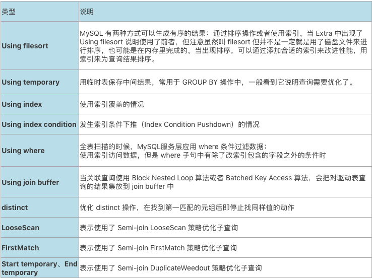
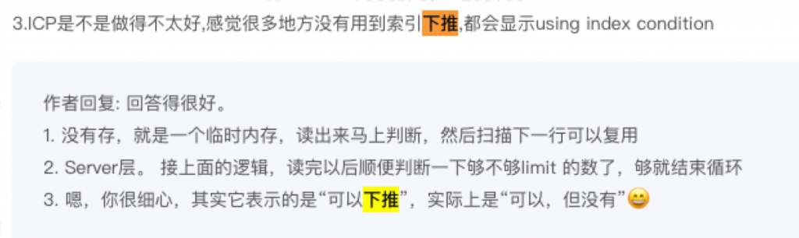

# 技术分享 | EXPLAIN 执行计划详解（2）&#8211;Extra

**原文链接**: https://opensource.actionsky.com/20210208-explain/
**分类**: 技术干货
**发布时间**: 2021-02-07T18:14:21-08:00

---

作者：胡呈清
爱可生 DBA 团队成员，擅长故障分析、性能优化，个人博客：https://www.jianshu.com/u/a95ec11f67a8，欢迎讨论。
本文来源：原创投稿*爱可生开源社区出品，原创内容未经授权不得随意使用，转载请联系小编并注明来源。
## Extra
Extra 是 EXPLAIN 输出中另外一个很重要的列，该列显示 MySQL 在查询过程中的一些详细信息。
											
## Using index
使用索引覆盖的情况下，执行计划的 extra 会显示为 &#8220;Using index&#8221;：
- 查询的字段都包含在使用的索引中；
- where 子句使用的字段也都包含在使用的索引中。
比如：
有组合索引：`idx_a` (`first_name`,`last_name`,`birth_date`)
`mysql> explain select first_name,last_name,birth_date from employees where \
first_name='Mayuri' and last_name like 'Alpay' and birth_date > '1968-01-01'\G
*************************** 1. row ***************************
           id: 1
  select_type: SIMPLE
        table: employees
   partitions: NULL
         type: range
possible_keys: idx_a
          key: idx_a
      key_len: 127
          ref: NULL
         rows: 1
     filtered: 100.00
        Extra: Using where; Using index`
## Using index condition
查询数据时如果使用 index condition down 索引条件下推就会在执行计划的 extra 字段中出现 &#8220;Using index condition&#8221;。
使用二级索引查找数据时，where 条件中属于索引一部分但无法使用索引的条件（比如 like &#8216;%abc&#8217; 左侧字符不确定），MySQL 也会把这部分判断条件下推到存储引擎层，筛选之后再进行回表，这样回表时需要查找的数据就更少。
索引条件下推的特点：
- 下推的条件涉及的字段一定要是使用到的二级索引的一部分，因为二级索引索引存储了这些字段的值，才能进行筛选，所以叫做“索引条件下推”；
- 大幅减小回表时的随机 I/O 开销。因为索引条件下推可以在查找完二级索引后利用条件筛选，减小结果集，减小接下来回表的次数，而回表做的是随机 I/O（开销大），所以能够节省大量的 I/O 开销；
- 大幅减小了存储引擎层到 MySQL 服务层的传输开销。条件下推给了存储引擎层，提前进行筛选，这样返回给 MySQL 服务层的数据就变少了；
- 剩下的不能用到索引的 where 条件还是在 MySQL 服务层生效。
**示例 1**
有一个组合索引：`idx_a` (`first_name`,`last_name`,`birth_date`)
SQL:
`mysql> explain select * from employees where first_name='Mayuri' and last_name like '%Alpay'\G
*************************** 1. row ***************************
           id: 1
  select_type: SIMPLE
        table: employees
   partitions: NULL
         type: ref
possible_keys: idx_a
          key: idx_a
      key_len: 58
          ref: const
         rows: 230
     filtered: 11.11
        Extra: Using index condition
1 row in set, 1 warning (0.00 sec)
`查询的 where 子句中 first_name=&#8217;Mayuri&#8217; 条件可以使用到二级索引 idx_a，而 last_name like &#8216;%Alpay&#8217; 条件最左的字符不固定所以不能使用二级索引。索引下推的执行过程是：
- 通过二级索引 idx_a 查找满足 first_name=&#8217;Mayuri&#8217; 条件的记录；
- MySQL 把条件 last_name like &#8216;%Alpay&#8217; 下推到 InnoDB 层，对上一步的结果进行筛选（因为 last_name 是索引 idx_a 的一部分，所以可以直接筛选，否则不行）；
- 取出上一步结果中的主键值，进行回表。
**示例 2**
有一个组合索引：`idx_a` (`first_name`,`last_name`,`birth_date`)
SQL: `select * from employees where first_name > 'Mayuri' and last_name = 'Alpay';`
在索引树上 first_name > &#8216;Mayuri&#8217; 的数据行，对于 last_name 的值来说是无序的。所以搜索索引树时，只能用 first_name > &#8216;Mayuri&#8217; 来找出数据，然后再把 last_name = &#8216;Alpay&#8217; 这个条件下推到 innodb 层筛选数据。
**示例 3**
有一个组合索引：`idx_a` (`first_name`,`last_name`,`birth_date`)
SQL 为：
`mysql> explain select * from employees where  first_name='Mayuri' and last_name > 'Alpay'\G
*************************** 1. row ***************************
           id: 1
  select_type: SIMPLE
        table: employees
   partitions: NULL
         type: range
possible_keys: idx_a
          key: idx_a
      key_len: 124
          ref: NULL
         rows: 226
     filtered: 100.00
        Extra: Using index condition`
虽然这里显示了 “Using index condition”，但实际上是不需要做索引条件下推的，因为索引的第一个字段固定，对于 last_name 字段值来说也是有序的。这属于一个 “bug”，特地考古找到了丁奇老师回复的一条评论：
											
**示例 4**
如果是索引覆盖不需要回表，即使发生索引条件下推，也不会出现 &#8220;Using index condition&#8221;：
`mysql> explain select first_name,last_name,birth_date from employees where  
first_name > 'Mayuri' and last_name > 'Alpay'\G
*************************** 1. row ***************************
           id: 1
  select_type: SIMPLE
        table: employees
   partitions: NULL
         type: range
possible_keys: idx_a
          key: idx_a
      key_len: 124
          ref: NULL
         rows: 226
     filtered: 100.00
        Extra: Using where; Using index`
**小结**
总的来说，只要是用到 index filter，就会发生索引条件下推。但不一定出现 Using index condition 就一定发生了索引条件下推。关于 index filter 的概念，详见：SQL 中的 where 条件，在数据库中提取与应用浅析。
> https://www.jianshu.com/p/89ec04641e72
## Using where
就是前面说的 MySQL 服务层可以把属于索引的一部分但又无法使用索引的条件下推到存储引擎层，而其他条件还是得在 MySQL 服务层应用来过滤存储引擎层返回的数据。当出现这的情况，执行计划的 extra 字段就会出现 &#8220;Using where&#8221;，它可以和 &#8220;Using index&#8221; 一起出现，也可以和 &#8220;Using index condition&#8221; 一起出现。
- 全表扫描的时候，MySQL 服务层应用 where 条件过滤数据
`mysql> explain select emp_no,first_name,last_name from employees where hire_date = '1959-12-06'\G
*************************** 1. row ***************************
           id: 1
  select_type: SIMPLE
        table: employees
   partitions: NULL
         type: ALL
possible_keys: NULL
          key: NULL
      key_len: NULL
          ref: NULL
         rows: 299454
     filtered: 10.00
        Extra: Using where
`- 使用索引访问数据，但是 where 子句中有除了该索引包含的字段之外的条件时。
`mysql> explain select emp_no,first_name,last_name from employees where first_name='Mayuri' and hire_date = '1959-12-06'\G
*************************** 1. row ***************************
           id: 1
  select_type: SIMPLE
        table: employees
   partitions: NULL
         type: ref
possible_keys: idx_a
          key: idx_a
      key_len: 58
          ref: const
         rows: 230
     filtered: 10.00
        Extra: Using where
`- 使用索引访问数据，并达到索引覆盖，但是 where 子句中有属于索引一部分但无法使用索引的条件（比如 like &#8216;%abc&#8217; 左侧字符不确定）条件时：
`mysql> explain select first_name,last_name,birth_date from employees where  first_name='Mayuri' and last_name like '%Alpay'\G
*************************** 1. row ***************************
           id: 1
  select_type: SIMPLE
        table: employees
   partitions: NULL
         type: ref
possible_keys: idx_a
          key: idx_a
      key_len: 58
          ref: const
         rows: 230
     filtered: 11.11
        Extra: Using where; Using index
`- 使用索引访问数据，并且使用索引条件下推，并且 where 子句中有除了该索引包含的字段之外的条件时
`mysql> explain select * from employees where  first_name='Mayuri' and last_name like '%Alpay' and hire_date>'1969-01-01'\G
*************************** 1. row ***************************
           id: 1
  select_type: SIMPLE
        table: employees
   partitions: NULL
         type: ref
possible_keys: idx_a
          key: idx_a
      key_len: 58
          ref: const
         rows: 230
     filtered: 3.70
        Extra: Using index condition; Using where`
**文章推荐：**
[技术分享 | EXPLAIN 执行计划详解（1）](https://opensource.actionsky.com/20210202-explain/)