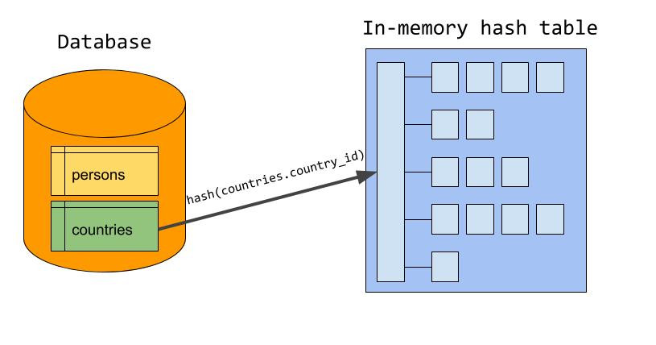
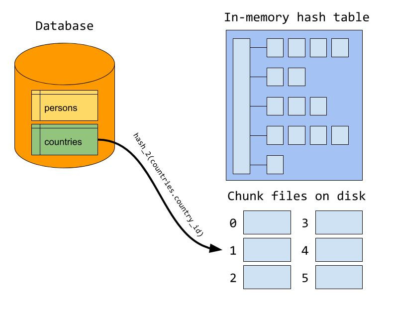
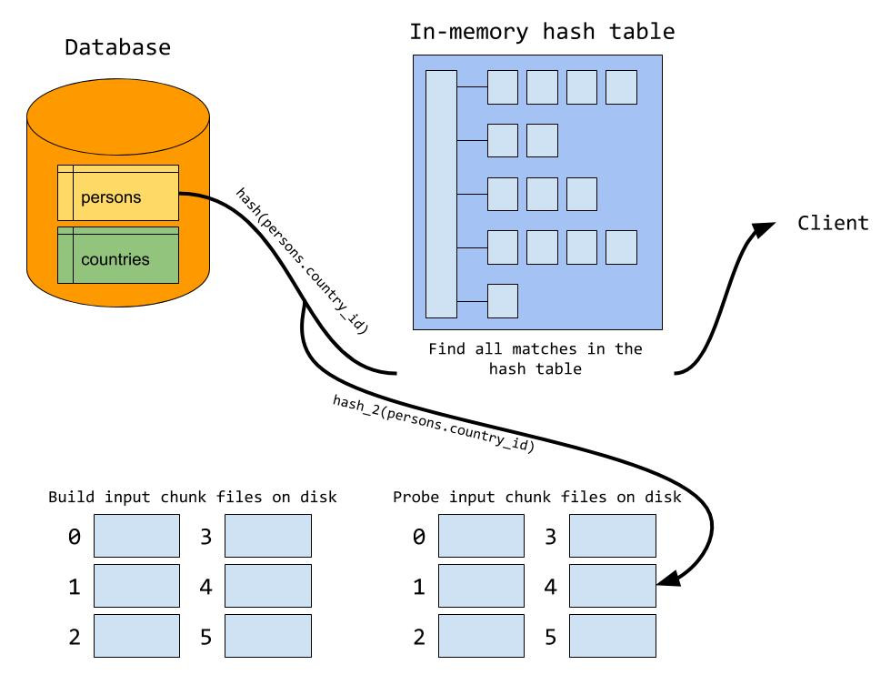
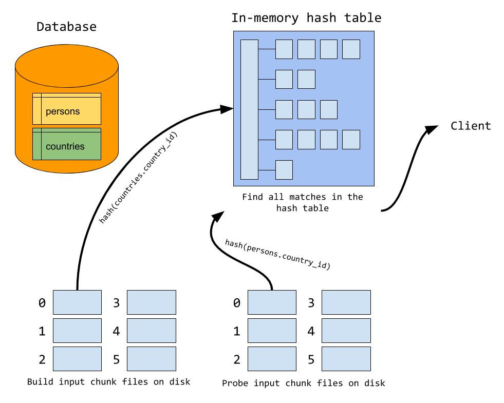
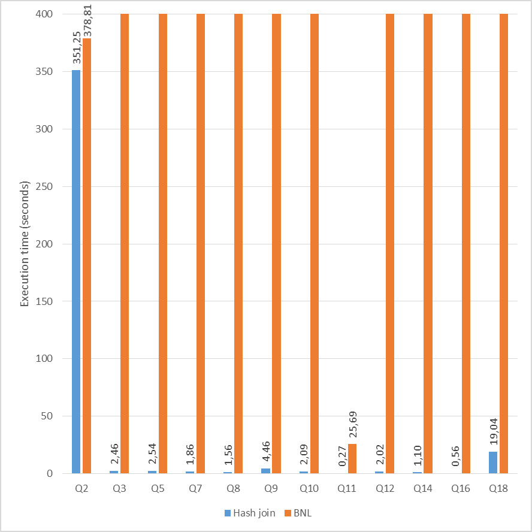

# 技术分享 | Hash join in MySQL 8

**原文链接**: https://opensource.actionsky.com/20191119-mysql/
**分类**: MySQL 新特性
**发布时间**: 2019-11-19T01:33:18-08:00

---

> **作者：****Erik Frøseth**
原文：https://mysqlserverteam.com/hash-join-in-mysql-8/
长期以来，在 MySQL 中执行 join 查询的只是嵌套循环算法的变体。随着 MySQL 8.0.18 的发布，现在可以使用 Hash join 执行 joins。这篇博客文章将介绍它的工作原理，使用时间以及在性能方面与 MySQL 中旧的 join 算法的比较。
**什么是 Hash join？**Hash join 是一种执行 join 的方式，其中哈希表用于查找两个输入之间的匹配行（一个输入是一个或多个表）。它通常比嵌套循环 join 更有效，特别是如果其中一个输入可以容纳在内存中时。为了查看其工作方式，我们将使用以下查询作为示例：- `SELECT`
- `  given_name, country_name`
- `FROM`
- `  persons JOIN countries ON persons.country_id = countries.country_id;`
**① 构建阶段**通常 Hash join 分为两个阶段：构建阶段和探测阶段。在构建阶段，服务使用联接属性作为哈希表键，构建一个内存中的哈希表，其中存储来自输入之一的行。此输入也称为构建输入，让我们假设将 `countries` 指定为构建输入。理想情况下，服务将选择两个输入中较小的一个作为构建输入（以字节为单位，而不是行数）。
由于 `countries.country_id` 是属于构建输入的联接条件，因此将其用作哈希表中的键。一旦所有行都存储在哈希表中，就完成了构建阶段。
											
**② 探测阶段**在探测阶段，服务开始从探测输入（在我们的示例中为 `persons` ）读取行。对于每一行，服务都会使用 `persons.country_id` 中的值作为查找键来探测哈希表是否匹配行。对于每个匹配项，将向客户端发送一个合并的行。最后，服务仅扫描每个输入一次，使用恒定时间查找来查找两个输入之间的匹配行。
											
假设服务可以将整个构建输入存储在内存中，则此方法非常有效。可用的内存量由系统变量 `join_buffer_size` 控制，可以在运行时进行调整。但是，如果构建输入大于可用内存，会发生什么？我们溢出到磁盘上！**③ 溢出到磁盘**
在构建阶段内存已满时，服务器会将其余的构建输入写出到磁盘上的多个块文件中。服务器试图设置块的数量，以使最大的块恰好适合内存（我们很快就会知道为什么），但每次输入的块文件个数严格上限是 128。通过计算 join 属性的哈希值来确定将行写入哪个块文件。请注意，在图示中，使用了与内存构建阶段中使用的哈希函数不同的哈希函数。稍后我们将了解原因。
											
在探测阶段，服务器会探测哈希表中的匹配行，就像所有内容都适合内存一样。但是除此之外，一行还可能与写入磁盘的构建输入中的一行匹配。因此，来自探测输入的每一行也被写入一组块文件。使用将构建输入写入磁盘时使用的哈希函数和公式确定将行写入哪个块文件。这样，我们可以确定两个输入之间的匹配行将位于同一对块文件中。
											
探测阶段完成后，我们开始从磁盘读取块文件。通常，服务器使用第一组块文件作为构建和探测输入来执行构建和探测阶段。我们将构建输入中的第一个块文件加载到内存中的哈希表中。这解释了为什么我们希望最大的块恰好适合内存。如果块文件太大，我们需要将其分成更小的块。加载构建块后，我们从探测输入读取相应的块文件，并在哈希表中探测匹配项，就像所有内容都适合内存一样。处理完第一对块文件后，我们将移至下一对块文件，继续进行直到所有对块文件都已处理为止。
											
您现在可能已经猜到了为什么在将行划分为块文件并将行写入哈希表时，为什么应该使用两个不同的哈希函数。如果我们要对两个操作使用相同的哈希函数，则在将构建块文件加载到哈希表中时，将得到一个非常糟糕的哈希表，因为同一块文件中的所有行都将哈希成相同的值。
**这么赞，我该如何使用？**Hash join 默认情况下处于启用状态，因此无需执行任何操作即可使用哈希联接。值得注意的是，Hash join 建立在新的迭代器执行器上，这意味着您必须使用 `EXPLAIN FORMAT=tree` 来查看是否将使用 Hash join：- `mysql> EXPLAIN FORMAT=tree`
- `    -> SELECT`
- `    ->   given_name, country_name`
- `    -> FROM`
- `    ->   persons JOIN countries ON persons.country_id = countries.country_id;`
- `+---------------------------------------------------------------------------------------------------------------------------------------------------------------------------------------------------------+`
- `| EXPLAIN                                                                                                                                                                                                 |`
- `+---------------------------------------------------------------------------------------------------------------------------------------------------------------------------------------------------------+`
- `| -> Inner hash join (countries.country_id = persons.country_id)  (cost=0.70 rows=1)`
- `    -> Table scan on countries  (cost=0.35 rows=1)`
- `    -> Hash`
- `        -> Table scan on persons  (cost=0.35 rows=1)     |`
- `+---------------------------------------------------------------------------------------------------------------------------------------------------------------------------------------------------------+`
- `1 row in set (0.01 sec)`
通常，如果使用一个或多个等联接条件将表联接在一起，并且联接条件没有索引，则将使用 Hash join。如果索引可用，则 MySQL 倾向于使用带有索引查找的嵌套循环。我们引入了一个新的优化器开关，使您可以对任何查询禁用 Hash join：- `mysql> SET optimizer_switch="hash_join=off";`
- `Query OK, 0 rows affected (0.00 sec)`
- 
- `mysql> EXPLAIN FORMAT=tree`
- `    -> SELECT`
- `    ->   given_name, country_name`
- `    -> FROM`
- `    ->   persons JOIN countries ON persons.country_id = countries.country_id;`
- `+----------------------------------------+`
- `| EXPLAIN                                |`
- `+----------------------------------------+`
- `|                                         |`
- `+----------------------------------------+`
- `1 row in set (0.00 sec)`
禁用 Hash join 后，MySQL 将退回到块嵌套循环，从而使用旧的执行程序（迭代器执行程序不支持块嵌套循环）。此开关使比较 Hash join 和块嵌套循环的性能变得容易。
如果由于构建输入太大而导致无法容纳在内存中并使用磁盘。则可以增加连接缓冲区的大小。与块嵌套循环相反，Hash join 将递增地分配内存，这意味着它将永远不会使用超出其需求的内存。因此，使用 Hash join 时，使用较大的连接缓冲区大小更安全。
**性能数据！**我们做了一些基准测试以查看 Hash join 与块嵌套循环相比如何，结果看起来像这样：
											
您可以在此处查看结果的演示。首先，我必须提到在此测试中我们确实禁用了所有索引。这是为了使优化器使用块嵌套循环和 Hash join 来创建执行计划，因此您在此处看到的数字不会显示出对 DBT-3 执行时间的总体改进。进行此测试是为了突出块嵌套循环和 Hash join 之间的区别。但是我们可以看到，在所有使用 Hash join 的查询中，Hash join 显然都优于块嵌套循环。调整了缓冲池的大小，以便所有数据都在内存中，并且连接缓冲区的大小与默认值（约 250kB）保持不变。显着的改进是由于以下事实：每次输入 Hash join 仅扫描一次，并且它使用恒定时间查找来查找两个表之间的匹配行。遗憾的是，当前 Hash join 的实现存在一些限制：MySQL 仅支持内部 Hash join，这意味着反，半和外部联接仍使用块嵌套循环执行。优化器/计划器使用块嵌套循环执行连接。但应该更频繁地使用 Hash join。我们希望将来消除这两个限制，但是即使存在这两个限制，哈希联接也应使您的查询运行更快。
**社区近期动态**
**No.1**
**Mycat 问题免费诊断**
诊断范围支持：
Mycat 的故障诊断、源码分析、性能优化
服务支持渠道：
技术交流群，进群后可提问
QQ群（669663113）
社区通道，邮件&电话
osc@actionsky.com
现场拜访，线下实地，1天免费拜访
关注“爱可生开源社区”公众号，回复关键字“Mycat”，获取活动详情。
**No.2**
**社区技术内容征稿**
征稿内容：
格式：.md/.doc/.txt
主题：MySQL、分布式中间件DBLE、数据传输组件DTLE相关技术内容
要求：原创且未发布过
奖励：作者署名；200元京东E卡+社区周边
投稿方式：
邮箱：osc@actionsky.com
格式：[投稿]姓名+文章标题
以附件形式发送，正文需注明姓名、手机号、微信号，以便小编及时联系