# 技术分享 | InnoDB 的索引高度

**原文链接**: https://opensource.actionsky.com/20200603-innodb/
**分类**: 技术干货
**发布时间**: 2020-06-03T00:39:24-08:00

---

作者：洪斌
爱可生南区负责人兼技术服务总监，MySQL  ACE，擅长数据库架构规划、故障诊断、性能优化分析，实践经验丰富，帮助各行业客户解决 MySQL 技术问题，为金融、运营商、互联网等行业客户提供 MySQL 整体解决方案。
本文来源：转载自公众号-玩转MySQL
*爱可生开源社区出品，原创内容未经授权不得随意使用，转载请联系小编并注明来源。
**前两天有人问到如何计算索引高度，分享之前的一篇笔记。**
InnoDB 表是 B+tree 索引结构，数据即索引。最小存储单元为 page，默认 16KB。
有两类索引：- clustered index：主键或唯一索引为 key，其他字段值作为 value。每张 InnoDB 表是一个 clustered index。
- secondary index：指定字段为 key，value 是 clustered index 的 key(即主键)。
index page 由三种组合在一起形成一个 B+Tree。1. root page：在索引首次创建时分配，page id 保存在数据字典中，记录保存指向子页的指针。root page 填满时不会发生分裂，而是将值移动到新的子页上，并分裂成两个。
2. non-leaf page：存放指向 leaf page 或其他 non-leaf page 的指针，也称为 internal page。
3. leaf page：存放数据。
每个 page 都有一个 level，leaf page 的 level 是 0，root page 的 level 取决于整个 B+Tree 的高度。
对于 leaf page，每条记录包含一个 next-record 指针，记录下一条记录的偏移量。记录按升序排列，但物理上并非顺序存放。infimum 和 supremum 是伪记录，代表最小值和最大值。
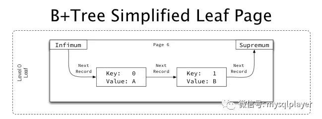											
non-leaf page 与 leaf page 结构类似，不同的是，每条记录 key 存放指向子页的最小值，value 部分存放子页编号。
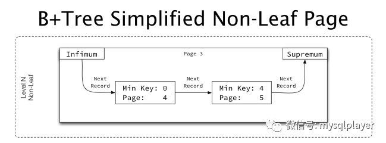											
如果在同一个 level 下超过 1 个 page，page 间会使用双向链表方式连接，每个 page 的 FIL 头存放指向 next page 和 prev page 的指针。
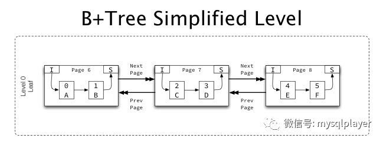											
一个完整的索引树结构：
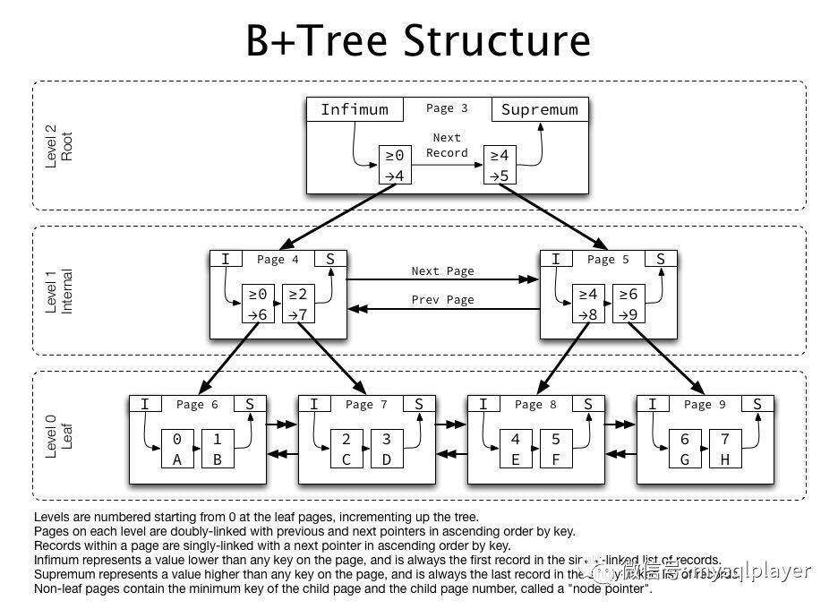											
观察下 3 个表定义不同数据类型的主键，其数据页中存储记录的情况，每张表 90w 条记录。
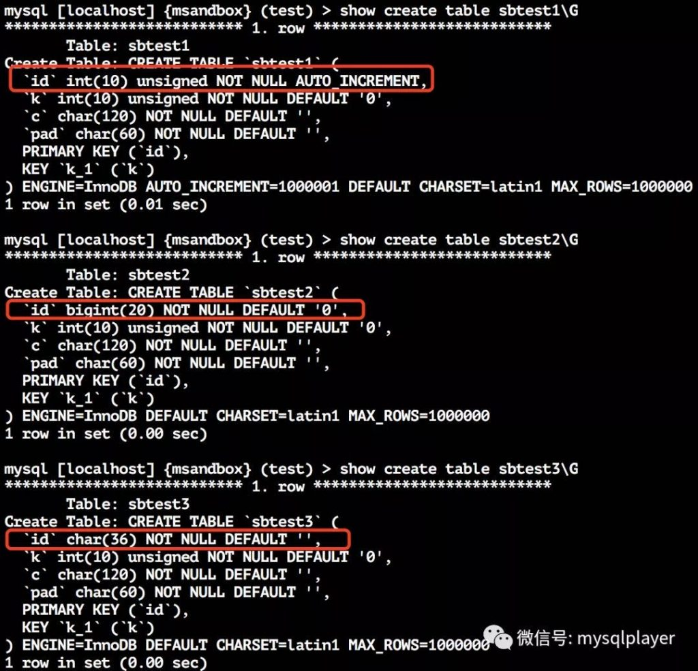											
**表 1：int 主键**
non-leaf page(level 1) 每页有 1203 条记录，每条记录 13 byte(data/records)。
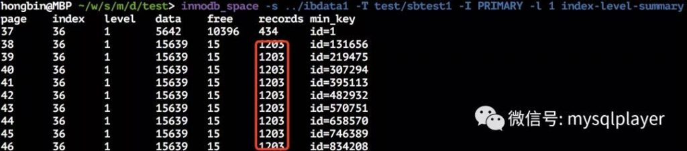											
leaf page(level 0) 每页有 73 条记录，每条记录 206 byte。
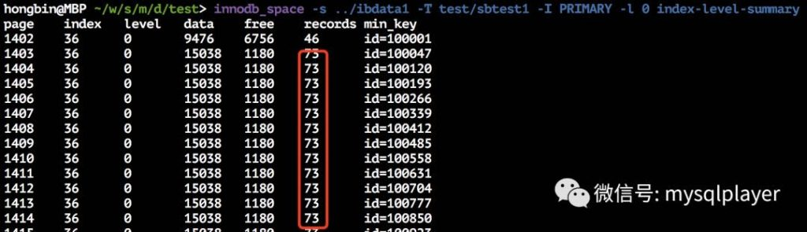											
**表 2：bigint 主键**
non-leaf page(level 1) 每页有 928 条记录，每条记录 17 byte。
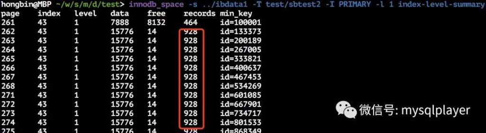											
leaf page(level 0) 每页有 72 条记录，每条记录 210 byte。
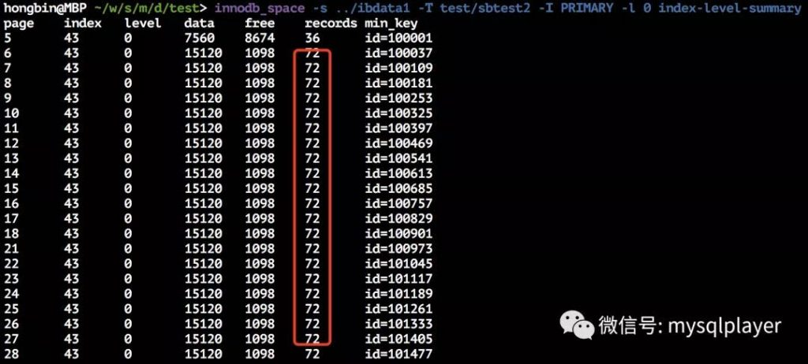											
**表 3：uuid 主键**
non-leaf page(level 1) 每个页可存储 357 个记录，每条记录 45 byte。
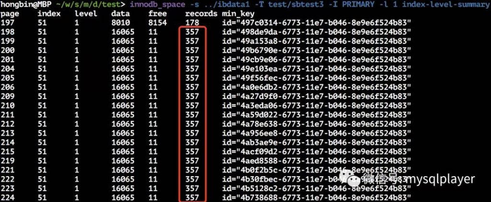											
leaf page(level 0) 每个页可存储 63 个记录，每条记录 238 byte。
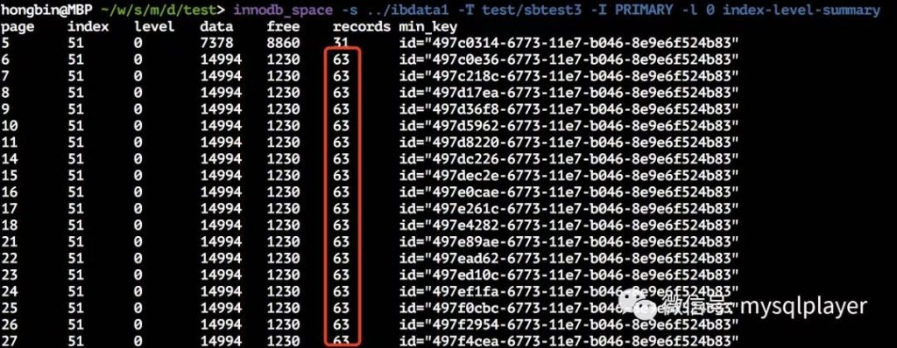											
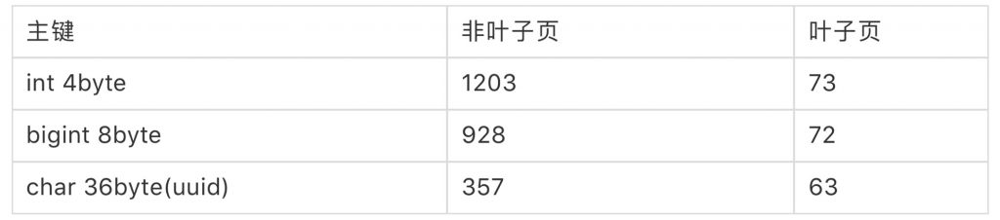											
**索引树高度估算**
表 1：int 主键
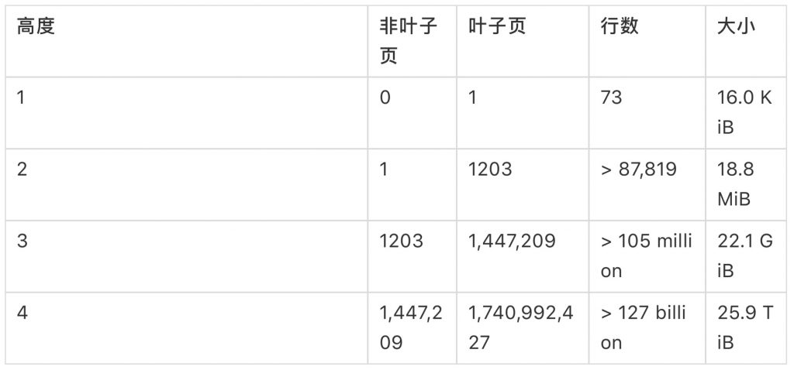											
表 2：bigint 主键
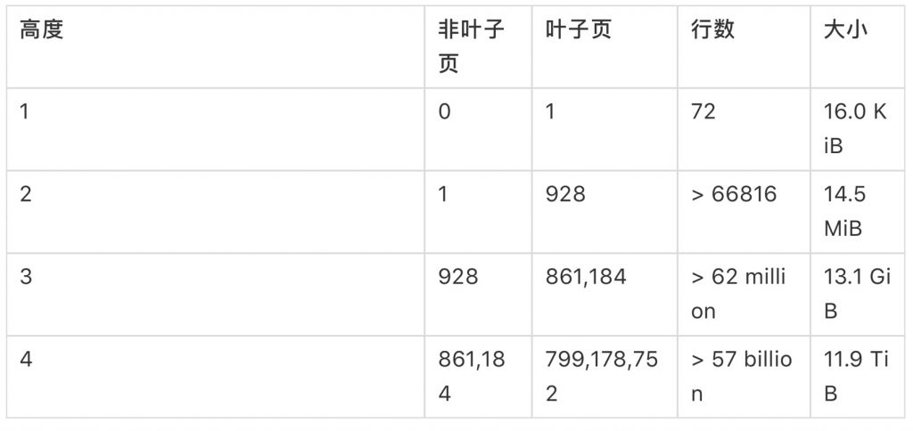											
表 3：char(36) 主键
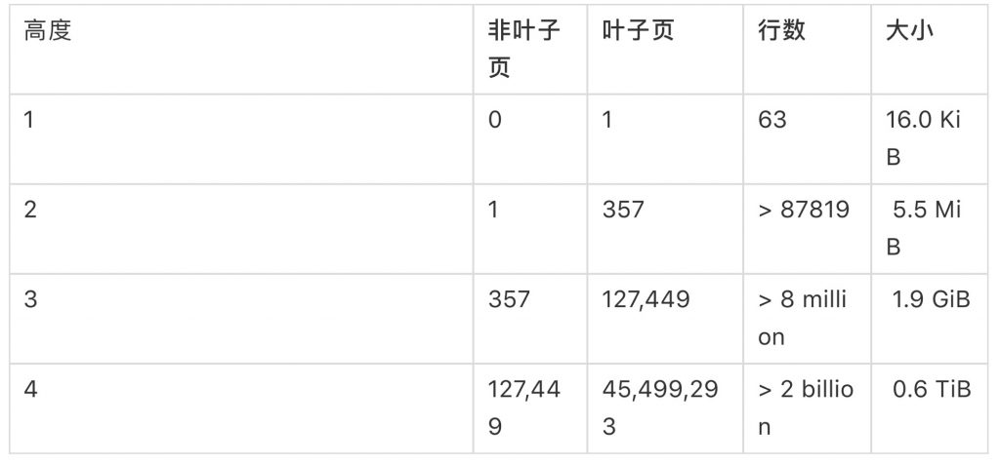											
参考：https://blog.jcole.us/2013/05/02/how-does-innodb-behave-without-a-primary-key/