# 技术分享 | Linux 环境下针对进程维度的监控实现

**原文链接**: https://opensource.actionsky.com/20220707-linux/
**分类**: 技术干货
**发布时间**: 2022-07-05T23:44:03-08:00

---

作者：莫善
某互联网公司高级 DBA。
本文来源：原创投稿
*爱可生开源社区出品，原创内容未经授权不得随意使用，转载请联系小编并注明来源。
#### 一、背景介绍
运维工作中可能会遇到这么一个痛点，因线上机器基本都是单机多实例，有时候会出现因为某个实例而影响了整个机器的性能。因缺少进程级别的监控，事后想分析是哪个实例跑满了系统资源往往比较困难。为了解决这一痛点，迫切希望实现进程级别的监控。
> 进程级别的资源监控，包括但是不限于CPU，内存，磁盘IO，网络流量。
#### 二、前期准备
经了解，有一个 process_exporter 可以实现进程监控，但是在实际调研及测试发现，该工具有些不足：
> process_exporter https://github.com/ncabatoff/process-exporter
- 监控的对象必须预先配置
我们线上单台机器可能部署有20个实例，要么是将20个实例的配置放在一个 process_export ，要么是单个实例一个 process_export ，不管哪种方式部署 process_export 可能都有些麻烦，另外新加一个想监控的对象也需要重新维护一下 process_exporter 。
> 我希望是添加待监控机器后能自动发现所有活跃的进程。
- 不能监控进程的网络情况
测试 process_exporter 发现只有 io、内存、cpu等使用情况，没找到网络监控的指标。
> 我们线上机器很多还是千兆网卡，监控网络使用情况的需求更大。
- 额外的需求
我们的环境可能会有一些临时进程（不是常驻进程）。
#### 三、需求实现
##### 1、监控采集
最开始的思路很简单，就想着使用一些系统工具直接读结果进行解析。但是领导觉得读取它们的采集结果可能稍微重了一点，可能效率不高，达不到小粒度采集，所以想让我研究一下直接抓取【/proc/pid/】下面运行态的数据，这种方式效率应该是最高的。但是在实际测试过程中发现，想要通过【/proc/pid/】来实现进程监控的方案真是困难重重，以至于后来暂时放弃该方案了，不过还是想简单聊一下这个的测试历程。
[root process-exporter]# ls /proc/1
attr       auxv    clear_refs  comm             cpuset  environ  fd      gid_map  limits    map_files  mem        mounts      net  numa_maps  oom_score      pagemap      personality  root   schedstat  setgroups  stack  statm   syscall  timers   wchan
autogroup  cgroup  cmdline     coredump_filter  cwd     exe      fdinfo  io       loginuid  maps       mountinfo  mountstats  ns   oom_adj    oom_score_adj  patch_state  projid_map   sched  sessionid  smaps      stat   status  task     uid_map
[root process-exporter] #
> 这个连接比较详细的介绍了【/proc/pid】下面的文件/目录 https://github.com/NanXiao/gnu-linux-proc-pid-intro
（1）CPU状态抓取
直接翻车，在【/proc/pid/】下面没找到CPU相关的状态数据。
> 有知道的大佬请指导一下。
（2）MEM状态抓取
内存可以通过【/proc/pid/status】文件进行抓取。
$ grep "VmRSS:" /proc/3948/status 
VmRSS:	19797780 kB
$
（3）io状态抓取
同理，io也可以通过【/proc/pid/io】文件进行抓取。
$ grep "bytes" /proc/3948/io
read_bytes: 7808071458816
write_bytes: 8270093250560
（4）网络状态抓取
这个也直接翻车，在【/proc/pid/】下面倒是找到了跟网络相关的信息，比如【/proc/pid/net/dev】，还有【/proc/pid/netstat】。
起初以为dev这个文件是保存了进程级网络传输数据，但是发现这个文件记录的网络流量是整个网卡的，就是说【/proc/pid/net/dev】和【/proc/net/dev】这两个文件记录的网络流量字节数基本一样大。具体测试如下：
首先模拟两个网络传输的进程，因为我测试的机器是有NFS，所以直接从NFS拷贝到本地，就模拟了网络传输。
$  ps -ef|grep -- "cp -i -r"|grep -v grep
root      66218 111973 12 17:14 pts/1    00:00:11 cp -i -r Backup_For_TiDB/15101/2022-06-20 /work
root      67099 122467 10 17:14 pts/2    00:00:09 cp -i -r Backup_For_TiDB/15001/2022-06-20 /work
> 进程号分别是 66218 67099
然后通过同时打印两个pid对应的【/proc/pid/net/dev】文件及系统的【/proc/net/dev】文件做对比
$  cat /proc/66218/net/dev /proc/67099/net/dev /proc/net/dev |grep eth0 && sleep 1 && echo "------------------------" && cat /proc/66218/net/dev /proc/67099/net/dev /proc/net/dev|grep eth0
eth0: 364616462197417 249383778845    0    0    0     0          0         0 77471452119287 170038153309    0    0    0     0       0          0
eth0: 364616462197417 249383778845    0    0    0     0          0         0 77471452119287 170038153309    0    0    0     0       0          0
eth0: 364616462197417 249383778845    0    0    0     0          0         0 77471452119287 170038153309    0    0    0     0       0          0
------------------------
eth0: 364616675318586 249383924598    0    0    0     0          0         0 77471456448161 170038229547    0    0    0     0       0          0
eth0: 364616675318586 249383924598    0    0    0     0          0         0 77471456449457 170038229571    0    0    0     0       0          0
eth0: 364616675318586 249383924598    0    0    0     0          0         0 77471456449835 170038229578    0    0    0     0       0          0
$  
可以看到，这三个【/proc/66218/net/dev】【/proc/67099/net/dev】 【/proc/net/dev】的eth0网卡的流量是一样的，就是说【/proc/pid/net/dev】实际也是系统的流量开销，而不是单个进程对应的流量开销。
【/proc/pid/net/dev】这个不行就怀疑【/proc/pid/net/netstat】这个文件是我需要的，但是很难受，几乎看不懂里面的信息，找了很多资料才大致弄清楚里面的数据，最终发现也不是需要的数据。
> /proc/pid/net/netstat的详情可以参考这里 https://github.com/moooofly/MarkSomethingDown/blob/master/Linux/TCP%20%E7%9B%B8%E5%85%B3%E7%BB%9F%E8%AE%A1%E4%BF%A1%E6%81%AF%E8%AF%A6%E8%A7%A3.md
最终还是妥协了，老老实实使用现成的工具进行采集吧。
> top free ps iotop iftop等工具
##### 2、数据分析
确定了采集方式后就是数据的分析了，下面准备挨个分析一下。
（1）CPU
下面这几个是整机的情况
$ lscpu|grep 'NUMA node0 CPU(s)'|awk '{print $NF}'|awk -F'-' '{print $2+1}'  #机器CPU核心数
$ uptime|awk -F'average: ' '{print $2}'|awk -F, '{print int($1)}'            #机器当前负载情况
$ top -b -n 1|grep '%Cpu(s):' |awk '{print int($8)}'  #idle
$ top -b -n 1|grep '%Cpu(s):' |awk '{print int($10)}' # iowait
> 这部分比较简单，直接记录即可。
下面是针对进程抓取CPU使用情况
$ top -b -n 1|grep -P "^[ 0-9]* "|awk 'NF==12 {
if($9 > 200 || $10 > 10) {
for (i=1;i<=NF;i++)
printf $i"@@@";
print "";
}
}'  #进程使用CPU百分比，内存百分比，仅记录使用到cpu和内存的进程
> 这部分稍微有点复杂，结果会保存到top_dic字典。
这个操作的目的是想着记录进程的cpu内存使用情况，但是会发现top的详情里面并没有进程信息，所以还需要结合ps辅助一下，具体如下：
ps -ef|awk '{printf $2"@@@" ;for(i=8;i<=NF;i++) {printf $i" "}print ""}'
> 这部分结果会保存到ps_dic字典。只需要记录pid和进程详情即可，所以对ps做了分析后最后的结果就是【pid@@@process_info】，最终top_dic和ps_dic通过pid关联
（2）MEM
下面是整机的情况
$ free |grep '^Mem:'|awk '{print int($2/1024/1024),int($3/1024/1024),int(($2-$3)/1024/1024)}'
下面是针对进程抓取MEM使用情况
#进程使用MEM百分比在cpu部分就已经采集
内存这块是为了方便并没有使用proc下面的运行态数据，如果从proc下面采集需要遍历所有pid，感觉比较麻烦，还不如直接通过top采集一次来的方便（还是顺便采集）。但是也有一个弊端，最终计算进程使用内存大小会多一个操作，即需要根据MEM百分比对其进行计算换成具体字节数。
（3）磁盘
下面是整机的磁盘使用情况
$ df|grep ' " + part + "'|awk '$2 > 1024 * 1024 * 50 && /^\//{print $1,int($2/1024/1024),int($3/1024/1024),int($4/1024/1024)}'  #磁盘使用情况
> 需要数据盘的挂载点，如果没有配置挂载点会记录整个机器的所有挂载点（大于50GB的挂载点）的使用情况。
下面是针对进程抓取io使用情况
$ iotop -d 1 -k -o -t -P -qq -b -n 1|awk -F' % ' '
NR>2{
OFS="@@@";
split($1,a," ");
if(a[5] > 10240 || a[7] > 10240 ) {
print a[1],a[2],a[5]a[6],a[7]a[8],$NF;
}
}
NR<3{
print $0;
}'|awk '
{
if(NR==1){
print $1,$2,$6,$13;
} else if(NR==2) {
print $1,$2,$5,$11;
} else {
print $0;
}
}'
> 这个采集也稍微有点复杂，结果会保存到iotop_dic字典，通过pid和top_dic和ps_dic这两个字典关联。需要注意的是，在实际测试过程中发现，部分进程的详情非常长，所以为了避免数据冗余，进程信息会记录到单独的表【tb_monitor_process_info】，并记录该串的md5值且将md5作为唯一键，这样可以避免空间的浪费。在展示的时候仅需要通过md5值作为关联条件即可。
我们需要对结果做分析并加工成我们需要的，我觉得有用的就是【时间】【pid】【读io】【写io】【进程信息】，以及对于io访问量少的进程直接过滤掉。
综上，进程级别的cpu，内存，io使用情况的采集数据上报给server端大概是下面这样：
{
"19991":{
"cpu":"50.0",
"mem":"12.5",
"io_r":"145",
"io_w":"14012",
"md5":"2932fb739fbfed7175c196b42021877b",
"remarks":"/opt/soft/mysql57/bin/mysqld --defaults-file=//work/mysql23736/etc/my23736.cnf"
},
"58163":{
"cpu":"38.9",
"mem":"13.1",
"io_r":"16510",
"io_w":"1245",
"md5":"c9e1804bcf8a9a2f7c4d5ef6a2ff1b62",
"remarks":"/opt/soft/mysql57/bin/mysqld --defaults-file=//work/mysql23758/etc/my23758.cnf"
}
}
（4）网络
网络的监控有点难受，没法基于pid做分析，只能通过ip:port分析来回的流量。
下面是整机的网络使用情况
$ iftop -t -n -B -P -s 1 2>/dev/null|grep Total |awk '
NR < 3 {
a = $4;
if ($4 ~ /MB/) {
a = ($4 ~ /MB/) ? 1024 * int($4) "KB" : $4;
} else if ($4 ~ /GB/) {
a = ($4 ~ /GB/) ? 1024 * 1024 * int($4) "KB" : $4;
}
a = (a ~ /KB/) ? int(a) : 0
print $2, a;
}
NR == 3 {
b = $6;
if ($6 ~ /MB/) {
b = ($6 ~ /MB/) ? 1024 * int($6) "KB" : $6;
} else if ($6 ~ /GB/) {
b = ($6 ~ /GB/) ? 1024 * 1024 * int($6) "KB" : $6;
}
b = (b ~ /KB/) ? int(b) : 0
print $1, b;
}'
下面是进程级别的网络使用情况
$ iftop -t -n -B -P -s 2 -L 200 2>/dev/null|grep -P '(<=|=>)'|sed 'N;s/\\n/,/g'|awk 'NF==13{
if($4 ~ /(K|M|G)B/ || $10 ~ /(K|M|G)B/) {
if(($4 ~ /KB/ && int($4) > 10240) ||
($10 ~ /KB/ && int($10) > 10240) ||
($4 ~ /MB/ && int($4) > 10240) ||
($10 ~ /MB/ && int($10) > 10240) ||
($4 ~ /GB/ || $10 ~ /GB/)) {
print $2,$4,$8,$10
}
}
}'
> 这部分比较麻烦的是单位换算及计算。这部分会将结果保存到iftop_dic。
这个采集也稍微有一点复杂，需要对结果做分析并加工成我们所需要的。我认为有用的就是【出ip:port】【出口流量】【回ip:port】【入口流量】。最后进程网络使用情况的采集数据上报给server端大概是下面这样子。
{
"net":{
"speed":"1000",
"send":"7168",
"receive":"8192",
"Total":"16384",
"time":"2022-06-29 20:16:20",
"iftop" : {
"192.168.168.11:55746":[
{
"remote":"192.168.168.13:18059",
"out":"7.94KB",
"in":"307KB"
}
],
"192.168.168.11:60090":[
{
"remote":"192.168.168.13:18053",
"out":"6.73KB",
"in":"307KB"
}
]
}
}
}
至此，所有采集项的监控数据都已经拿到了，下面就是将数据入库了。
##### 3、数据入库
监控数据分析了以后，就是将其记录下来，本项目采用 MySQL 来保存数据，其中不免涉及一些二次分析，以及注意事项，这里不准备介绍，放在注意事项部分进行介绍。
##### 4、数据展示
完成了数据分析，数据记录，最后的工作就是将数据展示出来，供运维人员在需要的时候随时查看分析，本项目采用 grafana 将数据展示出来，这个部分有些注意事项，这里也不准备介绍，放在注意事项进行介绍。可以先来看个效果图：

#### 四、注意事项
> 使用 python3 实现代码部分，所有注意事项的解决方案也是仅针对 python3 语法来实现的。
1、ssh环境
数据的采集是通过rpc实现，但是 server 端对 client 的管理都是依赖 ssh ，所以必须保证 server 到所有的 client 都能 ssh 免密登录。
2、长连接
跟 MySQL 的通信，建议使用长连接。尤其是需要监控的机器个数比较多，如果是短连接会频繁跟 MySQL 进行创建连接释放连接，存在一定的不必要开销。
def f_connect_mysql(): #建立连接
"""
建立连接
"""
state = 0
try :
db = pymysql.connect(monitor_host, monitor_user, monitor_pass, monitor_db, monitor_port, read_timeout = 2, write_timeout = 5) #连接mysql
except Exception as e :
f_write_log(log_opt = "ERROR", log = "[ 建立连接失败 ] [ " + str(e) + " ]", log_file = log_file)
db = None
return db
def f_test_connection(db):
"""
测试连接
"""
try:
db.ping()
except:
f_connect_mysql()
return db
def f_close_connection(db):
"""
关闭连接
"""
try:
db.close()
except:
db = None
return db
> 需要注意，如果是多线程的话建议每个线程维护一个连接，或者添加互斥锁，这样可以避免部分异常。
3、做减法
因为我们是基于机器去做的进程监控，难免会出现很多被监控的对象（一台机器上千个服务也不是不可能），在测试过程中没有发现这个问题影响很大，但是在实际上线后发现，如果不优化这个部分会导致 metrics 太多，grafana 的渲染很慢，所以对于不必要的采集记录，可以在采集的时候就过滤掉，能一定程度避免 client 到 server 端的网络开销，也能减少磁盘空间的开销，还提升 grafana 的出图效率。
> 优化后，在配置文件提供了配置项，只有当进程使用系统资源满足阈值才会被采集。
##### 4、超时机制
（1）操作 MySQL 的超时
既为了代码的健壮性，也是为了程序的持续、稳定性都建议加上超时参数，可以避免因为一些极端场景导致读数或者写数卡住。
（2）采集数据的超时
生产环境的复杂性，什么都可能发生，即便是一条简单到不能再简单的命令也可能出现卡住，所以加上超时机制吧。这里需要注意，在添加超时机制的时候发现有些问题，具体测试如下：
Python 3.7.4 (default, Sep  3 2019, 19:29:53) 
[GCC 4.8.5 20150623 (Red Hat 4.8.5-16)] on linux
Type "help", "copyright", "credits" or "license" for more information.
>>> import datetime,subprocess
>>> s_time = datetime.datetime.now()
>>> res = subprocess.run("echo $(sleep 10)|awk '{print $1}'",shell=True,stdin=subprocess.PIPE,stdout=subprocess.PIPE,stderr=subprocess.PIPE,encoding="utf-8",timeout=2)
省略了很多错误输出
subprocess.TimeoutExpired: Command 'echo $(sleep 10)|awk '{print $1}'' timed out after 2 seconds
>>> e_time = datetime.datetime.now();
>>> 
>>> print(s_time)
2022-06-23 13:05:37.886864
>>> print(e_time)
2022-06-23 13:05:48.353889
>>> print(res)
Traceback (most recent call last):
File "<stdin>", line 1, in <module>
NameError: name 'res' is not defined
>>> 
可以看到【subprocess.run】设置了两秒超时，但是两秒后没有抛出异常并结束执行，从执行时间看s_time跟e_time相差11秒，但是整个执行结果是异常的（res都没有结果），就是说并没有起到预想的超时效果（预想的效果是到超时阈值后终止执行，返回异常）。
> 如果操作命令是简单的命令就没事，比如将【echo $(sleep 10)|awk &#8216;{print $1}&#8217;】改成【sleep 10】，这个超时机制就正常。
针对这个超时机制可能会出现失效的情况，在代码里面直接用系统命令timeout代替了。
##### 5、返回值
如果操作命令带管道等复杂命令，返回值可能并不可信。具体测试如下
>>> res = subprocess.run("echoa|awk '{print $1}'",shell=True,stdin=subprocess.PIPE,stdout=subprocess.PIPE,stderr=subprocess.PIPE,encoding="utf-8",timeout=2)
>>> res.returncode
0
>>>
> 【echoa|awk &#8216;{print $1}&#8217;】管道左边的操作是错误的，所以整个返回结果应该是非零（预期是这样），但是这里返回了0。原因是在管道操作的场景，bash默认情况是仅获取最后一个管道的执行返回状态码，例如【comm1|comm2|comm3】，如果comm1执行成功，comm2执行失败，但是comm3执行成功，那整个返回状态就是执行成功。
解决方案如下
>>> res = subprocess.run("set -o pipefail;echoa|awk '{print $1}'",shell=True,stdin=subprocess.PIPE,stdout=subprocess.PIPE,stderr=subprocess.PIPE,encoding="utf-8",timeout=2)
>>> res.returncode
127
>>> 
> 执行命令前先加一个set -o pipefail，关于set -o的解释可以参考下面的描述。
-o    If set, the return value of a pipeline is the value of the last (rightmost) command to exit with a non-zero status, or zero if all  com‐mands in the pipeline exit successfully.  This option is disabled by default.
#### 五、工作原理
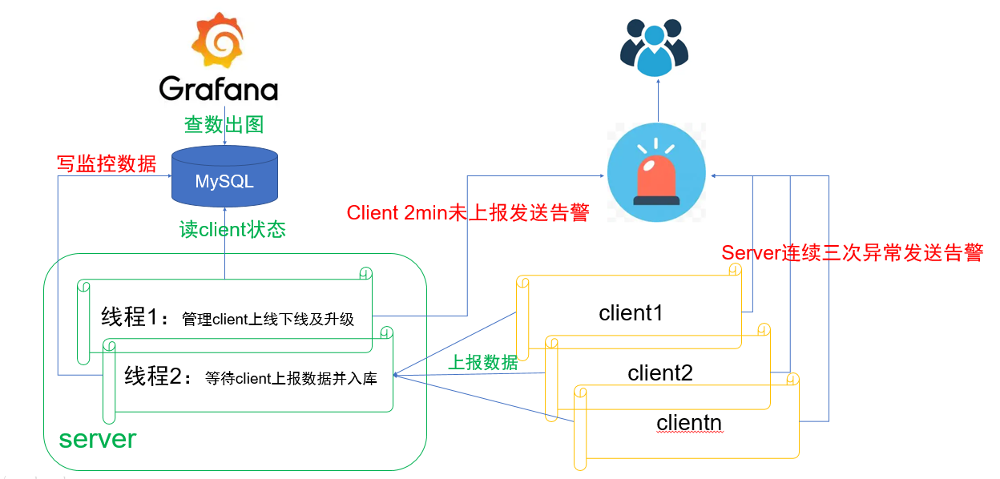
##### 1、server
- 线程1
这个线程会做三个事情：
（1）在server重启的时候会去读【tb_monitor_version】表，判断当前版本号跟MySQL记录的版本号是否一致，如果不一致就会去更新MySQL记录的版本号。然后将【tb_monitor_host_config】表所有istate=2的节点更新为istate=1。
（2）管理client上线下线，每30s去读一次【tb_monitor_host_config】表，将需要上线的节点或者需要下线的节点进行维护。istate=1表示需要上线，就会去部署监控脚本（升级就更新代码），并更新为istate=2，istate=0表示需要下线，会去下线该client节点并更新为istate=-1。
（3）管理client状态，每30s去读一次【tb_monitor_host_config，tb_monitor_alert_info，tb_monitor_host_info】表（三表关联），将最近两分钟没有上报的client且最近5min没有被告警的节点统计出来并告警。
- 线程2
这个线程做两个事：
（1）等待client上报监控数据，然后进行二次分析并写到MySQL中。
（2）返回当前版本号给client。
##### 2、client
client端会做三个事情
（1）六线程并行去采集【机器cpu】【机器内存】【机器磁盘】【机器网络】【进程网络】【进程io，进程cpu，进程内存】。采集完毕后，主线程会进行分析并上报给server端。
（2）在上报过程中如果遇到连续三次server都是异常状态就会将server异常记录（避免多个client同时告警）到【tb_monitor_alert_info】表发送告警。
（3）上报完成后会判断自己的版本号跟server端返回的版本号是否一致，如果不一致就会退出程序，等待crontab拉起，以此完成升级。
> server端完成代码更新，在重启server的时候会将新代码同步到各个client。
##### 3、MySQL
MySQL的作用是存版本信息，client ip配置，监控数据，以及告警状态等。
##### 4、grafana
grafana的作用是从MySQL读取监控数据并展示出来。
##### 5、alert
采用企业微信的机器人作为告警通道。
#### 六、使用限制
##### 1、系统环境
（1）操作系统版本及内核。
$ uname -a
Linux 3.10.0-693.21.1.el7.x86_64 #1 SMP Wed Mar 7 19:03:37 UTC 2018 x86_64 x86_64 x86_64 GNU/Linux
$ cat /etc/redhat-release
CentOS Linux release 7.4.1708 (Core)
> 其他版本没有测试过，不确定是否能用。
（2）系统工具
监控数据采集依赖于操作系统工具，主要依赖如下：
awk,grep,sed,tr,md5sum
top,iftop,iotop
df,free,lscpu,uptime
ip,netstat
rsync,python3
cd,ssh,timeout
> server端到client要有免密登录。
##### 2、软件环境
软件版本可能存在兼容性问题，所以其他版本不确定是否能用，请各自测试调试。
（1）Python环境
> 3.7.4
（2）MySQL版本
> 5.7.26
（3）grafana版本
> 8.3.1 建议小版本也要一致。 https://dl.grafana.com/enterprise/release/grafana-enterprise-8.3.1.linux-amd64.tar.gz
#### 七、使用介绍
##### 1、部署server
（1）clone项目
mkdir -p /opt/soft/git
cd /opt/soft/git
git clone https://gitee.com/mo-shan/rpc_for_process_monitor.git
> 依赖Python3环境，建议3.7.4，要求python3在PATH里面，安装过程略。
（2）部署server
cp -r /opt/soft/git/rpc_for_process_monitor /opt/soft/rpc_for_monitor  #注意这里的目录是有区别的, 主要是希望开发环境跟实际部署的目录不一样, 避免失误
cd /opt/soft/rpc_for_monitor
$ tree -L 2
.
├── conf
│   └── config.ini                  #配置文件
├── img                             #忽略
│   ├── all-info.png
│   ├── cpu-info.png
│   ├── disk-info.png
│   ├── grafana-data-source-1.png
│   ├── grafana-data-source-2.png
│   ├── grafana-data-source-3.png
│   ├── grafana-data-source-4.png
│   ├── grafana-data-source-5.png
│   ├── grafana-data-source-6.png
│   ├── grafana-data-source-7.png
│   ├── mem-info.png
│   ├── net-info.png
│   └── process-info.png
├── init                            #初始化文件
│   ├── grafana.json                #grafana配置模板
│   ├── init.sql                    #mysql建表语句
│   └── requirements.txt            #python3依赖的模块
├── lib                             #库文件
│   ├── Config.py                   #解析config.ini
│   ├── ConnectMySQL.py             #连接并操作mysql
│   ├── globalVar.py                #全局变量
│   ├── Public.py                   #公共函数
│   └── __pycache__
├── LICENSE
├── logs                            #日志目录
│   └── info.log                    #日志文件
├── py37env                         #虚拟环境，要求在/opt/soft/rpc_for_monitor/py37env下才能使用（activate等文件的路径写死了）
│   ├── bin
│   ├── include
│   ├── lib
│   └── pip-selfcheck.json
├── README.md                       #帮助文档
├── rpc.py                          #主程序
├── start_server.sh                 #server端的启动脚本
└── state                           #忽略
└── state.log
11 directories, 28 files
（3）配置server
vim conf/config.ini #根据实际情况进行编辑
> 如果需要变更项目目录，需要将【lib/Config.py】文件的变量【config_file】也改一下。
[global]
version       = 1.1   #版本号, 通过这个变量控制server和client的代码，如果server发现这个配置跟表里保存的版本不一致就认为代码进行了变更，就会将新代码传到client，client如果发现自己的版本和server版本不一样会进行重启，以此达到升级效果。
interval_time = 30    #监控采集粒度单位是秒，即30秒一次，这个不是完全精确的30s一次
retention_day = 30    #监控数据保留天数，即30天
log_file = /opt/soft/rpc_for_monitor/logs/info.log #日志文件
script_dir = /opt/soft/rpc_for_monitor             #脚本目录，不建议变更
mount_part    = /work  #数据盘挂载点, 也可以不配置，置为空，但是不能删除这个配置项
log_size      = 20     #日志文件大小（MB）限制，超过这个值就会删除历史日志
[RULE] 
cpu = 200    #采集的阈值，200表示某个进程使用cpu大于等于200%才会被采集
mem = 10     #采集的阈值，10表示某个进程使用内存大于等于10GB才会被采集
io  = 10240  #采集的阈值，10240表示某个进程使用io（读写有一个就算）大于等于10MB才会被采集
net = 10240  #采集的阈值，10240表示某个进程使用网络（进出有一个就算）大于等于10MB才会被采集
[CLIENT]
path = xxxx  #预定义一下操作系统的path，因为client会维护一个cront任务，所以避免因为环境变量问题导致脚本执行报错，需要定义一下path
python3 = /usr/local/python3 #python3安装目录
py3env = /opt/soft/rpc_for_monitor/py37env #python3虚拟环境目录，工程自带了一个虚拟环境，可以直接用（前提是脚本目录没有变更）
[MSM]
wx_url  = xxxx   #企业微信报警url，告警功能需要用户自己修改一下并测试（如果是告警机器人url+key，可以直接配上就能用，本例就是通过企业微信机器人发送告警）
[Monitor]  #存放监控数据的MySQL的配置
mysql_host      = xxxx
mysql_port      = xxxx
mysql_user      = xxxx
mysql_pass      = xxxx
省略部分不建议变更的配置
> 所有目录不建议修改, 要不然需要变更的地方太多，容易出错。
##### 2、部署 MySQL
> 安装MySQL略，建议的版本：5.7
（1）新建必要的账户
> 用MySQL管理员用户登录并操作。
create user 'monitor_ro'@'192.%' identified by 'pass1'; #密码请根据实际情况变更
grant select on dbzz_monitor.* to 'monitor_ro'@'192.%';
create user 'monitor_rw'@'192.%' identified by 'pass2';
grant select,insert,update,delete on dbzz_monitor.* to 'monitor_rw'@'192.%';
> monitor_ro用户给grafana使用, monitor_rw用户是给程序写入监控数据的（server端写数据，client上报给server）。所以注意的是，monitor_ro用户要给grafana机器授权，monitor_rw用户要给所有监控对象授权，这个目的是用来控制当server失联了，第一个发现的client就会向表里写一条告警记录并告警，避免其他client重复操作。
（2）初始化MySQL
> 用MySQL管理员用户登录并操作。
cd /opt/soft/rpc_for_monitor
mysql < init/init.sql 
> 所有表放在dbzz_monitor库下
(dba:3306)@[dbzz_monitor]>show tables;
+----------------------------+
| Tables_in_dbzz_monitor     |
+----------------------------+
| tb_monitor_alert_info      |   # 告警表, 触发告警就会在里面写入一条记录, 避免同一时间多次告警。
| tb_monitor_disk_info       |   # 磁盘信息表，多个盘会记录多条记录
| tb_monitor_host_config     |   # client配置表，需要采集监控的机器配置到这里面就行
| tb_monitor_host_info       |   # 系统层面的监控记录到这里面
| tb_monitor_port_net_info   |   # 端口级别的网络监控会记录到这里面
| tb_monitor_process_info    |   # 这里面是记录了进程信息，全局的
| tb_monitor_process_io_info |   # 这里是记录的进程的io监控数据
| tb_monitor_version         |   # 记录版本号，及版本号变更时间
+----------------------------+
6 rows in set (0.00 sec)
(dba:3306)@[dbzz_monitor]>
> 所有表都有详细的注释，请看表的建表注释。
##### 3、配置client
配置客户端很简单，只需要往MySQL表里面写入一条记录。
use dbzz_monitor;
insert into tb_monitor_host_config(rshost,istate) select '192.168.168.11',1;  
#多个机器就写多条记录，server端会有后台线程定时扫描tb_monitor_host_config
#如果有待添加的client就会进行部署
#如果需要下线监控节点直接将istate状态改成0即可
> 这里有个限制条件，这个client端已经有python3环境，否则会报错。
##### 4、部署grafana
安装略。
> grafana版本：8.3.1，建议小版本也要一致。 https://dl.grafana.com/enterprise/release/grafana-enterprise-8.3.1.linux-amd64.tar.gz
这部分涉及到grafana的配置，所有的配置都已经导成json文件，用户直接导入即可。
> 具体的操作如下。
（1）新建DataSource
新建一个数据源
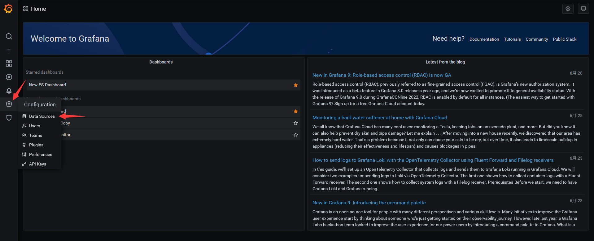

需要选择MySQL数据源

数据源的名称要求写【dba_process_monitor】，如果跟grafana配置不一致可能会有影响。
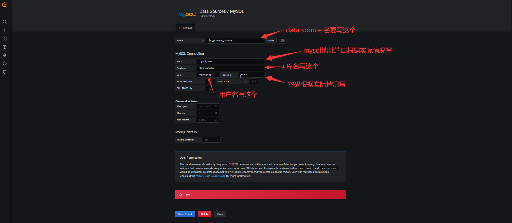
（2）导入json配置
$ ll init/grafana.json 
-rw-r--r-- 1 root root 47875 Jun 23 14:28 init/grafana.json

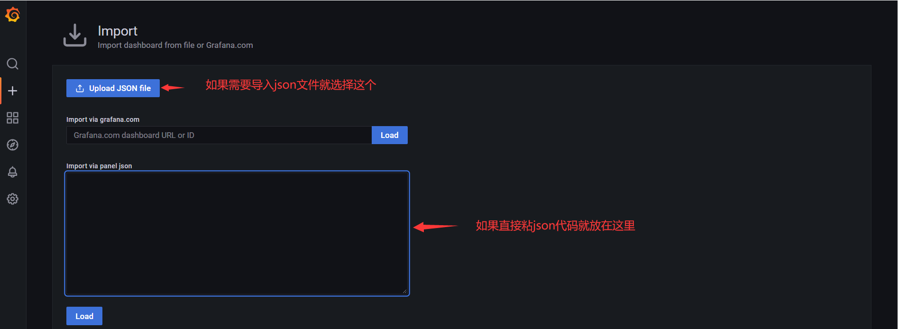
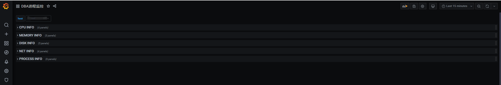
本配置是在grafana 8.3.1 版本下生成的。需要注意一下版本，不同版本可能不兼容。如果版本不一致导入会导致出图失败，需要用户自己重新配置grafana，出图的sql可以参考一下grafana配置文件的rawSql的配置【grep rawSql init/grafana.json】。
- 建议1：【Lagend】的配置都改成【as table】，要不然如果指标太多显示出来的会很乱
- 建议2：选择单位的时候对于不希望进行转换的可以选【Custom unit】属性
- 建议3：【Stacking and null value】属性建议设置为【null as zero】
##### 5、启动server
将server端的启动脚本配置到crontab中，可以起到守护进程的作用。
echo "*/1 * * * * bash /opt/soft/rpc_for_monitor/start_server.sh" >> /var/spool/cron/root
> client端不用管，server启动以后会自动去管理client。
配置完成后，等待一分钟查看日志【/opt/soft/rpc_for_monitor/logs/info.log】，可以看到类似下面的日志。
[ 2022-06-30 15:13:01 ] [ INFO ] [ V1.1 Listening for '0.0.0.0:9300' ]
[ 2022-06-30 15:13:04 ] [ INFO ] [ 新加监控节点成功 ] [ 192.168.168.11 ]
[ 2022-06-30 15:13:11 ] [ INFO ] [ 监控数据上报成功 ] [ 192.168.168.11 ] 
> 端口默认是9300，可以通过修改【/opt/soft/rpc_for_monitor/start_server.sh】这个文件就行变更监听端口。
##### 6、效果图
（1）主页面
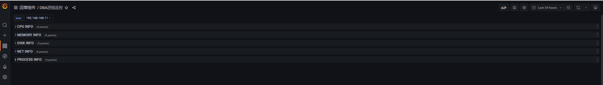
> 总共有五个ROW，前面四个是机器级别的监控图，process是进程的监控图。
（2）CPU页面
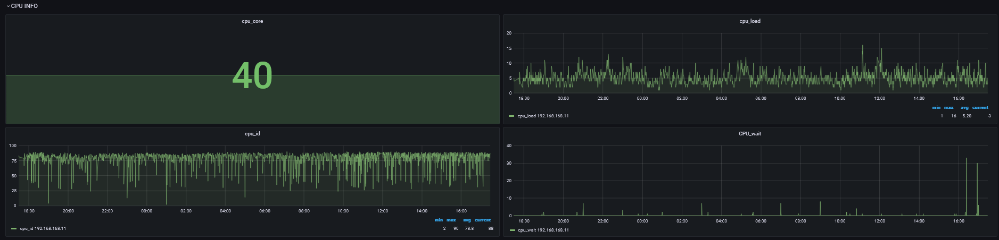
> 整个机器的CPU使用情况。
（3）内存页面
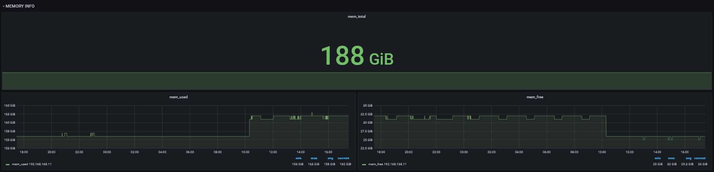
> 整个机器的内存使用情况。
（4）磁盘页面
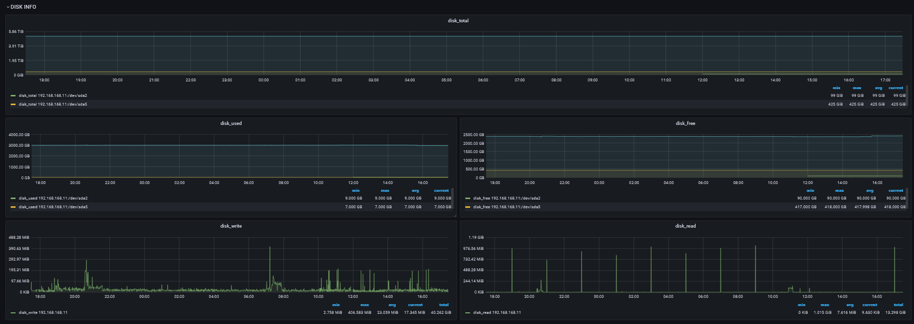
> 整个机器的磁盘使用情况，如果没有定义具体的挂载点，会采集所有的挂载点。
（5）网络页面
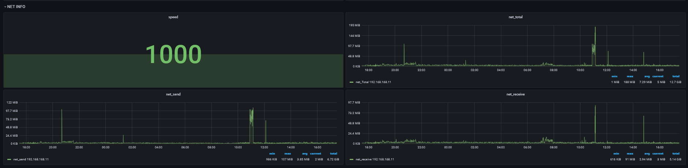
> 整个机器的网络使用情况。
（6）进程页面
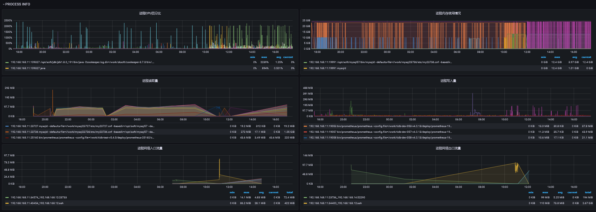
> 会看到具体的进程对系统资源的使用情况。需要注意，因在采集的时候做了过滤，所以监控数据并不一定是连续的，所以建议配置grafana的【null as zero】，这样展示监控图的时候是连续的，而不是很多点。另外某个指标可能为空，这也是正常现象。
#### 八、注意事项
- server，client端一定要有python3环境。
- 如果有多个server，在启动server的时候就要指定多个（用逗号隔开），要不然在部署client的时候只会配上单个server，配置多个的好处就是如果第一个宕机/异常，client会上报给其他的server。
- server在运行过程中可以添加client，只需要在【tb_monitor_host_config】表添加istate为1的记录即可。同理，如果下线的话就更新istate为0即可，运行中的istate为2，下线后的istate为-1。
- 该工具有告警功能（如果配置），server挂了（client连续三次都连不上server），会由第一个发现的client记录到MySQL里面，并发送告警，如果client挂了，server会发现并告警（超过两分钟未上报告警数据）。
- 如果需要升级代码，只需要测试好新代码，确认无误后，更新到server的部署脚本目录，然后kill掉server进程即可，等待crontab拉起就行了，client端的代码不用人为进行更新。需要注意，新代码一定要记得修改配置文件的版本号，要不然server端不会发现版本不一致，也就不会下发相关任务去更新client的代码。
- 如果需要修改部署目录请根据实际情况修改【conf/config.ini】【lib/Config.py】，注意这时候自带的虚拟环境将不能使用了。强烈不建议变更目录结构或者目录名。
- 因考虑到MySQL性能问题及grafana渲染性能问题，所以增加了采集阈值功能，所以部分面板的监控数据可能会没有（该时间段的进程没有满足采集阈值的数据）。
#### 九、写在最后
本文所有内容仅供参考，因各自环境不同，在使用文中代码时可能碰上未知的问题。如有线上环境操作需求，请在测试环境充分测试。