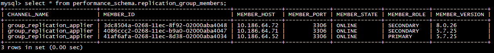
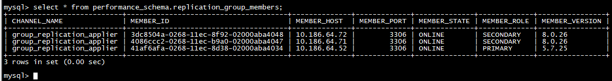
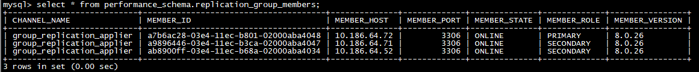
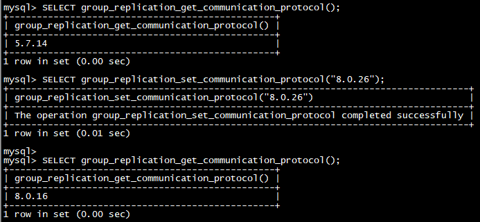

# 技术分享 | MGR 单主模式组内滚动升级

**原文链接**: https://opensource.actionsky.com/20211022-mgr/
**分类**: 技术干货
**发布时间**: 2021-10-21T22:14:44-08:00

---

> 
作者：李鹏博
爱可生 DBA 团队成员，主要负责 MySQL 故障处理和 SQL 审核优化。对技术执着，为客户负责。
本文来源：原创投稿
*爱可生开源社区出品，原创内容未经授权不得随意使用，转载请联系小编并注明来源。

MySQL 从 5.7 开始支持 MGR ，并不断地进行改进与完善，比如从 8.0.14 新增了 group_replication_consistency 参数用于配置集群一致性；从 8.0.16 新增 group_replication_consistency 参数来支持 auto-rejoin 功能，从 8.0.17 开始支持 clone 插件并用于 MGR 的分布式恢复。本文将介绍如何从 MySQL 5.7.25 单主模式的 MGR 组内滚动升级到 MySQL 8.0.26 。
MGR 可以离线升级，也可以在线升级，我们通常都会选择在线升级。而在线升级官方提供了3种方式：组内滚动升级、滚动迁移升级、滚动重复升级。我们这里使用最简单快速的组内滚动升级方式。
组内滚动升级的方式就是在一个 MGR 组内，其中的每个实例都依次从组中删除、升级，然后重新加入组中。这种方式比较适合单主模式。而对于多主模式下的组，由于在组内滚动升级期间主节点的数量会减少，从而会导致写可用性降低，这是因为如果一个成员加入一个组时，它运行的 MySQL 服务器版本高于现有组成员运行的最低版本，它会自动保持只读模式( super_read_only=ON )，从 MySQL 8.0.17 开始，当所有成员都升级到相同的版本时，它们都会自动更改回读写模式；而对于之前的版本，则需要在每个成员上手动设置 super_read_only=OFF 来将实例改回读写模式。
以下将大致介绍升级的步骤：
### 一. 确定MGR模式和版本
#### 1. 确认MGR模式
`show variables like '%group_replication_single_primary_mode%';
`
#### 2. 确认主节点
`select * from performance_schema.replication_group_members;
SHOW STATUS LIKE 'group_replication_primary_member';
`
#### 3. 确认节点数据库版本
#MySQL 5.7需要每个单独确认
`select @@version;
`
注意：前面的1. 2. 3. 步骤在 MySQL 8 里面可只通过一条语句确认：
`select * from performance_schema.replication_group_members;
`
### 二. 备份数据库
升级之前必须要对数据库进行全备，以便用于升级失败后的回退。
### 三. 升级第一个从节点
#### 1. 安装mysql shell
##下载地址：https://dev.mysql.com/downloads/repo/yum/
rpm -Uvh mysql80-community-release-el7-3.noarch.rpm
yum install -y mysql-shell
#### 2. 检查兼容性并修复不兼容的地方
`mysqlsh -- util check-for-server-upgrade { --user=root --socket=/opt/mysql/data/3307/mysqld.sock } --target-version=8.0.26 --output-format=JSON --config-path=/opt/mysql/etc/3307/my.cnf
`
### 3. 停止组复制
`stop group_replication;
`
### 4. 关闭数据库
`SET GLOBAL innodb_fast_shutdown=0;
systemctl stop mysqld_3306
`
### 5. 安装新版本 MySQL
`tar xf mysql-8.0.26-linux-glibc2.12-x86_64.tar.xz -C /opt/mysql/base/
`
删除原 base 路径目录或软连接：
`rm -rf /opt/mysql/base/5.7.25/
ln -s mysql-8.0.26-linux-glibc2.12-x86_64/ /opt/mysql/base/5.7.25
`
### 6. 使用 &#8211;upgrade=auto 启动数据库进行升级
`/opt/mysql/base/5.7.25/bin/mysqld --defaults-file=/opt/mysql/etc/3306/my.cnf --daemonize --pid-file=/opt/mysql/data/3306/mysqld.pid --user=actiontech-mysql --socket=/opt/mysql/data/3306/mysqld.sock --port=3306 --upgrade=auto
`
注意：
升级完成后不用再进行重启
升级完成之后，以后再启动不需要再使用 &#8211;upgrade=auto 参数
### 7.节点手动加入集群并开启组复制
`RESET SLAVE ALL;
set global group_replication_group_name="964fe9c5-03e4-11ec-8aa2-02000aba4034";
SET GLOBAL group_replication_local_address = "10.186.64.71:33061";
SET GLOBAL group_replication_group_seeds = "10.186.64.52:33061";
SET GLOBAL group_replication_bootstrap_group = OFF;
CHANGE MASTER TO MASTER_USER="repl",MASTER_PASSWORD="repl" FOR CHANNEL "group_replication_recovery";
START GROUP_REPLICATION;
select * from performance_schema.replication_group_members;
`

### 四. 以上述方式升级

### 五. 升级主节点
升级方式同升级从节点,
需要注意的是执行&#8221;stop group_replication;&#8221;之后，主节点会自动进行切换，要确认新的主节点的位置
注意修改：
`SET GLOBAL group_replication_local_address = "10.186.64.71:33061";
SET GLOBAL group_replication_group_seeds = "10.186.64.52:33061";
`

### 六. 修改主节点主机
如果要将主节点修改回原主节点地址：
指定原主的server uuid（MEMBER ID）并切换
`SELECT group_replication_set_as_primary('ab8900ff-03e4-11ec-b68a-02000aba4034');
`
### 七. 升级通信协议
MGR 升级之后，通信协议依旧是老版本的通信协议，不会自动升级
#### 1. 确认当前的老版本通信协议版本
`SELECT group_replication_get_communication_protocol();
`
#### 2. 升级到目前 MGR 新版本的通信协议
`SELECT group_replication_set_communication_protocol("8.0.26");
`
#### 3. 确认升级后的通信协议版本
`SELECT group_replication_get_communication_protocol();
`
