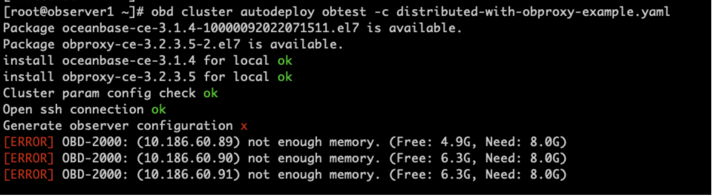
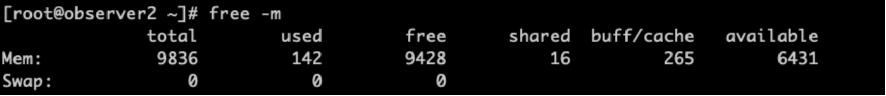
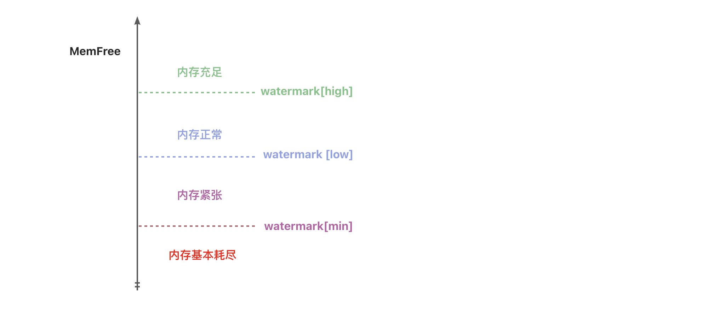
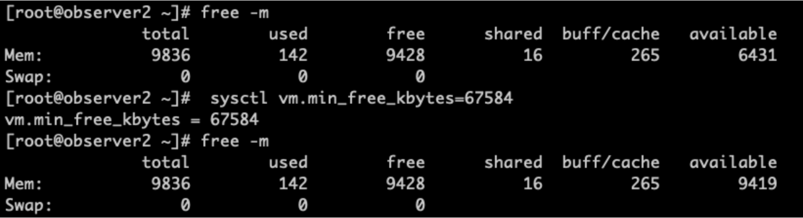

# 技术分享 | MemAvailable 是怎么计算的

**原文链接**: https://opensource.actionsky.com/20220920-mysql-2/
**分类**: MySQL 新特性
**发布时间**: 2022-09-21T21:53:20-08:00

---

作者：胡呈清
爱可生 DBA 团队成员，擅长故障分析、性能优化，个人博客：https://www.jianshu.com/u/a95ec11f67a8，欢迎讨论。
本文来源：原创投稿
*爱可生开源社区出品，原创内容未经授权不得随意使用，转载请联系小编并注明来源。
#### 背景
前两天安装 OceanBase 时遇到一个小问题：

很明显，安装OB时要求服务器可用内存至少 8G，不达标就无法安装。为了凑这3台10G内存的服务器我已经费了不少劲了，free -m 输出中 free 不是有 9G 吗，为什么还报错？

仔细一看上图，available 只有 6.3G，而 OB 安装报错的 Free 其实是 available。
那为什么 free -m 输出中：free 有 9.3G，而 available 只有 6.3G呢？
通常我们会把 MemAvailable 看成是 buffer/cache、free 之和。但实际上不是，它其实还跟 min_free_kbytes 有着密切关系。
#### min_free_kbytes
kswapd 是专门用来定期回收内存的进程。为了衡量内存的使用情况，定义了三个内存阈值（watermark，也称为水位），分别是 watermark[min/low/high]：

上图基本揭示了几个水位的含义，当 MemFree 低于 watermark[low] 时，kswapd 进行内存回收，直到空闲内存达到 watermark[high] 后停止回收。如果申请内存的速度太快，导致空闲内存降至 watermark[min] 后，内核就会进行 direct reclaim（直接回收），用回收上来的空闲页满足内存申请，这样会阻塞应用程序。而 watermark[min] 的大小等于内核参数 min_free_kbytes 的值，其他几个水位的关系是：
- watermark[low] = watermark[min]*5/4
- watermark[high] = watermark[min]*3/2
#### MemAvailable
显然 watermark[min] 以下的内存属于系统的自留内存，不会给普通进程申请使用。而 MemAvailable 意为可以分配使用的内存，因此它不应当包含这一块内存。实际上其计算公式为：
`MemAvailable = MemFree - watermark[LOW] + (PageCache - min(PageCache / 2, watermark[LOW]))`
知道了 MemAvailable 是怎么计算的，接下来就很简单了，先查看 min_free_kbytes 的设置：
[root@observer2 ~]# cat /proc/sys/vm/min_free_kbytes
2097152
2G 是OB 的部署规范，由于是测试环境，将它修改为64M后，MemAvailable 就符合要求了：

#### min_free_kbytes 设置建议
OB 的部署规范中，规定 min_free_kbytes=2G，不得不说这个点很细节，因为：
- 系统会根据内存大小自动计算出 min_free_kbytes 大小，但并不是线性关系，取值范围是 128K-64M，如果系统开启了大页，则最大值通常会超过 64M，但也不会很大，以下面这台服务器为例，256G内存，min_free_kbytes只有 132M：
root@idrc-110:~# cat /proc/sys/vm/min_free_kbytes
135168
root@idrc-110:~# free -m
total        used        free      shared  buff/cache   available
Mem:         257897       60060        2068       18161      195768      178009
Swap:           616           6         610
- 如果 min_free_kbytes 设置的很小，则系统剩余可用内存容易触底，direct reclaim 会造成性能严重降低。相反如果设置的很大，则 watermark[min/low/high] 这3个水位都会很大，经常触发内存回收，使内存利用率降低。
所以为系统预留2G内存十分合理，是一个很容易被忽略的优化点。
#### 参考资料
[https://git.kernel.org/pub/scm/linux/kernel/git/torvalds/linux.git/commit/?id=34e431b0ae398fc54ea69ff85ec700722c9da773](https://git.kernel.org/pub/scm/linux/kernel/git/torvalds/linux.git/commit/?id=34e431b0ae398fc54ea69ff85ec700722c9da773)