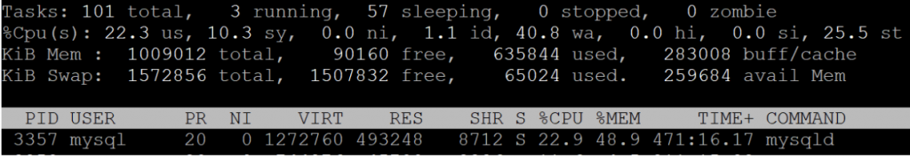
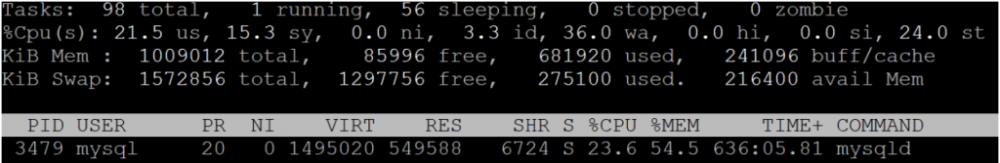

# 技术分享 | MySQL 8 和 MySQL 5.7 在小型设备的内存消耗分析

**原文链接**: https://opensource.actionsky.com/20190821-mysql/
**分类**: MySQL 新特性
**发布时间**: 2019-08-21T01:54:45-08:00

---

> 作者：Peter Zaitsev
虽然我们经常在较大规模的系统上运行 MySQL ，但我们常常在最小的云实例上运行 MySQL，或者只在我们的笔记本电脑上运行它。在这些情况下，MySQL 8 和 MySQL 5.7 的内存消耗非常重要。
在比较 MySQL 8 和 MySQL 5.7 时，您应该知道 MySQL 8 会使用更多内存。对运行相同轻量级工作负载的 MySQL 8 和 MySQL 5.7（实际上它们是 Percona Server 版本）的 1GB VM 进行基本测试。
我看到以下 vmstat 输出：**MySQL 5.7 vmstat 输出**- `procs -----------memory---------- ---swap-- -----io---- -system-- ------cpu-----`
- ` r  b   swpd   free   buff  cache   si   so    bi    bo   in   cs us sy id wa st`
- ` 4  0  65280  71608  58352 245108    0    0  2582  3611 1798 8918 18  9 11 33 30`
- ` 4  0  65280  68288  58500 247512    0    0  2094  2662 1769 8508 19  9 13 30 29`
- ` 3  1  65280  67780  58636 249656    0    0  2562  3924 1883 9323 20  9  7 37 27`
- ` 4  1  65280  66196  58720 251072    0    0  1936  3949 1587 7731 15  7 11 36 31`
**MySQL 8.0 vmstat 输出**
- `procs -----------memory---------- ---swap-- -----io---- -system-- ------cpu-----`
- ` r  b   swpd   free   buff  cache   si   so    bi    bo   in    cs us sy id wa st`
- ` 9  1 275356  62280  60832 204736    0    0  2197  5245 2638 13453 24 13  2 34 27`
- ` 3  0 275356  60548  60996 206340    0    0  1031  3449 2446 12895 25 11 10 28 26`
- ` 7  1 275356  78188  59564 190632    0    1  2448  5082 2677 13661 26 13  6 30 25`
- ` 4  1 275356  76516  59708 192096    0    0  2247  3750 2401 12210 22 12  4 38 24`
正如您所看到的，MySQL 8 使用了大约 200MB 的 swap 分区，并且使用更少的系统缓存，被分配更多内存。
如果我们查看“top”命令的输出，我们会看到：**MySQL 5.7**
											
**MySQL 8.0**
											
这也展示出** MySQL8 使用的更多常驻内存和虚拟内存**。特别是“可怕的”虚拟内存，因为它远远超过这些 VM 上可用的 1GB 物理内存。当然，虚拟内存使用（VSZ）是现代应用程序实际内存需求的一个很差的指标，但它确实证实了更高的内存需求这个事。
实际上，正如我们从 “vmstat” 输出中所知道的那样，即使没有太多的“空间”，MySQL 8 和 MySQL 5.7 都不会在低负载下使用 swap 分区。如果您有多个连接或希望在同一个 VM 上运行某些应用程序，则可以使用 swap（如果未启用交换，则可能导致 OOM）。
这是一个有趣的实验，能看看我有多少可以驱动 MySQL 5.7 和 MySQL 8 的内存消耗。
以下是我用于此测试的配置：- `[mysqld]`
- `innodb_buffer_pool_size=256M`
- `innodb_buffer_pool_instances=1`
- `innodb_log_file_size=1G`
- `innodb_flush_method=O_DIRECT`
- `innodb_numa_interleave=1`
- `innodb_flush_neighbors=0`
- `log_bin`
- `server_id=1`
- `expire_logs_days=1`
- `log_output=file`
- `slow_query_log=ON`
- `long_query_time=0`
- `log_slow_rate_limit=1`
- `log_slow_rate_type=query`
- `log_slow_verbosity=full`
- `log_slow_admin_statements=ON`
- `log_slow_slave_statements=ON`
- `slow_query_log_always_write_time=1`
- `slow_query_log_use_global_control=all`
- `innodb_monitor_enable=all`
- `userstat=1`
**总结**在开发环境中迁移到 MySQL 8 时，请记住，使用相同的设置需要比 MySQL 5.7 配置更多的内存。
**社区近期动态**
**No.1**
**Mycat 问题免费诊断**
**诊断范围支持：**
Mycat 的故障诊断、源码分析、性能优化
**服务支持渠道：**
- 技术交流群，进群后可提问QQ群（669663113）
- 社区通道，邮件&电话osc@actionsky.com
- 现场拜访，线下实地，1天免费拜访
**关注“爱可生开源社区”公众号，回复关键字“Mycat”，获取活动详情。**
**No.2**
**原创技术内容 征稿**
**征稿内容：**- 格式：.md/.doc/.txt
- 主题：MySQL、分布式中间件DBLE、数据传输组件DTLE相关
- 要求：原创且未发布过
- 奖励：作者署名；200元京东E卡+社区周边
**投稿方式：**- 邮箱：osc@actionsky.com
- 格式：[投稿]姓名+文章标题
- 以**附件**形式发送，正文需注明**姓名、手机号、微信号**，以便小编及时联系