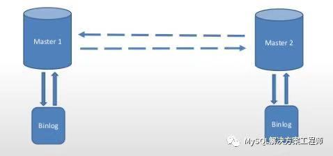

# 技术分享 | MySQL 8.0 常见问题——复制篇

**原文链接**: https://opensource.actionsky.com/20190925-mysql/
**分类**: MySQL 新特性
**发布时间**: 2019-09-25T01:10:53-08:00

---

> 转载自公众号：MySQL解决方案工程师
作者：徐轶韬
											
**问题1：****复制功能可以在不同的操作系统上使用吗？**
											
**答：**可以，复制功能可以在不同的操作系统上面共同使用。
**问题2：****复制功能可以在不同架构的硬件上使用吗？**
											
**答：**可以，可以在32位或64位架构的系统上共同使用。
**问题3：主从复制时，从服务器必须总是连接到主服务器吗？**
											
**答：**不是。从服务器与主服务器的连接可以断开，当重新连接主服务器，从服务器会追赶主服务器上的更新。主从复制依赖于服务器上面的二进制日志,当从服务器能够从最后读取事件的位置继续读取二进制日志时复制才能工作。因此，必须保证主服务器中尚未复制到从服务器二进制日志文件没被删除，才可以使断开的从服务器重新连接主服务器继续进行复制。
**问题4：****如何知道从服务器落后于主服务器多少？**
											
**答：**执行SHOW SLAVE STATUS 语句，确认Seconds_Behind_Master 列的信息。
**问题5：****是否可以强制主服务器阻止更新，直到从服务器赶上为止?**
											
**答：**可以。
执行如下步骤：
- a. 在主服务器上执行：
mysql> FLUSH TABLES WITH READ LOCK;
mysql> SHOW MASTER STATUS;
- b. 在从服务器上执行下面的语句，函数的值使用上面输出里面相对应的值。
mysql> SELECT MASTER_POS_WAIT(&#8216;log_name&#8217;, log_pos);
SELECT语句被阻塞，直到从服务器到达指定的日志文件和位置后，从服务器与主服务器保持同步，语句返回。
- c. 主服务器上，执行下面的语句，恢复更新处理：
mysql> UNLOCK TABLES;
**问题6：****搭建双向复制时应该注意哪些问题？**
											
**答：**MySQL 的主从复制目前不支持主服务器和从服务器之间的任何锁协议，无法保证分布式（跨服务器）更新的原子性。假设客户端 A 对服务器 1 进行更新，同时，在它传播到服务器 2 之前，客户端 B 可以对服务器 2 进行更新，这使得客户端A的更新与对服务器 1 的更新不同。因此，当客户端 A 更新到服务器2时，它生成的表与服务器 1 上的表不同。这意味着以双向复制关系会具有非常大的风险——破坏数据的一致性，除非确保更新可以以任何顺序安全地进行，或者以某种方式在客户端的代码中处理。此外，就更新而言，双向复制实际上并没有显著提高性能。每个服务器必须执行相同数量的更新，就像单个服务器所做的一样。惟一的区别是锁的争用要少一些，因为源自另一台服务器的更新是在一台从服务器线程中序列化的。但这种好处也可能被网络延迟所抵消。
**问题7：如何利用复制改善系统性能？**
											
**答：**可以将一台服务器设置为主服务器，并将所有写入指向它。然后在允许的范围内配置尽可能多的从服务器，并在主服务器和从服务器之间分配读操作。还可以使用 &#8211;skip-innodb 选项启动从服务器，启用 low_priority_updates 系统变量，并将 delay_key_write 系统变量设置为 ALL，用以提升从服务器端速度。
对于处理频繁读取和少量写入的系统，MySQL 复制是最有效的。理论上，使用一主多从的设置，可以添加更多的从服务器来扩展系统，直到耗尽网络带宽，或者写入负载增长到主服务器无法处理它的程度。
如果想要确定使用多少台从服务器可以提升性能，用户必须了解系统的查询模式，并对主服务器和从服务器上的读写吞吐量之间的关系进行基准测试。
假设系统负载由 10% 的写入和 90% 的读取组成，我们通过基准测试确定 R =1200 &#8211; 2 *W。（ R 和 W 代表每秒的读取和写入次数）换句话说，系统可以在不进行写入的情况下每秒读取 1200 次，平均的写入速度是平均读取速度的两倍时长，并且关系是线性的。假设主服务器和每个从服务器的性能相同，我们有一个主服务器和 N 个从服务器。每台服务器计算下面的等式：
R = 1200 &#8211; 2 * W
R = 9 * W/ (*`N`* + 1) (10%写，90%读。读取被拆分，写入被复制到所有从服务器。)
9 * W / (*`N`* + 1) + 2 * W = 1200
W = 1200 / (2 + 9/(*`N`* + 1))
最后一个等式表示了 N 个从服务器的最大写入次数，给定最大可能的读取速率为每秒 1,200 次，每次写入的读取次数为 9 次。
**通过分析可以得出以下结论：**
如果 N=0，表示没有使用复制功能，系统每秒可以处理 1200/11=109 次写操作。
如果 N=1，系统每秒可以处理 184 次写操作。
如果 N=8，系统每秒可以处理 400 次写操作。
如果 N=17，系统每秒可以处理 480 次写操作。
当 N 趋于无穷大时，我们可以非常接近每秒 600 次写操作，将系统吞吐量提高约5.5倍。然而，在只有 8 台服务器的情况下，我们将其增加了近 4 倍。
这些计算假定网络带宽是无限的，因而忽略了其他几个可能对系统很重要的因素。在大多数情况下，用户可能无法执行类似的计算，但该计算可以准确地预测如果添加 N 个从服务器将会在系统上发生什么。
考虑以下问题可以帮助决定复制是否会改善系统的性能，以及在多大程度上改善系统的性能：
a. 系统的读/写比率是多少?
b. 如果减少读操作，一台服务器可以处理多少写负载?
c. 网络上有多少个从服务器可用带宽?
**问题8：****如何使用复制功能提供高可用性？**
											
**答：**如何实现冗余取决于应用程序和系统环境。
高可用性解决方案（带有自动故障转移）需要系统监视工具、自定义脚本或中间件来提供从 MySQL 主服务器到从服务器的故障转移。MySQL Router 可以提供故障转移。
如果要手动处理这个过程，可以通过修改应用程序，让其与新 MySQL 服务器通信，或者将 DNS 从宕机的服务器调整到新的服务器。
**问题9：****如何防止 GRANT 和 REVOKE 语句复制到从服务器？**
											
**答：**启动服务器时，使用 &#8211;replicate-wild-ignore-table=mysql.% 选项，可以忽略复制 mysql 数据库下面的表。
**问题10：****如何知道从服务器复制最后一条语句的时间？**
											
**答：**当从服务器的 SQL 线程执行从主服务器获得的事件时，它用事件的时间戳修改自己的时间。( 这也是 TIMESTAMP 可以复制的原因。) 在 SHOW PROCESSLIST 输出的 Time 列中，从服务器 SQL 线程所显示的秒数是上次复制事件的时间戳与从服务器的实际时间之间的秒数。可以使用它来确定最后一次复制事件的时间。假设从服务器与主服务器断开连接一个小时，然后重新连接，可能会在 SHOW PROCESSLIST 的 Time 列看到类似 3600 这样的大时间值，这是因为从服务器正在执行一个小时前的语句。
**社区近期动态**
**No.1**
**10.26 DBLE 用户见面会 北京站**
											
爱可生开源社区将在 2019 年 10 月 26 日迎来在北京的首场 DBLE 用户见面会，以线下**互动分享**的会议形式跟大家见面。
时间：10月26日 9:00 &#8211; 12:00 AM
地点：HomeCafe 上地店（北京市海淀区上地二街一号龙泉湖酒店对面）
重要提醒：
1. 同日下午还有 dbaplus 社群举办的沙龙：聚焦数据中台、数据架构与优化。
2. 爱可生开源社区会在每年10.24日开源一款高质量产品。本次在 dbaplus 沙龙会议上，爱可生的资深研发工程师闫阿龙，将为大家带来《金融分布式事务实践及txle概述》，并在现场开源。
**No.2**
**Mycat 问题免费诊断**
诊断范围支持：
Mycat 的故障诊断、源码分析、性能优化
服务支持渠道：
- 技术交流群，进群后可提问
QQ群（669663113）
- 社区通道，邮件&电话
osc@actionsky.com
- 现场拜访，线下实地，1天免费拜访
关注“爱可生开源社区”公众号，回复关键字“Mycat”，获取活动详情。
**No.3**
**社区技术内容征稿**
征稿内容：
- 格式：.md/.doc/.txt
- 主题：MySQL、分布式中间件DBLE、数据传输组件DTLE相关技术内容
- 要求：原创且未发布过
- 奖励：作者署名；200元京东E卡+社区周边
投稿方式：
- 邮箱：osc@actionsky.com
- 格式：[投稿]姓名+文章标题
- 以附件形式发送，正文需注明姓名、手机号、微信号，以便小编及时联系