# 技术分享 | MySQL Binlog 通过 MySQL 客户端导入数据库效率低的原因

**原文链接**: https://opensource.actionsky.com/20220104-mysql/
**分类**: MySQL 新特性
**发布时间**: 2022-01-04T00:56:44-08:00

---

作者：郭斌斌
爱可生 DBA 团队成员，负责项目日常问题处理及公司平台问题排查。
本文来源：原创投稿
*爱可生开源社区出品，原创内容未经授权不得随意使用，转载请联系小编并注明来源。
## 一、背景
客户反馈生产环境中，MySQL 5.7 通过 xtrabackup+ Binlog 做基于时间点的恢复操作时，持续卡在 Binlog 的回放阶段，旷日持久，久到离谱。他对于这种旷日持久的操作产生了怀疑，想要确认数据库的这种行为是否合理，因此有了本文的 Binlog 回灌验证操作。
## 二、复现前提
MySQL Version：5.7.22
Binlog format： Row
准备 Delete 800多万记录的 Binlog
## 三、复现准备
3.1 创建表、构造数据
`mysql> create table t1(id int primary key,name varchar(10));
Query OK, 0 rows affected (0.02 sec)
mysql> insert into t1 values(1,repeat('a',10));
Query OK, 1 row affected (0.01 sec)
mysql> insert into t1 select (select count(1) from t1)+id,name from t1;
Query OK, 1 row affected (0.01 sec)
Records: 1  Duplicates: 0  Warnings: 0
………………
mysql> insert into t1 select (select count(1) from t1)+id,name from t1;
Query OK, 4194304 rows affected (57.75 sec)
Records: 4194304  Duplicates: 0  Warnings: 0
`
3.2 准备 Delete 800多万记录的 Binlog 文件
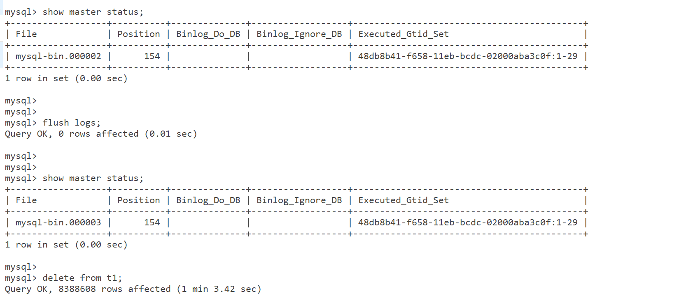
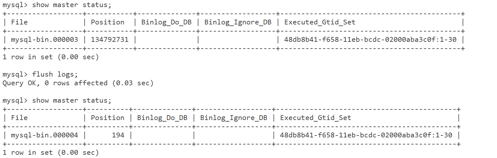
MySQL Binlog mysql-bin.000003 用于回灌测试
3.3 由于 Binlog 的回灌和造数是在同一个实例上，之前为了构建 Delete 800多万记录的 Binlog ，已经将数据删除，因此在进行 binlog 回灌前，需要使用之前造数的方法，重新造数

3.4 同一个实例上先进行了 Delete ，又重新构建新的数据。导致 Delete 操作的 GTID 要比重新造数操作的 GTID 小，为保证可以正常回灌，可以执行 reset master
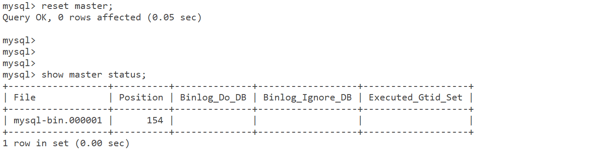
## 四、复现测试
4.1 解析 MySQL Binlog  mysql-bin.000003

4.2 导入解析文件
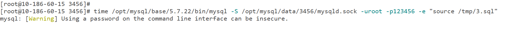
**A Few Moment Later**
4.3 查看 processlist ，发现导入线程一直处于 Sleep 状态，现象跟客户描述契合。
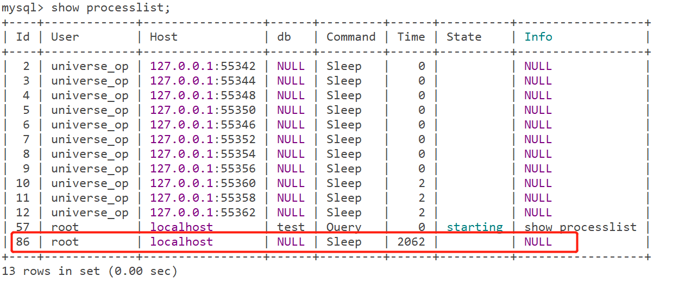
4.4 随即中断导入操作，重新发起导入同时使用 strace 记录操作的行为。
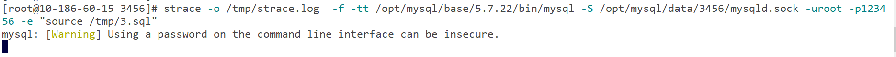
4.5 通过观测产生的 strace.log ，发现两个 read 的时间间隔不固定，少的也需要140ms左右，而读取的大小却只有4k（4096），读取效率偏低。
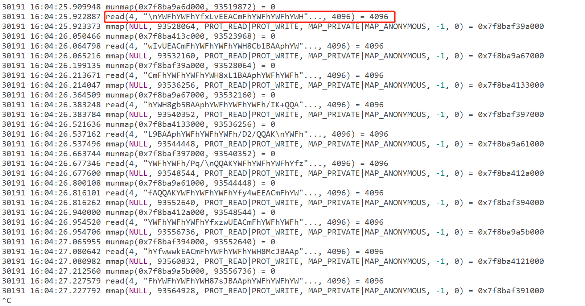
## 五、分析
通过 Google 检索“MySQL Mem Load Slow”发现这是一个 BUG ，MySQL 5.7 Client 在读取较大事务（涉及多行操作）时，由于内存分配效率比较低，导致消耗大量的时间，已在 MySQL 8.0.13 中修复。

## 六、复测
6.1 Mysql 8.0.18 客户端进行 Binlog 解析文件的回灌，提示 MySQL Server has gone away
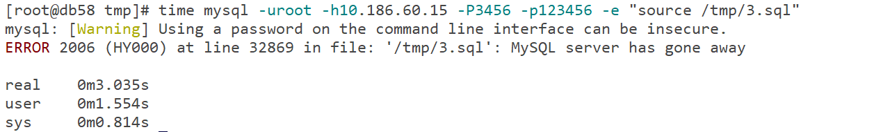
6.2 导数报错时数据库没触发重启，查看 error 日志，有如下报错：
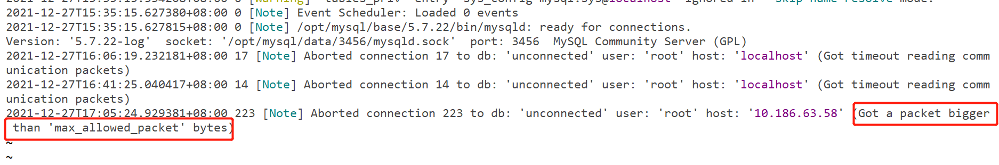
6.3 调大 max_allowed_packet 配置后重新测试
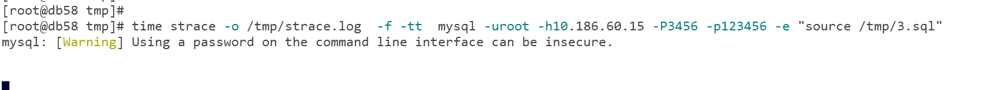
6.4 观测 strace 日志，每次读取 Binlog 大小16M，远高于原来的4k
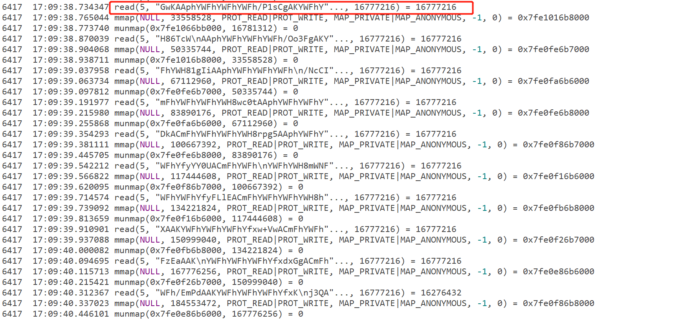
6.5 观测线程状态
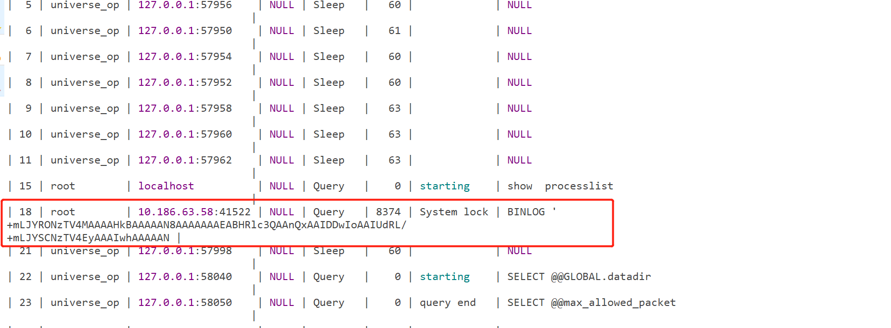
6.6 观察执行耗时，MySQL 8.0.18 客户端导数时间变短，效率提升明显。
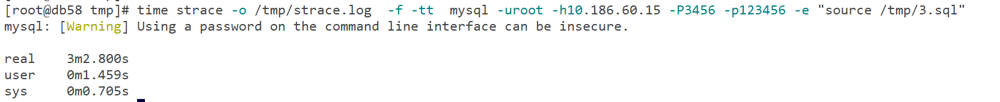
## 七、结论
目前官方在 MySQL 8.0.13 版本中，解决了“在使用 MySQL Client 进行批量导数时，内存分配效率低”的问题，因此 MySQL 8.0.18 客户端在进行回灌 Binlog 解析后的文件时，读取文件效率明显高于5.7.22的客户端，提升了 Binlog回放的效率。
#### 参考链接
https://bugs.mysql.com/bug.php?id=85155
https://dev.mysql.com/doc/relnotes/mysql/8.0/en/news-8-0-13.html#mysqld-8-0-13-bug