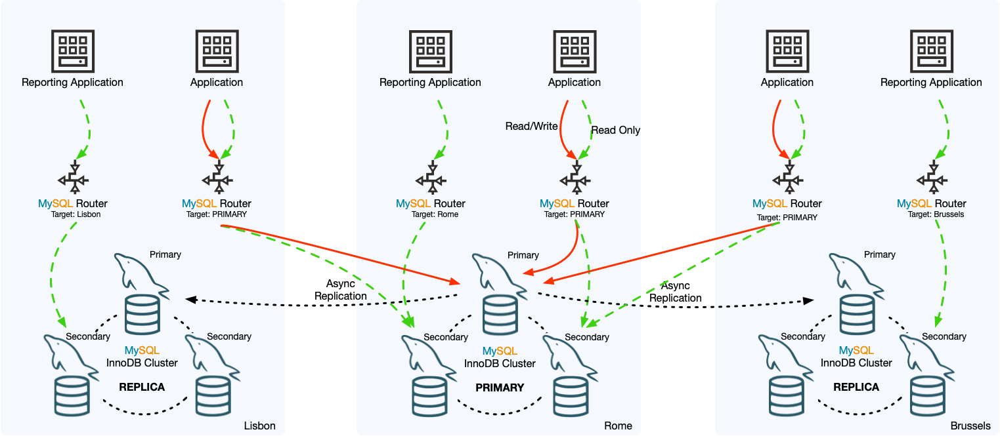

# 技术分享 | MySQL InnoDB Cluster Set 介绍

**原文链接**: https://opensource.actionsky.com/20220420-innodb/
**分类**: 技术干货
**发布时间**: 2022-04-19T23:27:52-08:00

---

作者：杨涛涛
资深数据库专家，专研 MySQL 十余年。擅长 MySQL、PostgreSQL、MongoDB 等开源数据库相关的备份恢复、SQL 调优、监控运维、高可用架构设计等。目前任职于爱可生，为各大运营商及银行金融企业提供 MySQL 相关技术支持、MySQL 相关课程培训等工作。
本文来源：原创投稿
*爱可生开源社区出品，原创内容未经授权不得随意使用，转载请联系小编并注明来源。
**MySQL InnoDB Cluster(MIC)** 想必大家已经非常熟悉，由三个组件组成，分别为：MySQL Shell、MySQL Router 、MySQL MGR 。
MySQL Shell 用来进行MGR的日常运维，MySQL Router 对上层应用提供一个简单的读写分离入口，MySQL MGR 则是用来存放真实数据的多个 MySQL 实例。对应的架构如下：

那如果想针对 MIC 做一个容灾功能，该怎么做？如果你一直使用 MySQL 8.0，并且保持 MySQL 版本一直为最新，那答案是肯定的（最新的 MySQL 8.0 小版本为 8.0.28），**新名字为 MySQL InnoDB Cluster Set（MICS）。**
这个新特性其实就是基于纯粹的 MIC 做容灾。 比如北京上地一套 MIC 对外提供服务，东直门另外一套 MIC 用来做灾备，两套 MIC 通过专用复制通道**clusterset_replication**来同步数据。 截取官网的架构如下：

##### MICS 虽然看起来挺好，但是限制很多，几个主要限制如下：
- 
###### MICS 的最大特性是高可用，而不是一致性。由于数据传输依赖传统的 MySQL 异步复制（不能使用半同步），无法避免异步复制的缺陷：数据延迟、数据一致性、需要手动故障转移等等。
- 
###### 从库不能是已有的 MIC ，必须新建。所以在搭建 MICS 前，得想办法解决已有数据的保存问题。
- 
###### MICS 内部 MIC 限制为单主模式，不能多主。
- 
###### MICS 内部只有一套 MIC 对外提供服务，其他只能作为备库。
- 
###### 只支持 MySQL 8.0 。
##### 我来简单演示下搭建过程：（为了简单起见，没有包含 MySQL ROUTER 组件）
- 
###### 准备至少6台 MySQL 实例。（端口分别为3381、3382、3383、3384、3385、3386）
`    MySQL  Py > for i in range(3381,3387):
->     dba.deploy_sandbox_instance(i,{"password":"root"})
-> 
A new MySQL sandbox instance will be created on this host in 
/root/mysql-sandboxes/3381
...
`
- 
###### 端口3381、3382、3383 搭建一套 MGR ，名字为 ytt-rc1 。
`    MySQL  Py > \c root:root@localhost:3381
Creating a session to 'root@localhost:3381'
...
Server version: 8.0.28 MySQL Community Server - GPL
...
MySQL  localhost:3381 ssl  Py > rc1 = dba.create_cluster('ytt-rc1');
A new InnoDB cluster will be created on instance 'localhost:3381'.
...
MySQL  localhost:3381 ssl  Py > rc1.add_instance("root:root@localhost:3382",{"recoveryMethod":"clone"})
...
MySQL  localhost:3381 ssl  Py > rc1.add_instance("root:root@localhost:3383",{"recoveryMethod":"clone"})
...
`
- 
###### 创建一套 MICS ，命名为：ytt-rc-set ，主库为 ytt-rc1 。
`    MySQL  localhost:3381 ssl  Py > rc1_set = rc1.create_cluster_set('ytt-rc-set')
A new ClusterSet will be created based on the Cluster 'ytt-rc1'.
* Validating Cluster 'ytt-rc1' for ClusterSet compliance.
* Creating InnoDB ClusterSet 'ytt-rc-set' on 'ytt-rc1'...
* Updating metadata...
ClusterSet successfully created. Use ClusterSet.create_replica_cluster() to add Replica Clusters to it.
`
- 
###### 查看 MICS 状态： 名字为 ytt-rc-set 、集群角色为 primary 、对应主实例为 127.0.0.1:3381 、状态为 healthy 。
`    MySQL  localhost:3381 ssl  Py > rc1_set.status()
{
"clusters": {
"ytt-rc1": {
"clusterRole": "PRIMARY", 
"globalStatus": "OK", 
"primary": "127.0.0.1:3381"
}
}, 
"domainName": "ytt-rc-set", 
"globalPrimaryInstance": "127.0.0.1:3381", 
"primaryCluster": "ytt-rc1", 
"status": "HEALTHY", 
"statusText": "All Clusters available."
`
- 
###### 接下来为 ytt-rc-set 添加从库，从库必须不属于任何 MIC 。
创建 MICS 管理用户，用来同步主库数据：
`    MySQL  localhost:3381 ssl  Py > dba.configure_instance("root:root@localhost:3384",{"clusterAdmin":"ics_admin","clusterAdminPassword":"root"})
Configuring local MySQL instance listening at port 3384 for use in an InnoDB cluster...
...
Cluster admin user 'ics_admin'@'%' created.
The instance '127.0.0.1:3384' is already ready to be used in an InnoDB cluster.
Successfully enabled parallel appliers.
`
添加从库：从库 MIC 的名为为 ytt-rc2 。
`    MySQL  localhost:3381 ssl  Py > rc2=rc1_set.create_replica_cluster("root:root@localhost:3384","ytt-rc2",{"recoveryMethod":"clone","recoveryProgress":2})
Setting up replica 'ytt-rc2' of cluster 'ytt-rc1' at instance '127.0.0.1:3384'.
...
Replica Cluster 'ytt-rc2' successfully created on ClusterSet 'ytt-rc-set'.
`
给 ytt-rc2 添加其他实例：
`   MySQL  localhost:3381 ssl  Py > rc2.add_instance("root:root@localhost:3385",{"recoveryMethod":"clone"})
MySQL  localhost:3381 ssl  Py > rc2.add_instance("root:root@localhost:3386",{"recoveryMethod":"clone"})
`
- 
###### 看下 ytt-rc-set 的最新状态：ytt-rc1 为主，ytt-rc2 为备。
`    MySQL  localhost:3381 ssl  Py > rc1_set.describe()
{
"clusters": {
"ytt-rc1": {
"clusterRole": "PRIMARY", 
"topology": [
{
"address": "127.0.0.1:3381", 
"label": "127.0.0.1:3381"
}, 
{
"address": "127.0.0.1:3382", 
"label": "127.0.0.1:3382"
}, 
{
"address": "127.0.0.1:3383", 
"label": "127.0.0.1:3383"
}
]
}, 
"ytt-rc2": {
"clusterRole": "REPLICA", 
"topology": [
{
"address": "127.0.0.1:3384", 
"label": "127.0.0.1:3384"
}, 
{
"address": "127.0.0.1:3385", 
"label": "127.0.0.1:3385"
}, 
{
"address": "127.0.0.1:3386", 
"label": "127.0.0.1:3386"
}
]
}
}, 
"domainName": "ytt-rc-set", 
"primaryCluster": "ytt-rc1"
}
`
- 
###### 写条数据简单测试下数据同步：主库表t1插一条记录。
`   MySQL  localhost:3381 ssl  SQL > \sql
MySQL  localhost:3381 ssl  SQL > create database ytt;
Query OK, 1 row affected (0.0167 sec)
MySQL  localhost:3381 ssl  SQL > use ytt;
Default schema set to `ytt`.
Fetching table and column names from `ytt` for auto-completion... Press ^C to stop.
MySQL  localhost:3381 ssl  ytt  SQL > create table t1(id int primary key,r1 int);
Query OK, 0 rows affected (0.1561 sec)
MySQL  localhost:3381 ssl  ytt  SQL > insert t1 values (1,100);
Query OK, 1 row affected (0.0185 sec)
MySQL  localhost:3381 ssl  ytt  SQL > table t1;
+----+-----+
| id | r1  |
+----+-----+
|  1 | 100 |
+----+-----+
1 row in set (0.0004 sec)
`
切换到从库，看下效果：表t1数据已经正常同步，并且只读。
`    MySQL  localhost:3381 ssl  ytt  SQL > \c root@localhost:3384
Creating a session to 'root@localhost:3384'
...
MySQL  localhost:3384 ssl  SQL > use ytt
...
MySQL  localhost:3384 ssl  ytt  SQL > table t1;
+----+-----+
| id | r1  |
+----+-----+
|  1 | 100 |
+----+-----+
1 row in set (0.0006 sec)
MySQL  localhost:3384 ssl  ytt  SQL > create table t2 like t1;
ERROR: 1290 (HY000): The MySQL server is running with the --super-read-only option so it cannot execute this statement  
`
- 
###### 手动进行主备切换：ytt-rc2 已经被提升了新的主。
`   MySQL  localhost:3384 ssl  ytt  Py > rc1_set.set_primary_cluster('ytt-rc2')
Switching the primary cluster of the clusterset to 'ytt-rc2'
...
Cluster 'ytt-rc2' was promoted to PRIMARY of the clusterset. The PRIMARY instance is '127.0.0.1:3384'
`
- 
###### 看下 ytt-rc-set 最新状态：ytt-rc1 变为备，新主为 ytt-rc2 。
`   MySQL  localhost:3384 ssl  ytt  Py > rc1_set.status()
{
"clusters": {
"ytt-rc1": {
"clusterRole": "REPLICA", 
"clusterSetReplicationStatus": "OK", 
"globalStatus": "OK"
}, 
"ytt-rc2": {
"clusterRole": "PRIMARY", 
"globalStatus": "OK", 
"primary": "127.0.0.1:3384"
}
}, 
"domainName": "ytt-rc-set", 
"globalPrimaryInstance": "127.0.0.1:3384", 
"primaryCluster": "ytt-rc2", 
"status": "HEALTHY", 
"statusText": "All Clusters available."
`
## 总结：
##### MySQL InnoDB Cluster Set 由于数据传输通道为异步复制，所以要谨慎使用！