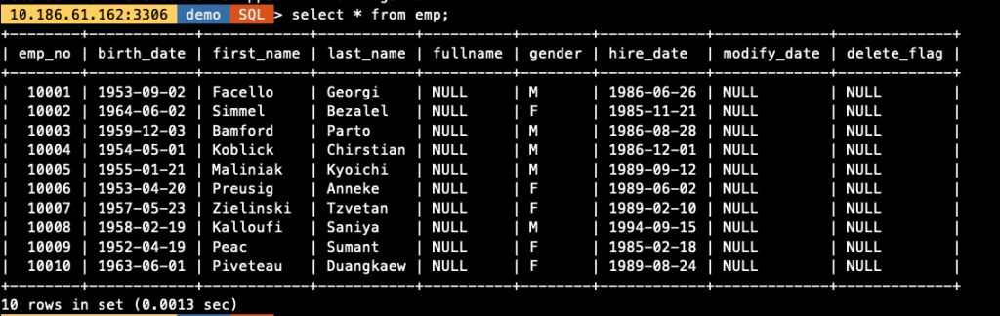
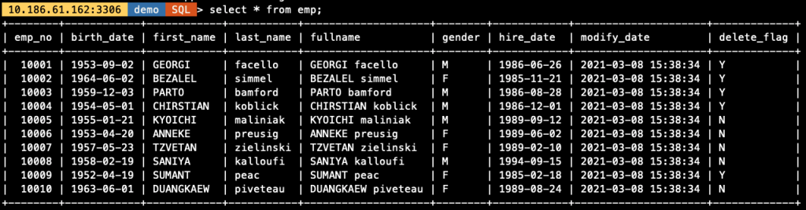
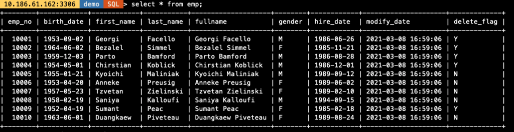

# 技术分享 | MySQL Load Data 的多种用法

**原文链接**: https://opensource.actionsky.com/20210325-mysql/
**分类**: MySQL 新特性
**发布时间**: 2021-03-25T00:56:52-08:00

---

作者：余振兴爱可生 DBA 团队成员，熟悉 Oracle、MySQL、MongoDB、Redis，最近在盘 TiDB，擅长架构设计、故障诊断、数据迁移、灾备构建等等。负责处理客户 MySQL 及我司自研 DMP 数据库管理平台日常运维中的问题。热衷技术分享、编写技术文档。本文来源：原创投稿* 爱可生开源社区出品，原创内容未经授权不得随意使用，转载请联系小编并注明来源。
**本文目录**
一、LOAD 基本背景二、LOAD 基础参数三、LOAD 示例数据及示例表结构四、LOAD 场景示例- 场景 1. LOAD 文件中的字段比数据表中的字段多
- 场景 2. LOAD 文件中的字段比数据表中的字段少
- 场景 3. LOAD 生成自定义字段数据
- 场景 4. LOAD 定长数据
五、LOAD 总结
## 一、LOAD 基本背景
> 我们在数据库运维过程中难免会涉及到需要对文本数据进行处理，并导入到数据库中，本文整理了一些导入导出时常见的场景进行示例演示。
## 二、LOAD 基础参数
> 
文章后续示例均使用以下命令导出的 csv 格式样例数据（**以 ****`,` 逗号做分隔符，以 `"` 双引号作为界定符）**
`-- 导出基础参数
select * into outfile '/data/mysql/3306/tmp/employees.txt'
character set utf8mb4
fields terminated by ','
enclosed by '"'
lines terminated by '\n'
from employees.employees limit 10;
-- 导入基础参数
load data infile '/data/mysql/3306/tmp/employees.txt'
replace into table demo.emp
character set utf8mb4
fields terminated by ','
enclosed by '"'
lines terminated by '\n'
...`
## 
## 三、LOAD 示例数据及示例表结构
> 以下为示例数据，表结构及对应关系信息
`-- 导出的文件数据内容
[root@10-186-61-162 tmp]# cat employees.txt
"10001","1953-09-02","Georgi","Facello","M","1986-06-26"
"10002","1964-06-02","Bezalel","Simmel","F","1985-11-21"
"10003","1959-12-03","Parto","Bamford","M","1986-08-28"
"10004","1954-05-01","Chirstian","Koblick","M","1986-12-01"
"10005","1955-01-21","Kyoichi","Maliniak","M","1989-09-12"
"10006","1953-04-20","Anneke","Preusig","F","1989-06-02"
"10007","1957-05-23","Tzvetan","Zielinski","F","1989-02-10"
"10008","1958-02-19","Saniya","Kalloufi","M","1994-09-15"
"10009","1952-04-19","Sumant","Peac","F","1985-02-18"
"10010","1963-06-01","Duangkaew","Piveteau","F","1989-08-24"
-- 示例表结构
SQL > desc demo.emp;
+-------------+---------------+------+-----+---------+-------+
| Field       | Type          | Null | Key | Default | Extra |
+-------------+---------------+------+-----+---------+-------+
| emp_no      | int           | NO   | PRI | NULL    |       |
| birth_date  | date          | NO   |     | NULL    |       |
| first_name  | varchar(16)   | NO   |     | NULL    |       |
| last_name   | varchar(16)   | NO   |     | NULL    |       |
| fullname    | varchar(32)   | YES  |     | NULL    |       | -- 表新增字段,导出数据文件中不存在
| gender      | enum('M','F') | NO   |     | NULL    |       |
| hire_date   | date          | NO   |     | NULL    |       |
| modify_date | datetime      | YES  |     | NULL    |       | -- 表新增字段,导出数据文件中不存在
| delete_flag | char(1)       | YES  |     | NULL    |       | -- 表新增字段,导出数据文件中不存在
+-------------+---------------+------+-----+---------+-------+
-- 导出的数据与字段对应关系
emp_no  birth_date    first_name   last_name    gender  hire_date
"10001"  "1953-09-02"  "Georgi"     "Facello"    "M"    "1986-06-26"
"10002"  "1964-06-02"  "Bezalel"    "Simmel"     "F"    "1985-11-21"
"10003"  "1959-12-03"  "Parto"      "Bamford"    "M"    "1986-08-28"
"10004"  "1954-05-01"  "Chirstian"  "Koblick"    "M"    "1986-12-01"
"10005"  "1955-01-21"  "Kyoichi"    "Maliniak"   "M"    "1989-09-12"
"10006"  "1953-04-20"  "Anneke"     "Preusig"    "F"    "1989-06-02"
"10007"  "1957-05-23"  "Tzvetan"    "Zielinski"  "F"    "1989-02-10"
"10008"  "1958-02-19"  "Saniya"     "Kalloufi"   "M"    "1994-09-15"
"10009"  "1952-04-19"  "Sumant"     "Peac"       "F"    "1985-02-18"
"10010"  "1963-06-01"  "Duangkaew"  "Piveteau"   "F"    "1989-08-24"`
## 四、LOAD 场景示例
#### 场景 1. LOAD 文件中的字段比数据表中的字段多
> 只需要文本文件中部分数据导入到数据表中
`-- 临时创建2个字段的表结构
SQL > create table emp_tmp select emp_no,hire_date from emp;
SQL > desc emp_tmp;
+-----------+------+------+-----+---------+-------+
| Field     | Type | Null | Key | Default | Extra |
+-----------+------+------+-----+---------+-------+
| emp_no    | int  | NO   |     | NULL    |       |
| hire_date | date | NO   |     | NULL    |       |
+-----------+------+------+-----+---------+-------+
-- 导入数据语句
load data infile '/data/mysql/3306/tmp/employees.txt'
replace into table demo.emp_tmp
character set utf8mb4
fields terminated by ','
enclosed by '"'
lines terminated by '\n'
(@C1,@C2,@C3,@C4,@C5,@C6) -- 该部分对应employees.txt文件中6列数据
-- 只对导出数据中指定的2个列与表中字段做匹配,mapping关系指定的顺序不影响导入结果
set hire_date=@C6,
    emp_no=@C1; 
-- 导入数据结果示例
SQL > select * from emp_tmp;
+--------+------------+
| emp_no | hire_date  |
+--------+------------+
|  10001 | 1986-06-26 |
|  10002 | 1985-11-21 |
|  10003 | 1986-08-28 |
|  10004 | 1986-12-01 |
|  10005 | 1989-09-12 |
|  10006 | 1989-06-02 |
|  10007 | 1989-02-10 |
|  10008 | 1994-09-15 |
|  10009 | 1985-02-18 |
|  10010 | 1989-08-24 |
+--------+------------+
10 rows in set (0.0016 sec)`
#### 场景 2. LOAD 文件中的字段比数据表中的字段少
> 表字段不仅包含文本文件中所有数据，还包含了额外的字段
`-- 导入数据语句
load data infile '/data/mysql/3306/tmp/employees.txt'
replace into table demo.emp
character set utf8mb4
fields terminated by ','
enclosed by '"'
lines terminated by '\n'
(@C1,@C2,@C3,@C4,@C5,@C6) -- 该部分对应employees.txt文件中6列数据
-- 将文件中的字段与表中字段做mapping对应,表中多出的字段不做处理
set emp_no=@C1,
   birth_date=@C2,
   first_name=@C3,
   last_name=@C4,
   gender=@C5,
   hire_date=@C6;`
											
#### 场景 3. LOAD 生成自定义字段数据
> 从场景 2 的验证可以看到，emp 表中新增的字段 `fullname,modify_date,delete_flag` 字段在导入时并未做处理，被置为了 NULL 值，如果需要对其进行处理，可在 LOAD 时通过 `MySQL支持的函数` 或给定 `固定值` 自行定义数据，对于文件中存在的字段也可做函数处理，结合导入导出，实现简单的 ETL 功能，如下所示：
`-- 导入数据语句
load data infile '/data/mysql/3306/tmp/employees.txt'
replace into table demo.emp
character set utf8mb4
fields terminated by ','
enclosed by '"'
lines terminated by '\n'
(@C1,@C2,@C3,@C4,@C5,@C6)              -- 该部分对应employees.txt文件中6列数据
-- 以下部分明确对表中字段与数据文件中的字段做Mapping关系,不存在的数据通过函数处理生成(也可设置为固定值)
set emp_no=@C1,
   birth_date=@C2,
   first_name=upper(@C3),              -- 将导入的数据转为大写
   last_name=lower(@C4),               -- 将导入的数据转为小写
   fullname=concat(first_name,' ',last_name),    -- 对first_name和last_name做拼接
   gender=@C5,
   hire_date=@C6 ,
   modify_date=now(),                 -- 生成当前时间数据
   delete_flag=if(hire_date<'1988-01-01','Y','N'); -- 对需要生成的值基于某一列做条件运算`
											
#### 场景 4. LOAD 定长数据
> 定长数据的特点如下所示，可以使用函数取出字符串中固定长度来生成指定列数据
`SQL > select 
    c1 as sample_data,
    substr(c1,1,3)  as c1,
    substr(c1,4,3)  as c2,
    substr(c1,7,2)  as c3,
    substr(c1,9,5)  as c4,
    substr(c1,14,3) as c5,
    substr(c1,17,3) as c6 from t1
    
*************************** 1. row ***************************
sample_data: ABC余振兴CDMySQLEFG数据库
         c1: ABC
         c2: 余振兴
         c3: CD
         c4: MySQL
         c5: EFG
         c6: 数据库
`> 定长数据导入需要明确每列数据占用的字符个数，以下直接使用 rpad 对现有的表数据填充空格的方式生成定长数据用作示例使用
`-- 生成定长数据
SQL > select 
    concat(rpad(emp_no,10,' '),
          rpad(birth_date,19,' '),
          rpad(first_name,14,' '),
          rpad(last_name,16,' '),
          rpad(gender,2,' '),
          rpad(hire_date,19,' ')) as fixed_length_data 
      from employees.employees limit 10;
+----------------------------------------------------------------------------------+
| fixed_length_data                                                                |
+----------------------------------------------------------------------------------+
| 10001     1953-09-02         Georgi        Facello         M 1986-06-26          |
| 10002     1964-06-02         Bezalel       Simmel          F 1985-11-21          |
| 10003     1959-12-03         Parto         Bamford         M 1986-08-28          |
| 10004     1954-05-01         Chirstian     Koblick         M 1986-12-01          |
| 10005     1955-01-21         Kyoichi       Maliniak        M 1989-09-12          |
| 10006     1953-04-20         Anneke        Preusig         F 1989-06-02          |
| 10007     1957-05-23         Tzvetan       Zielinski       F 1989-02-10          |
| 10008     1958-02-19         Saniya        Kalloufi        M 1994-09-15          |
| 10009     1952-04-19         Sumant        Peac            F 1985-02-18          |
| 10010     1963-06-01         Duangkaew     Piveteau        F 1989-08-24          |
+----------------------------------------------------------------------------------+
-- 导出定长数据
select 
    concat(rpad(emp_no,10,' '),
          rpad(birth_date,19,' '),
          rpad(first_name,14,' '),
          rpad(last_name,16,' '),
          rpad(gender,2,' '),
          rpad(hire_date,19,' ')) as fixed_length_data 
into outfile '/data/mysql/3306/tmp/employees_fixed.txt'
character set utf8mb4
lines terminated by '\n'
from employees.employees limit 10;
-- 导出数据示例
[root@10-186-61-162 tmp]# cat employees_fixed.txt
10001     1953-09-02         Georgi        Facello         M 1986-06-26
10002     1964-06-02         Bezalel       Simmel          F 1985-11-21
10003     1959-12-03         Parto         Bamford         M 1986-08-28
10004     1954-05-01         Chirstian     Koblick         M 1986-12-01
10005     1955-01-21         Kyoichi       Maliniak        M 1989-09-12
10006     1953-04-20         Anneke        Preusig         F 1989-06-02
10007     1957-05-23         Tzvetan       Zielinski       F 1989-02-10
10008     1958-02-19         Saniya        Kalloufi        M 1994-09-15
10009     1952-04-19         Sumant        Peac            F 1985-02-18
10010     1963-06-01         Duangkaew     Piveteau        F 1989-08-24
-- 导入定长数据
load data infile '/data/mysql/3306/tmp/employees_fixed.txt'
replace into table demo.emp
character set utf8mb4
fields terminated by ','
enclosed by '"'
lines terminated by '\n'
(@row)  -- 对一行数据定义为一个整体
set emp_no   = trim(substr(@row,1,10)),-- 使用substr取前10个字符,并去除头尾空格数据
   birth_date = trim(substr(@row,11,19)),-- 后续字段以此类推
   first_name = trim(substr(@row,30,14)),
   last_name  = trim(substr(@row,44,16)),
   fullname  = concat(first_name,' ',last_name),  -- 对first_name和last_name做拼接
   gender   = trim(substr(@row,60,2)),
   hire_date  = trim(substr(@row,62,19)),
   modify_date = now(),
   delete_flag = if(hire_date<'1988-01-01','Y','N'); -- 对需要生成的值基于某一列做条件运算`
											
## 五、LOAD 总结
1. 默认情况下导入的顺序以文本文件 `列-从左到右，行-从上到下` 的顺序导入
2. 如果表结构和文本数据不一致，建议将文本文件中的各列依次顺序编号并与表中字段建立 mapping 关系，以防数据导入到错误的字段
3. 对于待导入的文本文件较大的场景，建议将文件 `按行拆分` 为多个小文件，如用 split 拆分
4. 对文件导入后建议执行以下语句验证导入的数据是否有 `Warning`,`ERROR` 以及导入的数据量
- `GET DIAGNOSTICS @p1=NUMBER,@p2=ROW_COUNT;`
- `select @p1 AS ERROR_COUNT,@p2 as ROW_COUNT;`
5. 文本文件数据与表结构存在过大的差异或数据需要做清洗转换，建议还是用专业的 ETL 工具或先粗略导入 MySQL 中再进行加工转换处理。
**文章推荐：**
[技术分享 | MySQL 主从复制中创建复制用户的时机探讨](https://opensource.actionsky.com/20210318-mysql/)
[技术分享 | 一次数据库迁移](https://opensource.actionsky.com/20210312-mysql/)
[技术分享 | XtraBackup 备份加速](https://opensource.actionsky.com/20210311-xtrabackup/)