# 技术分享 | MySQL Shell import_table 数据导入

**原文链接**: https://opensource.actionsky.com/20210427-mysql/
**分类**: MySQL 新特性
**发布时间**: 2021-04-26T23:03:17-08:00

---

作者：余振兴爱可生 DBA 团队成员，熟悉 Oracle、MySQL、MongoDB、Redis，最近在盘 TiDB，擅长架构设计、故障诊断、数据迁移、灾备构建等等。负责处理客户 MySQL 及我司自研 DMP 数据库管理平台日常运维中的问题。热衷技术分享、编写技术文档。本文来源：原创投稿*爱可生开源社区出品，原创内容未经授权不得随意使用，转载请联系小编并注明来源。
## 1. import_table介绍
> 
[上期技术分享](https://opensource.actionsky.com/20210325-mysql/)我介绍了 MySQL Load Data 的 4 种将文本数据导入到 MySQL 的常用的方法。
这一期我们继续介绍另一款更加高效的数据导入工具 —— MySQL Shell 工具集中的`import_table`。该工具的全称是 `Parallel Table Import Utility`，顾名思义，支持并发数据导入。
该工具在 MySQL Shell 8.0.23 版本后，功能更加完善，以下列举该工具的**核心功能**：
- 
基本覆盖了 MySQL Data Load 的所有功能，可以作为替代品使用
- 
默认支持并发导入（支持自定义 chunk 大小）
- 
支持通配符匹配多个文件同时导入到一张表（非常适用于相同结构数据汇总到一张表）
- 
支持限速（对带宽使用有要求的场景，非常合适）
- 
支持对压缩文件处理
- 
支持导入到 5.7 及以上 MySQL
## 2. Load Data 与 import table 功能示例
> 该部分针对 import table 和 Load Data 相同的功能做命令示例演示，我们依旧以导入 employees 表的示例数据为例，演示 MySQL Load Data 的综合场景。
- 数据自定义顺序导入
- 数据函数处理
- 自定义数据取值
`## 示例数据如下
[root@10-186-61-162 tmp]# cat employees_01.csv
"10001","1953-09-02","Georgi","Facello","M","1986-06-26"
"10003","1959-12-03","Parto","Bamford","M","1986-08-28"
"10002","1964-06-02","Bezalel","Simmel","F","1985-11-21"
"10004","1954-05-01","Chirstian","Koblick","M","1986-12-01"
"10005","1955-01-21","Kyoichi","Maliniak","M","1989-09-12"
"10006","1953-04-20","Anneke","Preusig","F","1989-06-02"
"10007","1957-05-23","Tzvetan","Zielinski","F","1989-02-10"
"10008","1958-02-19","Saniya","Kalloufi","M","1994-09-15"
"10009","1952-04-19","Sumant","Peac","F","1985-02-18"
"10010","1963-06-01","Duangkaew","Piveteau","F","1989-08-24"
## 示例表结构
 10.186.61.162:3306  employees  SQL > desc emp;
+-------------+---------------+------+-----+---------+-------+
| Field       | Type          | Null | Key | Default | Extra |
+-------------+---------------+------+-----+---------+-------+
| emp_no      | int           | NO   | PRI | NULL    |       |
| birth_date  | date          | NO   |     | NULL    |       |
| first_name  | varchar(14)   | NO   |     | NULL    |       |
| last_name   | varchar(16)   | NO   |     | NULL    |       |
| full_name   | varchar(64)   | YES  |     | NULL    |       |  -- 表新增字段,导出数据文件中不存在
| gender      | enum('M','F') | NO   |     | NULL    |       |
| hire_date   | date          | NO   |     | NULL    |       |
| modify_date | datetime      | YES  |     | NULL    |       |  -- 表新增字段,导出数据文件中不存在
| delete_flag | varchar(1)    | YES  |     | NULL    |       |  -- 表新增字段,导出数据文件中不存在
+-------------+---------------+------+-----+---------+-------+
`
#### 2.1 用 Load Data 方式导入数据
> 
具体参数含义不做说明，需要了解语法规则及含义可查看**系列上一篇文章[《MySQL Load Data 的多种用法》](https://opensource.actionsky.com/20210325-mysql/)**
`load data infile '/data/mysql/3306/tmp/employees_01.csv'
into table employees.emp
character set utf8mb4
fields terminated by ','
enclosed by '"'
lines terminated by '\n'
(@C1,@C2,@C3,@C4,@C5,@C6)
set emp_no=@C1,
    birth_date=@C2,
    first_name=upper(@C3),
    last_name=lower(@C4),
    full_name=concat(first_name,' ',last_name),
    gender=@C5,
    hire_date=@C6 ,
    modify_date=now(),
    delete_flag=if(hire_date<'1988-01-01','Y','N');`
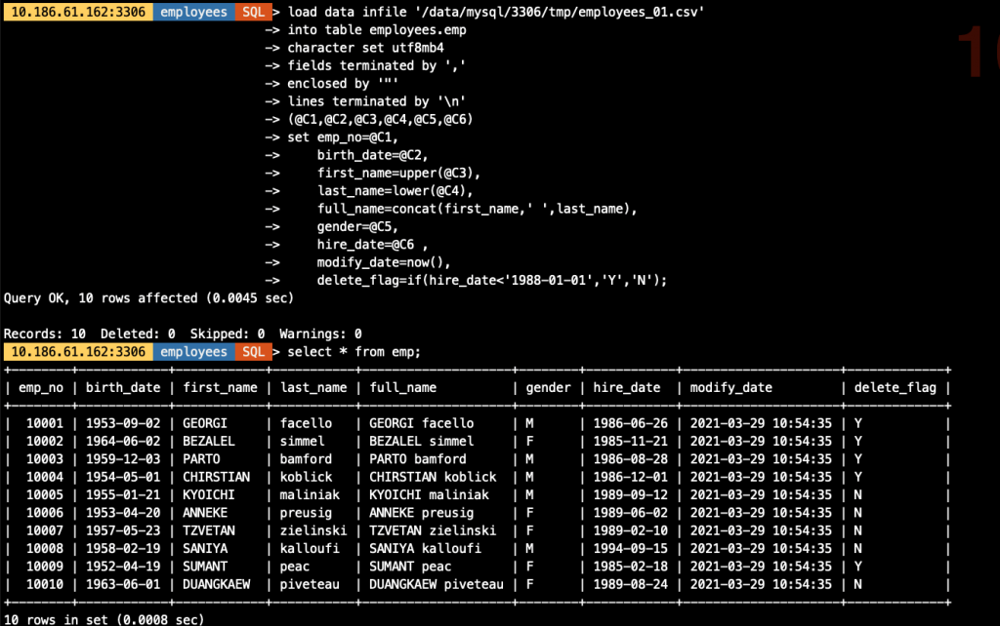											
#### 2.2 用 import_table 方式导入数据
```
util.import_table(
    [
        "/data/mysql/3306/tmp/employees_01.csv",
    ],
    {
        "schema": "employees", 
        "table": "emp",
        "dialect": "csv-unix",
        "skipRows": 0,
        "showProgress": True,
        "characterSet": "utf8mb4",
        "columns": [1,2,3,4,5,6],                   ## 文件中多少个列就用多少个序号标识就行
        "decodeColumns": {
            "emp_no":       "@1",                   ## 对应文件中的第1列
            "birth_date":   "@2",                   ## 对应文件中的第2个列
            "first_name":   "upper(@3)",            ## 对应文件中的第3个列,并做转为大写的处理
            "last_name":    "lower(@4)",            ## 对应文件中的第4个列,并做转为大写的处理
            "full_name":    "concat(@3,' ',@4)",    ## 将文件中的第3,4列合并成一列生成表中字段值
            "gender":       "@5",                   ## 对应文件中的第5个列
            "hire_date":    "@6",                   ## 对应文件中的第6个列
            "modify_date":  "now()",                ## 用函数生成表中字段值
            "delete_flag":  "if(@6<'1988-01-01','Y','N')"  ## 基于文件中第6列做逻辑判断,生成表中对应字段值
        }
    })
```
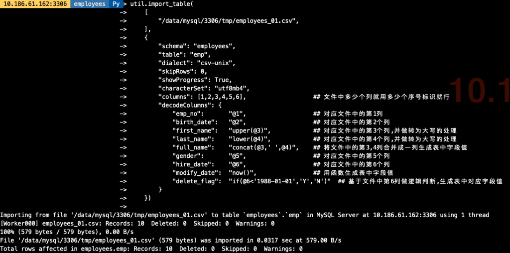											
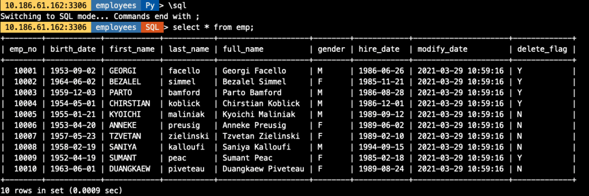											
## 3. import_table 特定功能
#### 3.1 多文件导入（模糊匹配）
```
## 在导入前我生成好了3份单独的employees文件,导出的结构一致
[root@10-186-61-162 tmp]# ls -lh
总用量 1.9G
-rw-r----- 1 mysql mysql  579 3月  24 19:07 employees_01.csv
-rw-r----- 1 mysql mysql  584 3月  24 18:48 employees_02.csv
-rw-r----- 1 mysql mysql  576 3月  24 18:48 employees_03.csv
-rw-r----- 1 mysql mysql 1.9G 3月  26 17:15 sbtest1.csv
## 导入命令,其中针对文件用employees_*做模糊匹配
util.import_table(
    [
        "/data/mysql/3306/tmp/employees_*",
    ],
    {
        "schema": "employees", 
        "table": "emp",
        "dialect": "csv-unix",
        "skipRows": 0,
        "showProgress": True,
        "characterSet": "utf8mb4",
        "columns": [1,2,3,4,5,6],                   ## 文件中多少个列就用多少个序号标识就行
        "decodeColumns": {
            "emp_no":       "@1",                   ## 对应文件中的第1列
            "birth_date":   "@2",                   ## 对应文件中的第2个列
            "first_name":   "upper(@3)",            ## 对应文件中的第3个列,并做转为大写的处理
            "last_name":    "lower(@4)",            ## 对应文件中的第4个列,并做转为大写的处理
            "full_name":    "concat(@3,' ',@4)",    ## 将文件中的第3,4列合并成一列生成表中字段值
            "gender":       "@5",                   ## 对应文件中的第5个列
            "hire_date":    "@6",                   ## 对应文件中的第6个列
            "modify_date":  "now()",                ## 用函数生成表中字段值
            "delete_flag":  "if(@6<'1988-01-01','Y','N')"  ## 基于文件中第6列做逻辑判断,生成表中对应字段值
        }
    })
    
## 导入命令,其中对要导入的文件均明确指定其路径
util.import_table(
    [
        "/data/mysql/3306/tmp/employees_01.csv",
        "/data/mysql/3306/tmp/employees_02.csv",
        "/data/mysql/3306/tmp/employees_03.csv"
    ],
    {
        "schema": "employees", 
        "table": "emp",
        "dialect": "csv-unix",
        "skipRows": 0,
        "showProgress": True,
        "characterSet": "utf8mb4",
        "columns": [1,2,3,4,5,6],                   ## 文件中多少个列就用多少个序号标识就行
        "decodeColumns": {
            "emp_no":       "@1",                   ## 对应文件中的第1列
            "birth_date":   "@2",                   ## 对应文件中的第2个列
            "first_name":   "upper(@3)",            ## 对应文件中的第3个列,并做转为大写的处理
            "last_name":    "lower(@4)",            ## 对应文件中的第4个列,并做转为大写的处理
            "full_name":    "concat(@3,' ',@4)",    ## 将文件中的第3,4列合并成一列生成表中字段值
            "gender":       "@5",                   ## 对应文件中的第5个列
            "hire_date":    "@6",                   ## 对应文件中的第6个列
            "modify_date":  "now()",                ## 用函数生成表中字段值
            "delete_flag":  "if(@6<'1988-01-01','Y','N')"  ## 基于文件中第6列做逻辑判断,生成表中对应字段值
        }
    })
```
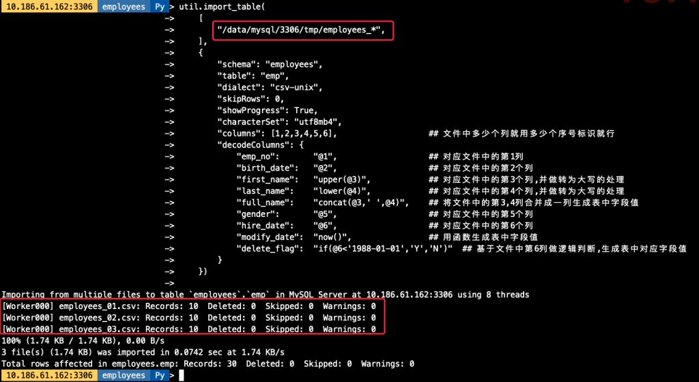											
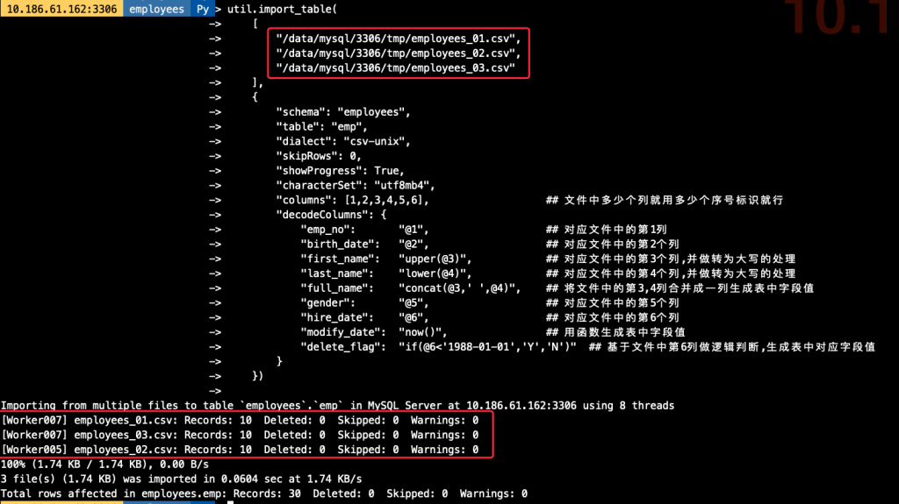											
#### 3.2 并发导入
> 在实验并发导入前我们创建一张 1000W 的 sbtest1 表（大约 2G 数据），做并发模拟，import_table 用 `threads` 参数作为并发配置，默认为 8 个并发。
`## 导出测试需要的sbtest1数据
[root@10-186-61-162 tmp]# ls -lh
总用量 1.9G
-rw-r----- 1 mysql mysql  579 3月  24 19:07 employees_01.csv
-rw-r----- 1 mysql mysql  584 3月  24 18:48 employees_02.csv
-rw-r----- 1 mysql mysql  576 3月  24 18:48 employees_03.csv
-rw-r----- 1 mysql mysql 1.9G 3月  26 17:15 sbtest1.csv
## 开启threads为8个并发
util.import_table(
    [
        "/data/mysql/3306/tmp/sbtest1.csv",
    ],
    {
        "schema": "demo", 
        "table": "sbtest1",
        "dialect": "csv-unix",
        "skipRows": 0,
        "showProgress": True,
        "characterSet": "utf8mb4",
        "threads": "8"
    })`
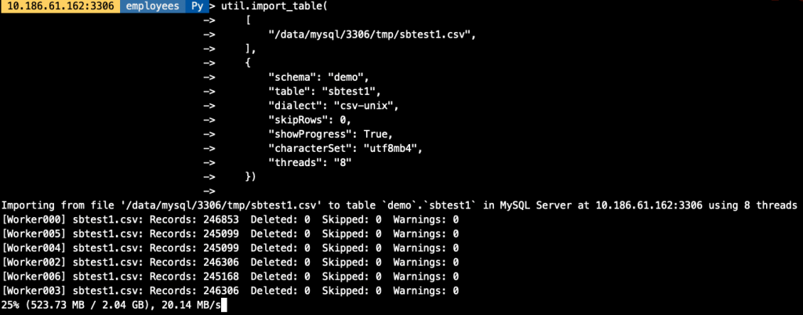											
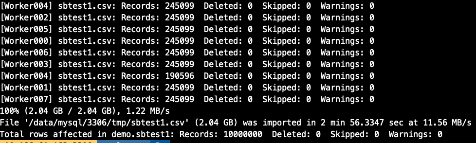											
#### 3.3 导入速率控制
> 可以通过 `maxRate` 和 `threads` 来控制每个并发线程的导入数据。如，当前配置线程为 4 个，每个线程的速率为 2M/s，则最高不会超过 8M/s。
`util.import_table(
    [
        "/data/mysql/3306/tmp/sbtest1.csv",
    ],
    {
        "schema": "demo", 
        "table": "sbtest1",
        "dialect": "csv-unix",
        "skipRows": 0,
        "showProgress": True,
        "characterSet": "utf8mb4",
        "threads": "4",
        "maxRate": "2M"
    })
`
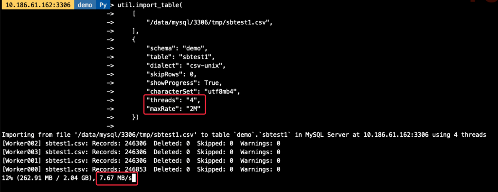											
### 3.4 自定义 chunk 大小
> 默认的 chunk 大小为 50M，我们可以调整 chunk 的大小，减少事务大小，如我们将 chunk 大小调整为 1M，则每个线程每次导入的数据量也相应减少。
`util.import_table(
    [
        "/data/mysql/3306/tmp/sbtest1.csv",
    ],
    {
        "schema": "demo", 
        "table": "sbtest1",
        "dialect": "csv-unix",
        "skipRows": 0,
        "showProgress": True,
        "characterSet": "utf8mb4",
        "threads": "4",
        "bytesPerChunk": "1M",
        "maxRate": "2M"
    })`
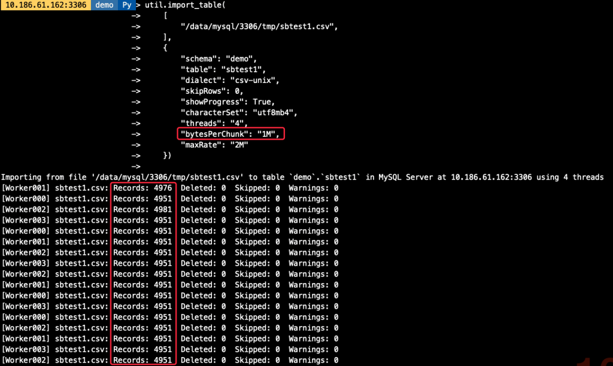											
## 4. Load Data vs import_table 性能对比
- 使用相同库表
- 不对数据做特殊处理，原样导入
- 不修改参数默认值，只指定必备参数
`-- Load Data语句
load data infile '/data/mysql/3306/tmp/sbtest1.csv'
into table demo.sbtest1
character set utf8mb4
fields terminated by ','
enclosed by '"'
lines terminated by '\n'
-- import_table语句
util.import_table(
    [
        "/data/mysql/3306/tmp/sbtest1.csv",
    ],
    {
        "schema": "demo", 
        "table": "sbtest1",
        "dialect": "csv-unix",
        "skipRows": 0,
        "showProgress": True,
        "characterSet": "utf8mb4"
    })`
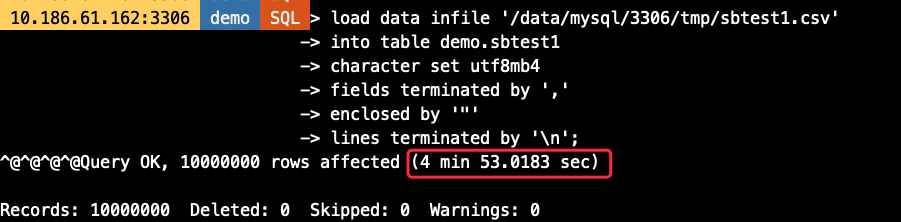											
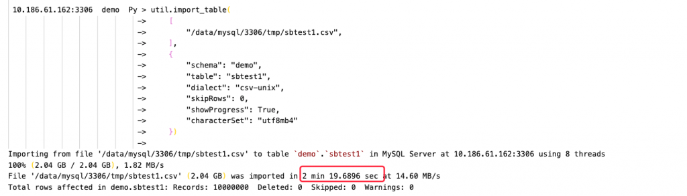											
> 可以看到，Load Data 耗时约 5 分钟，而 import_table 则只要不到一半的时间即可完成数据导入，效率高一倍以上（虚拟机环境磁盘 IO 能力有限情况下）。
## 5. 技术总结
- import_table 包含了 Load Data 几乎所有的功能
- import_table 导入的效率比 Load Data 更高
- import_table 支持对导入速度，并发以及每次导入的数据大小做精细控制
- import_table 的导入进度报告更加详细，便于排错及时间评估，包括：
- 导入速度
- 导入总耗时
- 每批次导入的数据量，是否存在 Warning 等等
- 导入最终的汇总报告
**文章推荐：**
[技术分享 | MySQL Load Data 的多种用法](https://opensource.actionsky.com/20210325-mysql/)