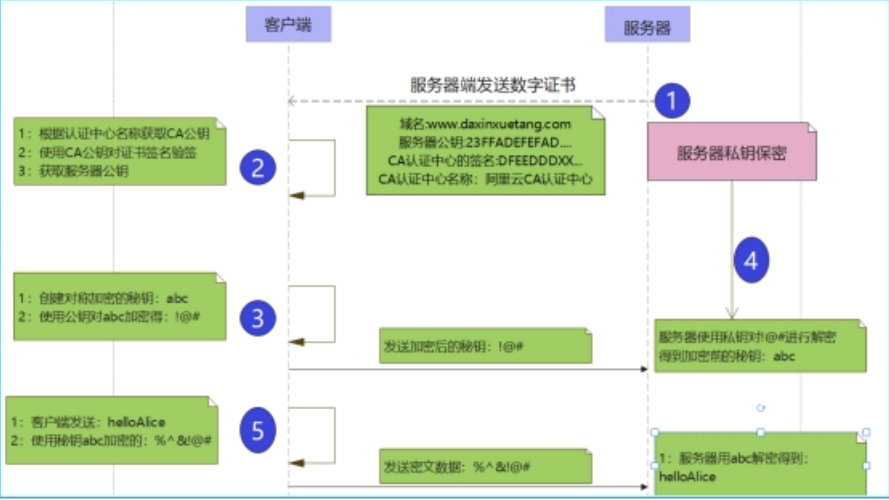
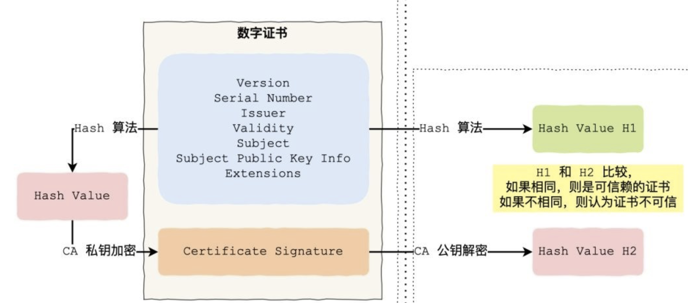

# 技术分享 | MySQL : SSL 连接浅析

**原文链接**: https://opensource.actionsky.com/20220309-mysql/
**分类**: MySQL 新特性
**发布时间**: 2022-03-08T21:59:48-08:00

---

作者：胡呈清
爱可生 DBA 团队成员，擅长故障分析、性能优化，个人博客：https://www.jianshu.com/u/a95ec11f67a8，欢迎讨论。
本文来源：原创投稿
*爱可生开源社区出品，原创内容未经授权不得随意使用，转载请联系小编并注明来源。
## TLS or SSL ?
SSL(Secure Socket Layer 安全套接层)是基于 HTTPS 下的一个协议加密层，最初是由网景公司（Netscape）研发，后被 IETF（The Internet Engineering Task Force &#8211; 互联网工程任务组）标准化后写入（RFCRequest For Comments 请求注释），RFC 里包含了很多互联网技术的规范。
起初是因为HTTP在传输数据时使用的是明文（虽然说 POST 提交的数据时放在报体里看不到的，但是还是可以通过抓包工具窃取到）是不安全的，为了解决这一隐患网景公司推出了SSL安全套接字协议层，SSL 是基于 HTTP 之下 TCP 之上的一个协议层，基于 HTTP 标准并对 TCP 传输数据时进行加密，所以 HTTPS 是 HTTP+SSL/TCP的简称。
由于 HTTPS 的推出受到了很多人的欢迎，在 SSL 更新到 3.0 时，IETF 对 SSL3.0 进行了标准化，并添加了少数机制(但是几乎和 SSL3.0无差异)，标准化后的 IETF 更名为 TLS1.0(Transport Layer Security 安全传输层协议)，可以说 TLS 就是 SSL 的新版本 3.1 。
TLS（Transport Layer Security）是更为安全的升级版 SSL。但 SSL 这一术语更为常用，实际上 MySQL 使用的就是 TLS 协议，而不是 SSL 协议。
## 1. TLS 握手过程
想弄清楚下面这一大堆文件的作用是什么吗？那就必须先了解  TLS 握手过程
`├── ca-key.pem
├── ca.pem
├── client-cert.pem
├── client-key.pem
├── server-cert.pem
└── server-key.pem
`
#### 1.1 TLS 握手过程
TLS 握手的过程，其实就是秘钥交换的过程，这也是整个TLS 加密技术里最复杂的一个环节，参考一张网上的图如下：

#### 1.2 密钥算法
对称密钥算法：数据加密和解密时使用相同的密钥。
非对称密钥算法：数据加密和解密时使用不同的密钥，一个是公开的公钥，一个是由用户秘密保存的私钥。利用公钥（或私钥）加密的数据只能用相应的私钥（或公钥）才能解密。
与非对称密钥算法相比，对称密钥算法具有计算速度快的优点，通常用于对大量信息进行加密（如对所有报文加密）；而非对称密钥算法，一般用于数字签名和对较少的信息进行加密。
注意：SSL/TLS 协议就是使用对称密钥算法进行数据加密，使用非对称密钥算法进行”对称密钥“的加密。其过程为：
- 
上图中，Server端发送了公钥给客户端，私钥自己保存，这是非对称密钥算法中的公钥、私钥对；
- 
客户端会创建一个密钥，这个就是对称加密算法中的密钥。然后用 Server 端的公钥对这个密钥加密，发送给 Server 端；
- 
Server 端收到客户端发送过来的加密过的密钥，使用自己的私钥进行解密，得到加密前的密钥；
- 
接下来传输数据则使用“对称密钥”进加密和解密。
这个就是利用非对称密钥算法保证对称密钥本身的安全。
#### 1.3 数字证书-如何保证公钥的真实性？
如果有攻击者伪造了 Server 端的公钥并发了客户端，客户端会访问到假网站被窃取信息。显然保证客户端收到的 Server 端的公钥是真实的，是保证整个加密连接可靠性的第一道防线。
数字证书由权威机构 CA(Certification Authority) 签发，签发过程为：
- 
用户首先产生自己的密钥对，并将公钥及部分个人身份信息传送给 CA ；
- 
CA 核实用户身份（将执行一些必要的步骤，以确信请求确实由用户发送而来）；
- 
CA 对用户的所有信息（公钥、所有者、有效期&#8230;）进行 Hash 计算，得到一个 Hash 值，然后再使用私钥对 Hash 值进行加密得到签名，就得到了数字证书。该证书包含：用户的公钥、所有者、有效期等信息，同时还附有CA的签名信息。
数字证书的验证流程：
- 
客户端会使用同样的 Hash 算法获取该数字证书的 Hash 值 H1；
- 
通常浏览器和操作系统中集成了 CA 证书（包含 CA 公钥、所有者），客户端取得这个CA证书，使用其中的 CA 公钥解密签名，得到一个 Hash 值 H2 ；
- 
比较 H1 和 H2，如果值相同，则数字证书可信。
上述签发和验证流程见下图（参考自网络）：

如果 CA 证书不在浏览器和操作系统的可信任区，这种 CA 证书通常被称为自签名 CA 证书（MySQL 自动生成的就是自签名证书，详见下文）。要完成数字证书的验证，则必须事先将自签名 CA 证书放到客户端，并在客户端发起连接时指定这个 CA 证书文件；或者事先将自签名 CA 证书导入到客户端的操作系统可信任区，这样在 TLS 握手过程中也能自动获取到这个 CA 证书。
另外：验证证书在 SSL/TLS 协议中不一定是必须的，比如 mysql 客户端只有指定 &#8211;ssl-mode=VERIFY_CA 或者 &#8211;ssl-mode=VERIFY_IDENTITY 时才验证 CA 证书。如果 &#8211;ssl-mode=REQUIRED，则不验证 CA 证书，只要求 MySQL Server 端发送公钥给客户端，这就无法保证服务端公钥是真实属于 MySQL server 的。详细见下文。
## 2. MySQL SSL 加密连接
#### 2.1 MySQL服务端的配置
启动参数：
- 
&#8211;ssl：表示 MySQL 服务端允许加密连接，这个启动参数MySQL8.0默认启用
系统变量：
- 
require_secure_transport：指定是否要求客户端使用加密连接。默认值为 OFF，如果 ON，则表示客户端必须使用加密连接，如果客户端关闭 ssl ，则连接会报错。
以下参数指定加密连接时使用的证书和密钥文件：
`ssl_ca=ca.pem
ssl_cert=server-cert.pem
ssl_key=server-key.pem
`
MySQL8.0 在启动时会自动生成 SSL 证书、密钥文件，以及 RSA 密钥对文件；或者使用 mysql_ssl_rsa_setup 程序生成上述文件。也可以手工生成：
`## SSL证书和密钥文件
certs
├── ca-key.pem
├── ca.pem
├── client-cert.pem
├── client-key.pem
├── server-cert.pem
└── server-key.pem
# Create CA certificate
# 创建CA证书（包含CA公钥）和CA私钥
openssl genrsa 2048 > ca-key.pem
openssl req -new -x509 -nodes -days 3600 \
-key ca-key.pem -out ca.pem
# Create server certificate, remove passphrase, and sign it
# server-cert.pem = public key, server-key.pem = private key
# 先生成服务器公钥、私钥
# 使用CA私钥对服务器公钥签名，得到服务器证书 server-cert.pem，证书中包含公钥、所有者、有效期等明文信息，也有经过 CA 私钥加密对公钥、所有者、有效期...加密后的签名
openssl req -newkey rsa:2048 -days 3600 \
-nodes -keyout server-key.pem -out server-req.pem
openssl rsa -in server-key.pem -out server-key.pem
openssl x509 -req -in server-req.pem -days 3600 \
-CA ca.pem -CAkey ca-key.pem -set_serial 01 -out server-cert.pem
# Create client certificate, remove passphrase, and sign it
# client-cert.pem = public key, client-key.pem = private key
# 先生成客户端公钥、私钥
# 使用CA私钥对客户端公钥签名，得到客户端证书 client-cert.pem，一般不需要验证客户端身份，这些文件就不需要用到。当然如果要同时验证 MySQL Server 身份和客户端身份，就需要用到这些文件了。
openssl req -newkey rsa:2048 -days 3600 \
-nodes -keyout client-key.pem -out client-req.pem
openssl rsa -in client-key.pem -out client-key.pem
openssl x509 -req -in client-req.pem -days 3600 \
-CA ca.pem -CAkey ca-key.pem -set_serial 01 -out client-cert.pem
# 查看证书内容
openssl x509 -text -in ca.pem
# 验证CA证书（“使用CA证书验证数字证书”更恰当？）
openssl verify -CAfile ca.pem server-cert.pem
# 输出结果：server-cert.pem: OK
`
#### 2.2 MySQL客户端配置
MySQL 客户端连接 Server 时，通过 &#8211;ssl-mode 参数指定：
- 
&#8211;ssl-mode=PREFFERED，默认行为，client 端尝试使用加密进行连接，如果无法构建加密连接，则会退回到未加密的连接
- 
&#8211;ssl-mode=REQUIRED时，Client 端需要加密连接，如果无法构建连接，则 Client 端将失败
- 
&#8211;ssl-mode=DISABLED，Client 端使用未加密的连接
- 
&#8211;ssl-mode=VERIFY_CA，Client 端需要加密连接，并且还对 CA 证书进行验证
- 
&#8211;ssl-mode=VERIFY_IDENTITY，Client 端需要加密的连接，并且还针对 CA 证书和其证书中的服务器主机名执行验证
注意：主机名身份验证 VERIFY_IDENTITY 不适用于由服务器自动创建或使用 mysql_ssl_rsa_setup 手动创建的自签名CA证书。
测试如下：
`##当指定 --ssl-mode=REQUIRED，仅要求加密连接，不需要验证 MySQL Server 身份，所以会直接信任 MySQL Server 发送给客户端的公钥（即 server-cert.pem 数字证书中的明文公钥，忽略其中的数字签名信息）
[root@172-16-21-5 /]# /opt/mysql/base/8.0.21/bin/mysql -h172.16.21.4 -P3306 -utest -ptestpass --ssl-mode=REQUIRED -e "select 1"
mysql: [Warning] Using a password on the command line interface can be insecure.
+---+
| 1 |
+---+
| 1 |
+---+
##当指定 --ssl-mode=VERIFY_CA，需要验证 CA 证书，因为这个 CA 证书是自签发的，所以不在浏览器和操作系统的可信任区，无法从浏览器和操作系统的可信任区这个公共渠道获取 CA 证书，所以报错：
[root@172-16-21-5 /]# /opt/mysql/base/8.0.21/bin/mysql -h172.16.21.4 -P3306 -utest -ptestpass --ssl-mode=VERIFY_CA
ERROR 2026 (HY000): SSL connection error: CA certificate is required if ssl-mode is VERIFY_CA or VERIFY_IDENTITY
##将MySQL服务端的 ca.pem 拷贝到客户端
scp ca.pem 172.16.21.5:/tmp/
##--ssl-mode=VERIFY_CA，指定需要验证 CA 证书，因为这个 CA 证书是自签发的，所以不在浏览器和操作系统的可信任区，则必须要将 CA 证书拷贝到客户端，并指定 CA 证书文件
##TLS 握手过程中，MySQL Server 发送服务器数字证书 server-cert.pem 给客户端，客户端使用 CA 证书中的 CA 公钥解密 server-cert.pem 中的签名，验证通过，才可以正常登陆:
[root@localhost ~]# mysql -h10.186.61.173 -P3308 -uhucq -p'1qaz@WSX' \
--ssl-ca="/tmp/ca.pem" \
--ssl-mode=VERIFY_CA \
-e "select 1"
+---+
| 1 |
+---+
| 1 |
+---+
##由于MySQL自动生成的CA证书是自签名证书，而 --ssl-mode=VERIFY_IDENTITY 不适用于由服务器自动创建或使用 mysql_ssl_rsa_setup手动创建的自签名CA证书，即使指定本地的CA证书文件，连接也会失败
[root@localhost ~]# mysql -h10.186.61.173 -P3308 -uhucq -p'1qaz@WSX' \
--ssl-ca="/tmp/ca.pem" \
--ssl-mode=VERIFY_IDENTITY \
-e "select 1"
ERROR 2026 (HY000): SSL connection error: Failed to verify the server certificate via X509 certificate matching functions
`
#### 2.3 MySQL SSL 连接中的 TLS 握手过程
上述示例已有详细说明，这里再简要总结一下：
- 
客户端发起 ssl 连接请求；
- 
MySQL Server 发送数字证书 server-cert.pem 给客户端（server-cert.pem包含：服务器公钥、CA签名信息）；
- 
客户端使用CA 证书 ca.pem（由于这是 MySQL 自签名的CA证书，无法从操作系统的可信任区获取（压根不在这里边），所以事先必须在客户端本地保存 CA 证书文件）中的 CA 公钥解密 server-cert.pem 中的签名，进行验证；
- 
验证通过后，生成对称密钥，使用 server-cert.pem 中的公钥加密“对称密钥”，发送给 MySQL Server；
- 
MySQL Server 使用自己保留的私钥 server-key.pem 解密，得到“对称密钥”；
- 
接下来传输数据则使用“对称密钥”进加密和解密。
如果仅指定 &#8211;ssl-mode=REQUIRED，不指定 &#8211;ssl-mode=VERIFY_CA 或者 &#8211;ssl-mode=VERIFY_IDENTITY，则不需要步骤3。
## 3. JDBC 如何设置SSL连接
首先 MySQL Server 端必须生成 SSL 证书和密钥文件，并且在启动时指定启动参数：&#8211;ssl（一般将其写到 my.cnf 中）。MySQL8.0 启动时会自动生成SSL 证书和密钥文件，并默认使用 &#8211;ssl 参数。
JDBC 关闭 ssl 连接示例：`jdbc:mysql://localhost:3306/hucq?useSSL=false`
如果 MySQL Server 使用 caching_sha2_password（MySQL8.0默认的认证插件）、sha256_password 认证插件，则还必须指定 AllowPublicKeyRetrieval=True，因为 caching_sha2_password 插件要求交换密码时必须使用 RSA 公钥加密（在没有使用SSL加密连接的情况下），AllowPublicKeyRetrieval=True 参数作用是请求 MySQL Server 端发送 RSA 公钥给客户端，如果不请求 RSA 公钥并且又没有指定客户端本地RSA公钥文件（先从 MySQL 服务器上拷贝 RSA 公钥到本地），则连接会报错。应该配置：`jdbc:mysql://localhost:3306/hucq?useSSL=false&AllowPublicKeyRetrieval=True`
JDBC 开启 SSL 连接，意味着要求安全连接，则应该开启 CA 证书认证，跟 mysql 客户端一样，需要将 MySQL 的自签名 CA 证书导入到客户端，或者放到 ftp 上，再通过 JDBC 参数指定 CA 证书路径，比较复杂，请参考官方文档：https://dev.mysql.com/doc/connector-j/8.0/en/connector-j-reference-using-ssl.html
#### 参考资料
- 
https://tangyuxian.com/2021/05/19/%E5%90%8E%E7%AB%AF/%E7%AE%97%E6%B3%95/%E7%AE%97%E6%B3%95-TLS-SSL%E6%8F%A1%E6%89%8B%E8%BF%87%E7%A8%8B/
- 
https://dev.mysql.com/doc/refman/8.0/en/using-encrypted-connections.html