# 技术分享 | MySQL 主从复制中创建复制用户的时机探讨

**原文链接**: https://opensource.actionsky.com/20210318-mysql/
**分类**: MySQL 新特性
**发布时间**: 2021-03-18T00:49:52-08:00

---

作者：赵黎明爱可生 MySQL DBA 团队成员，Oracle 10g OCM，MySQL 5.7 OCP，擅长数据库性能问题诊断、事务与锁问题的分析等，负责处理客户 MySQL 及我司自研 DMP 平台日常运维中的问题，对开源数据库相关技术非常感兴趣。本文来源：原创投稿* 爱可生开源社区出品，原创内容未经授权不得随意使用，转载请联系小编并注明来源。
## 背景
该问题来自某客户，据描述，他们在部署 MySQL 主从复制时，有时候仅在主库上创建复制用户，有时候主从实例上都会去分别创建复制用户，发现这两种方式都可以成功建立复制。针对这一现象，进行了一轮验证，来观察采用不同方式创建复制用户对主从复制的影响。
通常来说，用得较多的方式是在搭建主从复制前，先在主库创建好复制用户，然后做一个 Xtrabackup 物理全备，再拿到从库上恢复并搭建主从。除此以外，还有哪些方式呢？分别对主从复制有哪些影响？一起来看一下。
## 验证
- MySQL 版本为 5.7.32，主库：10.186.60.62，从库：10.186.60.68。
- 为了演示方便，本次搭建主从复制时均采用 mysqldump 进行逻辑备份。
#### 场景 1：仅在主库创建复制用户
1. 主库做一个备份并拷贝到从库
`/usr/local/mysql5732/bin/mysqldump --single-transaction --master-data=2 -B zlm -S /tmp/mysql3332.sock -p > zlm.sql
scp zlm.sql root@10.186.60.68:~`
2. 登陆从库执行导入
`mysql> source zlm.sql
`由于没有使用参数 &#8211;set-gtid-purged=off，导出的语句中会带有 SET @@GLOBAL.GTID_PURGED=&#8217;xxxx:1-xx&#8217; 并执行，导入前需要先在从库上执行 reset master。
3. 主库创建复制用户
`mysql> create user repl1 identified by 'repl1';`
4. 从库配置主从复制并启动
`mysql> change master to master_host='10.186.60.62',master_port=3332,master_user='repl1',master_password='repl1',master_auto_position=1;
mysql> start slave;`
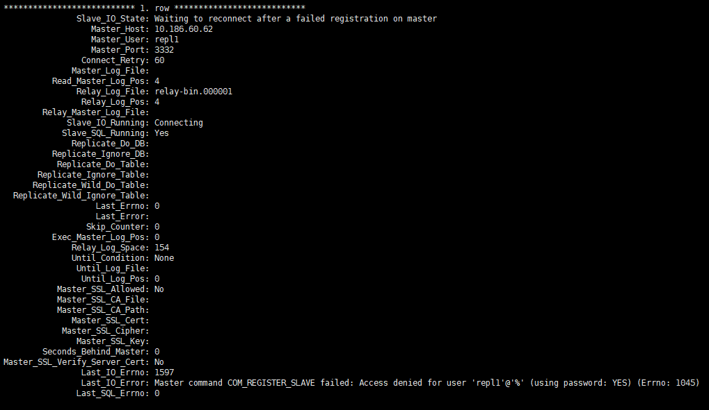											
启动复制后，报了 Error 1045 的错误，此处并不是密码错，而是没有给复制用户配置 replication slave 权限，在主库上对 repl1 用户执行赋权后（grant replication slave on *.* to repl1;），再启动复制就正常了。
主从复制正常以后，也会在从库上创建复制用户 repl1。
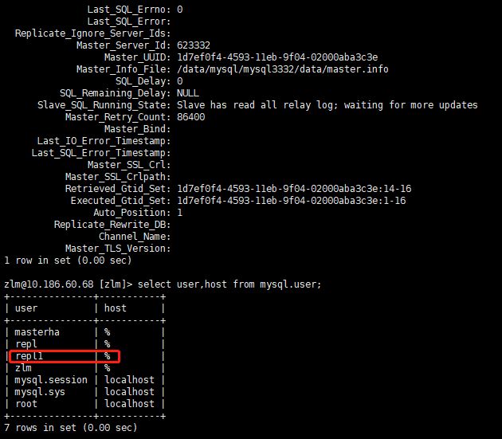											
从库上并没有创建过复制用户 repl1，主从复制就正常搭建好了，为什么呢？因为 change master to 语句中指定的 master_user 是主库上的复制用户，从库通过这个用户连接到主库进行同步，当开启复制线程后，主库上创建复制用户的语句会在从库上进行回放，于是从库上也会有这个复制用户了。
#### 结论 1
- 搭建主从复制时，在从库创建复制用户不是必须的，仅在主库创建即可，复制用户会同步到从库。
#### 场景 2：主从库单独创建复制用户（create 语句）
1. 主库做一个备份并拷贝到从库（gtid_purged=xxxx:1-23）
2. 从库执行导入
3. 主库创建复制用户并赋权
`mysql> create user repl2 identified by 'repl2';
mysql> grant replication slave on *.* to repl2;`
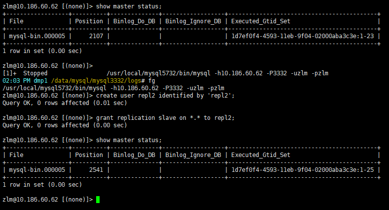											
4. 从库创建复制用户
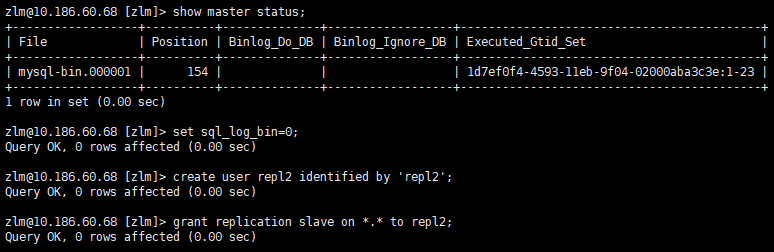											
由于不想在从库上产生由从库 uuid 写入的 binlog 事务，此处设置了 sql_log_bin=0，使事务不被记录到 binlog 中，原因是在数据库管理平台对高可用集群进行管理时，通常是不允许从库上有主库不存在的 GTID 事务的。
5. 从库配置主从复制并启动
`mysql> change master to master_host='10.186.60.62',master_port=3332,master_user='repl2',master_password='repl2',master_auto_position=1;
mysql> start slave;`
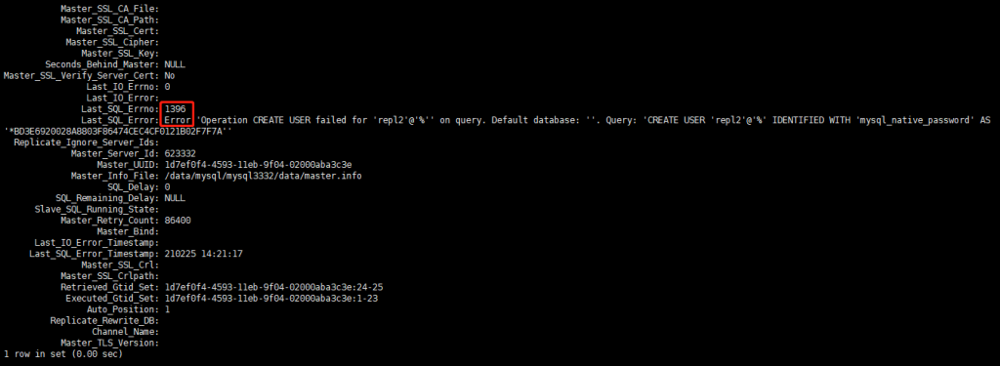											
由于从库上已经创建了复制用户，当回放到主库的这个事务时会报 Error 1396 的错误。
可以用 create user 语句创建一个重复用户来验证。
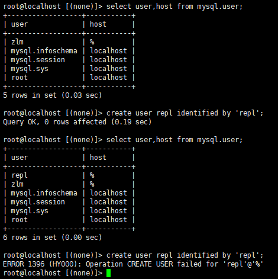											
解析主库 binlog，启动复制后执行的第一个事务就是这个 24 的创建用户语句。
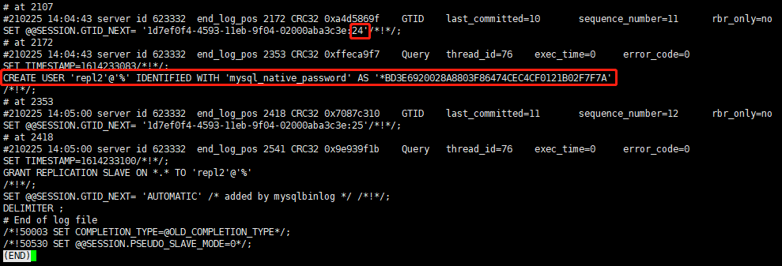											
#### 结论 2
- 在从库导入备份后并分别在主、从库单独创建复制用户后，当从库执行到创建用户的事务时会导致复制中断。
#### 场景 3：主从库单独创建复制用户（grant 语句）
1. 主库做一个备份并拷贝到从库（gtid_purged=xxxx:1-28）
2. 从库执行导入
3. 主库创建复制用户
`mysql> grant replication slave on *.* repl3 identified by 'repl3';`
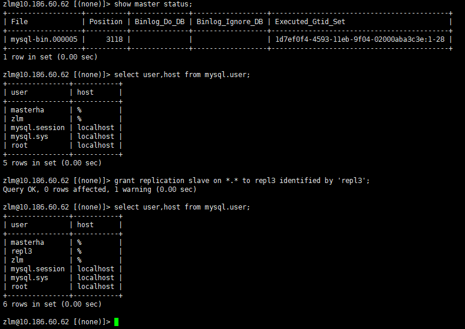											
4. 从库创建复制用户
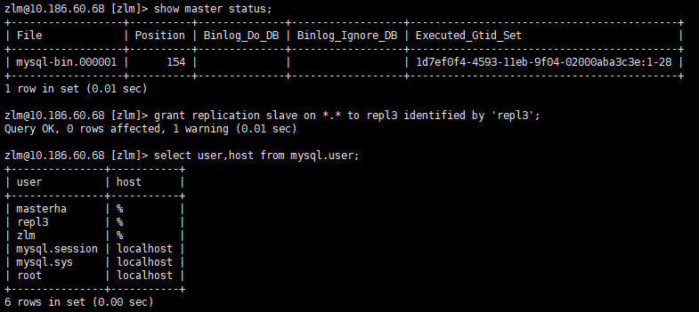											
5. 从库配置主从复制并启动
`mysql> change master to master_host='10.186.60.62',master_port=3332,master_user='repl2',master_password='repl2',master_auto_position=1;
mysql> start slave;`
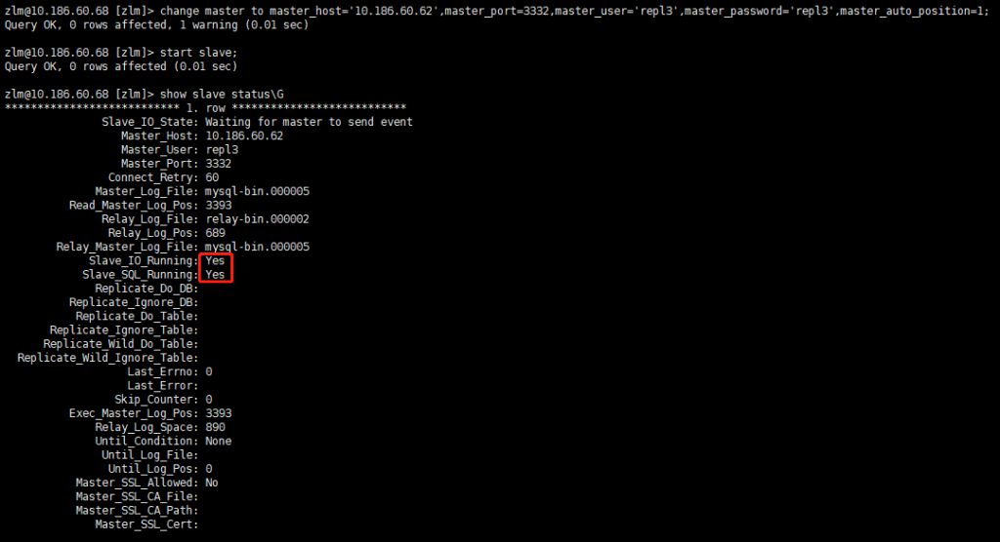											
这次启动复制后并没有报错。为何用 grant 语句创建用户就可以，用 create 语句就不行呢？
create 与 grant 语句都会产生事务并记录到 binlog 中，但区别是 grant 语句是一个近似幂等的操作，而 create 语句不是。
解析主库 binlog，29 和 30 都是重复执行 grant 的事务。
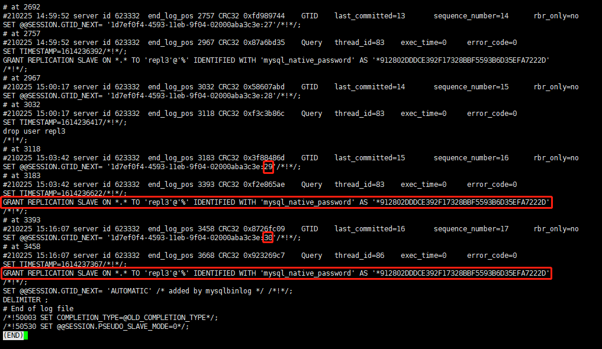											
观察 show slave stauts\G，从库上也把 29，30 这两个事务都回放掉了，重复执行它们并不影响主从复制。
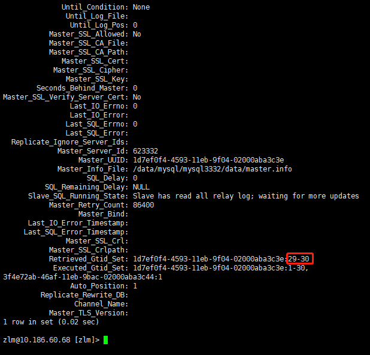											
但要注意的是，在 MySQL 8.0 中已经禁止通过 grant 这种语法来创建用户了。
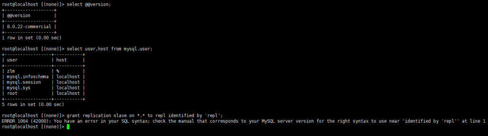											
#### 结论 3
- 从库导入备份并在主从库分别使用 grant 语句创建用户后，在从库回放时不会导致复制中断。
## 总结
1. 根据以上验证结果得知，在搭建主从复制时，采用多种方式创建复制用户都是可行的，但有些方式存在一些限制，如：在主、从实例上分别创建复制用户。虽然执行 grant 语句创建用户不会导致复制中断，但其并不是标准的 MySQL 创建用户语法，在 MySQL 8.0 中已被视为语法错误，因此不推荐采用这样的方式来搭建主从。
2. 创建复制用户的方式
**Create 语句创建用户时**
1. 主库创建完复制用户后做备份，再配置主从
2. 备份后仅在主库创建复制用户，再配置主从（推荐）
3. 如果要在主、从库分别创建复制用户，应先设置 session 级别的 sql_log_bin=0，再配置主从
**Grant 语句创建用户时（MySQL 5.7 及以下版本）**
1. 主库先创建复制用户后备份，再配置主从
2. 仅在主库创建复制用户，再配置主从（推荐）
3. 主、从库分别创建复制用户，再配置主从
**文章推荐：**
[技术分享 | binlog 实用解析工具 my2sql](https://opensource.actionsky.com/20210105-my2sql/)
[技术分享 | 如何优雅地在 Windows 上从 MySQL 5.6 升级到 5.7](https://opensource.actionsky.com/20200715-mysql/)
[技术分享 | 什么是半一致性读？](https://opensource.actionsky.com/20200623-mysql/)