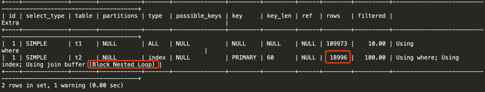
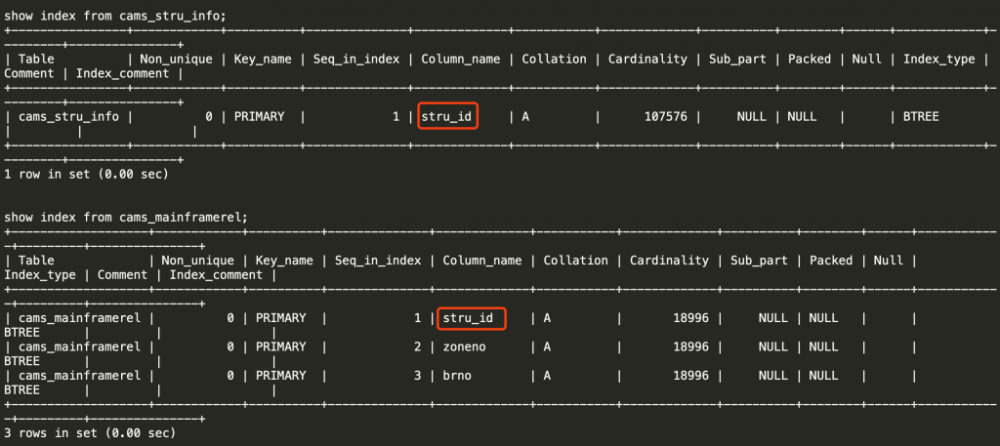
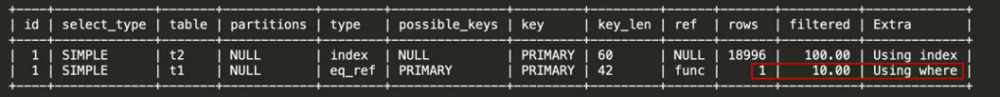
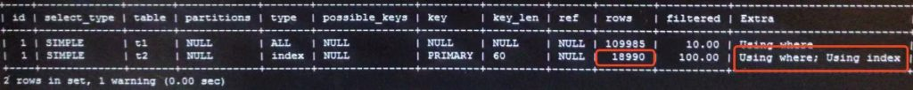
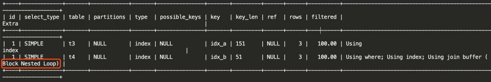
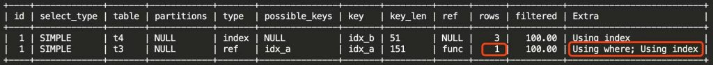

# 技术分享 | MySQL 优化：JOIN 优化实践

**原文链接**: https://opensource.actionsky.com/20200121-mysql/
**分类**: MySQL 新特性
**发布时间**: 2020-01-20T18:59:54-08:00

---

近期刚好学习了丁奇老师的《MySQL 实战 45 讲》中的 join 优化相关知识，又刚刚好碰上了一个非常切合的 join 查询需要优化，分析过程有些曲折，记录下来留作笔记。
**问题 SQL 描述**
问题 SQL 和执行计划是这样的：- `explain SELECT`
- `    t1.stru_id AS struId,`
- `    ...`
- `FROM cams_stru_info t1`
- `    LEFT JOIN cams_mainframerel t2 ON t1.stru_id =t2.stru_id`
- `WHERE t1.stru_state="1";`
											
这个 SQL 是非常简单的，关联条件 stru_id 在两张表中都是主键或者主键的第一个字段：
											
而把 left join 转化成 inner join 后，SQL的效率很高：
											
从上述信息来看，这个 SQL 存在的问题有：
1. 大表驱动小表，这肯定是不好的，t1表近11万行数据，为驱动表；t2表近1.9万行数据，为被驱动表。这主要是 left join 导致的，大部分情况下 left join 左表即驱动表，但是这里业务需求就是如此，没办法改变；
2. 驱动表的筛选条件 stru_state = 1，这个字段是一个状态值，基数很小，不适合建索引，即使建索引也没有用，所以驱动表一定是全表扫描。这点根据业务需求，也没法改变，其实全表扫描对性能影响不大，后续会解释；
3. 被驱动表关联字段明明有索引，但做了全表扫描（全索引扫描）；
4. 优化器选择使用的 join 算法为 BNL（Block Nested Loop），SQL 执行是计算次数等于 11 万 * 1.9 万，近 20 亿次计算，所以执行非常慢。
**join 的两种算法：****BNL 和 NLJ**
在继续分析之前，先得介绍一下 join 的两种算法，方便大家理解后面我分析思路上的错误和心得。**首先是 NLJ（Index Nested-Loop Join）算法，**以如下 SQL 为例：
select * from t1 join t2 on t1.a=t2.a
SQL 执行时内部流程是这样的：
1. 先从 t1（假设这里 t1 被选为驱动表）中取出一行数据 X；
2. 从 X 中取出关联字段 a 值，去 t2 中进行查找，满足条件的行取出；
3. 重复1、2步骤，直到表 t1 最后一行循环结束。
这就是一个嵌套循环的过程，注意“Index”，所以这里前提是被驱动表的关联字段有索引，最明显的特征就是在被驱动表上查找数据时可以使用索引，总的对比计算次数等于驱动表满足 where 条件的行数。假设这里 t1、t2都是1万行，则只需要 1万次计算。
如果 t1、t2 的 a 字段都没有索引，还按照上述的嵌套循环流程查找数据呢？每次在被驱动表上查找数据时都是一次全表扫描，要做1万次全表扫描，扫描行数等于 1万+1万*1万，这个效率很低，如果表行数更多，扫描行数动辄几百亿，所以优化器肯定不会使用这样的算法，**而是选择 BNL 算法，执行流程是这样的：**
1. 把 t1 表（假设这里 t1 被选为驱动表）满足条件的数据全部取出放到线程的 join buffer 中；
2. 每次取 t2 表一行数据，去 joinbuffer 中进行查找，满足条件的行取出，直到表 t2 最后一行循环结束。
这个算法下，执行计划的 Extra 中会出现 Using join buffer(Block Nested Loop)，t1、t2 都做了一次全表扫描，总的扫描行数等于 1万+1万。但是由于 joinbuffer 维护的是一个无序数组，每次在 joinbuffer 中查找都要遍历所有行，总的内存计算次数等于1万*1万。说句题外话，如果 joinbuffer 维护的是一个哈希表的话，每次查找做一次判断就能找到数据，效率提升飞快，其实这就是 hash join 了，MySQL 8.0 已支持。另外如果 joinbuffer 不够大放不下驱动表的数据，则要分多次执行上面的流程，会导致被驱动表也做多次全表扫描。
**分析误区**
回到分析过程，我一开始疑惑的点就在于：为什么被驱动表 t2 关联字段有索引，却没有使用 NLJ 算法，而是使用了 BNL 算法？显然如果使用 NLJ 算法，总的扫描行数等于 t1 的行数即 19万行，总的计算次数也只有19万次，效率是很高的。
因为是刚学到 join 算法这方面的知识，理解的不是很透彻，思路上一直纠结在算法这里，所以接下来我想的是禁用 BNL 算法，搜索了一下 hint 语法：&#8220;select /+ NO_BNL() */ t1. from &#8230;&#8221;，执行计划的结果却跟我预期的不一样：
											
这让我更迷惑了，明明没有使用 BNL 算法，为什么被驱动表还是做了全表扫描？是算法出了什么问题吗？还是 hint 产生了其他效果？
直到客户告诉了我答案，两表的关联字段字符集和校对规则不一样&#8230;
得解释下为什么之前没有想这一点，因为前面提到 inner join 执行计划毫无问题，使用了 NLJ 算法，优化器选了小表 t2 做驱动表，被驱动表 t1 按索引查找，效率很高。
**继续分析**
得知原因后，关于算法的疑问突然就想通了，NLJ 和 BNL 算法的选择根本在于关联字段的索引：***不是取决于有没有索引，而是被驱动表能不能使用到索引进行查找。***所以这本质上是一个索引失效问题，逻辑上其实只推进了一步，但是因为对新知识的不自信，推理能力不足（之前自认为推理能力不错的&#8230;），这一步一直没有走出去，这应该是我最大的收获了。
**然后还要解释另一个疑问：既然关联字段字符集和校对规则不一样，为什么 inner join 不受影响？left join 时却索引失效了？**
来看个测试，下面是两张表，关联字段的字符集不一样：
- `CREATE TABLE `t3` (`
- `  `id` int(11) NOT NULL AUTO_INCREMENT,`
- `  `a` char(50) CHARACTER SET utf8 DEFAULT NULL,`
- `  PRIMARY KEY (`id`),`
- `  KEY `idx_a` (`a`)) ;`
- `CREATE TABLE `t4` (`
- `  `id` int(11) NOT NULL AUTO_INCREMENT,`
- `  `b` char(50) CHARACTER SET latin1 DEFAULT NULL,`
- `  PRIMARY KEY (`id`),`
- `  KEY `idx_b` (`b`));`
分别插入了几条数据，使用 straight_join 语法固定连接顺序：- `SQL1：select * from t3 straight_join t4 on t3.a=t4.b;`
- `SQL2：select * from t4 straight_join t3 on t3.a=t4.b;`
- `SQL3：select * from t3 left join t4 on t3.a=t4.b;`
- `SQL4：select * from t3 join t4 on t3.a=t4.b;`
SQL1 和 SQL3 都是选择了 t3 做驱动表，执行计划一样，都显示索引失效了，使用了 BNL 算法，被驱动表进行全表扫描：
											
SQL2 和 SQL4 都是选择了 t4 做驱动表，执行计划一样，被驱动表按照索引查找，使用了 NLJ 算法：
											
也就是说，在这个测试中，latin1 去 join utf8 时，索引是正常使用的，反过来则索引失效。又测试了 utf8 和 utf8mb4 的情况，utf8 join utf8mb4 正常，反过来则索引失效。为此我的猜测是：被驱动表字段的字符集更大时，索引可以正常使用，反之则索引失效。关于字符集这点就不继续探索了，希望能有这方面的高手来解答。最后，SQL 改成 inner join 后使用 NLJ 算法的原因就很明了了：NLJ 算法的效率显然是高于 BNL 的，优化器做选择时当然要选择更高效的算法。虽然关联字段字符集不一样，但是按照小>大的顺序，索引还是可以正常使用，一旦索引可以使用，选择 NLJ 算法就是顺理成章的事了。
**总结**
1. NLJ 和 BNL 算法的选择根本在于关联字段的索引：不是取决于有没有索引，而是被驱动表能不能使用到索引进行查找；2. join 查询关联字段字符集或者校对规则不一致导致的索引失效，跟关联顺序有关，当然规范一定是让各表关联字段的字符集和校对规则一致；3. join 的优化，最好的办法就是把 BNL 转化为 NLJ，也就是被驱动表关联字段加索引，并且保证其有效，更多的优化思路可以看参考资料。另外，一个好消息是从 MySQL8.0.18 开始已经支持 hash join 了，原本选择 BNL 算法的场景会直接使用 hash join，效率提升不止一点点，简直就是 DBA 福音了。> 参考资料：https://time.geekbang.org/column/article/79700https://time.geekbang.org/column/article/80147https://time.geekbang.org/column/article/82865