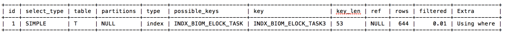
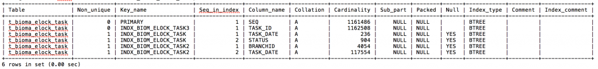
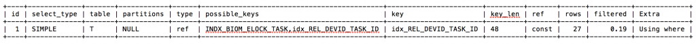

# 技术分享 | MySQL 优化：为什么 SQL 走索引还那么慢？

**原文链接**: https://opensource.actionsky.com/20191211-mysql/
**分类**: MySQL 新特性
**发布时间**: 2019-12-11T00:00:49-08:00

---

**背景**2019-01-11 9:00-10:00 一个 MySQL 数据库把 CPU 打满了。硬件配置：256G 内存，48 core
**分析过程**接手这个问题时现场已经不在了，信息有限，所以我们先从监控系统中查看一下当时的状态。从 PMM 监控来看，这个 MySQL 实例每天上午九点 CPU 都会升高到 10%-20%，只有 1 月 2 号 和 1 月 11 号 CPU 达到 100%，也就是今天的故障。怀疑是业务在九点会有压力下发，排查方向是慢查询。
1. 按执行次数统计 slow log 发现次数最多的一条 sql：`mysqldumpslow -s c slow.log>/tmp/slow_report.txt```
- `Count: 3276 Time=21.75s (71261s) Lock=0.00s (1s) Rows=0.9 (2785), xxx`
- `SELECT T.TASK_ID,`
- `T.xx,`
- `T.xx,`
- `...`
- `FROM T_xx_TASK T`
- `WHERE N=N`
- `AND T.STATUS IN (N,N,N)`
- `AND IFNULL(T.MAX_OPEN_TIMES,N) > IFNULL(T.OPEN_TIMES,N)`
- `AND (T.CLOSE_DATE IS NULL OR T.CLOSE_DATE >= SUBDATE(NOW(),INTERVAL 'S' MINUTE))`
- `AND T.REL_DEVTYPE = N`
- `AND T.REL_DEVID = N`
- `AND T.TASK_DATE >= 'S'`
- `AND T.TASK_DATE <= 'S'`
- `ORDER BY TASK_ID DESC`
- `LIMIT N,N`
2. 在 slow log 中找到这条查询记录扫描行数：“Rows_examined: 1161559”，看起来是全表扫描，CPU 升高通常原因就是同时执行大量慢 sql，所以接下来分析这个 sql
3. 因为 T_xxx_TASK 表在现场应急时清理过数据（从 110 万删至 4 万行），所以需要用备份恢复该表到故障前。恢复备份后，查看执行计划与执行时间：- `explain SELECT T.TASK_ID,`
- `T.xx,`
- `...`
- `FROM T_xxx_TASK T`
- `WHERE 1=1`
- `AND T.STATUS IN (1,2,3)`
- `AND IFNULL(T.MAX_OPEN_TIMES,0) > IFNULL(T.OPEN_TIMES,0)`
- `AND (T.CLOSE_DATE IS NULL OR T.CLOSE_DATE >= SUBDATE(NOW(),INTERVAL '10' MINUTE))`
- `AND T.REL_DEVTYPE = 1`
- `AND T.REL_DEVID = 000000025xxx`
- `AND T.TASK_DATE >= '2019-01-11'`
- `AND T.TASK_DATE <= '2019-01-11'`
- `ORDER BY TASK_ID DESC`
- `LIMIT 0,20;`
- 
											
执行时间 10s+：1 row in set (10.37 sec)
表索引信息: `show index from `T_xxx_TASK;
											
看到这里其实已经可以基本确定是这个 SQL 引起的了，因为执行一次就要 10s+，而且那个时间点会并发下发大量的这个 SQL。但是有一点陷阱藏在这里：**1. 执行计划中明明有使用到索引，为什么执行还是这么慢？****2. 执行计划中显示扫描行数为 644，为什么 slow log 中显示 100 多万行？**a. 我们先看执行计划，选择的索引 “INDX_BIOM_ELOCK_TASK3(TASK_ID)”。结合 sql 来看，因为有 &#8220;ORDER BY TASK_ID DESC&#8221; 子句，排序通常很慢，如果使用了文件排序性能会更差，优化器选择这个索引避免了排序。那为什么不选 possible_keys:INDX_BIOM_ELOCK_TASK 呢？原因也很简单，TASK_DATE 字段区分度太低了，走这个索引需要扫描的行数很大，而且还要进行额外的排序，优化器综合判断代价更大，所以就不选这个索引了。不过如果我们强制选择这个索引（用 force index 语法），会看到 SQL 执行速度更快少于 10s，那是因为优化器基于代价的原则并不等价于执行速度的快慢；b. 再看执行计划中的 type:index，&#8221;index&#8221; 代表 “全索引扫描”，其实和全表扫描差不多，只是扫描的时候是按照索引次序进行而不是行，主要优点就是避免了排序，但是开销仍然非常大。Extra:Using where 也意味着扫描完索引后还需要回表进行筛选。一般来说，得保证 type 至少达到 range 级别，最好能达到 ref。在第 2 点中提到的“慢日志记录Rows_examined: 1161559，看起来是全表扫描”，这里更正为“全索引扫描”，扫描行数确实等于表的行数；c. 关于执行计划中：“rows：644”，其实这个只是估算值，并不准确，我们分析慢 SQL 时判断准确的扫描行数应该以 slow log 中的 Rows_examined 为准。4. 优化建议：添加组合索引 IDX_REL_DEVID_TASK_ID(REL_DEVID,TASK_ID)
**优化过程：**TASK_DATE 字段存在索引，但是选择度很低，优化器不会走这个索引，建议后续可以删除这个索引：- `select count(*),count(distinct TASK_DATE) from T_BIOMA_ELOCK_TASK;`
- `+------------+---------------------------+`
- `| count(*) | count(distinct TASK_DATE) |`
- `+------------+---------------------------+`
- `| 1161559 | 223 |`
- `+------------+---------------------------+`
在这个 sql 中 REL_DEVID 字段从命名上看选择度较高，通过下面 sql 来检验确实如此：
- `select count(*),count(distinct REL_DEVID) from T_BIOMA_ELOCK_TASK;`
- `+----------+---------------------------+`
- `| count(*) | count(distinct REL_DEVID) |`
- `+----------+---------------------------+`
- `| 1161559 | 62235 |`
- `+----------+---------------------------+`
由于有排序，所以得把 task_id 也加入到新建的索引中，REL_DEVID,task_id 组合选择度 100%：- `select count(*),count(distinct REL_DEVID,task_id) from T_BIOMA_ELOCK_TASK;`
- `+----------+-----------------------------------+`
- `| count(*) | count(distinct REL_DEVID,task_id) |`
- `+----------+-----------------------------------+`
- `| 1161559 | 1161559 |`
- `+----------+-----------------------------------+`
在测试环境添加 REL_DEVID，TASK_ID 组合索引，测试 sql 性能：alter table T_BIOMA_ELOCK_TASK add index idx_REL_DEVID_TASK_ID(REL_DEVID,TASK_ID);
添加索引后执行计划：这里还要注意一点“隐式转换”：REL_DEVID 字段数据类型为 varchar，需要在 sql 中加引号：AND T.REL_DEVID = 000000025xxx >> AND T.REL_DEVID = &#8216;000000025xxx&#8217;
											
执行时间从 10s+ 降到 毫秒级别：1 row in set (0.00 sec)
**结论******一个典型的 order by 查询的优化，添加更合适的索引可以避免性能问题：执行计划使用索引并不意味着就能执行快。
**社区近期动态**
**No.1**
**Mycat 问题免费诊断**
诊断范围支持：
Mycat 的故障诊断、源码分析、性能优化
服务支持渠道：
技术交流群，进群后可提问
QQ群（669663113）
社区通道，邮件&电话
osc@actionsky.com
现场拜访，线下实地，1天免费拜访
关注“爱可生开源社区”公众号，回复关键字“Mycat”，获取活动详情。
**No.2**
**社区技术内容征稿**
征稿内容：
格式：.md/.doc/.txt
主题：MySQL、分布式中间件DBLE、数据传输组件DTLE相关技术内容
要求：原创且未发布过
奖励：作者署名；200元京东E卡+社区周边
投稿方式：
邮箱：osc@actionsky.com
格式：[投稿]姓名+文章标题
以附件形式发送，正文需注明姓名、手机号、微信号，以便小编及时联系