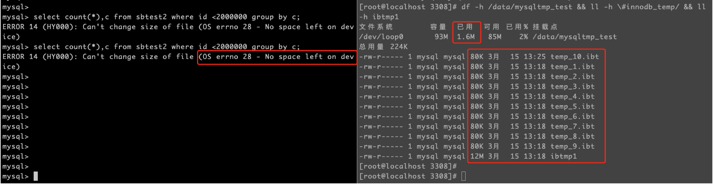
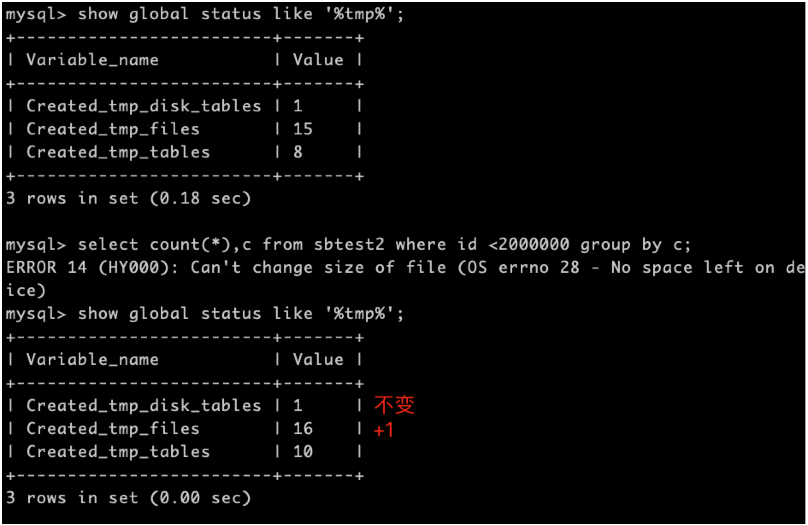
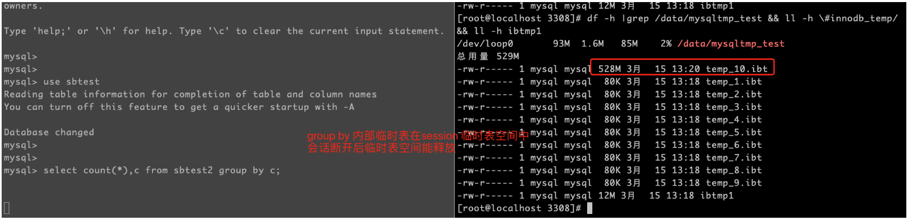
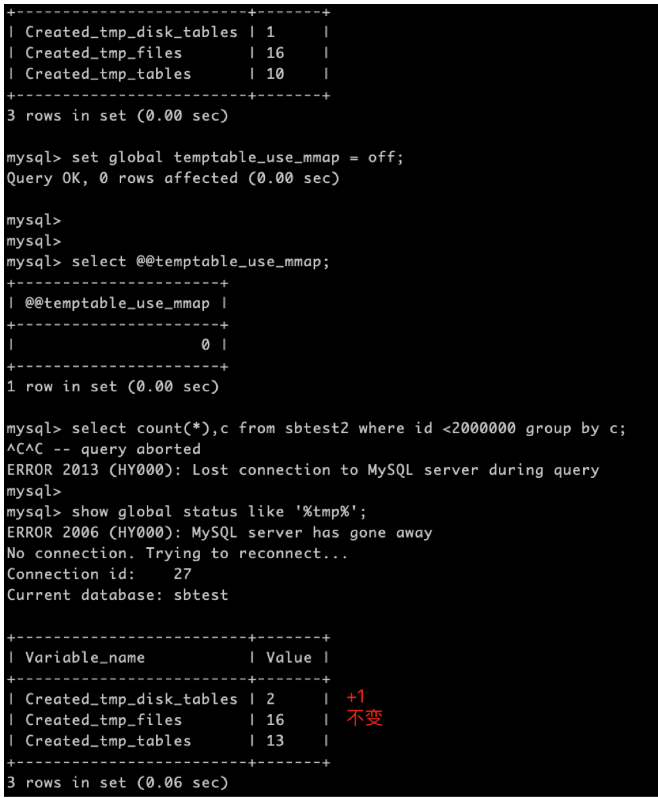

# 技术分享 | MySQL 内部临时表是怎么存放的

**原文链接**: https://opensource.actionsky.com/20210830-mysql/
**分类**: MySQL 新特性
**发布时间**: 2021-09-01T01:05:44-08:00

---

作者：胡呈清
爱可生 DBA 团队成员，擅长故障分析、性能优化，个人博客：https://www.jianshu.com/u/a95ec11f67a8，欢迎讨论。
本文来源：原创投稿
*爱可生开源社区出品，原创内容未经授权不得随意使用，转载请联系小编并注明来源。
如果 SQL 在执行过程中读到的数据无法直接得到结果，那么就需要额外的内存来保存中间结果，得出最终结果，这个额外的内存就是内部临时表。比如 group by 执行时，就需要构建一个临时表，需要额外的字段保存聚合函数的结果，当然为了防止内存使用过大，一般超出某个限制后就会放到磁盘上。关于哪些操作会产生内部临时表，可以查看官方文档：https://dev.mysql.com/doc/refman/8.0/en/internal-temporary-tables.html，下面主要介绍 MySQL8.0 内部临时表存放方式的变化。
### MySQL 5.6
MySQL 5.6 中，内部临时表大小超过内存限制后是在临时目录中的单个表文件表空间中创建的，如果禁用了 innodb_file_per_table ，则在数据目录中的 InnoDB 共享表空间（ibdata1）中创建，很容易造成 ibdata1 过大，并且无法释放，只能逻辑导出数据迁移到新实例解决。
### MySQL 5.7
MySQL 5.7 在临时表空间上做了改进，已经实现将临时表空间从 InnoDB 共享表空间或者独立表空间中分离，现在叫共享临时表空间。好处有二：
- 
可以消除为每个临时表创建和删除的性能成本；
- 
是一块单独为内部临时表划分的表空间，重启 mysqld 可以重置其大小，避免 MySQL5.6 时 ibdata1 难以释放的问题。
其表现是 MySQL 启动时 datadir 下会创建一个 ibtmp1 文件，默认值下会无限扩展。例如，如果某个 SQL 执行时创建了一个大小为 20MB 的内部磁盘临时表，则创建时默认大小为 12MB 的临时表空间文件会扩展到 20MB 以适应该表。当 SQL 执行完删除临时表时，释放的空间可以重新用于新的临时表，但 ibtmp1 文件保持扩展大小，只有重启 MySQL 时才会真正回收共享临时表空间变成初始大小 12MB。
相关参数：
- 
tmp_table_size&#038;max_heap_table_size，内部临时表是存在内存中的，使用 MEMORY 存储引擎，如果大小超过了这两者较小的值，则会转化为磁盘临时表；
- 
internal_tmp_disk_storage_engine：如果内部临时表转化为磁盘临时表，则这个参数指定了磁盘临时表的存储引擎，默认是 INNODB，还可以设置为 MYISAM；
- 
innodb_temp_data_file_path：指定了临时表空间的位置和大小，默认值为 `ibtmp1:12M:autoextend` ，即 datadir/ibtmp1，初始大小12M可以无限扩展，建议限制一个最大值防止把磁盘撑满。
缺点：SQL 执行完产生的内部临时表可能很大，必须要重启才能释放。这点曾一度让我很困惑，为什么不能做的更好一点执行完就释放呢？所幸 MySQL8.0 优化了这个问题。
### MySQL 8.0
MySQL 8.0又有较大变化，新增了一些参数：
- 
internal_tmp_mem_storage_engine：用来指定在内存中的内部临时表的存储引擎，默认值 TempTable，而非以前默认的 MEMORY
- 
temptable_max_ram：定义 TempTable 存储引擎开始在磁盘上存储数据之前可以占用的最大内存量，默认值1G
- 
temptable_use_mmap：定义当 TempTable 存储引擎占用的内存量超过 temptable_max_ram 变量定义的限制时，TempTable 存储引擎是否为内存中的内部临时表分配空间作为内存映射的临时文件。 禁用 temptable_use_mmap 时，将使用 InnoDB 磁盘内部临时表代替。默认值ON，8.0.16引入，8.0.26弃用。
- 
temptable_max_mmap：定义 TempTable 存储引擎在开始将数据存储到磁盘上的 InnoDB 内部临时表之前，被允许从内存映射的临时文件分配的最大内存量（以字节为单位）。设置为0将禁用从内存映射的临时文件分配内存。默认值1G，8.0.23引入。
### 内存映射临时文件
也就是说，默认情况下执行 SQL 产生内部临时表，使用的存储引擎从 MEMORY 变成了 TempTable，当然 TempTable 依然是一种内存表，可以使用的最大内存是1G（默认）。当大小超过1G，会使用`内存映射临时文件作为内部临时表的溢出机制`，大白话就是防止内存使用太大，把内存中的数据放在临时文件中。
但是你想想，关系型数据库设计了存储引擎这么好的东西来存放数据，这时候用文件来存是不是过分了点？估计官方是这么想的：哎呀内部临时表很小的，我就临时放放，你忍忍。后来发现有些内部临时表太大了忍不了，为了防止内存映射临时文件过大，8.0.23版本引入一个新参数 temptable_max_mmap 来限制其大小，如果超过其大小（默认1G），则转化为磁盘临时表（这点和 MySQL 5.7一致）。值得注意的是 temptable_use_mmap 参数 8.0.26 标记被弃用了，官方文档也提示建议设置为0将其关闭，所以个人理解`使用内存映射临时文件作为内部临时表的溢出机制`是一个糟糕的方案。
### TempTable
为什么要把内部临时表默认引擎换成 TempTable ？它与 MEMORY 最大的不同是：
- 
可以支持变长类型，例如 varchar(100)的数据”abcd”应该只占用4个字节而非100个字节，节省内存；
- 
支持二进制大对象，例如 blob, text 等。如果使用 MEMORY 引擎，这样的内部临时表会直接使用磁盘临时表，这个是为了提升性能。
那么真的那么好用吗？目前最新版本是8.0.26，还是存在一些问题的，例如：
https://bugs.mysql.com/bug.php?id=98782
https://bugs.mysql.com/bug.php?id=98739
https://bugs.mysql.com/bug.php?id=99593
https://bugs.mysql.com/bug.php?id=99100
前3个都是性能问题，后面一个则可能会导致 SQL 执行时报错：The table &#8216;/tmp/#sql639b7_13_4&#8217; is full，所以在这些问题解决前，建议设置`internal_tmp_mem_storage_engine=MEMORY`。
### 临时表空间
MySQL 8.0 临时表空间也发生了变化，分为了`会话临时表空间`和`全局临时表空间`内，全局临时表空间内和 MySQL 5.7 时没什么两样，不过 SQL 产生的内部临时表将存储在`会话临时表空间`中。
新参数：
- 
innodb_temp_tablespaces_dir ：定义了创建会话临时表空间的位置，默认位置是数据目录中 #innodb_temp的目录
`shell> ls datadir/#innodb_temp
temp_10.ibt  temp_2.ibt  temp_4.ibt  temp_6.ibt  temp_8.ibt
temp_1.ibt   temp_3.ibt  temp_5.ibt  temp_7.ibt  temp_9.ibt
`
会话临时表空间其实是个包含10个临时表空间的池，会话临时表空间在第一次请求创建磁盘临时表时从临时表空间池中分配给会话。一个会话最多分配两个表空间，一个用于用户创建的临时表，另一个用于优化器创建的内部临时表。当会话断开连接时，其临时表空间被清除并释放回池中。
### 测试现象
temptable_use_mmap = ON 时，如果内部临时表超过了 temptable_max_ram 大小，使用内存映射的临时文件用作内部临时表的溢出机制，临时文件放在 tmpdir 目录下：

可以看到临时文件数量+1，磁盘临时表数量不变：

temptable_use_mmap = OFF 时，如果内部临时表超过了temptable_max_ram 大小，使用 InnoDB 磁盘内部临时表用作内部临时表的溢出机制，存放在 innodb 会话临时表空间中，与 MySQL 5.7 的区别是，session 断开后就会释放空间，不需要重启 MySQL ：

可以看到临时文件数量不变，磁盘临时表数量+1：
