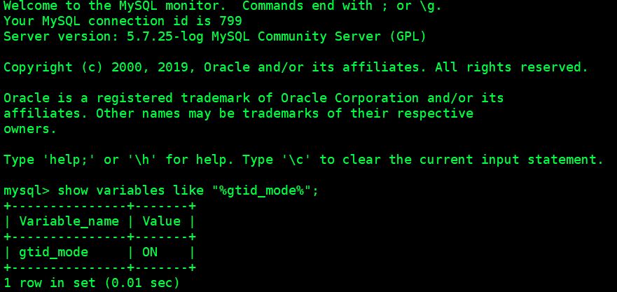
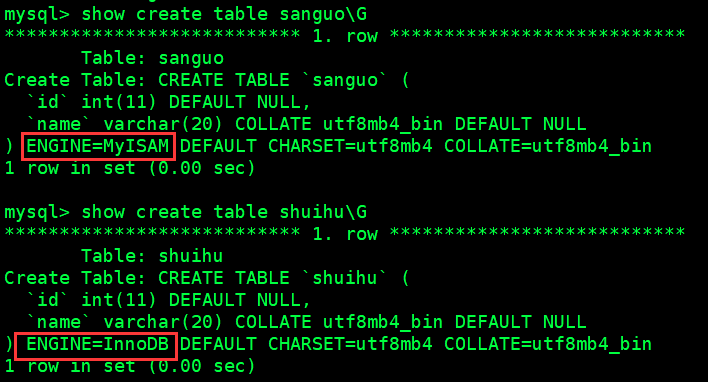
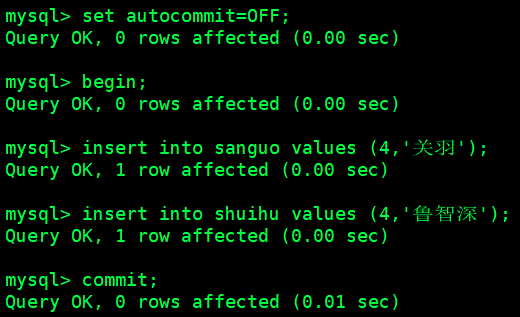
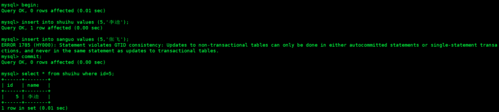
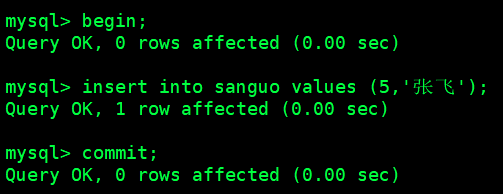
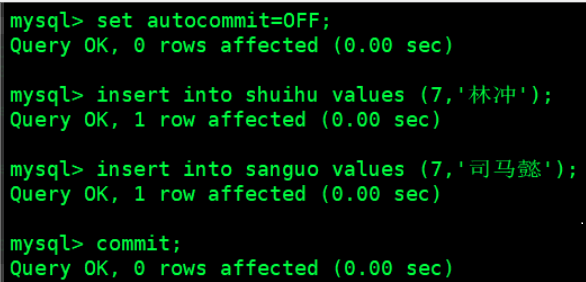
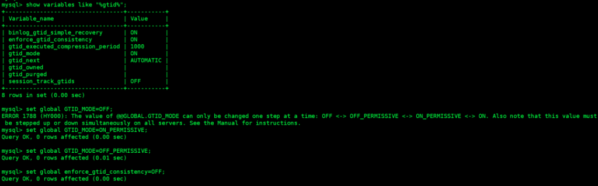
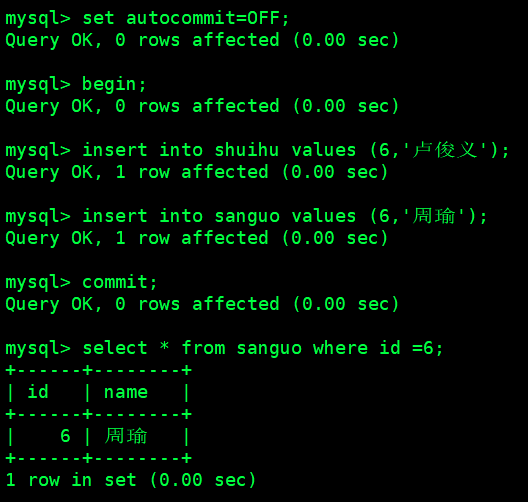
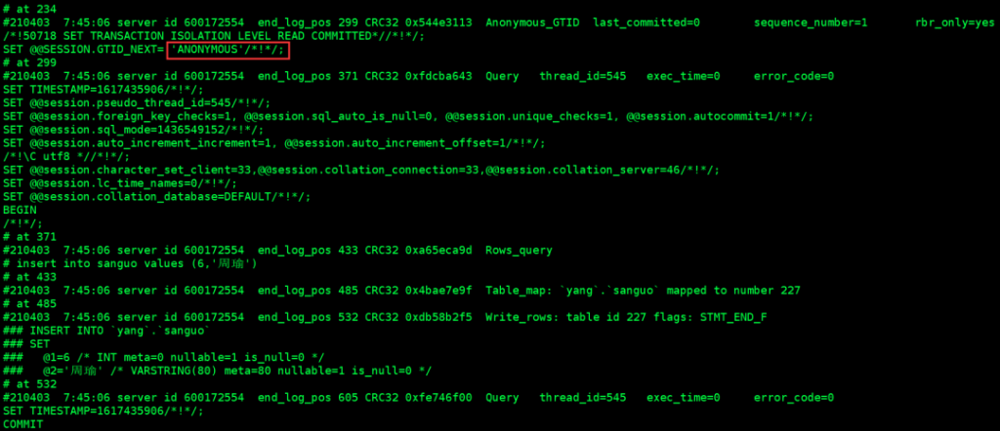
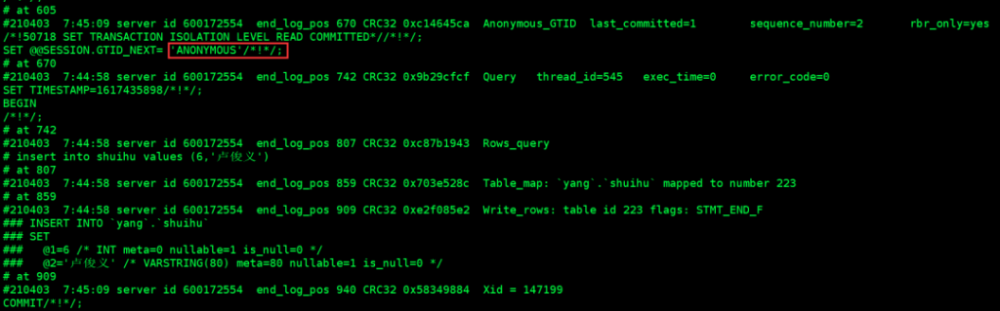

# 技术分享 | MySQL 同一事务中更新 innodb 和 myisam 表时应怎么办？

**原文链接**: https://opensource.actionsky.com/20210429-mysql/
**分类**: MySQL 新特性
**发布时间**: 2021-04-29T00:36:18-08:00

---

作者：刘开洋
爱可生交付服务团队北京 DBA，对数据库及周边技术有浓厚的学习兴趣，喜欢看书，追求技术。
本文来源：原创投稿
*爱可生开源社区出品，原创内容未经授权不得随意使用，转载请联系小编并注明来源。
### 问题
同事在客户那里解决问题时发现一个报错，出于兴趣就进行了研究：
Statement violates GTID consistency: Updates to non-transactional tables can only be done in either autocommitted statements or single-statement transactions,and never in the same statement as updates to transactional tables.
报错的意思是指业务端下发的事务违反了 GTID 的一致性。
原因是，非事务表和事务表在一条事务里进行了更新，MySQL 是不允许我们这么做的，但业务非要胳膊掰大腿，怎么办？
官方说明：
Only statements that can be logged using GTID safe statements can be logged when enforce_gtid_consistency is set to ON,so the operations listed here cannot be used with this option:
Transactions or statements that update both transactional and nontransactional tables.
跟客户沟通确定了该报错事务涉及到的两张表分别是 innodb 表和 myisam 表。我们在自己环境上复现一下。
### 复现
使用 mysql 5.7.25，开启 gtid，

并分别创建一张 innodb 表和 myisam 表。

在同一个事务中对两张表进行更新：

没有报错呀，怎么和客户那里的报错解释不符？
我们将两张表的提交顺序换一下呢？

果然复现了客户环境中的报错。可是为什么先更新 myisam 引擎表，可以更新 innodb 引擎表，反之则不行呢？
因为 myisam 引擎表不支持事务，在我们下发 begin 之后，就已经隐式提交了，这是个运维经验，无法直接判断，专门请教了行业大牛得到的确认；而继续更新 myisam 表时，MySQL 不认这个 insert myisam 表的操作是一个事务操作，只是给予一个记录 binlog 位置的 gtid，之后再更新 innodb 表的操作时，mysql 就认定这是在更新一条事务，在 commit 中就将这条事务提交了。
## 解决
解决办法有三种：
1.在业务层面修改事务逻辑，将对 myisam 表和 innodb 表的更新语句拆开执行。
2.将 myisam 存储引擎改为 innodb 存储引擎。
3.关闭事务一致性参数 ENFORCE_GTID_CONSISTENCY。
接下来分别对三种解决方案进行验证：
（1）修改业务逻辑，将 myisam 表的更新语句单独执行。

这是最为稳妥的一个方法。
（2）修改 myisam 表的存储引擎为 innodb
1)首先确认如果数据量比较大，可以使用 mysqldump 导出数据，然后修改 SQL 文件中的存储引擎的类型和表名，删掉 drop table 的操作，之后保存 SQL 文件导入到数据库中。
2)percona 公司也有一款工具适用于这样的场景，有兴趣的同学可以研究使用下，以备生产环境的使用：pt-online-schema-change。
3)如果表数据量很小，就可以使用常规的 alter 语句直接修改：alert table sanguo engine = InnoDB。
- 

> 注意：
myisam 存储引擎表不支持事务，innodb 表相对于 myisam 表来说能支持更多的数据库高级操作，例如：事务、外键。随着 MySQL 版本的不断更新迭代，innodb 的优势越来越大，建议将所有 MySQL 表的存储引擎逐渐替换为 innodb，两种存储引擎其他方面的优劣对比参考网上文档。
（3）关闭事务一致性参数 ENFORCE_GTID_CONSISTENCY

OFF_PERMISSIVE: New transactions are anonymous. Replicated transactions can be either anonymous or GTID transactions.
- 匿名事务依赖于二进制日志文件和位置来识别特定的事务。
- 从 MySQL 5.7.6 开始，添加的 OFF_PERMISSIVE 和 ON_PERMISSIVE 模式允许在拓扑中混合使用这些事务类型。

对表的更新操作完成。
我们去看看此时 binlog 中的写入：

关闭 ENFORCE_GTID_CONSISTENCY 参数后新事务的提交都是匿名的，且提交顺序被打乱，数据库不再进行一致性检查；但此时复制会中断，数据库使用的 HA 将失效。权衡利弊，对于业务来说代价较高，不建议使用。
> 附：
如果在一个生产环境中，不建议同时更新 innodb 和 myisam 存储引擎表，对于 myisam 引擎表的更改是无法进行回滚的，建议业务将 SQL 上线前一定做好检查。
## 参考:
[https://dev.mysql.com/doc/refman/5.7/en/replication-options-gtids.html](https://dev.mysql.com/doc/refman/5.7/en/replication-options-gtids.html)
[https://www.percona.com/doc/percona-toolkit/LATEST/pt-online-schema-change.html](https://www.percona.com/doc/percona-toolkit/LATEST/pt-online-schema-change.html)