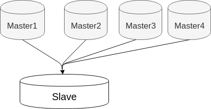
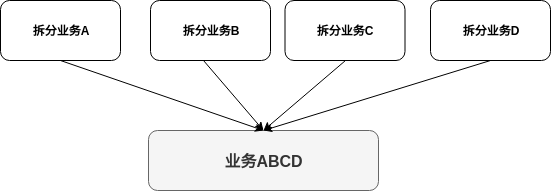
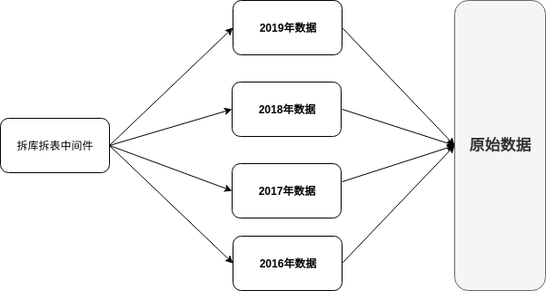
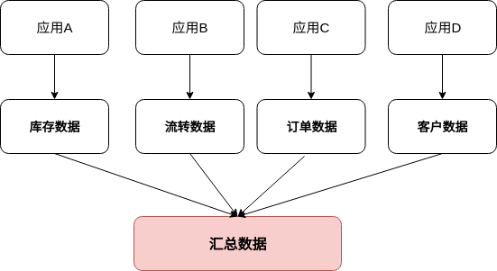

# 技术分享 | MySQL 多源复制场景分析

**原文链接**: https://opensource.actionsky.com/20191104-mysql/
**分类**: MySQL 新特性
**发布时间**: 2019-11-04T00:59:00-08:00

---

今天有客户问起：如何汇总多台 MySQL 数据到一台上？ 我回答：可以尝试下 MySQL 的多源复制。我们知道 MySQL 单主一从，单主多从，或者级联的主从架构我们都见的很多了。但是多主一从这种使用场景比较少，比如图 1：
											
**这种架构一般用在以下三类场景**
**1. 备份多台 Server 的数据到一台****如果按照数据切分方向来讲，那就是垂直切分。**比如图 2，业务 A、B、C、D 是之前拆分好的业务，现在需要把这些拆分好的业务汇总起来备份，那这种需求也很适用于多源复制架构。实现方法我大概描述下：业务 A、B、C、D 分别位于 4 台 Server，每台 Server 分别有一个数据库来隔离前端的业务数据，那这样，在从库就能把四台业务的数据全部汇总起来，而不需要做额外的操作。那没有多源复制之前，要实现这类需求，只能在汇总机器上搭建多个 MySQL 实例，那这样势必会涉及到跨库关联的问题，不但性能急剧下降，管理多个实例也没有单台来的容易。
											
**2. 用来聚合前端多个 Server 的分片数据。**
**同样，按照数据切分方向来讲，属于水平切分。**比如图 3，按照年份拆分好的数据，要做一个汇总数据展现，那这种架构也非常合适。实现方法稍微复杂些：比如所有 Server 共享同一数据库和表，一般为了开发极端透明，前端配置有分库分表的中间件，比如爱可生的 DBLE。
											
**3. 汇总并合并多个 Server 的数据**
**第三类和第一种场景类似。****不一样的是不仅仅是数据需要汇总到目标端，还得合并这些数据，这就比第一种来的相对复杂些。**比如图 4，那这样的需求，是不是也适合多源复制呢？答案是 YES。
											
那具体怎么做呢？我举个例子，比如下面一张表 A，字段分表为 ID（主键）、F1、F2、F3&#8230; 、F100。那按照这样的分法，前端 4 台 Server 的表分别为：- A1(ID,F1,F2,&#8230;,F25)
- A2(ID,F26,F27,&#8230;,F50)
- A3(ID,F51,F52,&#8230;,F75)
- A4(ID,F76,F77,&#8230;,F100)
那上面几张表的数据如果要合并到表 A，可以建立一个 Event，定时的来给表 A 里插入数据。涉及到的核心 SQL 为：- `insert ignore into A select A1.ID,F1,F2,...,F100 \`
- `from A1 natural join A2 natural join A3 natural join A4;`
那我们发现这个和第一个类似，只不过，所有的表最后到复制到了相同的数据库里。总结下，我上面简单说明了 MySQL 多源复制的三种常用使用场景，希望对大家有所帮助。
**社区近期动态**
**No.1**
**Mycat 问题免费诊断**
诊断范围支持：
Mycat 的故障诊断、源码分析、性能优化
服务支持渠道：
技术交流群，进群后可提问
QQ群（669663113）
社区通道，邮件&电话
osc@actionsky.com
现场拜访，线下实地，1天免费拜访
关注“爱可生开源社区”公众号，回复关键字“Mycat”，获取活动详情。
**No.2**
**社区技术内容征稿**
征稿内容：
格式：.md/.doc/.txt
主题：MySQL、分布式中间件DBLE、数据传输组件DTLE相关技术内容
要求：原创且未发布过
奖励：作者署名；200元京东E卡+社区周边
投稿方式：
邮箱：osc@actionsky.com
格式：[投稿]姓名+文章标题
以附件形式发送，正文需注明姓名、手机号、微信号，以便小编及时联系