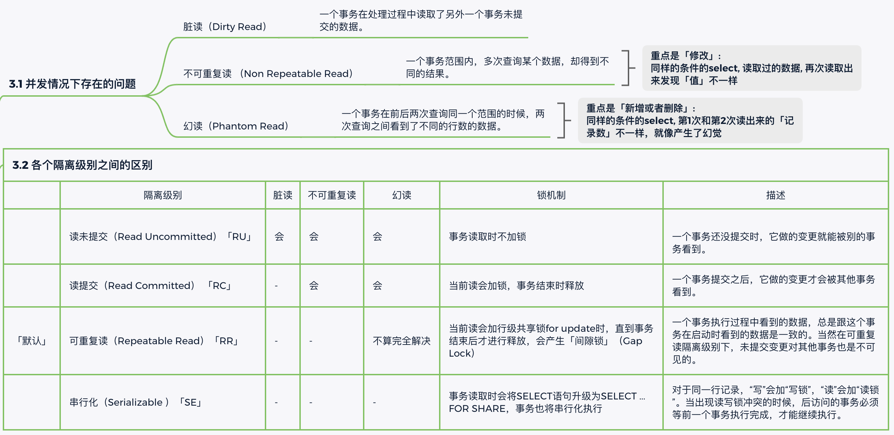
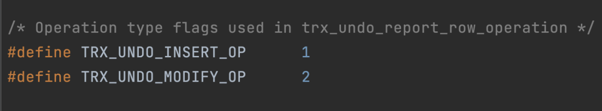
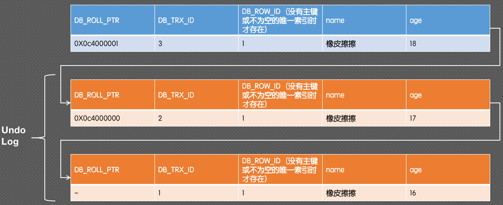
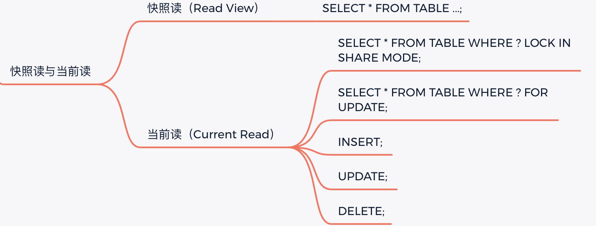
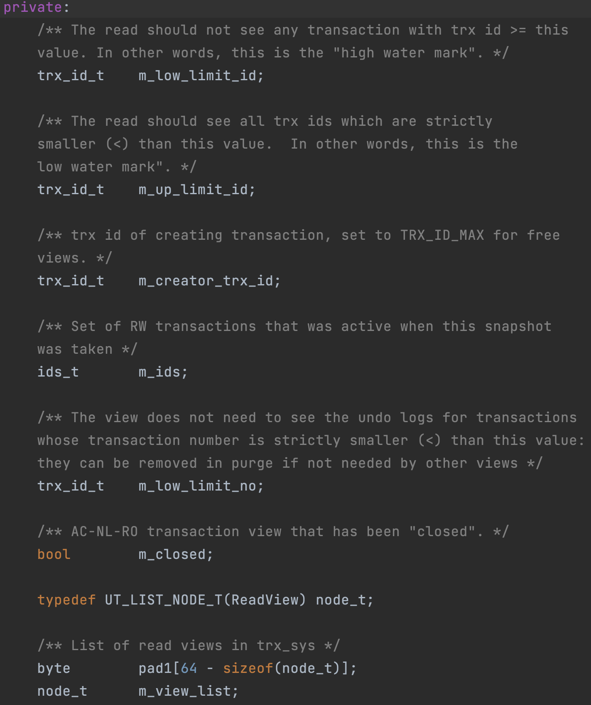
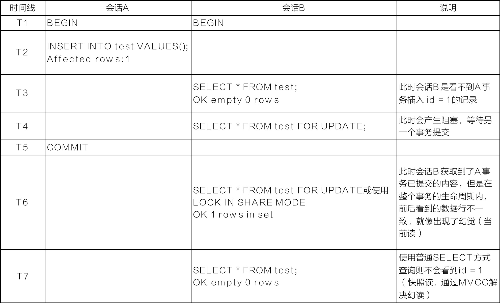
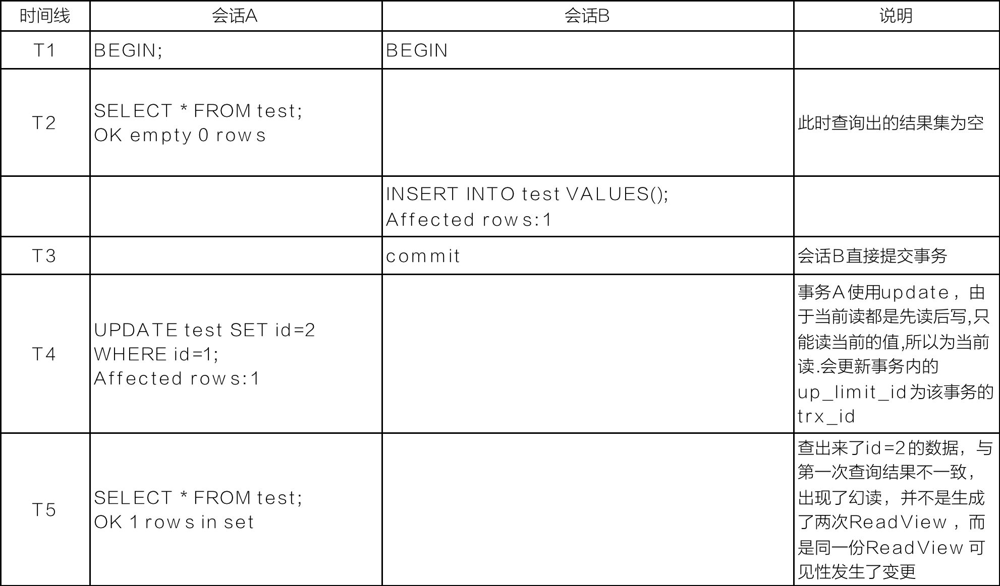

# 技术分享 | MySQL 多版本并发控制「MVCC」

**原文链接**: https://opensource.actionsky.com/20221221-mvcc/
**分类**: 技术干货
**发布时间**: 2022-12-20T23:32:33-08:00

---

作者：贲绍华
爱可生研发中心工程师，负责项目的需求与维护工作。其他身份：柯基铲屎官。
本文来源：原创投稿
*爱可生开源社区出品，原创内容未经授权不得随意使用，转载请联系小编并注明来源。
#### 一、MySQL InnoDB引擎事务隔离级别与并发问题
本文以MySQL 5.7版本为例进行说明，开始前让我们先简单复习一下InnoDB引擎下的四种隔离级别与三种并发场景下存在的问题，内容如下：

#### 二、Undo Logs
MySQL的Undo Logs保证了数据的原子性，它保存了事务发生之前的数据的一个版本，可以用于事务回滚，同时可以提供多版本并发控制下的读（MVCC），也即非锁定读。Undo Logs内部分为两种类型，它们分别是：

###### TRX_UNDO_INSERT：
由insert语句产生的undo日志，在事务提交后可以直接删除。只有事务回滚时产生作用；
###### TRX_UNDO_UPDATE：
除TRX_UNDO_INSERT以外，其他都属于该类型（包括删除），事务提交后还可能会被MVCC用到，不会立即清理；

每个事务都会维护INSERT和UPDATE两种类型的Undo的链表
#### 三、多版本并发控制「MVCC」（Multi Version Concurrency Control）
> Acronym for “multiversion concurrency control”. This technique lets
InnoDB transactions with certain isolation levels perform consistent read operations; that is, to query rows that are being updated by other transactions, and see the values from before those updates occurred. This is a powerful technique to increase concurrency, by allowing queries to proceed without waiting due to locks held by the other transactions.
在InnoDB引擎下，运行同一行内容在不同事务之间读写互不干扰，这是我们经常会碰到的业务场景，它也被认为是理所当然的。而实现这一特性的实现其实会比描述起来复杂得多。
MVCC就是允许在特定隔离级别的 InnoDB 引擎下，对事务执行一致的读操作。避免了并发事务下对一般类型查询的锁竞争，也是一种增强并发事务读写能力的功能。
就像一位称职的摄像师，在你每个人生的高光点都会按下快门记录当下与之前的影像。
它本质上就是一个链表，每一行内容的版本都指向上一个版本，其中也除了数据本身，还包含了事务可见性的信息在内，通过这些可见性信息用于判断哪个版本才能对当前的该查询可见。
#### 四、快照读「Read View」
当多个事务同时操作同一份数据内容时，可以分为两种获取方式：当前读、快照读。
- 当前读
直接从磁盘或buffer中获取当前内容的最新数据，读到什么就是什么。根据隔离级别的不同期间会产生一些锁，防止并发场景下其他事务产生影响；
在官方叫做 Locking Reads（锁定读取）：https://dev.mysql.com/doc/refman/8.0/en/innodb-locking-reads.html
- 快照读
简单的SELECT操作（不包括lock in share mode,for update），根据隔离级别的不同，会在不同时机产生快照，事务读取的实际是快照内容，保证一致性的同时减少了锁之间的竞争；
官方叫做 Consistent Nonlocking Reads（一致性非锁定读取，也叫一致性读取）: https://dev.mysql.com/doc/refman/8.0/en/innodb-consistent-read.html

下面来看一下，在MySQL 5.7的源码中，对于MVCC read view结构是如何定义的：

| 字段名 | 释义 |
| --- | --- |
| m_low_limit_id | 下一个待分配的事务ID（当前Max trx_id + 1） |
| m_up_limit_id | 最小活跃事务ID |
| m_creator_trx_id | 触发创建该ReadView的事务ID |
| m_ids | 该ReadView创建时，处于【当前活跃】状态的事务ID有序集合 |
| m_low_limit_no | 最后一个提交的事务number，事务提交时候获取同时写入Undo log中的值，事务Number小于该值的对该ReadView不可见。利用该信息可以Purge不需要的Undohttps://dev.mysql.com/doc/refman/5.7/en/innodb-purge-configuration.html |
| m_closed | 标记该ReadView是否已经closed，用于优化减少trx_sys->mutex这把大锁的使用 |
| m_view_list | 用于存储ReadView的链表信息 |
这里的字段大部分都是为了确保这份Readview是否能被其他事务所&#8221;看见&#8221;的条件，关于可见性的判断就不在此详细说明了。
#### 五、ReadView的创建与关闭

对于ReadView来说，在不同的隔离级别下它们的创建与关闭时机会存在区别，具体如下：
- 读提交 ( READ COMMITTED )「RC」
在READ COMMITTED事务隔离级别下,每次语句执行都关闭ReadView,然后重新创建一份ReadView
- 可重复读 ( REPEATABLE READ )「RR」
innobase_start_trx_and_assign_read_view(
/*====================================*/
handlerton*    hton,  /*!< in: InnoDB handlerton */
THD*      thd)   /*!< in: MySQL thread handle of the user for
whom the transaction should be committed */
{
......
/* 在RR级别下，使用start transaction with consistent snapshot会直接创建视图，否则会在第一条SELECT语句时创建 */
/* 快照会在事务结束时关闭，整个事务生命周期内共享同一个快照 */
/* Assign a read view if the transaction does not have it yet.
Do this only if transaction is using REPEATABLE READ isolation
level. */
trx->isolation_level = innobase_map_isolation_level(
thd_get_trx_isolation(thd));
if (trx->isolation_level == TRX_ISO_REPEATABLE_READ) {
trx_assign_read_view(trx);
} else {
push_warning_printf(thd, Sql_condition::SL_WARNING,
HA_ERR_UNSUPPORTED,
"InnoDB: WITH CONSISTENT SNAPSHOT"
" was ignored because this phrase"
" can only be used with"
" REPEATABLE READ isolation level.");
}
#### 六、为什么说RR级别下并没有完全解决幻读？
以下通过两个例子来说明RR级别下也能出现幻读的场景，创建一个test表，只有一个id(pk AUTO_INCREMENT)的字段：
CREATE TABLE `test` (
`id` int(11) NOT NULL AUTO_INCREMENT,
PRIMARY KEY (`id`)
) ENGINE=InnoDB DEFAULT CHARSET=utf8mb4
#### 案例一：

#### 案例二：

在RR级别下普通查询是快照读，并不会看到其他事务插入的数据。这种幻读情况只有在快照读与当前读混合使用的情况下才会出现，这部分也是争议比较多的地方。
然而当前读的定义就是能从buffer或磁盘获取到已提交数据的最新值，所以这跟事务的可见性其实并不矛盾。
#### 七、相关资料：
[https://dev.mysql.com/doc/refman/5.7/en/innodb-locking-reads.html](https://dev.mysql.com/doc/refman/5.7/en/innodb-locking-reads.html)
[https://dev.mysql.com/doc/dev/mysql-server/latest/classReadView.html](https://dev.mysql.com/doc/dev/mysql-server/latest/classReadView.html)
[https://dev.mysql.com/doc/refman/5.7/en/innodb-multi-versioning.html](https://dev.mysql.com/doc/refman/5.7/en/innodb-multi-versioning.html)
[https://developer.aliyun.com/article/928196](https://developer.aliyun.com/article/928196)