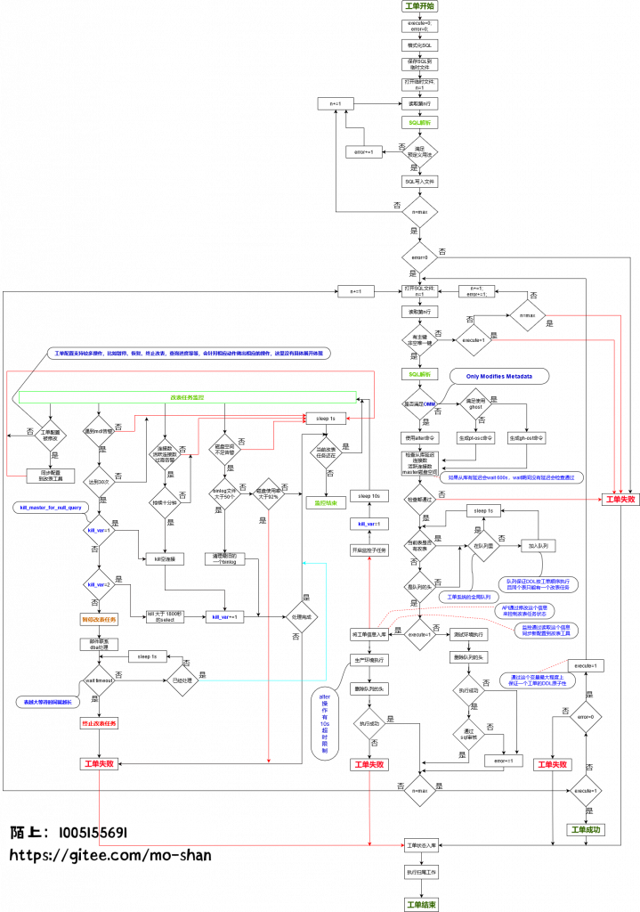

# 技术分享 | MySQL 改表工单后台逻辑实现

**原文链接**: https://opensource.actionsky.com/20210506-mysql/
**分类**: MySQL 新特性
**发布时间**: 2021-05-06T00:34:34-08:00

---

作者：莫善某互联网公司高级 DBA。本文来源：原创投稿*爱可生开源社区出品，原创内容未经授权不得随意使用，转载请联系小编并注明来源。> **本文目录：**一、导读二、背景三、分析四、正文五、写在最后
## 一、导读
DBA【MySQL DBA】，其他 DBA 不在本文讨论范围。
DDL【ALTER TABLE】，其他操作不在本文讨论范围。
OMM【Only Modifies Metadata】。
NOMM【Not Only Modifies Metadata】。
## 二、背景
> 
嘟！嘟！嘟！
你好，我今晚要上线新功能，有个改表帮我处理一下呗。
你好，我有个亿级（十亿）表，需要加个字段/索引帮我处理一下呗。
你好，我刚加了一个字段，小表半小时还没加完，而且现在好像写不了数据。
DBA 们应该经常会接到这种需求吧。
DDL 操作可能是 DBA 最头疼的一项工作之一，也是最日常的一项工作了。动不动就要加个字段，扩个长度。如果不幸前期设计不合理的系统，那后期维护起来就真的是叫爹骂娘的问候。如果又不幸是接盘跑了八百年的业务表需要上线新功能加一两字段或者扩个长度啥的，简直酸爽到飞。
MySQL 5.6 开始支持 OnlineDDL，美美地敲了回车，等半天还是没反应，撸了一把又一把，业务催了一遍又一遍，猥琐发育都二胎了，就是没结束，在三胎之后终于跑完了，然后你就躺下刷了会手机，想找点安慰告别努力工作的一天，结果发现又是绿油油的一天，怒扔手机睡觉去了，不曾想刚酝酿了一会睡意，麻烦又来了。
业务疯狂的打电话，很不情愿的接通了。业务反馈很多订单返回的数据都有问题。机智的你猜到了肯定是改表导致了延迟，业务还是一顿吐槽，吧啦吧啦说一大堆，还得起来把读流量切到主库，有没有很酸爽。
为啥会这样呢，我们就来掰扯掰扯这个问题。
MySQL 的 DDL 操作主要有两种方式 copy 和 inplace。copy 表需要全程锁表，对业务影响极大，inplace 不阻塞 dml 操作。但是 MySQL 5.6 推出 OnlineDDL 以前，基本干啥 copy，干啥啥不行，干啥啥锁表。5.6 版本推出 OnlineDDL，DBA 们简直爱的不要不要了。但是 inplace？就真的很爱了吗。别忘了，inplace 分为 rebuild 和 no-rebuild，这就能解释了为啥很多操作还是很慢了。原因就是：【NOMM】。
既然 OnlineDDL 还是有那么多问题，那我们该咋整呢？这还只是一个 DDL 操作，如果很多呢，几十上百个 DDL 需求，是不是要疯，枸杞红枣肾宝片是不是得搞起来了。但是别慌，还有后招。生活是很美好的，比如骑上小电驴就可以送外卖了。
废话时间结束，现在言归正传，来聊聊改表工单系统-后台逻辑是怎么实现的？
## 三、分析
**为什么 DBA 那么排斥 DDL 操作？**
1）对生产环境的敬畏心，能不做就不做，多做多错。只要是对线上环境操作，就是有风险的，一定要有这个意识，任何认为简单的操作都可能隐藏着不可预知的风险，线上环境无小事，一出事就是大事。所以能避免人为操作，就尽量避免人为操作。（是自动化不香吗，还是工作不饱和要体现工作量）
2）大表 DDL 操作成本高，白天容易影响业务，产生延迟等等。一般都是凌晨搞，熬夜太伤肾。还有就是，大多数 DDL 开销成本极大，简单来说就是【NOMM】开销成本都不小，那么就会带来一些问题，比如上面提到的延迟，还有就是 mdl 锁问题，还有磁盘 io 争抢，磁盘空间爆满等等，所以是有诸多风险的。是否是【OMM】**请参照下表**：
| Operation | 5.6 | 5.7 | 8.0 |
| --- | --- | --- | --- |
| Dropping an index | YES | YES | YES |
| Renaming an index | **NULL** | YES | YES |
| Changing the index type | YES | YES | YES |
| Renaming a column | YES | YES | YES |
| Setting a column default value | YES | YES | YES |
| Extending VARCHAR column size | **NO** | YES | YES |
| Dropping the column default value | YES | YES | YES |
| Modifying the definition of an ENUM or SET column | YES | YES | YES |
| Adding a VIRTUAL column | **NULL** | YES | YES |
| Dropping a VIRTUAL column | **NULL** | YES | YES |
| Adding a foreign key constraint | YES | YES | YES |
| Dropping a foreign key constraint | YES | YES | YES |
| Setting persistent table statistics | YES | YES | YES |
| Renaming a table | YES | YES | YES |
注：8.0 支持快速加列（instant 算法），但是有很多限制。常见的就是（1）不能使用 after、first 等位置属性，只能添加在表的最后一列。（2）不能是开启压缩的表。（3）不能是有全文索引的表。
3）重复性工作，大部分就是一个回车的事，然后就是盯监控，关注告警等一小时甚至更久，问题是每天还重复干很多。（dba 是干大事的，想想当时是不是按照内核开发要求招你来的）。
当然，在日常工作中，DBA 处理 DDL 操作，一般都是使用 gh-ost 或者 pt-osc 来进行操作，但是这两款工具就没问题了吗？下面我列几个问题：
- 
pt-osc，有触发器限制，产生死锁，且触发概率明显比 ghost 高很多。这是一个风险点，很容易被忽略。当 pt-osc 异常退出的时候，触发器还是会留在表上，这时候如果先删除临时表（xx_new）而没有先删除触发器，那一定很酸爽，业务一定会把你电话打爆。
- 
gh-ost，对网络要求比较高，如果网络延迟比较严重可能会导致改表一直不会完成。对 binlog format 要求是 row，binlog image 要求是 full。还有不支持外键表。
- 
最重要的一个问题，这类工具都比较笨，只会 copy 数据。就是说即便是【OMM】也会傻傻的 copy。对于大表，或者 TPS 比较大的业务，会写很多 binlog，容易将磁盘打爆。
- 
对于有慢查询环境，还是容易出现 mdl 等待。gh-ost 稍微好点，但是 pt-osc 的话就比较爽了，会一直锁。直到人为干预。
综上，会发现，DDL 真的很烦人，实际工作中遇到的痛点估计比上述的更多。（在此也建议业务，前期一定要做好数据库设计，有条件的一定要让 dba 参与设计，没有条件的一定要创建条件）
## 四、正文
先上一个流程图：
> 提示：原图链接
https://gitee.com/mo-shan/myonlineddl/blob/master/img/myonlineddl.png
											
主要做如下几点介绍：
- 格式化 SQL，需要将业务 SQL 做统一格式化处理，方便后面做 SQL 解析。
- 第一次 SQL 解析。根据用户提交的 DDL 做预定义用法判断，检查所有操作是否是满足预定义的。这块逻辑就是把控工单的操作，做到所有操作都可控。啥能做，啥不能做。
- 第二次 SQL 解析。判断单条 DDL 是否满足【OMM】如果满足就直接 OnlineDDL 了，如果不满足就使用 ghost/ptosc 工具。选择工具的时候会针对上述的优缺点问题做各自的判断，然后优先选择 ghost。说白了就是工单自适应，可根据当前操作，及不同环境做出判断，并调整相应配置生成一个安全合理又高效的执行计划。
- 提供 DDL 审核功能，并不是说业务提交什么就都能通过。比如说，是否允许 null 值，是否要求有注释，是否要求规范索引名等等。都可以通过规则开关进行审核。（这点跟上述的预定义用法判断有区别，一个是限制操作，一个是控制操作是否规范合理）
- 加上监控，和对异常处理。比如对 mdl 的监控，连接数，活跃连接数，磁盘空间等等，触发告警会有邮件提示。
- 尽可能的保证每个工单的原子性。就是尽可能的保证每个工单里的每条 DDL 都成功。要么就都不做，要做就都要成功，需要注意，这里说的是尽可能，有点耐人寻味。
- 通过 API 去实现动态配置改表工单，比如正在执行的改表需要暂停，恢复，终止，又或者需要获取改表进度。
- 扫尾工作。这点没什么好说的，擦干屁股很重要，避免下次踩坑。
当然要实现上述功能，最大的难度就是如何对业务的 DDL 操作进行解析。只有实现了 SQL 解析，才能消除上痛点实现功能。大家也可以想想怎么实现 SQL 解析这个功能。
下面列几个我在实现的时候遇到问题，供大家思考一下：
- SQL 格式化的时候，注释会对你的实现会产生很大的阻碍，那么该如何处理注释的呢。（ “/* */ comment &#8221; # &#8211;” 等等这些注释 ）
- SQL 解析的时候要考虑【OMM】分 change、modify，varchar 扩长度（又有局限性）等场景。如何鉴定这些是否满足【OMM】，如果是 modify 的组合模式（modify varchar and not varchar）又该怎么鉴定。
- 如何鉴定是否满足 8.0 的快速加列。
- SQL 审核的功能，如何把控 DDL 操作是合理的。
- 保留字问题怎么处理呢？不处理，直接返回错误？那用户体验太差了。有些人可能就会说，用反引号引起来就好了，那么问题来了，用户不知道这是关键字，他写的 SQL 没有用反引号，那需要工单系统二次处理给加上，那应该怎么加呢？哪些需要加呢？
以上几点，大家可以想想怎么实现，可能用脑子一过觉得难度好像不大，但是真正落实到代码，应该还是有些难度的。毕竟 ALTER TABLE 语法千变万化，组合十分复杂，关于我是如何实现的，有兴趣的小伙伴可以看一下 git，欢迎吐槽改进。（安装部署及测试都有）
> git：https://gitee.com/mo-shan/myonlineddl
需要了解测试流程，可以直接阅读【README.md】测试部分
## 五、写在最后
日拱一卒，终有一日成车。就是干！
**文章推荐：**
[技术分享 | MySQL binlog 分析工具 analysis_binlog 的使用介绍](https://opensource.actionsky.com/20210331-mysql/)