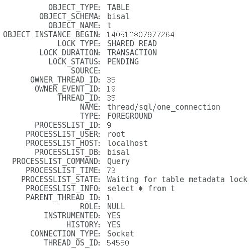

# 技术分享 | MySQL 的 MDL 锁解惑

**原文链接**: https://opensource.actionsky.com/20220426-mysql/
**分类**: MySQL 新特性
**发布时间**: 2022-04-27T23:55:17-08:00

---

作者：刘晨
网名 bisal ，具有十年以上的应用运维工作经验，目前主要从事数据库应用研发能力提升和技术管理相关的工作，Oracle ACE ，腾讯云TVP，拥有 Oracle OCM &#038; OCP 、EXIN DevOps Master 、SCJP 等国际认证，国内首批 Oracle YEP 成员，OCMU 成员，《DevOps 最佳实践》中文译者之一，CSDN &#038; ITPub 专家博主，公众号&#8221;bisal的个人杂货铺&#8221;，长期坚持分享技术文章，多次在线上和线下分享技术主题。
本文来源：原创投稿
*爱可生开源社区出品，原创内容未经授权不得随意使用，转载请联系小编并注明来源。
前几天，某个使用 MySQL 的应用，出现了一些问题，表象上是应用请求无响应，通过检索数据库，发现很多会话执行的 SQL 提示&#8221;Waiting for table metadata lock&#8221;的等待，经过确认，这些SQL对应的就是这些请求，SQL 无返回，自然从应用端不能得到响应。
但为什么出现这种现象？&#8221;table metadata lock&#8221;又是什么锁？
从&#8221;table metadata lock&#8221;的名称，可以知道他是个表锁，&#8221;metadata lock&#8221;简称为 MDL ，即元数据锁，从 MySQL 5.5 开始引入的，他是基于表元数据(表结构)的锁，MDL锁是为了保证并发环境下元数据和表数据的结构一致性。如果有事务对表加了MDL锁，那么其他事务就不能对表结构进行变更，同样对于正在进行表结构变更的时候也不允许其他事务对表数据进行增删改查，他能解决或者保证的是 DDL 操作与 DML 操作之间的一致性。
我们通过实验来体验下MDL锁的情况。
MySQL 5.7中，performance_schema库中新增了metadata_locks表，专门记录MDL的相关信息，但在5.7中默认关闭(8.0默认打开)，
`mysql> select * from performance_schema.setup_instruments \G;
...
NAME: wait/lock/metadata/sql/mdl
ENABLED: NO
TIMED: NO
`
为了更直观了解MDL锁，首先要开启MDL锁记录，执行如下SQL开启，此时就可以通过关联 metadata_locks 和 threads 等，观测 MDL 的相关信息，
`mysql> update performance_schema.setup_instruments set enabled='YES',TIMED='YES'
-> where name='wait/lock/metadata/sql/mdl';
Query OK, 1 row affected (0.02 sec)
Rows matched: 1  Changed: 1  Warnings: 0
`
#### 场景1 会话1执行SELECT操作
为了能关注到锁的信息，使用sleep函数，
`mysql> select sleep(10) from t;
+-----------+
| sleep(10) |
+-----------+
|         0 |
|         0 |
+-----------+
2 rows in set (20.01 sec)
`
processlist 显示的是 user sleep ，

执行如下SQL，
`select m.*, t.* from performance_schema.metadata_locks m 
left join performance_schema.threads t on m.owner_thread_id = t.thread_id\G;
`
可以看到这条SQL当前正在持有SHARED_READ类型的锁，说明SELECT读操作，实际上需要锁，

#### 场景2 会话1在事务中执行SELECT操作
执行BEGIN，再执行SELECT，但是不提交，
`mysql> begin;
Query OK, 0 rows affected (0.00 sec)
mysql> select * from t;
+------+
| id   |
+------+
|    1 |
|    2 |
+------+
2 rows in set (0.00 sec)
`
此时检索metadata_locks和threads，SELECT当前还是持有SHARED_READ类型的锁，

#### 场景3 事务中执行INSERT
开启一个事务，执行插入INSERT操作，但是不提交，
`mysql> begin;
Query OK, 0 rows affected (0.00 sec)
mysql> insert into t values(3);
Query OK, 1 row affected (0.01 sec)
`
此时检索metadata_locks和threads，INSERT当前是持有SHARED_WRITE类型的锁，

#### 场景4 执行alter table
场景3插入操作不提交的情况下，会话2执行 alter table ，此时就出现 hang ，
`alter table t add c varchar(1);
`
processlist 显示 alter table 操作等待 Waiting for table metadata lock ，

此时检索 metadata_locks 和 threads，alter table 依次持有了以下几种锁，INTENTION_EXCLUSIVE、SHARED_UPGRADABLE、EXCLUSIVE，
`          OBJECT_TYPE: GLOBAL
OBJECT_SCHEMA: NULL
OBJECT_NAME: NULL
OBJECT_INSTANCE_BEGIN: 140512405331056
LOCK_TYPE: INTENTION_EXCLUSIVE
LOCK_DURATION: STATEMENT
LOCK_STATUS: GRANTED
SOURCE: 
OWNER_THREAD_ID: 34
OWNER_EVENT_ID: 21
THREAD_ID: 34
NAME: thread/sql/one_connection
TYPE: FOREGROUND
PROCESSLIST_ID: 8
PROCESSLIST_USER: root
PROCESSLIST_HOST: localhost
PROCESSLIST_DB: bisal
PROCESSLIST_COMMAND: Query
PROCESSLIST_TIME: 5
PROCESSLIST_STATE: Waiting for table metadata lock
PROCESSLIST_INFO: alter table t add c varchar(1)
PARENT_THREAD_ID: 1
ROLE: NULL
INSTRUMENTED: YES
HISTORY: YES
CONNECTION_TYPE: Socket
THREAD_OS_ID: 6836
*************************** 5. row ***************************
OBJECT_TYPE: SCHEMA
OBJECT_SCHEMA: bisal
OBJECT_NAME: NULL
OBJECT_INSTANCE_BEGIN: 140512405285536
LOCK_TYPE: INTENTION_EXCLUSIVE
LOCK_DURATION: TRANSACTION
LOCK_STATUS: GRANTED
SOURCE: 
OWNER_THREAD_ID: 34
OWNER_EVENT_ID: 21
THREAD_ID: 34
NAME: thread/sql/one_connection
TYPE: FOREGROUND
PROCESSLIST_ID: 8
PROCESSLIST_USER: root
PROCESSLIST_HOST: localhost
PROCESSLIST_DB: bisal
PROCESSLIST_COMMAND: Query
PROCESSLIST_TIME: 5
PROCESSLIST_STATE: Waiting for table metadata lock
PROCESSLIST_INFO: alter table t add c varchar(1)
PARENT_THREAD_ID: 1
ROLE: NULL
INSTRUMENTED: YES
HISTORY: YES
CONNECTION_TYPE: Socket
THREAD_OS_ID: 6836
*************************** 6. row ***************************
OBJECT_TYPE: TABLE
OBJECT_SCHEMA: bisal
OBJECT_NAME: t
OBJECT_INSTANCE_BEGIN: 140512405330960
LOCK_TYPE: SHARED_UPGRADABLE
LOCK_DURATION: TRANSACTION
LOCK_STATUS: GRANTED
SOURCE: 
OWNER_THREAD_ID: 34
OWNER_EVENT_ID: 21
THREAD_ID: 34
NAME: thread/sql/one_connection
TYPE: FOREGROUND
PROCESSLIST_ID: 8
PROCESSLIST_USER: root
PROCESSLIST_HOST: localhost
PROCESSLIST_DB: bisal
PROCESSLIST_COMMAND: Query
PROCESSLIST_TIME: 5
PROCESSLIST_STATE: Waiting for table metadata lock
PROCESSLIST_INFO: alter table t add c varchar(1)
PARENT_THREAD_ID: 1
ROLE: NULL
INSTRUMENTED: YES
HISTORY: YES
CONNECTION_TYPE: Socket
THREAD_OS_ID: 6836
*************************** 7. row ***************************
OBJECT_TYPE: TABLE
OBJECT_SCHEMA: bisal
OBJECT_NAME: t
OBJECT_INSTANCE_BEGIN: 140512406836304
LOCK_TYPE: EXCLUSIVE
LOCK_DURATION: TRANSACTION
LOCK_STATUS: PENDING
SOURCE: 
OWNER_THREAD_ID: 34
OWNER_EVENT_ID: 21
THREAD_ID: 34
NAME: thread/sql/one_connection
TYPE: FOREGROUND
PROCESSLIST_ID: 8
PROCESSLIST_USER: root
PROCESSLIST_HOST: localhost
PROCESSLIST_DB: bisal
PROCESSLIST_COMMAND: Query
PROCESSLIST_TIME: 5
PROCESSLIST_STATE: Waiting for table metadata lock
PROCESSLIST_INFO: alter table t add c varchar(1)
PARENT_THREAD_ID: 1
ROLE: NULL
INSTRUMENTED: YES
HISTORY: YES
CONNECTION_TYPE: Socket
THREAD_OS_ID: 6836
`
#### 场景5 执行SELECT
场景3和4的前提下，会话3执行SELECT，同样出现了hang，
`mysql> select * from t;
`
processlist 显示 SELECT 的状态，Waiting for table metadata lock，

此时检索 metadata_locks 和 threads，SELECT 当前还是持有 SHARED_READ 锁，进程状态是 Waiting for table metadata lock ，

#### 场景6 提交会话1
执行commit或者rollback，提交会话1的事务，此时会话2的DDL，
`alter table t add c varchar(1);
`
会话3的查询，
`mysql> select * from t;
`
都可以执行了，processlist 没有任何的等待，而且 metadata_locks 和 threads 关联检索都是空的了，

从以上的6个场景，我们能得到一些表象信息，
(1) 即使普通的SELECT查询操作，都是要持有锁的，类型是SHARED_READ。
(2) 如果当前有未提交的活动事务，不允许执行alter table这种DDL。
(3) 如果当前DDL是hang，其他会话哪怕只是查询SELECT，都会hang。
如下就是MDL相关的锁模式，以及对应的SQL语句，
| 锁模式 | 对应SQL |
| --- | --- |
| MDL_INTENTION_EXCLUSIVE | GLOBAL对象、SCHEMA对象操作会加此锁 |
| MDL_SHARED | FLUSH TABLES with READ LOCK |
| MDL_SHARED_HIGH_PRIO | 仅对 MyISAM 存储引擎有效 |
| MDL_SHARED_READ | SELECT查询 |
| MDL_SHARED_WRITE | DML语句 |
| MDL_SHARED_WRITE_LOW_PRIO | 仅对MyISAM存储引擎有效 |
| MDL_SHARED_UPGRADABLE | ALTER TABLE |
| MDL_SHARED_READ_ONLY | LOCK xxx READ |
| MDL_SHARED_NO_WRITE | FLUSH TABLES xxx,yyy,zzz READ |
| MDL_SHARED_NO_READ_WRITE | FLUSH TABLE xxx WRITE |
| MDL_EXCLUSIVE | ALTER TABLE xxx PARTITION BY … |
MySQL 是 Server-Engine 架构，MDL锁是在 Server 层实现的表级锁，适用于所有存储引擎。MDL的读锁和写锁的阻塞关系如下，
(1) 读锁和写锁之间相互阻塞，即同一个表上的DML和DDL之间互相阻塞。这就是上面提到的表象1，以及场景4。
(2) 写锁和写锁之间互相阻塞，即两个session不能对表同时做表定义变更，需要串行操作。这个很容易理解。
(3) 读锁和读锁之间不会产生阻塞。就是说增删改查不会因为metadata lock产生阻塞，可以并发执行，如果不是这样，数据库就是串行操作了。
之所以需要MDL锁，就是因为事务执行的时候，不能发生表结构的改变，否则就会导致同一个事务中，出现混乱的现象，如果当前有事务持有MDL读锁，DDL就不能申请MDL写锁，保护元数据。慢查询、业务高峰期的频繁请求，都可能会让DDL申请不到MDL锁，进而出现等待。
可能有朋友会问，日常操作中会碰到针对行的操作存在互相等待的现象，例如UPDATE、DELETE相同行，这种其实是innodb行锁引起的DML之间的锁等待，和metadata lock无关。其实，行锁分类和metadata lock是很像的，他也分为读锁和写锁，或者叫共享锁和排他锁，读写锁之间阻塞关系也一致。但是二者最重要的区别，MDL是表锁，不是行锁，行锁中的读写操作对应到metadata lock都属于读锁。
因此我们常说的普通查询不加锁，其实指的是不加 innodb 的行锁，但实际上是需要持有 metadata lock 锁的。
如果出现 metadata lock 锁等待，对应的会话需要等待的时间，是受 lock_wait_timeout 参数控制的，默认值是 31536000 ，换算一下，是1年，因此，很少一直等待MDL锁超时的，而是要找到MDL产生的源头，提交、回滚，或者直接 kill 掉。降低 lock_wait_timeout 的值，只能让等待 metadata lock 的会话更快超时，并未从根上解决问题，还是得针对具体的场景，找到合适的方案，
`mysql> show variables like 'lock_wait_timeout';
+-------------------+----------+
| Variable_name     | Value    |
+-------------------+----------+
| lock_wait_timeout | 31536000 |
+-------------------+----------+
1 row in set (0.31 sec)
`
为了找到 metadata lock 的源头，可以关联 performance_schema 的 metadata_locks 、threads 和 events_statements_history ，梳理出关系。例如针对上述的场景4，执行SQL ，
`SELECT
locked_schema,
locked_table,
locked_type,
waiting_processlist_id,
waiting_age,
waiting_query,
waiting_state,
blocking_processlist_id,
blocking_age,
substring_index(sql_text,"transaction_begin;" ,-1) AS blocking_query,
sql_kill_blocking_connection
FROM
(
SELECT
b.OWNER_THREAD_ID AS granted_thread_id,
a.OBJECT_SCHEMA AS locked_schema,
a.OBJECT_NAME AS locked_table,
"Metadata Lock" AS locked_type,
c.PROCESSLIST_ID AS waiting_processlist_id,
c.PROCESSLIST_TIME AS waiting_age,
c.PROCESSLIST_INFO AS waiting_query,
c.PROCESSLIST_STATE AS waiting_state,
d.PROCESSLIST_ID AS blocking_processlist_id,
d.PROCESSLIST_TIME AS blocking_age,
d.PROCESSLIST_INFO AS blocking_query,
concat('KILL ', d.PROCESSLIST_ID) AS sql_kill_blocking_connection
FROM
performance_schema.metadata_locks a
JOIN performance_schema.metadata_locks b ON a.OBJECT_SCHEMA = b.OBJECT_SCHEMA
AND a.OBJECT_NAME = b.OBJECT_NAME
AND a.lock_status = 'PENDING'
AND b.lock_status = 'GRANTED'
AND a.OWNER_THREAD_ID <> b.OWNER_THREAD_ID
AND a.lock_type = 'EXCLUSIVE'
JOIN performance_schema.threads c ON a.OWNER_THREAD_ID = c.THREAD_ID
JOIN performance_schema.threads d ON b.OWNER_THREAD_ID = d.THREAD_ID
) t1,
(
SELECT
thread_id,
group_concat(   CASE WHEN EVENT_NAME = 'statement/sql/begin' 
THEN "transaction_begin" 
ELSE sql_text 
END 
ORDER BY event_id SEPARATOR ";" ) AS sql_text
FROM
performance_schema.events_statements_history
GROUP BY thread_id
) t2
WHERE
t1.granted_thread_id = t2.thread_id \G
`
可以得到非常具体的锁等待关系，而且给出了快速解锁的指令，
`*************************** 1. row ***************************
locked_schema: bisal
locked_table: t
locked_type: Metadata Lock
waiting_processlist_id: 8
waiting_age: 168
waiting_query: alter table t add c varchar(1)
waiting_state: Waiting for table metadata lock
blocking_processlist_id: 7
blocking_age: 172
blocking_query: insert into t values(3)
sql_kill_blocking_connection: KILL 7
1 row in set, 1 warning (0.01 sec)
`
我们在系统设计的时候，还是要注意，规范使用事务，合理控制事务的粒度，避免出现大事务，另外，如果通过图形化工具操作数据库，避免开启事务，但忘了关的情况，这些都可能造成MDL锁等待的出现，进而影响业务。