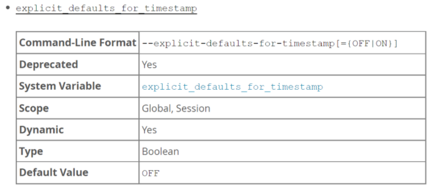

# 技术分享 | MySQL 的 TIMESTAMP 类型字段非空和默认值属性的影响

**原文链接**: https://opensource.actionsky.com/20211111-mysql/
**分类**: MySQL 新特性
**发布时间**: 2021-11-10T22:27:38-08:00

---

作者：刘晨
网名 bisal ，具有十年以上的应用运维工作经验，目前主要从事数据库应用研发能力提升方面的工作，Oracle ACE ，拥有 Oracle OCM &#038; OCP 、EXIN DevOps Master 、SCJP 等国际认证，国内首批 Oracle YEP 成员，OCMU 成员，《DevOps 最佳实践》中文译者之一，CSDN &#038; ITPub 专家博主，公众号&#8221;bisal的个人杂货铺&#8221;，长期坚持分享技术文章，多次在线上和线下分享技术主题。
本文来源：原创投稿
*爱可生开源社区出品，原创内容未经授权不得随意使用，转载请联系小编并注明来源。
前几天读了一篇文章《故障分析 | MySQL 迁移后 timestamp 列 cannot be null》，没想到这两天就碰到了相近的问题。
同事说他通过某款商业数据同步软件将一个 MySQL 5.7.28 的库同步到 MySQL 5.7.20 的库时，如果表中含有 TIMESTAMP 数据类型、缺省值为 current_timestamp 的字段，这些表的同步任务就都失败了，而另外的一些包含了 DATETIME 数据类型的表就同步成功了，不知道这是不是 MySQL 版本差异导致的？
不通过软件，直接手工创建，不会报错，模拟的 SQL ，如下所示，一个主键 id ，外加两个 timestamp 类型的字段，都设置了默认值，
`create table test(  
id int not null auto_increment,   
createtime timestamp null default current_timestamp,   
updatetime timestamp null default current_timestamp on update current_timestamp
);
`
同步软件报错的日志如下，提示为字段 updatetime 设置了无效的默认值，
`ERROR_GENERAL "Handling new table 'test'.'flow' failed execute create table statement failed, statement CREATE TABLE `test`.`test` ( `id` INT NOT NULL, `createtime` TIMESTAMP, `updatetime` TIMESTAMP ) COLLATE utf8_general_ci
RetCode: SQL_ERROR SqlState: HY000 NativeError: 1067 Message: [MySQL][ODBC 5.3(w) Driver][mysqld-5.7.20-log]Invalid default value for 'updatetime'
`
细致的同学，可能会注意到，日志中记录的 SQL 语句显示 createtime 和 updatetime 都只声明了 TIMESTAMP 类型，缺少了原始建表语句中的 NULL 和 DEFAULT 属性，这会有什么影响？
《故障分析 | MySQL 迁移后 timestamp 列 cannot be null》这篇文章其实介绍过，MySQL 中有个 explicit_defaults_for_timestamp 变量，他决定了 MySQL 是否为 TIMESTAMP 列的默认值和 NULL 值的处理启用某些非标准的行为：

https://dev.mysql.com/doc/refman/5.7/en/server-system-variables.html
如文档所说，如果 explicit_defaults_for_timestamp=OFF ，服务器会启用非标准行为，并按以下规则处理 TIMESTAMP 列：
(1) 没有明确使用NULL属性声明的TIMESTAMP列会自动使用NOT NULL属性声明。给这样的列分配一个NULL的值是允许的，并将该列设置为current timestamp。
(2) 表中的第一个TIMESTAMP列，如果没有明确地用NULL属性，DEFAULT属性或ON UPDATE属性声明，将自动用DEFAULT CURRENT_TIMESTAMP和ON UPDATE CURRENT_TIMESTAMP属性声明。
(3) 在第一个列之后的TIMESTAMP列，如果没有明确地用NULL属性或明确的DEFAULT属性来声明，就会自动声明为DEFAULT &#8216;0000-00-00 00:00:00&#8217;。对于插入的行，如果没有为该列指定明确的值，那么该列将被分配为&#8217;0000-00-00 00:00:00&#8217;，并且不会发生警告。根据是否启用了严格的SQL mode或包含NO_ZERO_DATE的SQL mode，默认值&#8217;0000-00-00 00:00:00&#8217;可能是不被允许的。
目标库 MySQL 5.7.20 的 explicit_defaults_for_timestamp 值是默认的 OFF ，结合上述规则，就可以模拟复现上述问题了。
虽然原始的建表语句中 TIMESTAMP 类型字段包含了 NULL 和 DEFAULT 属性，但是根据同步软件的错误提示，很明显，不知道什么原因，他在执行的时候忽略了这两个属性，导致真实的执行语句是：
`create table test(  id int not null,   createtime timestamp,   updatetime timestamp);
`
我们在客户端，执行上述 SQL ，就会得到相同的错误信息：
`SQL 错误 [1067] [42000]: Invalid default value for 'updatetime'
`
建表语句第一个 TIMESTAMP 类型字段是 createtime ，按照上述规则(1)，没有明确使用 NULL 属性声明的 TIMESTAMP 列会自动使用 NOT NULL 属性声明，按照上述规则(2)，表中的第一个 TIMESTAMP 列，如果没有明确地用 NULL 属性，DEFAULT 属性或 ON UPDATE 属性声明，将自动用 DEFAULT CURRENT_TIMESTAMP 和 ON UPDATE CURRENT_TIMESTAMP 属性声明，假设这个建表语句中只有一个 TIMESTAMP 类型字段 createtime ，他的结构会改成：

按照上述规则(3)，在第一个列之后的 TIMESTAMP 列，即此处的 updatetime ，如果没有明确地用 NULL 属性或明确的 DEFAULT 属性来声明，就会自动声明为 DEFAULT &#8216;0000-00-00 00:00:00&#8217;，但是这个 MySQL 5.7.20 的 sql_mode 变量包含了 NO_ZERO_DATE 规则，因此默认值&#8217;0000-00-00 00:00:00&#8217;不被允许，所以提示了错误：
`Invalid default value for 'updatetime'
`
我们能推断，如果表中存在两个及以上这种情况的 TIMESTAMP 类型字段，通过这个软件做同步，建表的时候，就会报错，这个可能是软件的一个 bug ，或者存在其他的配置控制，但就不在数据库的范畴了。
另外，多说一点，原始语句中 createtime 和 updatetime 列都指定了默认值，但还是设置 NULL 属性，这其实就有些矛盾了，或者说是设计上的不严谨，从规范设计开发的角度，还是应该避免的：
`create table test(  
id int not null auto_increment,   
createtime timestamp null default current_timestamp,   
updatetime timestamp null default current_timestamp on update current_timestamp
);
`
**P.S**: 按照同步软件能将 id 的 NOT NULL 属性带入来推测，如果 createtime 和 updatetime 显式设置 NOT NULL ，没准就能绕开上述问题，当然只是猜测。