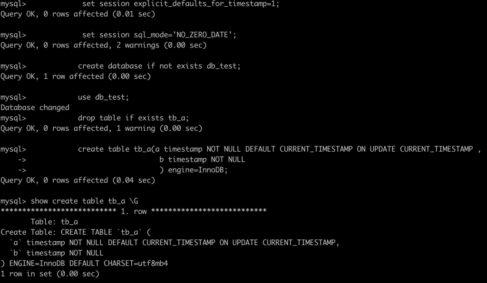
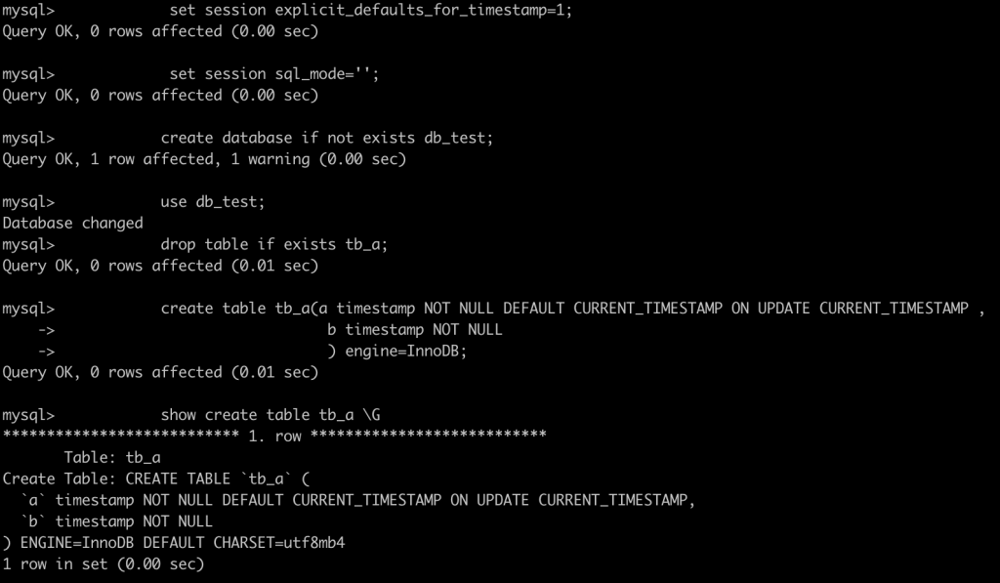
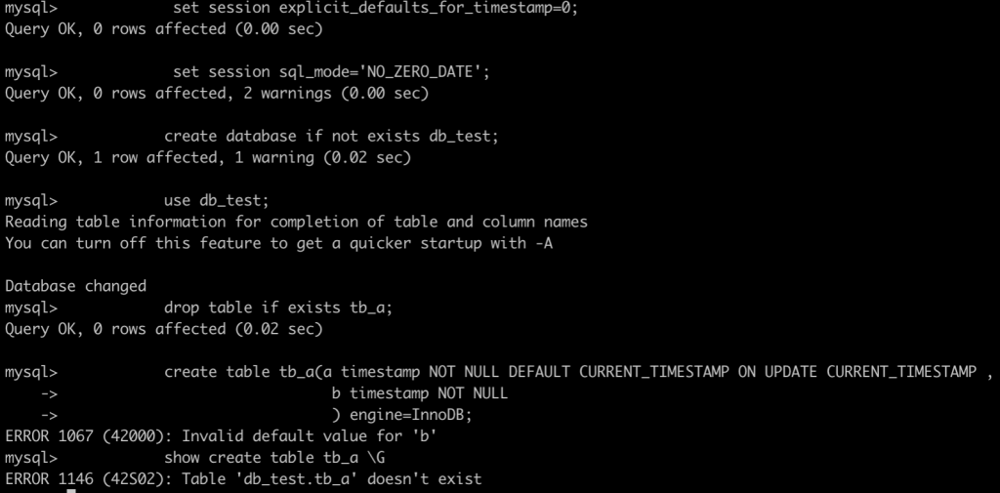
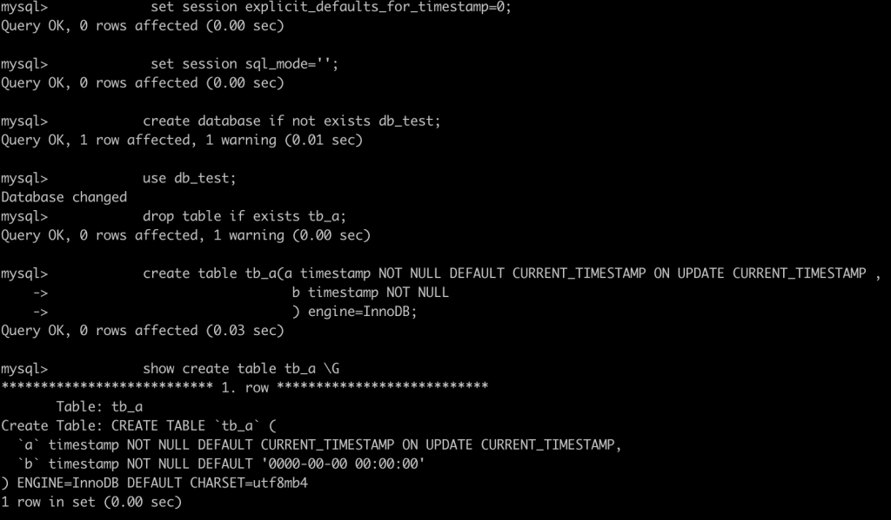

# 技术分享 | MySQL&#8211;测试&#8211;timestamp 字段默认值测试

**原文链接**: https://opensource.actionsky.com/20220928-timestamp/
**分类**: 技术干货
**发布时间**: 2022-10-09T00:46:06-08:00

---

作者：姚嵩
外星人&#8230;
本文来源：原创投稿
*爱可生开源社区出品，原创内容未经授权不得随意使用，转载请联系小编并注明来源。
#### 背景：
客户反馈表定义中含timestamp字段(SQL语句)，定义如下：
`b timestamp NOT NULL`在MySQL中执⾏后，变成如下：`b timestamp NOT NULL DEFAULT '0000-00-00 00:00:00'`
##### 想知道其原因，这⾥涉及到了两个技术点：
- MySQL如何给timestamp字段设置默认值。
- 00这种时间格式是否被允许。
##### MySQL 如何给 timestamp 字段设置默认值：
##### 涉及参数：
`explicit_defaults_for_timestamp`
##### 参数解析：
默认情况，启⽤`explicit_defaults_for_timestamp`，如果启⽤参数，表示禁⽌⾮标准⾏为，此时按如下⽅式处理timestamp列：
- 若要分配当前时间戳，只能设置列为`CURRENT_TIMESTAMP`或同义词NOW()，不能通过NULL。
- 没有使⽤NOT NULL属性显式声明的timestamp列将⾃动使⽤NULL属性声明并允许使⽤NULL值。
- 对于NOT NULL属性声明的timestamp列不允许使⽤NULL值。
- 使⽤了NOT NULL属性但未使⽤DEFAULT属性的timestamp会被认为没有默认值。
- `DEFAULT CURRENT_TIMESTAMP` 或者 `UPDATE CURRENT_TIMESTAMP` 属性不会被⾃动声明，只能显式指定。
- 表中第⼀个timestamp列的处理和其他timestamp列的处理⽅式并⽆不同。
如果禁⽤参数，表示开启了⾮标准⾏为，此时按如下⽅式处理timestamp列：
- 没有显式声明NULL属性的timestamp列将⾃动声明NOT NULL属性；并允许插⼊NULL值(8.0.22之前)，但会将该列设置设置为当前时间戳。
- 表中第⼀个timestamp列，如果没有显式声明NULL属性或者显式的DEFAULT属性或者ON UPDATE属性，则⾃动使⽤ `DEFAULT CURRENT_TIMESTAMP` 和 `ON UPDATE CURRENT_TIMESTAMP` 属性声明该列。
- 除第⼀个timestamp列以外的其他timestamp列，如果没有显式声明NULL属性或者显式的DEFAULT属性，则会⾃动声明为 `DEFAULT '0000-00-00 00:00:00'`(&#8220;zero&#8221;时间戳)。若sql_mode中包含了NO_ZERO_DATE，则默认值可能⽆效。
**zero时间戳是否被允许：**
- 通过sql_mode中的NO_ZERO_DATE值控制。
- 如果sql_mode中含NO_ZERO_DATE，则不允许 `'0000-00-00 00:00:00'`(&#8220;zero&#8221;时间戳) ，否则允许。
#### MySQL5.7.24测试：
##### 测试场景：
##### 建表语句：
create database if not exists db_test;
use db_test;
drop table if exists tb_a;
create table tb_a(a timestamp NOT NULL DEFAULT CURRENT_TIMESTAMP ON UPDATE CURRENT_TIMESTAMP
,
b timestamp NOT NULL
) engine=InnoDB;
show create table tb_a \G
#### 场景1：
set session explicit_defaults_for_timestamp=1;
set session sql_mode='NO_ZERO_DATE';
##### 测试截图1：
- 
##### 说明1：
因为`explicit_defaults_for_timestamp`值为1，并不会为timestamp字段设置默认值。
#### 场景2:
set session explicit_defaults_for_timestamp=1;
set session sql_mode='';
##### 测试截图2：

##### 说明2：
因为`explicit_defaults_for_timestamp`值为1，并不会为timestamp字段设置默认值。
#### 场景3:
set session explicit_defaults_for_timestamp=0;
set session sql_mode='NO_ZERO_DATE';
##### 测试截图3：
- 
##### 说明3:
因为`explicit_defaults_for_timestamp`值为0，且b字段不是第⼀个timestamp字段，没有显示声明NULL属性或DEFAULT属性，所以会赋予默认值 `'0000-00-00 00:00:00'`，⼜因为sql_mode中含NO_ZERO_DATE，不允许zero时间戳，所以报错：ERROR 1067 (42000): Invalid default value for &#8216;b&#8217;
#### 场景4:
set session explicit_defaults_for_timestamp=0;
set session sql_mode='';
##### 测试截图4:
- 
##### 说明4：
因为`explicit_defaults_for_timestamp`值为0，且b字段不是第⼀个timestamp字段，没有显示声明NULL属性或DEFAULT属性，所以会赋予默认值 `'0000-00-00 00:00:00'`。
#### 说明：
上面测试围绕客户场景设置，还有更多测试场景可供探索。不过还是建议：
explicit_defaults_for_timestamp=1
sql_mode含NO_ZERO_DATE