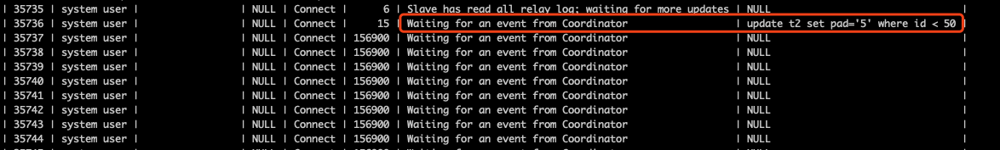
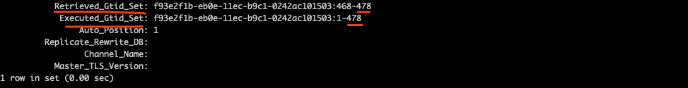
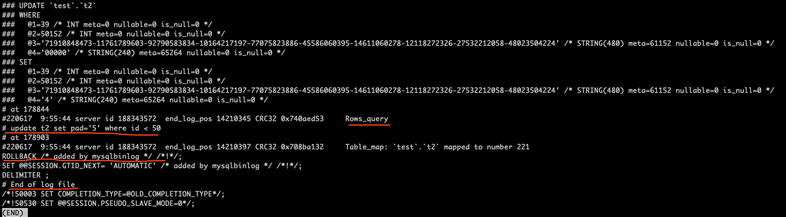
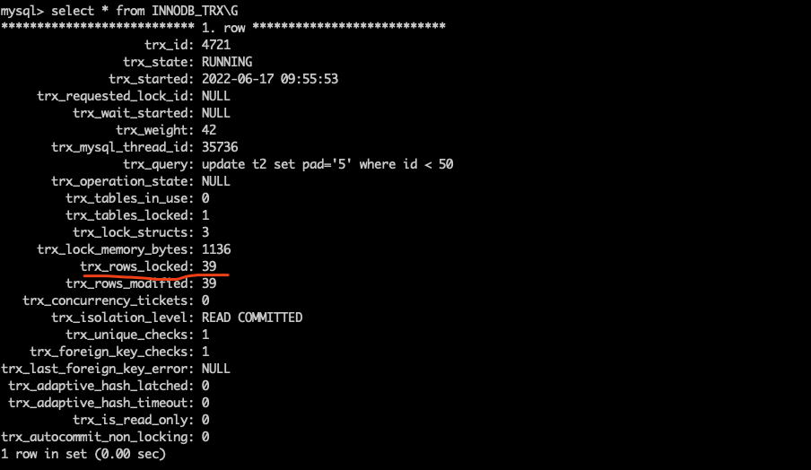
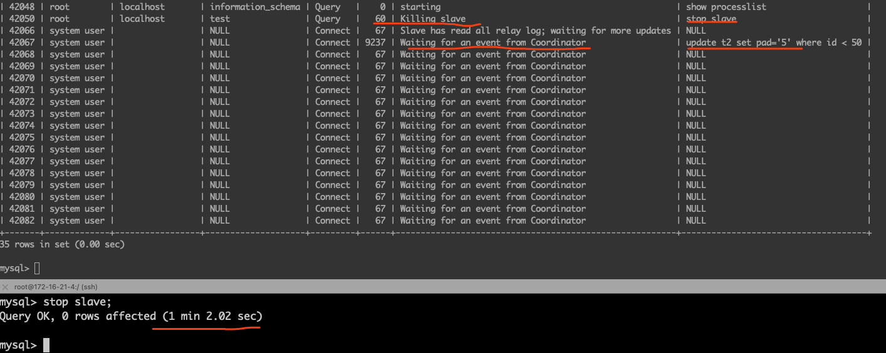

# 技术分享 | MySQL:从库复制半个事务会怎么样？

**原文链接**: https://opensource.actionsky.com/20220630-mysql/
**分类**: MySQL 新特性
**发布时间**: 2022-06-30T22:16:48-08:00

---

作者：胡呈清
爱可生 DBA 团队成员，擅长故障分析、性能优化，个人博客：https://www.jianshu.com/u/a95ec11f67a8，欢迎讨论。
本文来源：原创投稿
*爱可生开源社区出品，原创内容未经授权不得随意使用，转载请联系小编并注明来源。
#### 复制异常
在复制过程中，主库发生故障或者网络中断，都会造成 slave io thread 中断，就有可能出现从库只复制了半个事务的情况。比如主库执行的事务如下：
begin;insert 1;insert 2;commit;
从库接收的 binlog 可能只包含事务的一部分，比如：
- 情况1：只包含 begin;
- 情况2：只包含 begin;insert 1;
- 情况3：只包含 begin;insert 1;insert 2;
从库的 slave sql thread 回放完这部分 binlog 后，会等待 slave io thread 从主库读取剩余的 binlog，而在此之前 sql 线程回放这半个事务，就和我们手工执行半个事务一样，不会提交也不会回滚。
我们应该如何应对这种异常呢？
- 当 slave io thread 恢复，应该做什么？
- 当 slave io thread 无法恢复，应该做什么？
#### 实验过程
测试方法：
##1. 在从库上用 tc 模拟网络延迟，意在使读取 binlog 的速度变慢tc qdisc add dev eth0 root netem delay 3000ms 3000ms 100%##2. 在主库执行一个多语句事务begin;update t2 set pad='4' where id < 40;update t2 set pad='5' where id < 50;update t2 set pad='6' where id < 60;commit;##3. 在主库执行 commit 成功后，立刻用 iptables 切断主从之间的网络iptables -A OUTPUT -d 172.16.21.4 -j DROPiptables -A INPUT -s 172.16.21.4 -j DROP
这样我们可以在从库上观察到的现象为：
- 其中一个 worker 线程状态是`Waiting for an event from Coordinator`，这个状态说明 work 线程已经干完活在等 Coordinator （协调线程）分配新的 relay log event ，但同时又显示它正在执行`update t2 set pad='5' where id < 50`，这是矛盾1：

- `show slave status`输出中，`Retrieved_Gtid_Set`与`Executed_Gtid_Set`相等（意味着sql线程已经回放完所有的relay log），但是上图 worker 线程又正在回放SQL ，这是矛盾2：

最后我们通过 relay log 实锤，可以看到这个事务的 relay log 并不完整，到`update t2 set pad='5' where id < 50`; 这个`Rows_query event`就结束了：

#### 当 slave io thread 无法恢复
如果 slave io thread 长时间不能恢复，那么 sql 线程会因为等不到剩余的 binlog，一直无法提交或回滚，会一直持有这个事务的锁：

如果是主库故障导致的 slave io thread 异常，那很可能会进行主从切换，这个从库提升为主后，SQL线程持有的事务锁可能会阻塞业务请求。
此时应该 stop slave 停止 sql 线程，让事务回滚释放锁。需要注意的是：此情况下 stop slave 会等待 60 秒（等 slave io thread 接收事务剩余的binlog），60秒超时后才会停止 sql 线程：

#### 当 slave io thread 恢复
slave io thread 异常中断后，sql 线程是正常工作的，sql 线程执行了部分事务，并且会等待 io 线程发送新的 binlog。slave io thread 线程恢复后，如果是基于 GTID 的复制，会从当前 GTID 事务开始重新获取完整的 binlog，从库会先回滚当前事务，然后再重新回放新收到的 binlog。