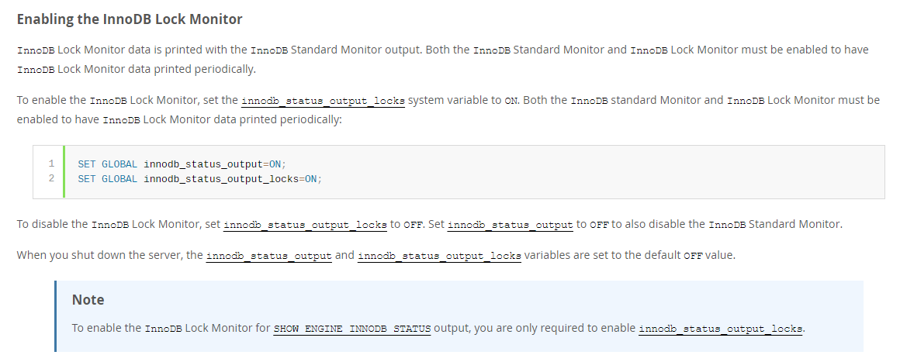

# 技术分享 | MySQL中查询会锁表 ?

**原文链接**: https://opensource.actionsky.com/20210607-mysql/
**分类**: MySQL 新特性
**发布时间**: 2021-06-07T22:40:20-08:00

---

作者：刘晨
网名 bisal ，具有十年以上的应用运维工作经验，目前主要从事数据库应用研发能力提升方面的工作，Oracle ACE ，拥有 Oracle OCM &#038; OCP、EXIN DevOps Master 、SCJP 等国际认证，国内首批 Oracle YEP 成员，OCMU 成员，《DevOps 最佳实践》中文译者之一，CSDN &#038; ITPub 专家博主，公众号&#8221;bisal的个人杂货铺&#8221;，长期坚持分享技术文章，多次在线上和线下分享技术主题。
本文来源：原创投稿
*爱可生开源社区出品，原创内容未经授权不得随意使用，转载请联系小编并注明来源。
我们知道，Oracle 中除了使用 select &#8230; for update ，其他查询语句不会出现锁，即没有读锁，读一致性通过多版本解决的，可以保证在不加锁的情况下，读到同一时间的数据。
前两天同事在微信群推了一篇文章，大概意思就是通过使用 insert into select 做了数据的备份，导致了 select 的表锁住，进而影响了正常的使用。
问题来了，Oracle 中执行的 insert into select 很正常，不会出现锁表，难道相同的语句用在了 MySQL ，就会锁住整张表？
我们能进行验证，MySQL 5.7 中执行如下语句，会出现什么现象？
`insert into test_1 select * from test_2;
`
test_1 和 test_2 定义如下，test_1 存在五条记录，
`​mysql> show create table test_1\G;
*************************** 1. row ***************************
Table: test_1
Create Table: CREATE TABLE `test_1` (
`id` int(11) NOT NULL,
`name` varchar(10) NOT NULL,
PRIMARY KEY (`id`)
) ENGINE=InnoDB DEFAULT CHARSET=utf8mb4
1 row in set (0.04 sec)
​
mysql> show create table test_2\G;
*************************** 1. row ***************************
Table: test_2
Create Table: CREATE TABLE `test_2` (
`id` int(11) NOT NULL,
`name` varchar(10) NOT NULL
) ENGINE=InnoDB DEFAULT CHARSET=utf8mb4
1 row in set (0.01 sec)
​
mysql> select * from test_1;
+----+--------+
| id | name   |
+----+--------+
|  1 | test_1 |
|  2 | test_2 |
|  3 | test_3 |
|  4 | test_4 |
|  5 | test_5 |
+----+--------+
5 rows in set (0.01 sec)
`
默认情况下，show engine innodb status 显示的锁信息很有限，可以开启锁监控，如果仅需要在 show engine innodb status 显示具体的锁，可以仅打开 innodb_status_output_locks，

该参数的默认值 OFF ，而且只可以在全局层面打开，
`​mysql> show variables like 'innodb_status_output_locks';
+----------------------------+-------+
| Variable_name              | Value |
+----------------------------+-------+
| innodb_status_output_locks | OFF   |
+----------------------------+-------+
1 row in set (0.44 sec)
​
mysql> set global innodb_status_output_locks=on;
Query OK, 0 rows affected (0.02 sec)
​
mysql> show variables like 'innodb_status_output_locks';
+----------------------------+-------+
| Variable_name              | Value |
+----------------------------+-------+
| innodb_status_output_locks | ON    |
+----------------------------+-------+
1 row in set (0.01 sec)
`
在会话 1 中，开启一个事务，将 test_1 的 name=&#8217;test_1&#8242; 这行记录导入 test_2 ，
`mysql> begin;
Query OK, 0 rows affected (0.00 sec)
​
mysql> insert into test_2 select * from test_1 where name = 'test_1';
Query OK, 1 row affected (0.00 sec)
Records: 1  Duplicates: 0  Warnings: 0
`
查看锁的信息，可以看到，有五个 record lock ，虽然我只从 test_1 读取一行数据，但实际上对 test_1 的所有记录都加了锁，而且显式对 test_1 加了一个 IS 的意向锁，因此这种操作，确实影响了 select 表的并发执行，
`mysql> show engine innodb status \G;
...
------------
TRANSACTIONS
------------
Trx id counter 3255
Purge done for trx's n:o 
## 解决方案 1 ，创建索引
我们为列 name 创建一个索引，
`mysql> alter table test_1 add index idx_test_1_01 (name);
Query OK, 0 rows affected (0.18 sec)
Records: 0  Duplicates: 0  Warnings: 0
`
再次开启事务，
`mysql> begin;
Query OK, 0 rows affected (0.00 sec)
​
mysql> insert into test_2 select * from test_1 where name = 'test_1';
Query OK, 1 row affected (0.00 sec)
Records: 1  Duplicates: 0  Warnings: 0
`
此时看下锁，这次没对 test_1 加任何的锁，只是对'test_1'这行记录加了共享锁(lock mode S locks gap before rec)，其实是加到了索引上，
`
​mysql> show engine innodb status \G;
...
------------
TRANSACTIONS
------------
Trx id counter 3268
Purge done for trx's n:o 
## 解决方案2：更改隔离级别
在创建索引前，之所以会出现锁表的情况，和隔离级别是相关的，首先看下数据库的隔离级别。ISO 和 ANSI SQL 标准制定了 4 种事务隔离级别的标准，包括如下，
Read Uncommitted
Read Committed
Repeatable Read
Serializable
然而不是所有的数据库厂商都遵循这些标准，例如 Oracle 不支持 RU 和 RR ，MySQL 则支持所有级别。Oracle 默认隔离级别是 RC ，MySQL 默认隔离级别是 RR 。
P.S. 
https://dev.mysql.com/doc/refman/5.7/en/innodb-transaction-isolation-levels.html
RR 和 RC 下，InnoDB 引擎都提供了一致性的非锁定读，即通过多版本控制的方式来读取当前时刻的行数据，从技术实现上，MySQL 和 Oracle 是很相像的，都是通过回滚段来实现的 MVCC (Multi Version Concurrency Control)，每行都可能有多个版本，即多个快照数据，避免对读加锁，提高读的并发。
比较一下 RR 和 RC ，最大的区别是两者对快照数据的定义不同，RR 模式下读取的是事务开始时的行快照数据，RC 模式下读取的则是该行最新的一份快照数据，我们通过实验，来看下这是什么意思。
如果是 RR 模式，模拟如下两个事务的操作。
T1 时刻，
会话 1 ，
`mysql> begin;
Query OK, 0 rows affected (0.00 sec)
​
mysql> select * from test_1 where id=5;
+----+--------+
| id | name   |
+----+--------+
|  5 | test_5 |
+----+--------+
1 row in set (0.01 sec)
`
T2 时刻，
会话 2 ，
`mysql> begin;
Query OK, 0 rows affected (0.00 sec)
​
mysql> update test_1 set name='test_6' where id=5;
Query OK, 1 row affected (0.00 sec)
Rows matched: 1  Changed: 1  Warnings: 0
`
T3 时刻，
会话 1 ，
`mysql> select * from test_1 where id=5;
+----+--------+
| id | name   |
+----+--------+
|  5 | test_5 |
+----+--------+
1 row in set (0.01 sec)
`
T4 时刻，
会话 2 ，
`mysql> commit;
Query OK, 0 rows affected (0.01 sec)
`
T5 时刻，
会话 1 ，
`mysql> select * from test_1 where id=5;
+----+--------+
| id | name   |
+----+--------+
|  5 | test_5 |
+----+--------+
1 row in set (0.01 sec)
`
可以看到，无论在会话 2 的事务中 id=5 的记录如何改动，会话 1 的事务中，id=5 的记录值，都和事务开始时的值相同。
更改为 RC 模式，模拟如下两个事务的操作。
在两个会话中，都执行这个操作，
`mysql> set session transaction_isolation='read-committed';
Query OK, 0 rows affected (0.00 sec)
`
T1 时刻，
会话 1 ，
`mysql> begin;
Query OK, 0 rows affected (0.00 sec)
​
mysql> select * from test_1 where id=5;
+----+--------+
| id | name   |
+----+--------+
|  5 | test_5 |
+----+--------+
1 row in set (0.00 sec)
`
T2 时刻，
会话 2 ，
`mysql> begin;
Query OK, 0 rows affected (0.00 sec)
​
mysql> update test_1 set name='test_6' where id=5;
Query OK, 1 row affected (0.00 sec)
Rows matched: 1  Changed: 1  Warnings: 0
`
T3 时刻，
会话 1 ，
`mysql> select * from test_1 where id=5;
+----+--------+
| id | name   |
+----+--------+
|  5 | test_5 |
+----+--------+
1 row in set (0.00 sec)
`
T4 时刻，
会话 2 ，
`mysql> commit;
Query OK, 0 rows affected (0.01 sec)
`
T5 时刻，
会话 1 ，
`mysql> select * from test_1 where id=5;
+----+--------+
| id | name   |
+----+--------+
|  5 | test_6 |
+----+--------+
1 row in set (0.00 sec)
`
可以看到，在会话 2 的事务中改动 id=5 的值，在会话1的事务中得到了体现。
因此，RR 模式下读取的是事务开始时的行快照数据，RC 模式下读取的则是该行最新的一份快照数据。
如果隔离级别是 RC ，执行如上 insert into select 操作，
`mysql> show variables like '%transaction_isolation%';
+-----------------------+----------------+
| Variable_name         | Value          |
+-----------------------+----------------+
| transaction_isolation | READ-COMMITTED |
+-----------------------+----------------+
1 row in set (0.00 sec)
​
mysql> begin;
Query OK, 0 rows affected (0.00 sec)
​
mysql> insert into test_2 select * from test_1 where name = 'test_1';
Query OK, 1 row affected (0.00 sec)
Records: 1  Duplicates: 0  Warnings: 0
`
此时看下锁信息，能看到 test_2 上是没有任何锁，因此不会出现 RR 会锁定 test_2 的情况，
`mysql> show engine innodb status \G;
...
------------
TRANSACTIONS
------------
Trx id counter 3269
Purge done for trx's n:o 
从语义上讲，RC 模式，其实破坏了 ACID 中的 I ，因为两个事务并未做到真正的隔离。而在 RR 模式，虽然两个事务做到了真正的隔离，但实际通过加锁，还是会产生一些问题的，因此隔离级别的选择，其实还是一种权衡的。