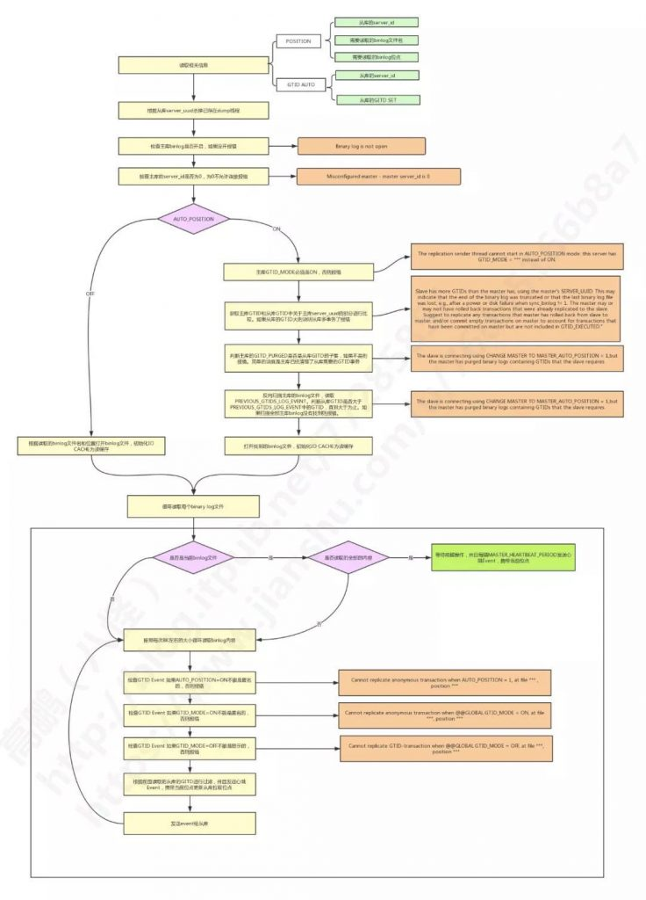

# 技术分享 | MySQL：产生大量小 relay log 的故障一例

**原文链接**: https://opensource.actionsky.com/20191017-mysql/
**分类**: MySQL 新特性
**发布时间**: 2019-10-17T00:38:27-08:00

---

> **作者：****高鹏**文章末尾有他著作的《深入理解 MySQL 主从原理 32 讲》，深入透彻理解 MySQL 主从，GTID 相关技术知识。源码版本：5.7.22
水平有限，如有误请谅解
**本文建议横屏观看，效果更佳。**
**一、案例来源和现象**这个案例是朋友 @peaceful 遇到的线上问题，最终线索也是他自己找到的。现象如下：**1、出现了大量很小的 relay log 如下，堆积量大约 2600 个：**- `...`
- `-rw-r----- 1 mysql dba    12827 Oct 11 12:28 mysql-relay-bin.036615`
- `-rw-r----- 1 mysql dba     4908 Oct 11 12:28 mysql-relay-bin.036616`
- `-rw-r----- 1 mysql dba     1188 Oct 11 12:28 mysql-relay-bin.036617`
- `-rw-r----- 1 mysql dba     5823 Oct 11 12:29 mysql-relay-bin.036618`
- `-rw-r----- 1 mysql dba      507 Oct 11 12:29 mysql-relay-bin.036619`
- `-rw-r----- 1 mysql dba     1188 Oct 11 12:29 mysql-relay-bin.036620`
- `-rw-r----- 1 mysql dba     3203 Oct 11 12:29 mysql-relay-bin.036621`
- `-rw-r----- 1 mysql dba    37916 Oct 11 12:30 mysql-relay-bin.036622`
- `-rw-r----- 1 mysql dba      507 Oct 11 12:30 mysql-relay-bin.036623`
- `-rw-r----- 1 mysql dba     1188 Oct 11 12:31 mysql-relay-bin.036624`
- `-rw-r----- 1 mysql dba     4909 Oct 11 12:31 mysql-relay-bin.036625`
- `-rw-r----- 1 mysql dba     1188 Oct 11 12:31 mysql-relay-bin.036626`
- `-rw-r----- 1 mysql dba      507 Oct 11 12:31 mysql-relay-bin.036627`
- `-rw-r----- 1 mysql dba      507 Oct 11 12:32 mysql-relay-bin.036628`
- `-rw-r----- 1 mysql dba     1188 Oct 11 12:32 mysql-relay-bin.036629`
- `-rw-r----- 1 mysql dba      454 Oct 11 12:32 mysql-relay-bin.036630`
- `-rw-r----- 1 mysql dba     6223 Oct 11 12:32 mysql-relay-bin.index`
**2、主库错误日志有如下错误**
- `2019-10-11T12:31:26.517309+08:00 61303425 [Note] While initializing dump thread for slave with UUID <eade0d03-ad91-11e7-8559-c81f66be1379>, found a zombie dump thread with the same UUID. Master is killing the zombie dump thread(61303421).`
- `2019-10-11T12:31:26.517489+08:00 61303425 [Note] Start binlog_dump to master_thread_id(61303425) slave_server(19304313), pos(, 4)`
- `2019-10-11T12:31:44.203747+08:00 61303449 [Note] While initializing dump thread for slave with UUID <eade0d03-ad91-11e7-8559-c81f66be1379>, found a zombie dump thread with the same UUID. Master is killing the zombie dump thread(61303425).`
- `2019-10-11T12:31:44.203896+08:00 61303449 [Note] Start binlog_dump to master_thread_id(61303449) slave_server(19304313), pos(, 4)`
**二、slave_net_timeout 参数分析**实际上第一眼看这个案例我也觉得很奇怪，因为很少有人会去设置 slave_net_timeout 参数，同样我们也没有设置过，因此关注较少。但是 @peaceful 自己找到了可能出现问题的设置就是当前从库 slave_net_timeout 参数设置为 10。我就顺着这个线索往下分析，我们先来看看 slave_net_timeout 参数的功能。
当前看来从库的 slave_net_timeout 有如下两个功能：- 1. 设置 IO 线程在空闲情况下（没有 Event 接收的情况下）的连接超时时间。
这个参数 5.7.7 过后是 60 秒，以前是 3600 秒，修改后需要重启主从才会生效。- 2. 如果 change master 没有指定 MASTER_HEARTBEAT_PERIOD 的情况下会设置为 slave_net_timeout/2
一般我们配置主从都没有去指定这个心跳周期，因此就是 slave_net_timeout/2，它控制的是如果在主库没有 Event 产生的情况下，多久发送一个心跳 Event 给从库的 IO 线程，用于保持连接。但是一旦我们配置了主从（change master）这个值就定下来了，不会随着 slave_net_timeout 参数的更改而更改，我们可以在 slave_master_info 表中找到相应的设置如下：
- `mysql> select Heartbeat from slave_master_info \G`
- `*************************** 1. row ***************************`
- `Heartbeat: 30`
- `1 row in set (0.01 sec)`
如果我们要更改这个值只能重新 change master 才行。
**三、原因总结**
如果满足下面三个条件，将会出现案例中的故障：
- 主从中的 MASTER_HEARTBEAT_PERIOD 的值大于从库 slave_net_timeout
- 主库当前压力很小持续 slave_net_timeout 设置时间没有产生新的 Event
- 之前主从有一定的延迟
那么这种情况下在主库心跳 Event 发送给从库的IO线程之前，IO 线程已经断开了。断开后 IO 线程会进行重连，每次重连将会生成新的 relay log，但是这些 relay log 由于延迟问题不能清理就出现了案例中的情况。
下面是官方文档中关于这部分说明：
- `If you are logging master connection information to tables, MASTER_HEARTBEAT_PERIOD can be seen`
- `as the value of the Heartbeat column of the mysql.slave_master_info table.`
- `Setting interval to 0 disables heartbeats altogether. The default value for interval is equal to the`
- `value of slave_net_timeout divided by 2.`
- `Setting @@global.slave_net_timeout to a value less than that of the current heartbeat interval`
- `results in a warning being issued. The effect of issuing RESET SLAVE on the heartbeat interval is to`
- `reset it to the default value.`
**四、案例模拟**有了理论基础就很好了模拟了，延迟这一点我模拟的时候关闭了从库的 SQL 线程来模拟 relay log 积压的情况，因为这个案例和 SQL 线程没有太多的关系。提前配置好主从，查看当前的心跳周期和 slave_net_timeout 参数如下：- `mysql> show variables like '%slave_net_timeout%';`
- `+-------------------+-------+`
- `| Variable_name     | Value |`
- `+-------------------+-------+`
- `| slave_net_timeout | 60    |`
- `+-------------------+-------+`
- `1 row in set (0.01 sec)`
- 
- `mysql> select Heartbeat from slave_master_info \G`
- `*************************** 1. row ***************************`
- `Heartbeat: 30`
- `1 row in set (0.00 sec)`
**1、停止从库的 SQL 线程**stop slave sql_thread;
**2、设置 slave_net_timeout 为 10**
- `mysql> set global slave_net_timeout=10;`
- `Query OK, 0 rows affected, 1 warning (0.00 sec)`
- 
- `mysql> show warnings;`
- `+---------+------+-----------------------------------------------------------------------------------------------------------------------------------------------------------------+`
- `| Level   | Code | Message                                                                                                                                                         |`
- `+---------+------+-----------------------------------------------------------------------------------------------------------------------------------------------------------------+`
- `| Warning | 1704 | The requested value for the heartbeat period exceeds the value of `slave_net_timeout' seconds. A sensible value for the period should be less than the timeout. |`
- `+---------+------+-----------------------------------------------------------------------------------------------------------------------------------------------------------------+`
- `1 row in set (0.00 sec)`
可以看到这里实际上已经有一个警告了。
**3、重启 IO 线程**这样才会让 slave_net_timeout 参数生效- `mysql> stop slave ;`
- `Query OK, 0 rows affected (0.01 sec)`
- 
- `mysql> start slave io_thread;`
- `Query OK, 0 rows affected (0.01 sec)`
**4、观察现象**
大概每 10 秒会生成一个 relay log 文件如下：- `-rw-r----- 1 mysql mysql        500 2019-09-27 23:48:32.655001361 +0800 relay.000142`
- `-rw-r----- 1 mysql mysql        500 2019-09-27 23:48:42.943001355 +0800 relay.000143`
- `-rw-r----- 1 mysql mysql        500 2019-09-27 23:48:53.293001363 +0800 relay.000144`
- `-rw-r----- 1 mysql mysql        500 2019-09-27 23:49:03.502000598 +0800 relay.000145`
- `-rw-r----- 1 mysql mysql        500 2019-09-27 23:49:13.799001357 +0800 relay.000146`
- `-rw-r----- 1 mysql mysql        500 2019-09-27 23:49:24.055001354 +0800 relay.000147`
- `-rw-r----- 1 mysql mysql        500 2019-09-27 23:49:34.280001827 +0800 relay.000148`
- `-rw-r----- 1 mysql mysql        500 2019-09-27 23:49:44.496001365 +0800 relay.000149`
- `-rw-r----- 1 mysql mysql        500 2019-09-27 23:49:54.789001353 +0800 relay.000150`
- `-rw-r----- 1 mysql mysql        500 2019-09-27 23:50:05.485001371 +0800 relay.000151`
- `-rw-r----- 1 mysql mysql        500 2019-09-27 23:50:15.910001430 +0800 relay.000152`
大概每 10 秒主库的日志会输出如下日志：- `2019-10-08T02:27:24.996827+08:00 217 [Note] While initializing dump thread for slave with UUID <010fde77-2075-11e9-ba07-5254009862c0>, found a zombie dump thread with the same UUID. Master is killing the zombie dump thread(216).`
- `2019-10-08T02:27:24.998297+08:00 217 [Note] Start binlog_dump to master_thread_id(217) slave_server(953340), pos(, 4)`
- `2019-10-08T02:27:35.265961+08:00 218 [Note] While initializing dump thread for slave with UUID <010fde77-2075-11e9-ba07-5254009862c0>, found a zombie dump thread with the same UUID. Master is killing the zombie dump thread(217).`
- `2019-10-08T02:27:35.266653+08:00 218 [Note] Start binlog_dump to master_thread_id(218) slave_server(953340), pos(, 4)`
- `2019-10-08T02:27:45.588074+08:00 219 [Note] While initializing dump thread for slave with UUID <010fde77-2075-11e9-ba07-5254009862c0>, found a zombie dump thread with the same UUID. Master is killing the zombie dump thread(218).`
- `2019-10-08T02:27:45.589814+08:00 219 [Note] Start binlog_dump to master_thread_id(219) slave_server(953340), pos(, 4)`
- `2019-10-08T02:27:55.848558+08:00 220 [Note] While initializing dump thread for slave with UUID <010fde77-2075-11e9-ba07-5254009862c0>, found a zombie dump thread with the same UUID. Master is killing the zombie dump thread(219).`
- `2019-10-08T02:27:55.849442+08:00 220 [Note] Start binlog_dump to master_thread_id(220) slave_server(953340), pos(, 4)`
这个日志就和案例中的一模一样了。
**解决问题**知道原因后解决也就很简单了我们只需设置 slave_net_timeout 参数为 MASTER_HEARTBEAT_PERIOD 的 2 倍就可以了，设置后重启主从即可。
**五、实现方式**
这里我们将通过简单的源码调用分析来看看到底 slave_net_timeout 参数和 MASTER_HEARTBEAT_PERIOD 对主从的影响。
**1、从库使用参数 slave_net_timeout**从库IO线程启动时候会通过参数 slave_net_timeout 设置超时：
- `->connect_to_master`
- `  -> mysql_options`
- 
- `case MYSQL_OPT_CONNECT_TIMEOUT: //MYSQL_OPT_CONNECT_TIMEOUT`
- `    mysql->options.connect_timeout= *(uint*) arg;`
- `    break;`
而在建立和主库的连接时候会使用这个值- `connect_to_master`
- ` ->mysql_real_connect`
- `   -> get_vio_connect_timeout`
- 
- `timeout_sec= mysql->options.connect_timeout;`
因此我们也看到了 slave_net_timeout 参数只有在 IO 线程重启的时候才会生效
**2、从库设置 MASTER_HEARTBEAT_PERIOD 值**在每次使用从库 change master 时候会设置这个值如下，默认为 slave_net_timeout/2：- `->change_master`
- `  ->change_receive_options`
- 
- 
- `    mi->heartbeat_period= min<float>(SLAVE_MAX_HEARTBEAT_PERIOD,`
- `                                     (slave_net_timeout/2.0f));`
因此我们看到只有 change master 才会重新设置这个值，重启主从是不会重新设置的。
**3、使用 MASTER_HEARTBEAT_PERIOD 值**
每次 IO 线程启动时候会将这个值传递给主库的 DUMP 线程，方式应该是通过构建语句 SET @masterheartbeatperiod 来完成的。如下：- `->handle_slave_io`
- ` ->get_master_version_and_clock`
- 
- 
- `if (mi->heartbeat_period != 0.0)`
- `  {`
- `    char llbuf[22];`
- `    const char query_format[]= "SET @master_heartbeat_period= %s";`
- `    char query[sizeof(query_format) - 2 + sizeof(llbuf)];`
主库启动 DUMP 线程的时候会通过搜索的方式找到这个值如下- ` ->Binlog_sender::init`
- `   ->Binlog_sender::init_heartbeat_period`
- 
- `user_var_entry *entry=`
- `    (user_var_entry*) my_hash_search(&m_thd->user_vars, (uchar*) name.str,`
- `                                     name.length);`
- `  m_heartbeat_period= entry ? entry->val_int(&null_value) : 0;`
**4、DUMP 线程使用 MASTER_HEARTBEAT_PERIOD 发送心跳 Event**这里主要是通过一个超时等待来完成，如下：- `->Binlog_sender::wait_new_events`
- `  ->Binlog_sender::wait_with_heartbeat`
- 
- 
- `set_timespec_nsec(&ts, m_heartbeat_period); //心跳超时`
- `    ret= mysql_bin_log.wait_for_update_bin_log(m_thd, &ts);//等待`
- `    if (ret != ETIMEDOUT && ret != ETIME) //如果是正常收到则收到信号，说明有新的Event到来，否则如果是超时则发送心跳Event`
- `      break; //正常返回0 是超时返回ETIMEDOUT 继续循环`
- 
- `      if (send_heartbeat_event(log_pos)) //发送心跳Event`
- `        return 1;`
**5、重连会杀掉可能的存在的 DUMP 线程**根据 UUID 进行比对如下：- `->kill_zombie_dump_threads`
- 
- 
- `Find_zombie_dump_thread find_zombie_dump_thread(slave_uuid);`
- `THD *tmp= Global_THD_manager::get_instance()->`
- `                                find_thd(&find_zombie_dump_thread);`
- `  if (tmp)`
- `  {`
- `    /*`
- `      Here we do not call kill_one_thread() as`
- `      it will be slow because it will iterate through the list`
- `      again. We just to do kill the thread ourselves.`
- `    */`
- `    if (log_warnings > 1)`
- `    {`
- `      if (slave_uuid.length())`
- `      {`
- `        sql_print_information("While initializing dump thread for slave with "`
- `                              "UUID <%s>, found a zombie dump thread with the "`
- `                              "same UUID. Master is killing the zombie dump "`
- `                              "thread(%u).", slave_uuid.c_ptr(),`
- `                              tmp->thread_id());`
- `      }//这里就是本案例中的日志了`
- `.....`
这里我们看到了案例中的日志。
**6、关于 DUMP 线程流程图**
最后给出一张来自我《 MySQL 主从原理 32 讲》第 17 节中 DUMP 线程的流程图如下：
											
最后推荐高鹏的专栏《深入理解 MySQL 主从原理 32 讲》，想要透彻了解学习 MySQL 主从原理的朋友不容错过。
作者微信：gp_22389860
											
**社区近期动态**
**No.1**
**10.26 DBLE 用户见面会 北京站**
											
爱可生开源社区将在 2019 年 10 月 26 日迎来在北京的首场 DBLE 用户见面会，以线下**互动分享**的会议形式跟大家见面。
时间：10月26日 9:00 &#8211; 12:00 AM
地点：HomeCafe 上地店（北京市海淀区上地二街一号龙泉湖酒店对面）
重要提醒：
1. 同日下午还有 dbaplus 社群举办的沙龙：聚焦数据中台、数据架构与优化。
2. 爱可生开源社区会在每年10.24日开源一款高质量产品。本次在 dbaplus 沙龙会议上，爱可生的资深研发工程师闫阿龙，将为大家带来《金融分布式事务实践及txle概述》，并在现场开源。
**No.2**
**「3306π」成都站 Meetup**
知数堂将在 2019 年 10 月 26 日在成都举办线下会议，本次会议中邀请了五位数据库领域的资深研发/DBA进行主题分享。
时间：2019年10月26日 13:00-18:00
地点：成都市高新区天府三街198号腾讯成都大厦A座多功能厅
**No.3**
**Mycat 问题免费诊断**
诊断范围支持：
Mycat 的故障诊断、源码分析、性能优化
服务支持渠道：
- 技术交流群，进群后可提问
QQ群（669663113）
- 社区通道，邮件&电话
osc@actionsky.com
- 现场拜访，线下实地，1天免费拜访
关注“爱可生开源社区”公众号，回复关键字“Mycat”，获取活动详情。
**No.4**
**社区技术内容征稿**
征稿内容：
- 格式：.md/.doc/.txt
- 主题：MySQL、分布式中间件DBLE、数据传输组件DTLE相关技术内容
- 要求：原创且未发布过
- 奖励：作者署名；200元京东E卡+社区周边
投稿方式：
- 邮箱：osc@actionsky.com
- 格式：[投稿]姓名+文章标题
- 以附件形式发送，正文需注明姓名、手机号、微信号，以便小编及时联系