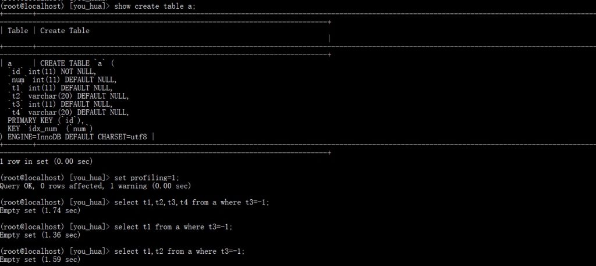
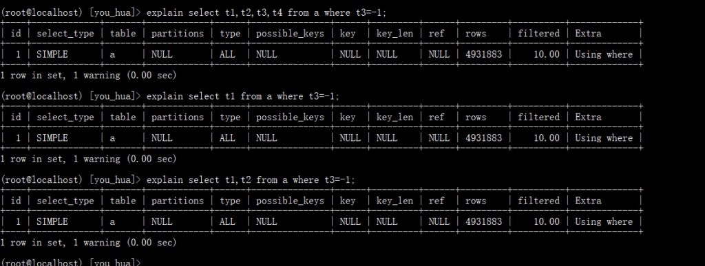
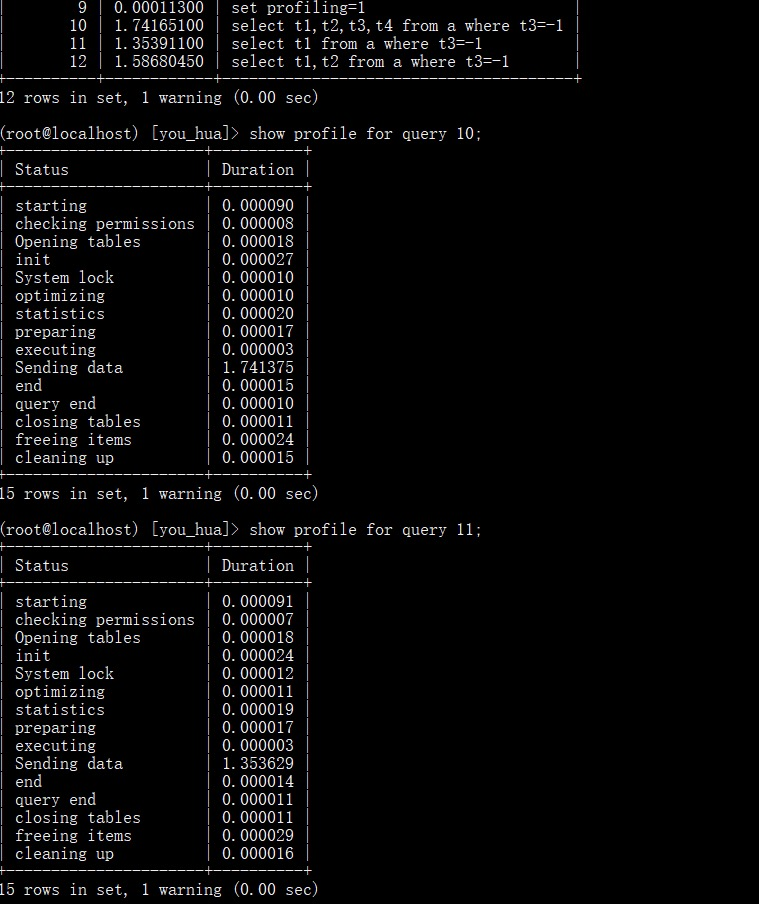
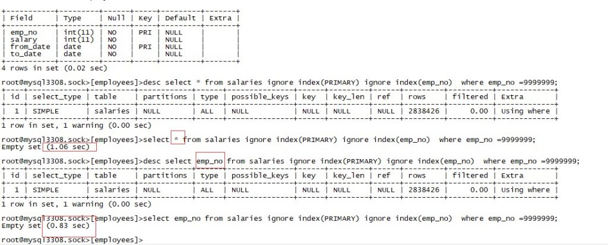

# 技术分享 | MySQL：查询字段数量多少对查询效率的影响

**原文链接**: https://opensource.actionsky.com/20191230-mysql/
**分类**: MySQL 新特性
**发布时间**: 2019-12-30T01:16:51-08:00

---

> **作者：****高鹏**
************文章末尾有他著作的《深入理解 MySQL 主从原理 32 讲》，深入透彻理解 MySQL 主从，GTID 相关技术知识。
这个问题是最近一个朋友问我的。刚好就好好看了一下，留下这样的记录。本文给出一些函数接口，末尾给出一些调用堆栈，为感兴趣的朋友做一个参考，也为自己做一个笔记。
**一、问题由来**
我们知道执行计划的不同肯定会带来效率的不同，但是在本例中执行计划完全一致，都是全表扫描，不同的只有字段个数而已。其次，测试中都使用了where 条件进行过滤（Using where），过滤后没有数据返回，我们常说的 where 过滤实际上是在 MySQL 层，当然某些情况下使用 ICP 会提前在 Innodb 层过滤数据，这里我们先不考虑 ICP，我会在后面的文章中详细描述 ICP 的流程，本文也会给出 where 过滤的接口，供大家参考。
下面的截图来自两个朋友，感谢他们的测试和问题提出。另外对于大数据量访问来讲可能涉及到物理 IO，首次访问和随后的访问因为 Innodb buffer 的关系，效率不同是正常，需要多测试几次。
**测试1：**
											
											
											
**测试2：**
											
我们通过这两个测试，可以发现随着字段的不断减少，效率越来越高，并且主要的区别都在 sending data 下面，这个状态我曾经大概描述过参考文章：
> https://www.jianshu.com/p/46ad0aaf7ed7
https://www.jianshu.com/p/4cdec711adef
简单的说 Innodb 数据的获取和 Innodb 数据到 MySQL 层数据的传递都包含在其中。
**二、简单的流程介绍**
下面我主要结合字段多少和全表扫描2个方面做一个简单的流程介绍。实际上其中有一个核心接口就是 row_search_mvcc，它大概包含了如下功能：- 通过预取缓存获取数据
- 打开事务
- 定位索引位置（包含使用 AHI 快速定位）
- 是否开启 readview
- 通过持久化游标不断访问下一条数据
- 加 Innodb 表锁、加 Innodb 行锁
- 可见性判断
- 根据主键回表（可能回表需要加行锁）
- ICP 优化
- SEMI update 优化
并且作为访问数据的必须经历的接口，这个函数也是很值得大家细细研读的。
**1. 通过 select 字段构建 readset（MySQL 层）**
首先需要构建一个叫做 read_set 的位图，来表示访问的字段位置及数量。它和 write set 一起，在记录 binlog 的 Event 的时候也会起着重要作用，可以参考我的《深入理解 MySQL 主从原理》中关于 binlog_row_image 参数一节。这里构建的主要接口为 TABLE::mark_column_used 函数，每个需要访问的字段都会调用它来设置自己的位图。下面是其中的一段如下：- `case MARK_COLUMNS_READ:`
- `    bitmap_set_bit(read_set, field->field_index);`
从栈帧来看这个构建 read_set 的过程位于状态‘init’下面。栈帧见结尾栈帧 1。
**2. 初次访问定位的时候还会构建一个模板（mysql_row_templ_t）（Innodb 层）**
本模板主要用于当 Innodb 层数据到 MySQL 层做转换的时候使用，其中记录了使用的字段数量、字段的字符集、字段的类型等等。接口 build_template_field 用于构建这个模板。栈帧见结尾栈帧 2。但是需要注意的是，这里构建模板就会通过我们上面说的 read_set 去判断到底有多少字段需要构建到模板中，然后才会调用 build_template_field 函数。如下是最重要的代码，它位于 build_template_needs_field 接口中。- `bitmap_is_set(table->read_set, static_cast<uint>(i)`
可以看到这里正在测试本字段是否出现在了 read_set 中，如果不在则跳过这个字段。下面是函数 build_template_needs_field 的注释：- `Determines if a field is needed in a m_prebuilt struct 'template'.`
- `@return field to use, or NULL if the field is not needed */`
**到这里我们需要访问的字段已经确立下来了**
**3. 初次定位数据，定位游标到主键索引的第一行记录，为全表扫描做好准备（Innodb 层）**
对于这种全表扫描的执行方式，定位数据就变得简单了，我们只需要找到主键索引的第一条数据就好了，它和平时我们使用（ref/range）定位方式不同，不需要二分法的支持。因此对于全表扫描的初次定位调用函数为 btr_cur_open_at_index_side_func，而不是通常我们说的 btr_pcur_open_with_no_init_func。如果大概看一下函数 btr_cur_open_at_index_side_func 的功能，我们很容易看到，它就是通过 B+ 树结构，定位到叶子结点的开头第一个块，然后调用函数 page_cur_set_before_first，将游标放到了所有记录的开头，目的只有一个为全表扫描做好准备。栈帧见结尾栈帧 3。注意这里正是通过我们 row_search_mvcc 调用下去的。 
**4. 获取 Innodb 层的第一条数据（Innodb 层）**
拿到了游标过后就可以获取数据了，这里也很简单代码就是一句如下：
- `rec = btr_pcur_get_rec(pcur);//获取记录 从持久化游标   整行数据`
但是需要注意的是这里获取的数据只是一个指针，言外之意可以理解为整行数据，其格式也是原始的 Innodb 数据，其中还包含了一些伪列比如（rollback ptr和trx id）。这里实际上和访问的字段个数无关。
**5. 将第一行记录转换为 MySQL 格式（Innodb 层）**
这一步完成后我们可以认为记录已经返回给了 MySQL 层，这里就是实际的数据拷贝了，并不是指针，整个过程放到了函数 row_sel_store_mysql_rec 中。我们前面的模板（mysql_row_templ_t）也会在这里发挥它的作用，这是一个字段过滤的过程，我们先来看一个循环。- `for (i = 0; i < prebuilt->ntemplate; i++)`
其中 prebuilt->n_template 就是字段模板的个数，我们前面已经说过了，通过 read_set 的过滤，对于我们不需要的字段是不会建立模板的。因此这里的模板数量是和我们访问的字段个数一样的。
然后在这个循环下面会调用 row_sel_store_mysql_field_func 然后调用 row_sel_field_store_in_mysql_format_func 将字段一个一个转换为 MySQL 的格式。我们来看一下其中一种类型的转换如下：- `case DATA_INT:`
- `    /* Convert integer data from Innobase to a little-endian`
- `    format, sign bit restored to normal */`
- 
- `    ptr = dest + len;`
- 
- `    for (;;) {`
- `        ptr--;`
- `        *ptr = *data;//值拷贝 内存拷贝`
- `        if (ptr == dest) {`
- `            break;`
- `        }`
- `        data++;`
- `    }`
我们可以发现这是一种实际的转换，也就是需要花费内存空间的。栈帧见结尾栈帧 4。**到这里我们大概知道了，查询的字段越多那么这里转换的过程越长，并且这里都是实际的内存拷贝，**而非指针指向。最终这行数据会存储到 row_search_mvcc 的形参 buffer 中返回给 MySQL 层，这个形参的注释如下：- `@param[out] buf     buffer for the fetched row in MySQL format`
**6. 对第一条数据进行 where 过滤（MySQL 层）**
拿到数据后当然还不能作为最终的结果返回给用户，我们需要在 MySQL 层做一个过滤操作，这个条件比较位于函数 evaluate_join_record 的开头，其中比较就是下面一句话- `found= MY_TEST(condition->val_int()); //进行比较 调用到 条件和 返回会记录的比较`
如果和条件不匹配将会返回 False。这里比较会最终调用 Item_func 的各种方法，如果等于则是 Item_func_eq，栈帧见结尾栈帧 5。
**7. 访问下一条数据**
上面我已经展示了访问第一条数据的大体流程，接下面需要做的就是继续访问下去，如下：- 移动游标到下一行
- 访问数据
- 根据模板转换数据返回给 MySQL 层
- 根据 where 条件过滤
整个过程会持续到全部主键索引数据访问完成。但是需要注意的是上层接口有些变化，由 ha_innobase::index_first 会变为 ha_innobase::rnd_next，统计数据由 Handler_read_first 变为 Handler_read_rnd_next，这点可以参考我的文章：> https://www.jianshu.com/p/25fed8f1f05e
并且 row_search_mvcc 的流程肯定也会有变化。这里不再赘述。但是实际的获取数据转换过程和过滤过程并没有改变。
**注意了这些步骤除了步骤1，基本都处于 sending data 下面。**
**三、回到问题本身**
好了到这里我们大概知道全表扫描的访问数据的流程了，我们就来看看一下在全表扫描流程中字段的多少到底有哪些异同点： 
**不同点：**- 构建的 read_set 不同，字段越多 read_set 中为 &#8216;1&#8217; 的位数越多
- 建立的模板不同，字段越多模板数量越多
- 每行数据转换为 MySQL 格式的时候不同，字段越多模板越多，那么循环转换每个字段的循环次数也就越多，并且这是每行都要处理的。
**相同点：**- 访问的行数一致
- 访问的流程一致
- where 过滤的方式一致
在整个不同点中，我认为最耗时的部分应该是每行数据转换为 MySQL 格式的消耗最大，因为每行每个字段都需要做这样的转换，这也刚好是除以 sending data 状态下面。我们线上大于 10 个字段的表比比皆是，如果我们只需要访问其中的少量字段，我们最好还是写实际的字段而不是 &#8216;*&#8217;，来规避这个问题。
**四、写在最后**
虽然本文中以全表扫描为列进行了解释，但是实际上任何情况下我们都应该缩减访问字段的数量，应该只访问需要的字段。
**五、备用栈帧**（下列图片需要点击放大查看）
**栈帧1 read_set 构建**
											
**栈帧2 构建模板**
											
**栈帧3 全表扫描初次定位栈帧**
											
**栈帧4 MySQL 格式的转换**
											
**栈帧5 String 的等值比较**
											
最后推荐高鹏的专栏《深入理解 MySQL 主从原理 32 讲》，想要透彻了解学习 MySQL 主从原理的朋友不容错过。
作者微信：gp_22389860
											
**社区近期动态**
**No.1**
**Mycat 问题免费诊断**
诊断范围支持：
Mycat 的故障诊断、源码分析、性能优化
服务支持渠道：
技术交流群，进群后可提问
QQ群（669663113）
社区通道，邮件&电话
osc@actionsky.com
现场拜访，线下实地，1天免费拜访
关注“爱可生开源社区”公众号，回复关键字“Mycat”，获取活动详情。
**No.2**
**社区技术内容征稿**
征稿内容：
格式：.md/.doc/.txt
主题：MySQL、分布式中间件DBLE、数据传输组件DTLE相关技术内容
要求：原创且未发布过
奖励：作者署名；200元京东E卡+社区周边
投稿方式：
邮箱：osc@actionsky.com
格式：[投稿]姓名+文章标题
以附件形式发送，正文需注明姓名、手机号、微信号，以便小编及时联系