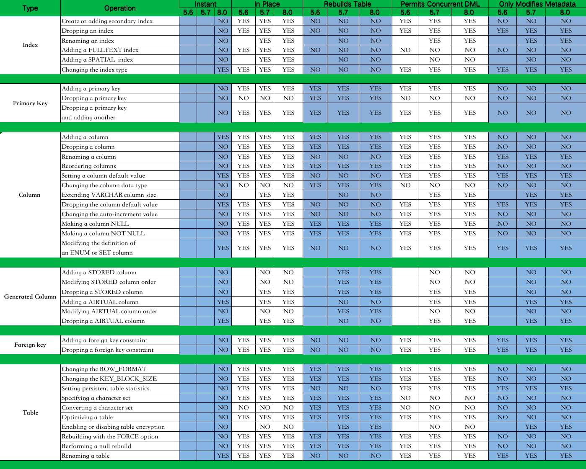

# 技术分享 | MySQL级联复制下进行大表的字段扩容

**原文链接**: https://opensource.actionsky.com/20230408-mysql/
**分类**: MySQL 新特性
**发布时间**: 2023-04-17T22:12:48-08:00

---

作者：雷文霆
爱可生华东交付服务部  DBA 成员，主要负责Mysql故障处理及相关技术支持。爱好看书，电影。座右铭，每一个不曾起舞的日子，都是对生命的辜负。
本文来源：原创投稿
*爱可生开源社区出品，原创内容未经授权不得随意使用，转载请联系小编并注明来源。
#### 一、背景
某客户的业务中有一张约4亿行的表，因为业务扩展，表中open_id varchar(50) 需要扩容到 varchar(500).
变更期间尽量减少对主库的影响(最好是不要有任何影响->最终争取了4个小时的窗口期)。
#### 二、库表信息
环境：Mysql 8.0.22
1主1从 基于Gtid复制
1.第一个问题，这是一张大表吗? 是的，请看
此表的ibd 文件280G + count长时间无返回 + 使用备库看了一下确认行数>4亿
以下语句也可以查看：
show table status from dbname like 'tablename'\G # Rows 的值不准，有时误差有2倍
SELECT a.table_schema,a.table_name,concat(round(sum(DATA_LENGTH/1024/1024)+sum(INDEX_LENGTH/1024/1024),2) ,'MB')total_size,concat(round(sum(DATA_LENGTH/1024/1024),2),'MB') AS data_size,concat(round(sum(INDEX_LENGTH/1024/1024),2),'MB') AS index_size FROM information_schema.TABLES a WHERE a.table_schema = 'dbname' AND a.table_name = 'tablename'; #看下此表的数据量
> 既然是大表，我们应该使用什么方式做变更呢？
## 三、方案选择
> 下文中的 M 表示主库，S1 为从1 ，S2 为从2
| 方式 | 优点 | 缺点 | 可行性 |
| --- | --- | --- | --- |
| OnlineDDL | 原生，使用中间临时表 | ALGORITHM=COPY时，会阻塞DML，推荐版本>MySQL5.7 | 5星 |
| Gh-ost | 使用binlog+回放线程代替触发器 | 第三方工具，根据不同的参数导致执行时间较长 | 4星 |
| Pt-osc | 版本兼容性好,使用触发器保持主副表一致 | 第三方工具，且使用限制较多 | 3星 |
| M-S1-S2 | 时间可预估 | 级联复制，人工操作 | 1星 |
> 为什么我们没有选择前3种方案？
根据实际情况评估，本次业务侧的需求是**此表24h都有业务流量，且不接受超过4小时的业务不可用时间**
OnlineDDL的方式，ALGORITHM=COPY时，期间会阻塞DML(只读)，最后主副表rename操作时(不可读写)，直到DDL完成(其中需要的时间不确定)。
Gh-ost的方式，推荐的模式为连接从库，在主库转换，此模式对主库影响最小，可通过参数设置流控。致命的缺点是此工具的变更时间太长，4亿的表，测试环境使用了70个小时。最后我们还需要下发切换命令及手动删除中间表*_del。如果是1主2从还是比较推荐这种方式的，因为还有一个从库可以保障数据安全。
Pt-osc 和Gh-ost都属于第三方，Pt-osc 对大表的操作和OnlineDDL有一个共同的缺点就是失败回滚的代价很大。
如果是低版本如MySQL<5.7可以使用，理论上OnlineDDL是在MySQL5.6.7开始支持，刚开始支持的不是很好，可适当取舍。
最后我们选择了，DBA最喜爱(xin ku)的一种方式，在M-S1-S2级联复制下进行。
#### 四、如何进行操作
- 新建一个S1的从库，构建M-S1-S2级联复制
- 使用OnlineDDL在S2上进行字段扩容 (优点是期间M-S1的主从不受影响)
- 扩容完成后，等待延迟同步M-S1-S2 (降低S2与M的数据差异,并进行数据验证)
- 移除S1,建立M-S2的主从关系(使S2继续同步M的数据)
- 备份S2恢复S1，建立M-S2-S1级联复制
- 应用停服，等待主从数据一致(优点是差异数据量的同步时间很短)
- 最终S2成为主库，S1为从库(应用需要修改前端连接信息)
- 应用进行回归验证
> 以上内容看上去很复杂，本质上就是备份恢复。读者可将其做为备选方案。分享一下具体步骤?
环境装备:开启Gtid,注意M,S1 binlog保存时长,磁盘剩余空间大于待变更表的2倍
show global variables like 'binlog_expire_logs_seconds'; # 默认604800
set global binlog_expire_logs_seconds=1209600; # 主库和级联主库都需要设置
1.搭建 1主2从的级联复制，M -> S1 -> S2 ，安装MySQL注意本次环境lower_case_table_names = 0 
2.在S2 上做字段扩容。 预估 10个小时
`参数设置:`
set global slave_type_conversions='ALL_NON_LOSSY'; # 防止复制报错SQL_Errno: 13146，属于字段类型长度不一致无法回放
set global interactive_timeout=144000;set global wait_timeout =144000;
`磁盘IO参数设置:`
set global innodb_buffer_pool_size=32*1024*1024*1024;# 增加buffer_pool 防止Error1206The total number of locks exceeds the lock table size 资源不足
set global sync_binlog=20000;set global innodb_flush_log_at_trx_commit=2;
set global innodb_io_capacity=600000;set global innodb_io_capacity_max=1200000; # innodb_io_capacity需要设置两次
show variables like '%innodb_io%'; # 验证以上设置
screen 下执行:
time mysql -S /data/mysql/3306/data/mysqld.sock -p'' dbname -NBe "ALTER TABLE tablename MODIFY COLUMN open_id VARCHAR(500) NULL DEFAULT NULL COMMENT 'Id' COLLATE 'utf8mb4_bin';"
查看DDL进度:
SELECT EVENT_NAME, WORK_COMPLETED, WORK_ESTIMATED  FROM performance_schema.events_stages_current;
3.扩容完成后，等待延迟同步M-S1-S2 
数据同步至主从一致,对比主从Gtid
4.移除S1,建立M-S2的主从关系
S1 (可选)
stop slave;
reset slave all;
systemctl stop mysql_3306
S2
stop slave;
reset slave all;
# MASTER_HOST='M主机IP'  
CHANGE MASTER TO
MASTER_HOST='',
MASTER_USER='',
MASTER_PASSWORD=',
MASTER_PORT=3306,
MASTER_AUTO_POSITION=1,
MASTER_CONNECT_RETRY=10;
start slave; (flush privileges;# 验证数据可正常同步)
5.备份S2恢复S1，建立M-S2-S1级联复制
物理备份S2,重做S2->S1 级联主从
rm -rf binlog/*
rm -rf redolog/*
xtrabackup --defaults-file=/data/mysql/3306/my.cnf.3306 --move-back --target-dir=/data/actionsky/xtrabackup_recovery/data
chown -R mysql. data/
chown -R mysql. binlog/*
chown -R mysql. redolog/*
systemctl start mysql_3306
set global gtid_purged='';
reset slave all;
# MASTER_HOST='S2主机IP'  ,已扩容变更完的主机
CHANGE MASTER TO
MASTER_HOST='',
MASTER_USER='',
MASTER_PASSWORD='',
MASTER_PORT=3306,
MASTER_AUTO_POSITION=1,
MASTER_CONNECT_RETRY=10;
`MySQL8.0版本需要在上面语句中添加 GET_MASTER_PUBLIC_KEY=1; #防止 Last_IO_Errno: 2061 message: Authentication plugin 'caching_sha2_password' reported error: Authentication requires secure connection.`
start slave;
6.应用停服，等待主从数据一致
主库停服+可设置read_only+flush privileges，对比主从Gtid
7.最终S2成为主库，S1为从库
应用更改配置连接新主库。
S2上:
stop slave;reset slave all;
set global read_only=0;set global super_read_only=0;
`show master status\G 观察是否有新事务写入`
收尾：还原第2步的参数设置。
set global interactive_timeout=28800;set global wait_timeout =28800;
set global innodb_buffer_pool_size=8*1024*1024*1024;
set global slave_type_conversions='';
set global sync_binlog=1;set global innodb_flush_log_at_trx_commit=1;
set global innodb_io_capacity=2000;set global innodb_io_capacity_max=4000;
> 补充场景: 基于磁盘IO能力的测试
直接在主库上修改，且无流量的情况下：
场景1，磁盘是NVME的物理机，4亿数据大约需要5个小时(磁盘性能1G/s)。
场景2，磁盘是机械盘的虚拟机，此数据量大约需要40个小时(磁盘性能100M/s)。
#### 五、总结
- 使用级联，对于业务侧来说，时间成本主要在应用更改连接和回归验证。如果从库无流量，不需要等待业务低峰。
- OnlineDDL可通过修改参数，提高效率，其中双一参数会影响数据安全，推荐业务低峰期操作。
- Gh-ost 适合变更时间宽裕的场景，业务低峰期操作，可调整参数加快进度，自定义切换的时间。
- 以上方式均不推荐多个DDL同时进行，即并行DDL。
- 大表操作和大数据量操作，需要我们贴合场景找到合适的变更方案，不需要最优，需要合适。
福利时间：分享一个速查表
