# 技术分享 | OMS 初识

**原文链接**: https://opensource.actionsky.com/20230411-oms/
**分类**: 技术干货
**发布时间**: 2023-04-10T23:58:01-08:00

---

作者：高鹏
DBA，负责项目日常问题排查，广告位长期出租 。
本文来源：原创投稿
*爱可生开源社区出品，原创内容未经授权不得随意使用，转载请联系小编并注明来源。
本文主要贡献者：进行OMS源码分析的@操盛春（北分之光）
#### 一、走进OMS
本文以OMS社区版3.3.1为例
我们可以从官方的地址上获取到它的架构图，这是它大概的样子：
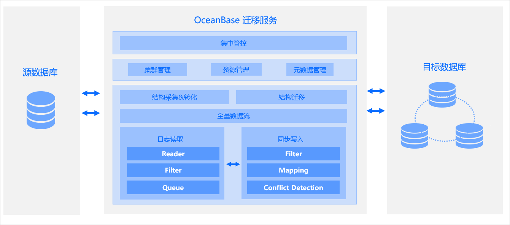
可以看到一个OMS数据迁移工具它包含了很多的组件，有DBCat、Store、Connector、JDBCWriter、Checker 和 Supervisor 等，组件的各个功能这里就不copy官方的叙述了，毕竟有手就行。接下来说点官网上没有的。
之前领导让我进行OMS性能测试时要顺便打印火焰图看一下，分析迁移过程中时间都用在了哪里，但是当我登录OMS容器后看到很多相关java进程，一时间分不清哪个进程是做什么的，那么接下里我们就对这些进程逐一说明
##### 1.Ghana-endpoint
[ActionTech ~]# ps uax | grep Ghana-endpoint
root        61  3.1  0.5 20918816 1582384 pts/0 Sl  Feb07 1756:47 java -Dspring.config.location=/home/ds/ghana/config/application-oms.properties -server -Xms1g -Xmx2g -XX:+PrintGCDetails -XX:+PrintGCTimeStamps -XX:+PrintGCDateStamps -Xloggc:/home/admin/logs/ghana/gc.log -XX:+UseGCLogFileRotation -XX:NumberOfGCLogFiles=10 -XX:GCLogFileSize=10M -XX:+HeapDumpOnOutOfMemoryError -XX:HeapDumpPath=/home/admin/logs/ghana -jar /home/ds/ghana/boot/Ghana-endpoint-1.0.0-executable.jar
Ghana-endpoint负责提供OMS 后台管理界面、调度TaskJob和StructTaskJob程序
tips:
StructTaskJob：结构迁移任务调度程序
TaskJob：
- TaskJob::scheduledTask()，负责正向切换步骤的子任务执行的调度
- TaskJob::scheduleMigrationProject()，负责结构迁移项目所有步骤初始化 & 任务执行进度监控的调度
##### 2.commons-daemon（CM）
[ActionTech ~]# ps uax | grep commons-daemon
root        50  297  1.7 25997476 4711620 pts/0 Sl  Feb07 163685:09 java -cp /home/ds/cm/package/deployapp/lib/commons-daemon.jar:/home/ds/cm/package/jetty/start.jar -server -Xmx4g -Xms4g -Xmn4g -Dorg.eclipse.jetty.util.URI.charset=utf-8 -Dorg.eclipse.jetty.server.Request.maxFormContentSize=0 -Dorg.eclipse.jetty.server.Request.maxFormKeys=20000 -DSTOP.PORT=8089 -DSTOP.KEY=cm -Djetty.base=/home/ds/cm/package/deployapp org.eclipse.jetty.start.Main
CM集群管理进程，为OMS 管理后台进程提供接口，用于创建拉取增量日志、全量迁移、增量同步、全量校验等任务，以及获取这些任务的执行进度
##### 3.oms-supervisor
[ActionTech ~]# ps uax | grep oms-supervisor
ds          63  1.0  0.3 11780820 985860 pts/0 Sl   Feb07 566:35 java -server -Xms1g -Xmx1g -Xmn512m -verbose:gc -Xloggc:./log/gc.log -XX:+PrintGC -XX:+PrintGCDetails -XX:+PrintGCTimeStamps -XX:+PrintGCDateStamps -Dserver.port=9000 -DconfigDir=/u01/ds/supervisor/config/ -Dspring.main.allow-circular-references=true -jar ./bin/oms-supervisor.jar
oms-supervisor进程用于启动执行拉取增量日志、全量迁移、增量同步、全量校验等任务的进程（组件），并监控这些进程的状态
##### 4.store
store增量日志拉取进程，它是多进程协作，直接抓取store进程可能会看到下面一坨，其根进程为 ./bin/store，该进程有子进程及多个后代进程。
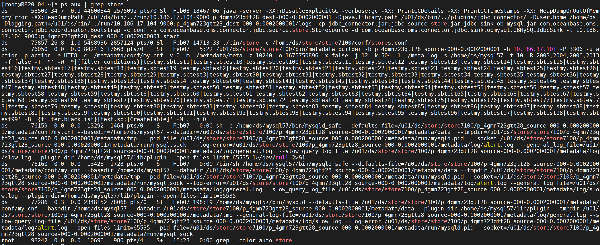
- ./bin/store：模拟源节点的从库，从源节点接收增量日志
- /u01/ds/store/store7100/bin/metadata_builder：进行过滤、转换，写入文件，并对DDL进行处理
这些进程会持续不断的把需要迁移表的增量日志拉取到 OMS 服务器上存储起来，以供增量同步任务使用。
##### 5.全量迁移和全量校验
[ActionTech ~]# ps -ef | grep VEngine
UID          PID    PPID  C STIME TTY          TIME       CMD
ds         32635       1 99 11:21 pts/0    00:00:02       /opt/alibaba/java/bin/java -server -Xms8g -Xmx8g -Xmn4g -Xss512k -XX:ErrorFile=/u01/ds/bin/..//run//10.186.17.106-9000:90230:0000000016/logs/hs_err_pid%p.log -XX:+HeapDumpOnOutOfMemoryError -XX:HeapDumpPath=/u01/ds/bin/..//run//10.186.17.106-9000:90230:0000000016/logs -verbose:gc -Xloggc:/u01/ds/bin/..//run//10.186.17.106-9000:90230:0000000016/logs/gc_%p.log -XX:+PrintGCDateStamps -XX:+PrintGCDetails -classpath lib/verification-core-1.2.54.jar:lib/verification-OB05-1.2.54.jar:lib/verification-TIDB-1.2.54.jar:lib/verification-MySQL-1.2.54.jar:lib/verification-OB-Oracle-Mode-1.2.54.jar:lib/verification-OB10-1.2.54.jar:lib/verification-Oracle-1.2.54.jar:lib/verification-DB2-1.2.54.jar:lib/verification-Sybase-1.2.54.jar:lib/verification-common-1.2.54.jar:lib/apache-log4j-extras-1.2.17.jar:lib/slf4j-log4j12-1.7.21.jar:lib/oms-conditions-3.2.3.12-SNAPSHOT.jar:lib/oms-common-3.2.3.12-SNAPSHOT.jar:lib/log4j-1.2.17.jar:lib/dws-rule-1.1.6.jar:lib/dws-schema-1.1.6.jar:lib/oms-record-3.2.3.12-SNAPSHOT.jar:lib/commons-io-2.6.jar:lib/metrics-core-4.0.2.jar:lib/connect-api-2.1.0.jar:lib/kafka-clients-2.1.0.jar:lib/slf4j-api-1.7.25.jar:lib/dss-transformer-1.0.10.jar:lib/calcite-core-1.19.0.jar:lib/dss-record-1.0.0.jar:lib/avatica-core-1.13.0.jar:lib/jackson-datatype-jsr310-2.11.1.jar:lib/jackson-databind-2.11.1.jar:lib/esri-geometry-api-2.2.0.jar:lib/jackson-dataformat-yaml-2.9.8.jar:lib/jackson-core-2.11.1.jar:lib/jackson-annotations-2.11.1.jar:lib/mysql-connector-java-5.1.47.jar:lib/oceanbase-1.2.1.jar:lib/druid-1.1.11.jar:lib/etransfer-0.0.65-SNAPSHOT.jar:lib/commons-lang3-3.9.jar:lib/aggdesigner-algorithm-6.0.jar:lib/commons-lang-2.6.jar:lib/fastjson-1.2.72_noneautotype.jar:lib/commons-beanutils-1.7.0.jar:lib/log4j-1.2.15.jar:lib/mapdb-3.0.8.jar:lib/kotlin-stdlib-1.2.71.jar:lib/annotations-16.0.3.jar:lib/calcite-linq4j-1.19.0.jar:lib/guava-29.0-jre.jar:lib/maven-project-2.2.1.jar:lib/maven-artifact-manager-2.2.1.jar:lib/maven-reporting-api-3.0.jar:lib/doxia-sink-api-1.1.2.jar:lib/doxia-logging-api-1.1.2.jar:lib/maven-settings-2.2.1.jar:lib/maven-profile-2.2.1.jar:lib/maven-plugin-registry-2.2.1.jar:lib/plexus-container-default-1.0-alpha-30.jar:lib/groovy-test-2.5.5.jar:lib/plexus-classworlds-1.2-alpha-9.jar:lib/junit-4.12.jar:lib/commons-dbcp2-2.5.0.jar:lib/httpclient-4.5.6.jar:lib/commons-logging-1.2.jar:lib/commons-collections4-4.1.jar:lib/oms-operator-3.2.3.12-SNAPSHOT.jar:lib/retrofit-2.9.0.jar:lib/jsr305-3.0.2.jar:lib/servlet-api-2.5.jar:lib/org.osgi.core-4.3.1.jar:lib/protobuf-java-3.11.0.jar:lib/maven-plugin-api-2.2.1.jar:lib/okhttp-3.14.9.jar:lib/maven-artifact-2.2.1.jar:lib/wagon-provider-api-1.0-beta-6.jar:lib/maven-repository-metadata-2.2.1.jar:lib/maven-model-2.2.1.jar:lib/plexus-utils-3.0.16.jar:lib/javax.annotation-api-1.3.2.jar:lib/javassist-3.20.0-GA.jar:lib/xml-apis-1.3.03.jar:lib/error_prone_annotations-2.3.4.jar:lib/easy-random-core-4.2.0.jar:lib/objenesis-3.1.jar:lib/commons-collections-3.2.2.jar:lib/lombok-1.18.16.jar:lib/antlr4-runtime-4.9.1.jar:lib/ojdbc8-19.7.0.0.jar:lib/orai18n-19.3.0.0.jar:lib/oceanbase-client-1.1.10.jar:lib/db2jcc-db2jcc4.jar:lib/jtds-1.3.1.jar:lib/javax.ws.rs-api-2.1.1.jar:lib/groovy-ant-2.5.5.jar:lib/groovy-cli-commons-2.5.5.jar:lib/groovy-groovysh-2.5.5.jar:lib/groovy-console-2.5.5.jar:lib/groovy-groovydoc-2.5.5.jar:lib/groovy-docgenerator-2.5.5.jar:lib/groovy-cli-picocli-2.5.5.jar:lib/groovy-datetime-2.5.5.jar:lib/groovy-jmx-2.5.5.jar:lib/groovy-json-2.5.5.jar:lib/groovy-jsr223-2.5.5.jar:lib/groovy-macro-2.5.5.jar:lib/groovy-nio-2.5.5.jar:lib/groovy-servlet-2.5.5.jar:lib/groovy-sql-2.5.5.jar:lib/groovy-swing-2.5.5.jar:lib/groovy-templates-2.5.5.jar:lib/groovy-test-junit5-2.5.5.jar:lib/groovy-testng-2.5.5.jar:lib/groovy-xml-2.5.5.jar:lib/groovy-2.5.5.jar:lib/sketches-core-0.9.0.jar:lib/json-path-2.4.0.jar:lib/janino-3.0.11.jar:lib/commons-compiler-3.0.11.jar:lib/hamcrest-core-1.3.jar:lib/gson-2.8.5.jar:lib/httpcore-4.4.13.jar:lib/commons-codec-1.15.jar:lib/ini4j-0.5.2.jar:lib/backport-util-concurrent-3.1.jar:lib/plexus-interpolation-1.11.jar:lib/failureaccess-1.0.1.jar:lib/listenablefuture-9999.0-empty-to-avoid-conflict-with-guava.jar:lib/checker-qual-2.11.1.jar:lib/j2objc-annotations-1.3.jar:lib/classgraph-4.8.65.jar:lib/zstd-jni-1.3.5-4.jar:lib/lz4-java-1.5.0.jar:lib/snappy-java-1.1.7.2.jar:lib/ant-junit-1.9.13.jar:lib/ant-1.9.13.jar:lib/ant-launcher-1.9.13.jar:lib/ant-antlr-1.9.13.jar:lib/commons-cli-1.4.jar:lib/picocli-3.7.0.jar:lib/qdox-1.12.1.jar:lib/jline-2.14.6.jar:lib/junit-platform-launcher-1.3.2.jar:lib/junit-jupiter-engine-5.3.2.jar:lib/testng-6.13.1.jar:lib/avatica-metrics-1.13.0.jar:lib/commons-pool2-2.6.0.jar:lib/snakeyaml-1.23.jar:lib/memory-0.9.0.jar:lib/eclipse-collections-forkjoin-11.0.0.jar:lib/eclipse-collections-11.0.0.jar:lib/eclipse-collections-api-11.0.0.jar:lib/lz4-1.3.0.jar:lib/elsa-3.0.0-M5.jar:lib/okio-1.17.2.jar:lib/junit-platform-engine-1.3.2.jar:lib/junit-jupiter-api-5.3.2.jar:lib/junit-platform-commons-1.3.2.jar:lib/apiguardian-api-1.0.0.jar:lib/jcommander-1.72.jar:lib/kotlin-stdlib-common-1.2.71.jar:lib/opentest4j-1.1.1.jar:conf com.alipay.light.VEngine -t 10.186.17.106-9000:90230:0000000016 -c /home/ds//run/10.186.17.106-9000:90230:0000000016/conf/checker.conf start
全量迁移和全量校验这两个任务的启动命令相同，但它其实是两个进程，所以我们无法从ps命令中分辨出该进程是全量迁移还是全量校验
想要区分需要看 /home/ds//run/10.186.17.106-9000:90230:0000000016/conf/checker.conf 文件，该文件就是上述启动命令中-c 参数所指定的配置文件。
condition.whiteCondition=[{"name":"sakila","all":false,"attr":{"dml":"d,i,u"},"sub":[{"name":"city"},{"name":"country"}]}]
condition.blackCondition=[{"name":"sakila","all":false,"sub":[{"name":"DRC_TXN*","func":"fn"},{"name":"drc_txn*","func":"fn"}]}]
datasource.master.type=MYSQL
......
task.split.mode=false
task.type=verify
task.checker_jvm_param=-server -Xms8g -Xmx8g -Xmn4g -Xss512k
task.id=90230
task.subId=3
task.resume=false
配置文件中的task.type 配置项的值代表了进程类型
- task.type=migrate：全量迁移进程
- task.type=verify：全量校验进程
##### 6.增量同步进程
[ActionTech ~]# ps aux | grep "coordinator\.Bootstrap"
ds       58500 34.7  0.9 44600844 2575092 pts/0 Sl  Feb08 18483:51 java -server -XX:+DisableExplicitGC -verbose:gc -XX:+PrintGCDetails -XX:+PrintGCTimeStamps -XX:+HeapDumpOnOutOfMemoryError -XX:HeapDumpPath=/u01/ds/bin/../run/10.186.17.104-9000:p_4gmn723gtt28_dest-000-0:0002000001 -Djava.library.path=/u01/ds/bin/../plugins/jdbc_connector/ -Duser.home=/home/ds -Dlogging.path=/u01/ds/bin/../run/10.186.17.104-9000:p_4gmn723gtt28_dest-000-0:0002000001/logs -cp jdbc_connector.jar:jdbc-source-store.jar:jdbc-sink-ob-mysql.jar com.oceanbase.oms.connector.jdbc.coordinator.Bootstrap -c conf -s com.oceanbase.oms.connector.jdbc.source.store.StoreSource -d com.oceanbase.oms.connector.jdbc.sink.obmysql.OBMySQLJdbcSink -t 10.186.17.104-9000:p_4gmn723gtt28_dest-000-0:0002000001 start
该进程用于读取增量日志，构造成SQL语句在目标节点进行回放
##### 7.进程之间关系
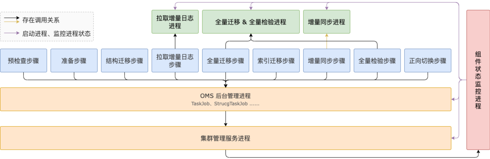
#### 二、迁移流程
上述是组成OMS的各个组件进程以及它们之间的关系。接下来我们用一个例子来简述下OMS内部工作流程。
以增量迁移任务为例：

通过同事对源码的分析，可得出迁移流程大致如下：
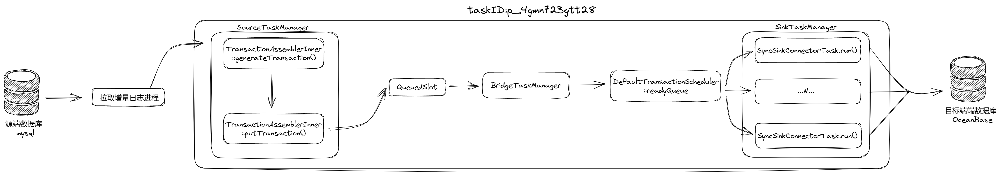
那么我们知道了迁移流程，接下来如何去剖析OMS迁移快慢的问题想必是每一个运维同事最为关心的点。
众所周知OMS的操作界面是十分简洁，明明用到了influxDB，但是展示出来的信息还是非常的少，几乎帮不上什么忙。
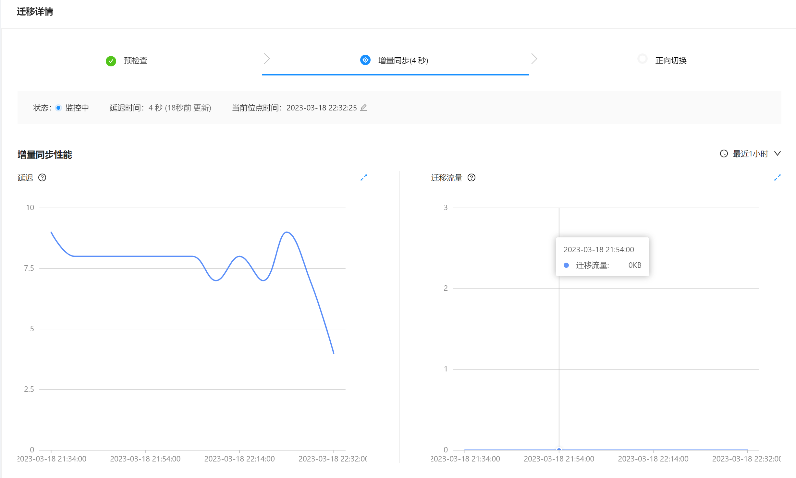
登录influxDB中可以看到如下相关监控项
["checker.dest.rps"]
["checker.dest.rt"]
["checker.dest.write.iops"]
["checker.source.read.iops"]
["checker.source.rps"]
["checker.source.rt"]
["checker.verify.dest.read.iops"]
["checker.verify.dest.rps"]
["checker.verify.dest.rt"]
["checker.verify.source.read.iops"]
["checker.verify.source.rps"]
["checker.verify.source.rt"]
["jdbcwriter.delay"]
["jdbcwriter.iops"]
["jdbcwriter.rps"]
["store.conn"]
["store.delay"]
["store.iops"]
["store.rps"]
除此之外OMS还使用了io.dropwizard.metrics5 做部分监控，由coordinator进程每10秒打印一次metrics，metrics的日志路径：/u01/ds/run/$test_id/logs/msg/metrics.log，日志内容为json格式，记录较为详细。
[2023-03-18 22:49:18.101] [{"jvm":{"JVM":"jvm:[heapMemory[max:30360MB, init:2048MB, used:677MB, committed:1980MB], noHeapMemory[max:0MB, init:2MB, used:58MB, committed:63MB], gc[gcName:ParNew, count:2643, time:64034ms;gcName:ConcurrentMarkSweep, count:8, time:624ms;], thread[count:88]]"},"sink":{"sink_worker_num":0,"sink_total_transaction":4.5654123E7,"rps":0.0,"tps":0.0,"iops":0.0,"sink_total_record":4.5654123E7,"sink_commit_time":0.0,"sink_worker_num_all":64,"sink_execute_time":0.0,"sink_total_bytes":2.8912799892E10},"source":{"StoreSource[0]source_delay":5,"p_4gmn723gtt28_source-000-0source_record_num":1.36962569E8,"p_4gmn723gtt28_source-000-0source_iops":198.98,"StoreSource[0]source_status":"running","p_4gmn723gtt28_source-000-0source_dml_num":4.5654123E7,"p_4gmn723gtt28_source-000-0source_dml_rps":0.0,"p_4gmn723gtt28_source-000-0source_rps":0.0},"dispatcher":{"wait_dispatch_record_size":0,"ready_execute_batch_size":0},"frame":{"SourceTaskManager.createdSourceSize":1,"queue_slot1.batchAccumulate":0,"forward_slot0.batchAccumulate":0,"forward_slot0.batchCount":4.7873212E7,"queue_slot1.batchCount":4.7873212E7,"queue_slot1.rps":0.6999300122261047,"SourceTaskManager.sourceTaskNum":0,"forward_slot0.recordAccumulate":0,"forward_slot0.rps":0.6999300122261047,"queue_slot1.tps":0.6999300122261047,"forward_slot0.tps":0.6999300122261047,"queue_slot1.recordAccumulate":0,"queue_slot1.recordCount":4.7873212E7,"forward_slot0.recordCount":4.7873212E7}}]
metrics.log是分析迁移瓶颈的重要工具，重点取source、dispatch、sink三个部分的监控值进行分析。
##### 1.source阶段
作用：主要用于连接源端数据库，拉取增量日志，单线程运行，读取SQL以事务形式向下游输出，由于是单线程运行，因此整个动作只能串行完成。
TransactionAssembler::TransactionAssemblerInner::generateTransaction()将读到的SQL拼接成事务；
TransactionAssembler::TransactionAssemblerInner::putTransaction()发送到QueuedSlot队列中。
通过metrics.log可以获取到如下监控值：
- source_record_num: Source阶段, 处理的行记录的总数 (在处理行记录(将行记录拼接为事务)时统计, TransactionAssembler.notify)
- source_rps: Source阶段, 每秒处理的行记录数 (TransactionAssembler.notify)
- source_iops: Source阶段, 每秒处理的行记录的大小 (TransactionAssembler.notify)
- source_dml_num: Source阶段, 处理的DML的行记录的总数 (TransactionAssembler.notify)
- source_dml_rps: Source阶段, 每秒处理的DML的行记录数 (TransactionAssembler.notify)
- StoreSource[0]source_status: Source阶段的状态, running/stopped
- StoreSource[0]source_delay: Source阶段的延迟, 处理数据的时间
可以利用influxDB将其制作成监控展示图，如下所示(部分)：

##### 2.dispatcher阶段
作用：协调生产和消费之间的速度，负责从 QueuedSlot 队列读取事务，然后写入事务调度队列（DefaultTransactionScheduler::readyQueue)，队列大小默认值为16384，单线程。
- dispatcher_ready_transaction_size: DefaultTransactionScheduler::readyQueue 队列中积压的事务数量，等待 SinkTaskManager 线程处理。
- coordinator_dispatch_record_size: DefaultTransactionScheduler::readyQueue 队列中积压的事务的记录数量之和，等待 SinkTaskManager 线程处理。
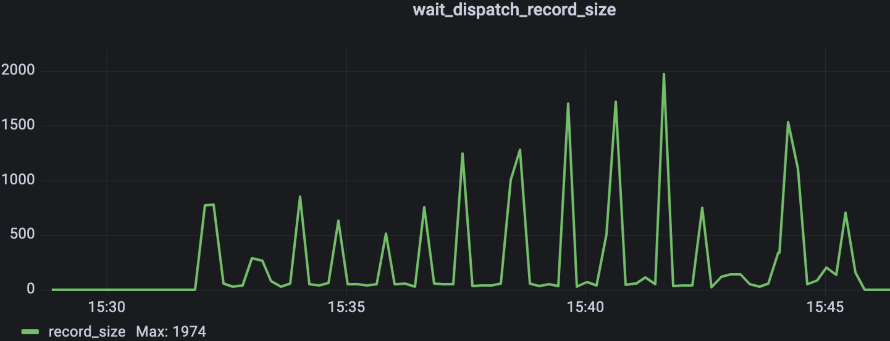
##### 3.sink阶段
作用：从上游的事务调度队列中获取数据，然后在目标数据库进行回放。多线程，线程数由workerNum配置项指定，默认16。
- sink_tps: 每秒回放完成多少事务（在事务回放完成时统计）
- sink_total_transaction: 回放事务的总数
- sink_worker_num: 工作线程中忙碌线程的数量
- sink_worker_num_all: 工作线程的总数
- sink_rps: 每秒回放完成多少行记录
- sink_total_record: 回放的行记录总数
- sink_execute_time: 行记录的平均执行时间 = 事务的SQL执行时间 / 事务的记录数
- sink_commit_time: 事务的提交阶段的平均时间
- sink_iops: 每秒回放的事务的行记录大小, 单位为 kb/s
- sink_total_bytes: 回放的事务的行记录大小总数
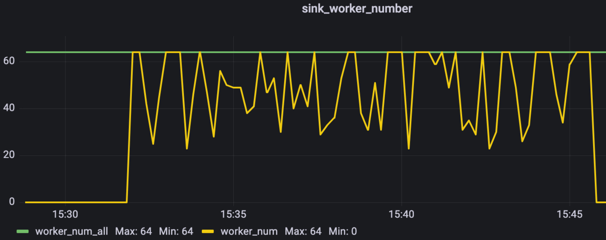
#### 三、OMS优化
OMS留给运维的优化空间并不多，本期我们只围绕迁移链路进行优化，下文列举出了两个最直接的优化方式。
##### 1.sink_worker_number
通过一组监控图来看查看OMS是否存在性能问题
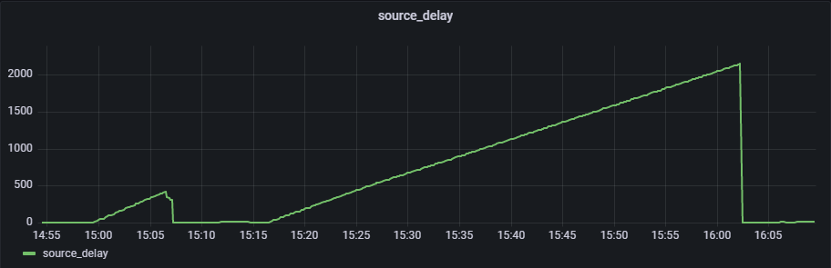
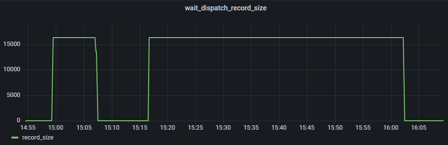
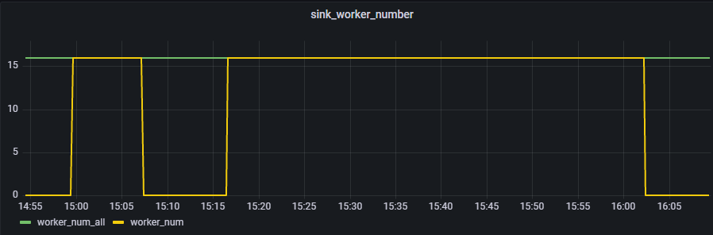
在压测过程中，sink_worker_number和wait_dispatch_record监控视图呈现出来的曲线几乎一致。很明的可以看出是因为下游的消费能力的不足导致事务全部积压在dispatch的队列中，并且将dispatch的队列都打满了。
找到问题原因后优化也就变得简单了，只需要调大sink_worker_number的线程数就可以，修改如下图所示。
运维监控 – 组件 – 更新
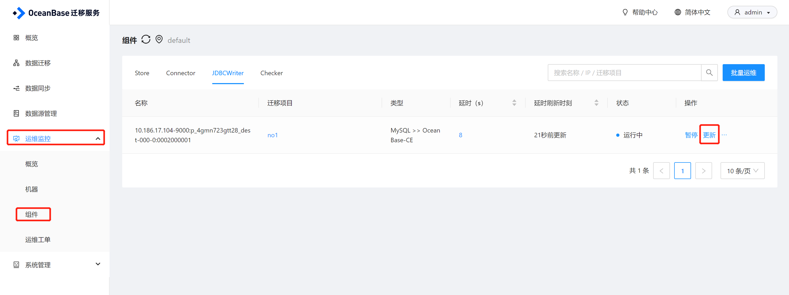
找到“JDBCWriter.worker_num”值，建议修改成宿主机CPU逻辑核数，最大不超过CPU逻辑核数*4（具体数值可根据环境动态调整）。
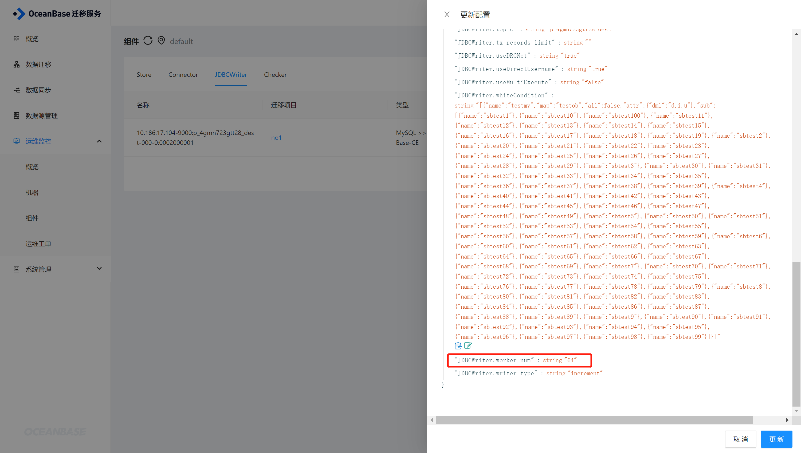
#### 2.迁移选项
OMS在创建迁移任务时，如果迁移任务中包含全量迁移的话可以选择“全量迁移并发速度”，档位越高占用的系统资源也就越多，如果宿主机资源丰富，可以选择“快速”。
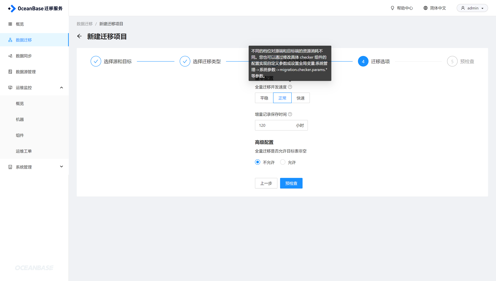
如下是不同档位所需要的资源，这是官方自带的模板，也可以根据实际情况调整。
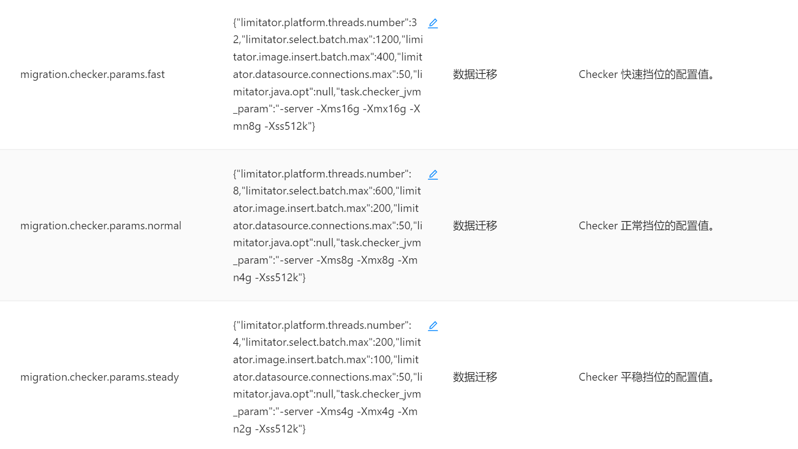
注：如果仅仅选择增量迁移是没有该选项的。
##### 3.其他优化方式只能具体原因具体分析了。