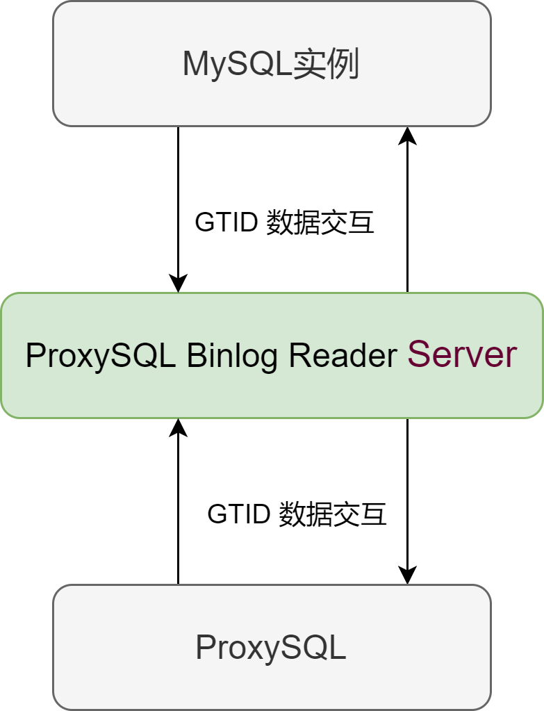

# 技术分享 | ProxySQL Binlog Reader 组件介绍（上篇）

**原文链接**: https://opensource.actionsky.com/20220720-proxysql/
**分类**: 技术干货
**发布时间**: 2022-07-19T20:50:33-08:00

---

作者：杨涛涛
资深数据库专家，专研 MySQL 十余年。擅长 MySQL、PostgreSQL、MongoDB 等开源数据库相关的备份恢复、SQL 调优、监控运维、高可用架构设计等。目前任职于爱可生，为各大运营商及银行金融企业提供 MySQL 相关技术支持、MySQL 相关课程培训等工作。
本文来源：原创投稿
*爱可生开源社区出品，原创内容未经授权不得随意使用，转载请联系小编并注明来源。
之前我写过一篇文章：《[ProxySQL 搭配 MySQL HA（下）](https://opensource.actionsky.com/20210106-proxysql/)》。文章里介绍了 ProxySQL 后端主机元数据表 mysql_server 每个字段的含义，其中有一个字段名为 gtid_port 。此字段是 ProxySQL Binlog Reader （目前还不支持 MySQL 8.0 版本）组件需要监听的端口， ProxySQL 需要连接这个端口来判断主从GTID事务号是否一致，今天我来简单介绍下这个组件。
可以把 ProxySQL Binlog Reader 组件看成一个轻量级的 MySQL 客户端，使用它来实时探测 MySQL 主从复制架构中各个从实例的 GTID 回放结果。ProxySQL Binlog Reader 、ProxySQL 、MySQL 三者之间的关系如下图：ProxySQL 读取 ProxySQL Binlog Reader 输出的 GTID 来判断 MySQL 主库和从库数据是否一致。

##### ProxySQL Binlog Reader 组件诞生的背景如下：
###### 1.前端应用请求进入 MySQL 之前需要读写分离。
###### 2.读写分离的逻辑如何保证？ 大致有三种策略：
(1).请求统一下发到主
(2).以事务块为粒度下发到主
(3).读请求统一下发到从
对于这三种策略，特别是最后一种，从库有可能读到过时的数据。MySQL 主从复制从数据传输原理上来讲，从库避免不了数据回放的延迟，我们定制的各种优化策略无非是想办法减少这部分延迟的时间，保证时效性。 MySQL 自从发布 GTID 功能后，对于此类问题，解决方法就变得容易许多。
例如可以读取主库最新的 GTID 编号、读取从库最新回放的 GTID 编号，对比一致性来计算延迟的时效性，从而更加准确的进行前端流量的下发。这种要么是按照传统方法来分析 show slave status 的结果写对应脚本、要么是手动去读取变量 gtid_executed 值来判断最新的 GTID 回放编号、要么是每台实例开启参数 session_track_gtids 主动给客户端返回最新的 GTID 编号，客户端通过这个编号来判断事务是否已经回放完成。在这种背景下，基于效率以及可扩展性，ProxySQL Binlog Reader 组件模拟 MySQL 从库，通过实时拉取每台 MySQL 实例的 GTID 编号（只是拉取 GTID 编号，非常节省资源），ProxySQL 进程则作为客户端读取 ProxySQL Binlog Reader 组件获取的最新 GTID 编号来判断从库与主库的数据是否一致，从而避免读取过时数据。
**下面我来简单演示下这个组件如何使用。**
三台实例（MySQL 版本为 5.7.34，端口都为5734）：
- ProxySQL 主机： 192.168.2.111
- 主库：192.168.2.120
- 从库，192.168.2.121
ProxySQL 默认管理端口6032，流量端口6033，配置表 mysql_servers 字段 gtid_port 都设置为57341。
<mysql:admin:5.5.30>select hostgroup_id, hostname,port,status,gtid_port from mysql_servers;
+--------------+---------------+------+--------+-----------+
| hostgroup_id | hostname      | port | status | gtid_port |
+--------------+---------------+------+--------+-----------+
| 1            | 192.168.2.120 | 5734 | ONLINE | 57341     |
| 2            | 192.168.2.121 | 5734 | ONLINE | 57341     |
+--------------+---------------+------+--------+-----------+
2 rows in set (0.00 sec)
为了和正常用户区分，单独给 ProxySQL Binlog reader 组件分配用户：
<mysql: ytt:5.7.34-log> create user binlog_reader identified by 'read';
Query OK, 0 rows affected (0.01 sec)
<mysql: ytt:5.7.34-log> grant replication client, replication slave on *.* to binlog_reader;
Query OK, 0 rows affected (0.00 sec)
在每个 MySQL 实例上都启动一个ProxySQL Binlog Reader 监听进程：-l 选项指定的端口需要匹配ProxySQL 系统表里设定的端口，也即 mysql_servers 表的gtid_port字段值。
#主：
root@ytt-large:/tmp# proxysql_binlog_reader -ubinlog_reader -pread -P5734 -h 192.168.2.120 -l57341 -L /tmp/proxysql_mysqlbinlog_reader.log
#从：
root@ytt-normal:/tmp# proxysql_binlog_reader -ubinlog_reader -pread -P5734 -h 192.168.2.121 -l57341 -L /tmp/proxysql_mysqlbinlog_reader.log
查看主库日志有无报错：启动正常，读取起始 GTID 编号，完后持续读取 binlog 。
root@ytt-large:/tmp# tail -f proxysql_mysqlbinlog_reader.log Starting ProxySQL MySQL BinlogSucessfully startedAngel process started ProxySQL MySQL Binlog process 288412022-07-18 15:11:04 [INFO] proxysql_binlog_reader version 2.0-3-gd8e01402022-07-18 15:11:04 [INFO] Initializing client...2022-07-18 15:11:04 [INFO] Last executed GTID: '00005734-0000-0000-0000-000000005734:1-2'2022-07-18 15:11:04 [INFO] Reading binlogs...
从库也启动正常：
root@ytt-normal:/tmp# tail -f proxysql_mysqlbinlog_reader.log Starting ProxySQL MySQL BinlogSucessfully startedAngel process started ProxySQL MySQL Binlog process 227102022-07-18 15:11:59 [INFO] proxysql_binlog_reader version 2.0-3-gd8e01402022-07-18 15:11:59 [INFO] Initializing client...2022-07-18 15:11:59 [INFO] Last executed GTID: '00005734-0000-0000-0000-000000005734:1-2'2022-07-18 15:11:59 [INFO] Reading binlogs...
如果主从之间数据传输异常，在 ProxySQL Binlog Reader 组件的日志里也会有对应的信息输出。
查看 MySQL 会话列表，主库和从库分别多了两个 DUMP 线程传输数据到 ProxySQL Binlog Reader 组件：
#主：  
Id: 125
User: binlog_reader
Host: 192.168.2.120:54668
db: NULL
Command: Binlog Dump GTID
Time: 314
State: Master has sent all binlog to slave; waiting for more updates
Info: NULL
#从：  
Id: 1426
User: binlog_reader
Host: 192.168.2.121:54992
db: NULL
Command: Binlog Dump GTID
Time: 165
State: Master has sent all binlog to slave; waiting for more updates
Info: NULL   
这里我简单介绍了 ProxySQL Binlog Reader 组件的产生背景、使用方法等，更多细节请关注下一篇。