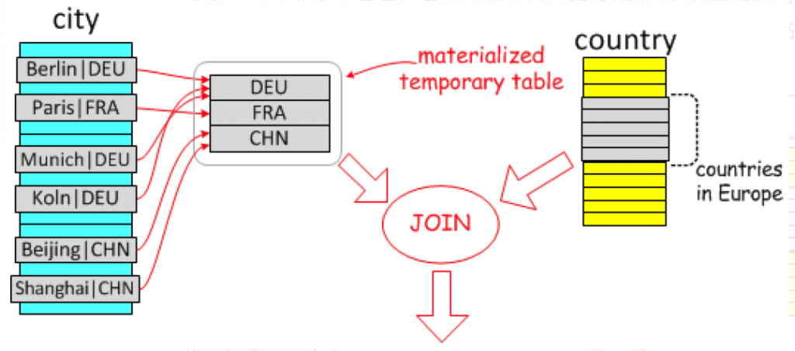

# 技术分享 | Semi-join Materialization 子查询优化策略

**原文链接**: https://opensource.actionsky.com/20200921-semi-join/
**分类**: 技术干货
**发布时间**: 2020-09-21T00:36:26-08:00

---

作者：胡呈清
爱可生 DBA 团队成员，擅长故障分析、性能优化，个人博客：https://www.jianshu.com/u/a95ec11f67a8，欢迎讨论。
本文来源：原创投稿
*爱可生开源社区出品，原创内容未经授权不得随意使用，转载请联系小编并注明来源。
本篇为子查询优化系列的第二篇。在之前一篇文章 [MySQL 子查询优化](https://opensource.actionsky.com/20200628-mysql/) 中我们介绍了子查询的一些优化策略，也简单介绍了 Semi-join 是怎么来的，今天继续介绍 Semi-join 的一些具体实现。
### 什么是 Semi-join
常规联接中，结果可能会出现重复值，而子查询可以获得无重复的结果。比如需要找出有人口大于 2000 万的城市的国家，如果用普通联接，则可能出现重复结果：- 
- 
- 
- 
- 
- 
- 
- 
- 
`select country.* from country join city on country.code=city.country_code \``and population>20000000;``+---------+----------+``| code    | name     |``+---------+----------+``|    1    | china    |``|    1    | china    |``+---------+----------+``2 rows in set (0.00 sec)`
而子查询则不会：- 
- 
- 
- 
- 
- 
- 
- 
```
select * from country where code in \`(select country_code from city where population>20000000);``+------+---------+``| code | name    |``+------+---------+``|  1   | china   |``+------+---------+``1 row in set (0.00 sec)
```
在子查询中，优化器可以识别出 in 子句中每组只需要返回一个值，在这种情况下，可以使用半联接 Semi-join 来优化子查询，提升查询效率。
###### Semi-join 限制
不过并不是所有子查询都是半联接，必须满足以下条件：- 子查询必须是出现在顶层的 WHERE、ON 子句后面的 IN 或者 =ANY
- 子查询必须是单个 select，不能是 union；
- 子查询不能有 group by 或者 having 子句（可以用 semijoin materialization 策略，其他不可以 ）；
- It must not be implicitly grouped (it must contain no aggregate functions). （不知道啥意思，保持原文）；
- 子查询不能有 order by with limit；
- 父查询中不能有 STRAIGHT_JOIN 指定联接顺序；
- The number of outer and inner tables together must be less than the maximum number of tables permitted in a join.
###### Semi-join 实现策略
子查询可以是相关子查询，如果子查询满足以上条件，MySQL 会将其转换为 semijoin，并从以下的策略中基于成本进行选择其中一种：- Duplicate Weedout
- FirstMatch
- LooseScan
- Materialize
对应 optimizer_switch 参数中的：- semijon=ON，控制 semijoin 是否开启的开关
- firstmatch、loosescan、duplicateweedout、materialization 分别是四种策略的开关，默认都是开启的
通过 explain 输出信息可以判断使用了哪种优化策略：- extra 中出现 Start temporary、End temporary，表示使用了 Duplicate Weedout 策略
- extra 中出现 FirstMatch(tbl_name) ，表示使用了 FirstMatch 策略
- extra 中出现 LooseScan(m..n)，表示使用了 LooseScan 策略
- select_type 列为 MATERIALIZED，以及 table 列为 <subqueryN>，表示使用了 Materialize 策略
接下来介绍 Semi-join Materialization 优化策略。
### Semi-join Materialization
Semi-join Materialization 策略就是把子查询结果物化成临时表，再用于 semijoin 的一种特殊的子查询实现，它实际上也可以分为两种策略：- Materialization-scan
- Materialization-lookup
以下 SQL 为例：- 
- 
- 
- 
- 
select * from Country``where Country.code IN (select City.Country``                       from City``                       where City.Population > 7*1000*1000)``      and Country.continent='Europe'`
这是一个不相关子查询，查出欧洲有人口超过 700 万的大城市的国家。Semi-join Materialization 优化策略的做法就是：把人口超过 700 万的大城市所在的国家，即 City.Country 字段值填充到一个临时表中，并且 Country 字段为主键（用来去重），然后与 Country 表进行联接：
											
联接可以有两个顺序：
- 从物化表到 Country 表
- 从 Country 表到物化表
第一种方法要对物化表做全表扫描，因此叫做 Materialization-scan。
第二种方法在物化表中查找数据时可以使用主键进行查找，因此叫做：Materialization-lookup。
###### Materialization-scan
看下优化器使用 Materialization-scan 策略后的执行计划：- 
- 
- 
- 
- 
- 
- 
- 
- 
`select * from Country where Country.code IN (select City.Country \``from City where  City.Population > 7*1000*1000);``+----+--------------+-------------+--------+--------------------+------------+---------+--------------------+------+-----------------------+``| id | select_type  | table       | type   | possible_keys      | key        | key_len | ref                | rows | Extra                 |``+----+--------------+-------------+--------+--------------------+------------+---------+--------------------+------+-----------------------+``|  1 | PRIMARY      | <subquery2> | ALL    | NULL               | NULL       | NULL    | NULL               |   15 |                       |``|  1 | PRIMARY      | Country     | eq_ref | PRIMARY            | PRIMARY    | 3       | world.City.Country |    1 |                       |``|  2 | MATERIALIZED | City        | range  | Population,Country | Population | 4       | NULL               |   15 | Using index condition |``+----+--------------+-------------+--------+--------------------+------------+---------+--------------------+------+-----------------------+`可以看到：- 有两个查询（id=1 和 id=2）；
- 第 2 个查询（id=2）的 select_type=MATERIALIZED，意思是子查询结果保存到一个临时表中，在读取的字段上建立主键，主键的目的是去除重复行；
- 第 1 行的 table=<subquery2>，代表使用的表正是第 2 个查询的物化临时表。
执行流程为：- 先执行子查询，走的 Population 索引，扫描了 15 行，得到 15 行结果；
- 将上一步得到的结果保存到临时表中；
- 从临时表中取出一行数据，到 Country 表中去查找满足联接条件的行，走 Country 表的主键，每次扫描 1 行；
- 重复 3，直到遍历临时表结束。
所以这里扫描的行数为 15+15+15*1=45。
###### Materialization-lookup
修改一下 SQL，让子查询的结果集变大，改变联接顺序：- 
- 
- 
- 
- 
- 
- 
- 
- 
```
select * from Country where Country.code IN (select City.Country \`from City where  City.Population > 1*1000*1000) ;``+----+--------------+-------------+--------+--------------------+--------------+---------+------+------+-----------------------+``| id | select_type  | table       | type   | possible_keys      | key          | key_len | ref  | rows | Extra                 |``+----+--------------+-------------+--------+--------------------+--------------+---------+------+------+-----------------------+``|  1 | PRIMARY      | Country     | ALL    | PRIMARY            | NULL         | NULL    | NULL |  239 |                       |``|  1 | PRIMARY      | <subquery2> | eq_ref | auto_key           | auto_key     | 3       | func |    1 |                       |``|  2 | MATERIALIZED | City        | range  | Population,Country | Population   | 4       | NULL |  238 | Using index condition |``+----+--------------+-------------+--------+--------------------+--------------+---------+------+------+-----------------------+
```
这样就变成了 Materialization-lookup，执行流程为：- 先执行子查询，走的 Population 索引，扫描了 238 行，得到 238 行结果；
- 将上一步得到的结果保存到临时表中；
- 从 Country 表中取出一行数据，到物化临时表中去查找满足联接条件的行，走物化表的主键，每次扫描 1 行；
- 重复 3，直到遍历 Country 表结束（一共 239 行）。
所以这里扫描的行数为 238+239*1=477。
### 注意事项
参考资料文章提到在 MariaDB 中，子查询有 group by 分组操作时能用到 Semi-join Materialization 优化策略（其他的 Duplicate Weedout、FirstMatch、LooseScan 不能用）。而在 MySQL 中，子查询有 group by 分组操作时所有的 Semi-join 策略都无法使用，即无法使用 Semi-join 优化，举例：- 
- 
- 
- 
- 
- 
- 
- 
```
select dept_name from departments where dept_no in \``(select min(dept_no) from dept_emp where emp_no<10020 group by dept_no);``+----+-------------+-------------+-------+-----------------+-----------+---------+------+-----------------------------------------------------------+``| id | select_type | table       | type  | possible_keys   | key       | key_len | rows | Extra                                                     |``+----+-------------+-------------+-------+-----------------+-----------+---------+------------------------------------------------------------------+``|  1 | PRIMARY     | departments | index | NULL            | dept_name | 42      |    9 | Using where; Using index                                  |``|  2 | SUBQUERY    | dept_emp    | range | PRIMARY,dept_no | PRIMARY   | 4       |   21 | Using where; Using index; Using temporary; Using filesort |`+----+-------------+-------------+-------+-----------------+-----------+---------+------+-----------------------------------------------------------+
```
可以看到这里使用的是 Non-semijoin materialization 优化策略，也就是 MySQL 子查询优化  文中的 Materialization 优化策略。所以 optimizer_switch 参数中的 materialization=on 标志也可以单独用于 Non-semijoin materialization 优化策略。
### 参考资料
- https://mariadb.com/kb/en/semi-join-materialization-strategy/
- https://dev.mysql.com/doc/refman/5.7/en/semijoins.html
相关推荐：
[技术分享 | MySQL 子查询优化](https://opensource.actionsky.com/20200628-mysql/)
[技术分享 | 讨论：MySQL 从库单表恢复](https://opensource.actionsky.com/20200914-mysql/)