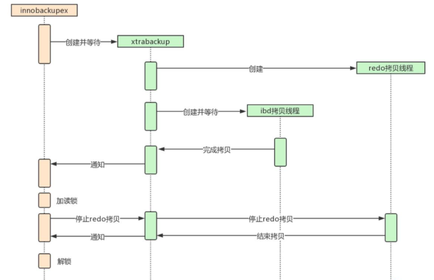
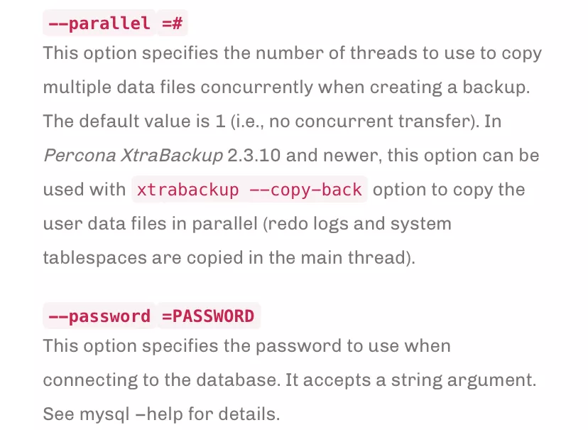
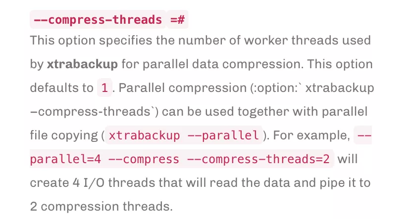

# 技术分享 | XtraBackup 备份加速

**原文链接**: https://opensource.actionsky.com/20210311-xtrabackup/
**分类**: 技术干货
**发布时间**: 2021-03-11T00:54:21-08:00

---

作者：侯晓阳
爱可生 DBA 团队成员，主要负责 MySQL 故障处理和 SQL 审核优化。对技术执着，为客户负责。
本文来源：原创投稿*爱可生开源社区出品，原创内容未经授权不得随意使用，转载请联系小编并注明来源。
## 概述
XtraBackup 是一款对于 MySQL 物理备份必不可少的工具，但是有时候在备份数据量级较大的数据库时，如果未做优化的话，还是有点慢，当然相对于逻辑备份，已然是很快了，那到底还能不能再快一点呢，又是什么参数在影响着 XtrBackup 的备份速度呢？带着这个疑问我们往下看。
首先我们需要先了解 XtraBackup 的备份原理，话不多说直接看图。
											
如图所示：
1. 当 innobackupex 命令开始备份的时候，首先会启动 xtrabackup 进程，xtrabackup 又分为两个线程，一个用于拷贝 ibd 文件，一个用于拷贝 redo 文件，redo 的拷贝线程只有一个，在 ibd 的拷贝线程启动前启动，在 ibd 的拷贝线程结束后结束。
2. xtrabackup 拷贝完成 idb 后，通知 innobackupex（通过创建文件），同时自己进入等待（redo 线程仍然继续拷贝）
3. innobackupex 收到 xtrabackup 通知后，执行 FLUSH TABLES WITH READ LOCK (FTWRL)，取得一致性位置点，然后开始备份非 InnoDB 文件（包括 frm、MYD、MYI、CSV、opt、par 等）。拷贝非 InnoDB 文件过程中，因为数据库处于全局只读状态，非 InnoDB 表（主要 是MyISAM）如果比较多的话整库只读时间就会比较长。
4. 当 innobackupex 拷贝完所有非 InnoDB 表文件后，通知 xtrabackup（通过删文件） ，同时自己进入等待（等待另一个文件被创建）；
5. xtrabackup 收到 innobackupex 备份完非 InnoDB 通知后，就停止 redo 拷贝线程，然后通知 innobackupex，redo log 拷贝完成（通过创建文件）；
6. innobackupex 收到 redo 备份完成通知后，就开始解锁，执行 UNLOCK TABLES；
7. 最后 innobackupex 和 xtrabackup 进程各自完成收尾工作，如资源的释放、写备份元数据信息等，innobackupex 等待 xtrabackup 子进程结束后退出。
## 参数介绍
能够让我们加速备份的参数其实严格来说有以下两个：
1. &#8211;parallel2. &#8211;compress-threads
先来说第一个参数 &#8211;parallel，先看下官方解释：
											
也就是说，这个参数的作用是，在 XtraBackup 备份开始拷贝 ibd 文件的时候可以并行拷贝的线程数量，默认的话是单线程拷贝的，如果 ibd 文件较多的话只能拷贝完一个再继续下一个，有一点需要注意如果表存储在一个 ibd 文件中，那么他将不会起到任何作用。
再看 &#8211;compress-threads 官网给出的解释：
											
简单来说就是针对 InnoDB 数据文件进行压缩的线程数，在指定这个参数的时候无需加上 &#8211;compress 也可以实现压缩。
## 测试
备份命令：
`[root@TEST/data]# innobackupex --host=127.0.0.1 --user=root --password=123456 --port=3306 --parallel=4 --compress-threads=4 --stream=xbstream --tmpdir=/backup/tmp --no-version-check /backup  >/backup/20210125/20210125`date +%H%M`
`
| 硬件 | 数据量 | 参数 | 所用时间 |
| --- | --- | --- | --- |
| 8C/8G | 100G | null | 20分钟 |
| 8C/8G | 100G | &#8211;compress-threads=4 | 15分钟 |
| 8C/8G | 100G | &#8211;parallel=4 | 12分钟 |
| 8C/8G | 100G | &#8211;parallel=4;&#8211;compress-threads=4 | 8分钟 |
**相关推荐：**
[故障分析 | 记一次 MySQL 复制故障 -Error_code:1317](https://opensource.actionsky.com/20210305-mysql/)