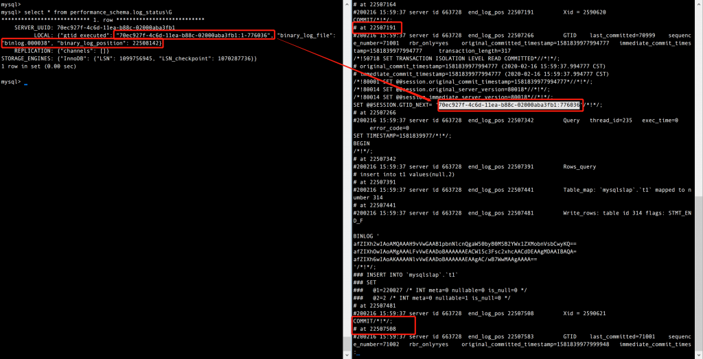

# 技术分享 | Xtrabackup 备份中 Xtrabackup_binlog_info 文件记录的 GTID 信息是否准确？

**原文链接**: https://opensource.actionsky.com/20200309-mysql/
**分类**: MySQL 新特性
**发布时间**: 2020-03-09T02:02:24-08:00

---

作者：何政
本文来源：原创投稿
*原创内容未经授权不得随意使用，转载请联系小编并注明来源。
Xtrabackup 是由 percona 开源的免费数据库热备份软件，它能对 InnoDB 和 XtraDB 存储引擎的数据库非阻塞地备份。
为了方便建立从库，Xtrabackup 在备份完成后会将 binlog position 与 GTID 的相关信息保存于 xtrabackup_binlog_info 文件中。
但是当你使用 Xtrabackup 生成的备份建立一个从库时，会发现恢复后的实例执行 `show master status`，显示的 Executed_Gtid_Set 与 xtrabackup_binlog_info 文件中记录的信息并不一致，而且使用 Xtrabackup 2.4 与 8.0（对 MySQL 8.0 进行备份）生成的备份在恢复后，信息不一致的表现又不相同。本篇文章主要针对该现象进行简单的分析。
**一、Xtrabackup 2.4.18 for MySQL 5.7.26**
**现象**
1. 使用 Xtrabackup 工具备份后，xtrabackup_binlog_info 文件记录的信息如下：- `\# cat xtrabackup_binlog_info`
- `mysql-bin.000003    86412752    55d3d9b9-4d49-11ea-932c-02000aba3fa6:1-595859`
2. 将该备份恢复至一个新实例并启动该实例，执行 `show master status;` 查看信息：- `mysql> show master status\G`
- `*************************** 1. row ***************************`
- `             File: mysql-bin.000001`
- `         Position: 154`
- `     Binlog_Do_DB:`
- `Binlog_Ignore_DB:`
- `Executed_Gtid_Set: 55d3d9b9-4d49-11ea-932c-02000aba3fa6:1-326661`
- `1 row in set (0.00 sec)`
此时会发现使用备份恢复的实例显示已执行过的 GTID 是 1-326661，而备份文件显示的是 1-595859，这是否表示两者相差的 GTID:326662-595859 代表的事务丢失了？
通过对原实例（进行备份的实例）的 binlog 进行解析，来查询 GTID:326662-595859 这部分事务所生成的数据在新实例（通过备份恢复的实例）上是否存在。可以发现 GTID:326662-595859 这部分事务的数据都存在于新实例上，也就是说数据与 xtrabackup_binlog_info 文件记录的是一致的，只不过与 `show master status` 命令获取的信息的不一致。
**原因分析**
首先我们要清楚 Xtrabackup 2.4 的备份流程，大致如下：
1. start backup
2. copy ibdata1 / copy .ibd file
3. Excuted ftwrl
4. backup non-InnoDB tables and files
5. Writing xtrabackup_binlog_info
6. Executed FLUSH NO_WRITE_TO_BINLOG ENGINE LOGS
7. Executed UNLOCK TABLES
8. Copying ib_buffer_pool
9. completed OK!
结合备份时的 general log 可知，Xtrabackup 在执行 ftwrl 并备份完所有非 InnoDB 表格的文件后通过`show master status` 获取了 binlog position 和 GTID 的信息，将其记录到 xtrabackup_binlog_info 文件中。
**那么 show master status 获取的是哪些信息？**
该命令提供本实例的 binlog 文件的状态信息，显示正在写入的 binlog 文件，以及当前的binlog position，并且 MySQL 5.7 在 MySQL 库下引入了 gtid_executed 表，该表会记录当前执行过的 GTID。
那么目前看来问题可能就出在 gtid_executed 表格上，通过测试和官方文档提供的信息可知，该表格虽然是 InnoDB 表，但是其中的数据并非是实时更新的，且该表格记录信息的方式存在以下两个情况：
1. 如果禁用了 log_bin，实例不会在该表格记录任何信息；若从库的 log_slave_updates 为 OFF，那么从库会在应用 relay-log 中的每个事务时执行一次 `insert mysql.gtid_executed` 的操作。
2. 如果启用了 log_bin，则该表格记录的是在 binlog 发生切换（rotate）的时候直到上一个 binlog 文件执行过的全部 GTID，而此时 show master status 获取的 Gtid 信息不再由 mysql.gtid_executed 表提供，而是由全局系统变量 gtid_exected 提供；如果服务器意外停止，则当前 binlog 文件中的 Gtid 集合不会保存在 mysql.gtid_executed 表中，在实例恢复期间，这些 Gtid 从 binlog 文件中读取并添加到表中。
**小结**
所以当备份恢复时，实际 `show master status` 可能会出现以下情况：
1. 当 log_bin 禁用或者 log_slave_updates 为 OFF 时，备份恢复后的实例 `show master status` 显示为空。
2. 当开启了 log_bin，但是该实例并未发生过 binlog 的切换时，备份恢复后的实例 `show master status` 显示也为空。
3. 当开启了 log_bin，其该实例的 binlog 发生过切换时，备份恢复后的实例 `show master status` 显示的信息会比 xtrabackup_binlog_info 文件中记录的 GTID 缺失一部分，这一部分就是 mysql.gtid_executed 表格未记录的部分。
**二、Xtrabackup 8.0.8 for MySQL 8.0.18**
**现象**
1. 使用 Xtrabackup 工具备份后，xtrabackup_binlog_info 文件记录的信息如下：- `# # cat xtrabackup_binlog_info`
- `binlog.000033    1459    70ec927f-4c6d-11ea-b88c-02000aba3fb1:1-621683`
2. 查看备份实例相对应的 binlog 解析后的内容：- `# mysqlbinlog -vv binlog.000033 | less`
- `定位至 70ec927f-4c6d-11ea-b88c-02000aba3fb1:621683`
- 
- `# at 508`
- `#200213 13:46:47 server id 663728  end_log_pos 583      GTID    last_committed=0        sequence_number=2       rbr_only=yes    original_committed_timestamp=1581572807720907   immediate_commit_timestamp=15815728`
- `07720907     transaction_length=317`
- `/*!50718 SET TRANSACTION ISOLATION LEVEL READ COMMITTED*//*!*/;`
- `# original_commit_timestamp=1581572807720907 (2020-02-13 13:46:47.720907 CST)`
- `# immediate_commit_timestamp=1581572807720907 (2020-02-13 13:46:47.720907 CST)`
- `/*!80001 SET @@session.original_commit_timestamp=1581572807720907*//*!*/;`
- `/*!80014 SET @@session.original_server_version=80018*//*!*/;`
- `/*!80014 SET @@session.immediate_server_version=80018*//*!*/;`
- `SET @@SESSION.GTID_NEXT= '70ec927f-4c6d-11ea-b88c-02000aba3fb1:621683'/*!*/;`
- `# at 583`
- `#200213 13:46:47 server id 663728  end_log_pos 659      Query   thread_id=214   exec_time=0     error_code=0`
- `SET TIMESTAMP=1581572807/*!*/;`
- `BEGIN`
- `/*!*/;`
- `# at 659`
- `#200213 13:46:47 server id 663728  end_log_pos 708      Rows_query`
- `# insert into t1 values(null,2)`
- `# at 708`
- `#200213 13:46:47 server id 663728  end_log_pos 758      Table_map: `mysqlslap`.`t1` mapped to number 314`
- `# at 758`
- `#200213 13:46:47 server id 663728  end_log_pos 798      Write_rows: table id 314 flags: STMT_END_F`
- 
- 
- `BINLOG '`
- `x+JEXh2wIAoAMQAAAMQCAACAAB1pbnNlcnQgaW50byB0MSB2YWx1ZXMobnVsbCwyKQ==`
- `x+JEXhOwIAoAMgAAAPYCAAAAADoBAAAAAAEACW15c3Fsc2xhcAACdDEAAgMDAAIBAQA=`
- `x+JEXh6wIAoAKAAAAB4DAAAAADoBAAAAAAEAAgAC/wCKAAEAAgAAAA==`
- `'/*!*/;`
- `### INSERT INTO `mysqlslap`.`t1``
- `### SET`
- `###   @1=65674 /* INT meta=0 nullable=0 is_null=0 */`
- `###   @2=2 /* INT meta=0 nullable=1 is_null=0 */`
- `# at 798`
- `#200213 13:46:47 server id 663728  end_log_pos 825      Xid = 2436045`
- `COMMIT/*!*/;`
可以发现该文件提供的 binlog position 与 GTID 并不对应。而 binlog.000033:1459 对应的 GTID 是 70ec927f-4c6d-11ea-b88c-02000aba3fb1:621685 提交后的下一个位置：- `# at 1142`
- `#200213 13:46:47 server id 663728  end_log_pos 1217     GTID    last_committed=2        sequence_number=4       rbr_only=yes    original_committed_timestamp=1581572807724646   immediate_commit_timestamp=15815728`
- `07724646     transaction_length=317`
- `/*!50718 SET TRANSACTION ISOLATION LEVEL READ COMMITTED*//*!*/;`
- `# original_commit_timestamp=1581572807724646 (2020-02-13 13:46:47.724646 CST)`
- `# immediate_commit_timestamp=1581572807724646 (2020-02-13 13:46:47.724646 CST)`
- `/*!80001 SET @@session.original_commit_timestamp=1581572807724646*//*!*/;`
- `/*!80014 SET @@session.original_server_version=80018*//*!*/;`
- `/*!80014 SET @@session.immediate_server_version=80018*//*!*/;`
- `SET @@SESSION.GTID_NEXT= '70ec927f-4c6d-11ea-b88c-02000aba3fb1:621685'/*!*/;`
- `# at 1217`
- `#200213 13:46:47 server id 663728  end_log_pos 1293     Query   thread_id=215   exec_time=0     error_code=0`
- `SET TIMESTAMP=1581572807/*!*/;`
- `BEGIN`
- `/*!*/;`
- `# at 1293`
- `#200213 13:46:47 server id 663728  end_log_pos 1342     Rows_query`
- `# insert into t1 values(null,2)`
- `# at 1342`
- `#200213 13:46:47 server id 663728  end_log_pos 1392     Table_map: `mysqlslap`.`t1` mapped to number 314`
- `# at 1392`
- `#200213 13:46:47 server id 663728  end_log_pos 1432     Write_rows: table id 314 flags: STMT_END_F`
- 
- 
- `BINLOG '`
- `x+JEXh2wIAoAMQAAAD4FAACAAB1pbnNlcnQgaW50byB0MSB2YWx1ZXMobnVsbCwyKQ==`
- `x+JEXhOwIAoAMgAAAHAFAAAAADoBAAAAAAEACW15c3Fsc2xhcAACdDEAAgMDAAIBAQA=`
- `x+JEXh6wIAoAKAAAAJgFAAAAADoBAAAAAAEAAgAC/wCMAAEAAgAAAA==`
- `'/*!*/;`
- `### INSERT INTO `mysqlslap`.`t1``
- `### SET`
- `###   @1=65676 /* INT meta=0 nullable=0 is_null=0 */`
- `###   @2=2 /* INT meta=0 nullable=1 is_null=0 */`
- `# at 1432`
- `#200213 13:46:47 server id 663728  end_log_pos 1459     Xid = 2436047`
- `COMMIT/*!*/;`
- `# at 1459`
3. 再看将备份恢复到一个新实例并启动后，执行 show master status 显示的信息：- `mysql> show master status\G`
- `*************************** 1. row ***************************`
- `             File: binlog.000034`
- `         Position: 191`
- `     Binlog_Do_DB:`
- `Binlog_Ignore_DB:`
- `Executed_Gtid_Set: 70ec927f-4c6d-11ea-b88c-02000aba3fb1:1-621685`
- `1 row in set (0.00 sec)`
可以发现与 Xtrabackup 2.4 不同的是，该备份的 xtrabackup_binlog_info 文件记录的信息并不准确，而备份恢复后显示的信息却是准确的。
**原因**
首先我们来看一下 Xtrabackup 8.0 针对 MySQL 8.0 备份的大致过程：
1. start backup2. copy .ibd file3. backup non-InnoDB tables and files4. Executed FLUSH NO_WRITE_TO_BINLOG BINARY LOGS5. Selecting LSN and binary log position from p_s.log_status6. copy last binlog file7. Writing /mysql/backup/backup/binlog.index8. Writing xtrabackup_binlog_info9. Executing FLUSH NO_WRITE_TO_BINLOG ENGINE LOGS10. copy ib_buffer_pool11. completed OK!
由以上步骤可知，Xtrabackup 8.0 对 MySQL 8.0 的备份与 Xtrabackup 2.4 略有不同，根据 percona 官方文档的信息，当 MySQL 8.0 中仅存在 InnoDB 引擎的表格时，不再执行ftwrl（当存在非 InnoDB 的表格或者使用 &#8211;slave-info 选项时会执行），而是根据上述步骤的第 5 步，Xtrabackup 8.0 会通过- `SELECT server_uuid, local, replication, storage_engines FROM performance_schema.log_status`
来获取 LSN 、binlog position and Gtid。
1. `performance_schema.log_status` 是 MySQL 8.0 提供给在线备份工具获取复制日志文件信息的表格。查询 log_status 表时，服务器将阻止日志的记录和相关的更改来获取足够的时间以填充该表，然后释放资源。Log_status 表通知在线备份工具应记录主库的 binlog 的哪个位点和 gtid_executed 的值，还有每个复制通道的 relay log。它还为各个存储引擎提供了相关信息，例如 InnoDB 存储引擎使用的最后一个日志序列号（LSN）和最后一个检查点的 LSN。
2. 经过测试发现，当无数据写入时， `performance_schema.log_status` 提供的 binlog position 与 GTID 是一致的，但是当有大量数据持续写入时，该表格提供的 binlog position 与 GTID 信息将不再一致，如下图：
											
3. 既然 `performance_schema.log_status` 提供的信息不一致，那么为什么备份恢复后，GTID 没有缺失？这是因为 Xtrabackup 8.0 在备份过程中多了两步操作，FLUSH NO_WRITE_TO_BINLOG BINARY LOGS 和 copy binlog，Xtrabackup 8.0 在备份完非 InnoDB 表格的文件时会先切换 binlog，然后将切换后的 binlog 也进行备份，这样使用该备份恢复的新实例在启动后不仅会读取 gtid_executed 表，也会读取 binlog 文件来更新 GTID，就可以保持与备份时 xtrabackup_binlog_info 文件记录的 binlog position 保持一致（需要注意的是 MySQL 8.0 的 gtid_executed 表格不再是当 binlog 切换时更新，而是会不断的实时更新，但需要注意在有大量数据写入时也不能做到和全局变量 gtid_exeuted 保持严格一致）。
4. 当 MySQL 8.0 中存在非 InnoDB 的表格，比如 MyISAM 表时，Xtrabackup 8.0 会在执行完 `FLUSH NO_WRITE_TO_BINLOG BINARY LOGS` 后执行 ftwrl，此时查询 `performance_schema.log_status` 得到的 binlog position 与 GTID 是一致的，且备份恢复后 show master status 显示的信息也与 xtrabackup_binlog_info 文件记录的信息一致。
**总结**
1. Xtrabackup 2.4 备份后生成的 xtrabackup_binlog_info 文件记录的 GTID 信息是准确的，但是备份恢复后 show master status 显示的 GTID 是不准确的。
2. Xtrabackup 8.0 在备份只有 InnoDB 表的实例时，xtrabackup_binlog_info 文件记录的 GTID 信息不一定是准确的，但是备份恢复后 show master status 显示的 GTID 是准确的。
3. Xtrabackup 8.0 在备份有非 InnoDB 表格的实例时，xtrabackup_binlog_info 文件记录的 GTID 信息是准确的，备份恢复后 show master status 显示的 GTID 也是准确的。
注意：此处的“准确”主要指 xtrabackup_binlog_info 文件中记录的 GTID 与备份中实际的 **binlog position & 数据**是否一致。