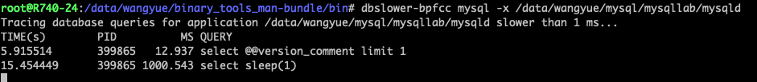
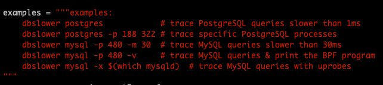
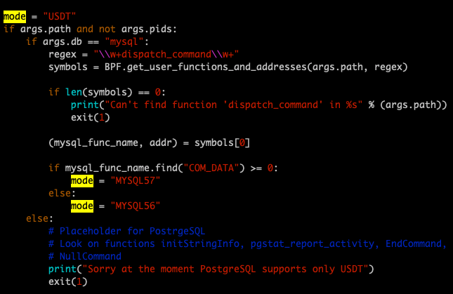
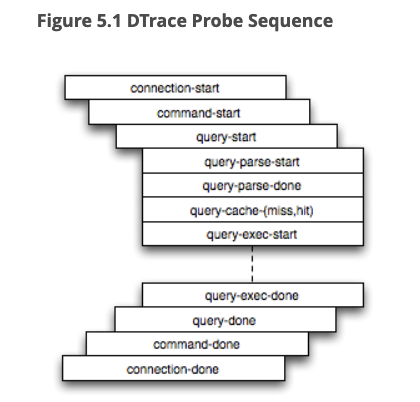
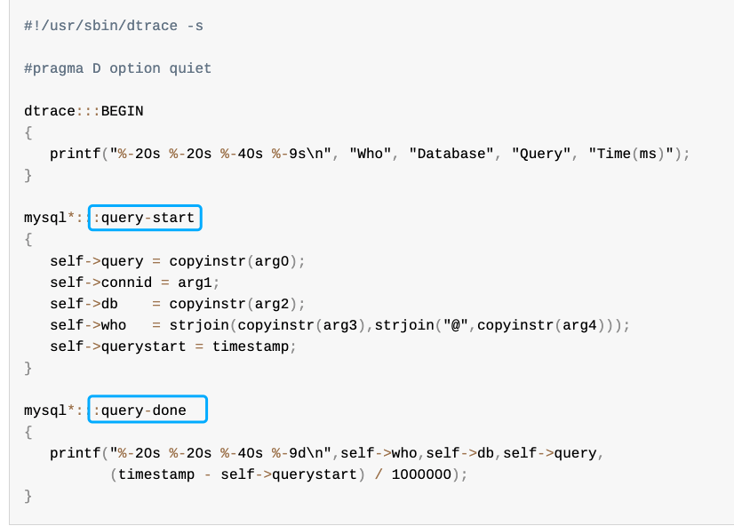
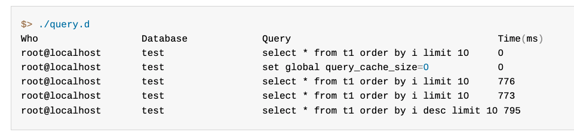
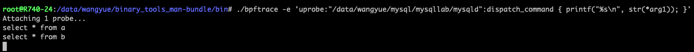
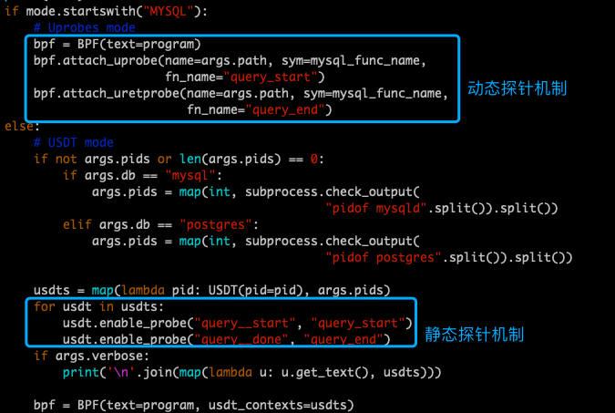

# 技术分享 | dbslower 工具学习之探针使用

**原文链接**: https://opensource.actionsky.com/20220614-bcc/
**分类**: 技术干货
**发布时间**: 2022-06-21T01:12:12-08:00

---

作者：王悦
Copyright (C) 2021 wingYue
本文来源：原创投稿
*爱可生开源社区出品，原创内容未经授权不得随意使用，转载请联系小编并注明来源。
最近使用了 bcc 工具集中的 dbslower ，这个工具可以探测 MySQL 指定阈值下的慢 query ，使用非常方便。
使用举例：

因为这个工具是一个 python 脚本，于是打开学习一下内部的机制。
首先开始的一段是一些使用案例：

这里我们关注这两个：
dbslower mysql -p 480 -m 30  # trace MySQL queries slower than 30msdbslower mysql -x $(which mysqld)  # trace MySQL queries with uprobes
同样是检测慢日志，一种是提供 pid ，另一种是提供二进制文件地址，粗看之下只是使用方式的不同，其实其中完全走向了不同的机制。
我们接着看下一段

这一段是用来确认最终使用的机制 mode ，如果提供 pid ，那么 mode=“MYSQL57” ，如果提供的是二进制地址，那么 mode=“USDT” 。
这里 USDT 指的是(Userland Statically Defined Tracing）用户态静态探针，也就是说，当使用 pid 时，脚本实际使用了 USDT 静态探针机制，而使用二进制文件时，则使用了另一种动态探针机制。要继续理解下面的段落，我们先来看一下静态探针和动态探针到底是指什么。
## 探针的分类
探针大致可以分为两类，静态探针和动态探针。
静态探针就比如我们上文看到的 USDT ，对应 MySQL 中，则是 MySQL DTrace 的实现。这类探针需要事先在代码中定义并在编译时开启。
需要说明的是 MySQL DTrace 在 MySQL5.7.18 被弃用，在 MySQL8.0 被彻底删除，所以我们只能在早期的版本中进行 DTrace 检测。MySQL 的 DTrace 包含了很多的探针，比如 query-start 和 query-done 用于检测一条语句的执行过程，比如 connection-start 和 connection-done 用于检测客户端连接的过程，这些探针都是需要在代码中实现的。且启用探针需要增加编译参数 -DENABLE_DTRACE=1。

我们来看一个官方示例直观的了解一下：
https://dev.MySQL.com/doc/refman/5.7/en/dba-DTrace-server.html
这里使用了 query-start 和 query-done 这两个探针，来获取语句执行时间
编辑 DTrace 脚本

执行效果

可惜静态探针在新版的 MySQL 上已经没有了，我们就不去深究了。
除了静态探针，还有一类是动态探针，就比如bfs技术中经常使用到的 uprobes 和 kprobes ，这类探针比较灵活，可以在程序运行时动态添加，如果熟悉代码，可谓是神器。
我使用 MySQL8.0 作为实验环境，简单写了一个利用 uprobes 打印 query 的示例。

这里的关键在于`{ printf("%s\n", str(*arg1)); }`，意思是打印出 dispatch_command方 法的第二个参数指向的内容。
同样的原理，变更一下函数，能动态打印任何我们想要的变量内容，或者利用探针写一些 bpf 脚本，能够实现许多功能，十分好用。
好了，回到我们的 dbslower 脚本上来。实际上这个脚本同时实现了静态探针和动态探针两种机制。

当我们使用 pid 时，比如`dbslower MySQL -p 480 -m 30` ，变量 mode 值为 “USDT” ，走入了上图的 else 段落，即利用了`query__start`和`query__done` 这两个静态探针，当探针被触发时，挂载到对应的处理函数`query_start`和`query_end`，这两个处理函数中的逻辑很简单，就是获取对应的 query 内容，记录时间等，有兴趣的话可以去脚本中查看，这里就不罗列了。
另一种情况，当我们使用二进制文件地址时，比如`dbslower MySQL -x $(which MySQLd)`  ，变量 mode 值为 “MYSQL57” ，走入了上图的if段落，mysql_func_name 在脚本中被赋予的值是 dispatch_command 函数，即利用了 bfp ，在函数 dispatch_command 执行前后插入了动态探针，同样的，当探针被触发时，挂载到对应的处理函数`query_start`和`query_end`进行时间的计算。
## 总结
- dbslower 脚本利用探针检测 MySQL query 执行时间。
- 当 dbslower 使用 pid 时，实际利用了静态探针机制，需要在编译时开启-DENABLE_DTRACE=1 ，且该机制在 MySQL 新版本中被删除了，需要特别注意。
- 当 dbslower 使用 mysqld 二进制路径时，实际是利用了动态探针机制，动态探针可以在程序运行时动态添加，无论新旧版本的 MySQL 都可以使用。
- bpf 的 uprobe 动态探针十分灵活，熟练使用之后，对一些故障排查场景是一大利器，缺点是多数情况下需要对照代码进行配置。