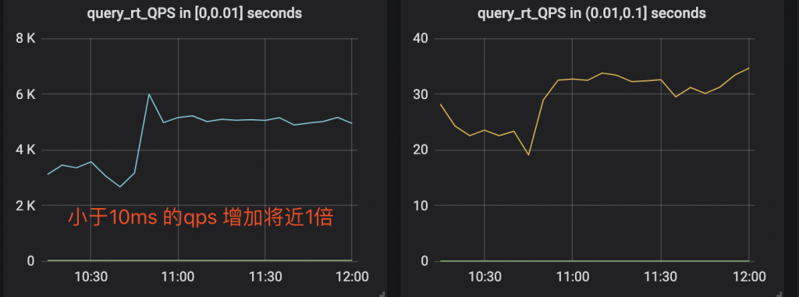
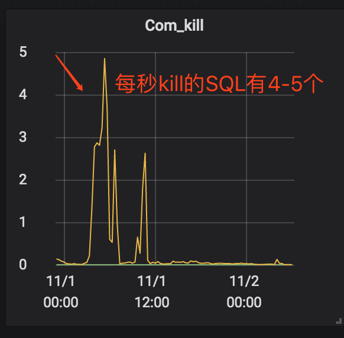

# 技术分享 | delete 语句引发大量 sql 被 kill 问题分析

**原文链接**: https://opensource.actionsky.com/20191113-mysql/
**分类**: MySQL 新特性
**发布时间**: 2019-11-13T00:11:22-08:00

---

> **作者：****王航威**
有赞 MySQL DBA，擅长分析和解决数据库的性能问题，利用自动化工具解决日常需求。
**本文建议PC端观看，效果更佳。**
**现象**
某个数据库经常在某个时间点，比如凌晨 2 点或者白天某些时间段发出如下报警：
- `[Critical][prod][mysql] - 超200 kill SQL/分钟`
- `[P0][PROBLEM][all(#2) db_data.Com_kill db=XXXX[m]:3306 10.53333>=3.3]`
- `[O1 2019-11-01 03:40:00]`
报警的意思是每分钟超过 200 个 SQL 被 kill，是一个严重告警级别，会打电话给 DBA。大半夜报警的确令人不爽，那么如何解决这个问题呢？通过检查日志，我们发现被 kill 的 SQL 都是 delete 语句。业务方其实会定时的跑删除任务，这个任务涉及到 N 多个表，删除任务持续时间比较长，所以白天和晚上都有一定概率会触发 sql-killer，然后报警。> 在有赞的数据库运维体系中，每个实例都会配置一个 sql-killer 的实时工具，用于 kill query 超过指定阈值的 SQL 请求（类似 pt-killer）。
**初步分析**在之前的案例分析过程中，碰到过因为长事务导致特定表上面的查询耗时增加的问题。经分析发现，这次被 kill 的 SQL 是分布在各个表上面，而且查询发现并不存在长事务。分析问题发生时候的数据库快照信息，QPS 都很低，除了差不多 10 TPS 的 delete 和几十的 select，没有发现有问题的 SQL。分析当时的 `show engine innodb status` 的信息，发现每次出问题的时候都会出现一些 latch 的等待，如下图所示。
											
找到对应的代码行数
											
看代码锁位置像是在等待各种 Buffer Pool 的各种 latch。为啥会等待在这里呢，又没有 DDL 相关的 SQL，于是百思不得其解。问题诊断一时间陷入困境。
**抽丝剥茧**由于等待和 Buffer Pool 的各种 latch 相关，而且 delete 操作本身会产生大量脏数据，那会不会跟刷脏页操作相关呢？我们看下 SQL 被 kill 的量和刷脏页的量之间的关系
											
											
发现每秒刷脏页的量和 SQL 被 kill 的量的曲线有点相近，看着刷脏页的量挺大的，但是每秒 delete 的 TPS 又不是很高，为啥这么低的 TPS 会让刷脏页频率抖动以及 SQL 执行变慢呢？曾经换过不同批次的机器，发现问题依旧，并没有改善，说明并不是机器本身的问题。继续浏览 buffer pool 相关的监控指标，像是发现新大陆一样的发现了一个异常指标
											
脏页比例达到了快 90% ！！！太吓人了！！！为啥脏页比例会达到 90% 呢，无非就是刷脏页的速度跟不上产生的速度，要么就是 IO 能力不行，要么就是产生脏页的速度过快，要么就是内存池太小，导致 Buffer Pool 被脏页占满。
那么这个脏页比例达到快 90% 会有什么问题呢？MySQL 有两个关于脏页的参数- `# yzsql    3306 param  dirty`
- `Variable_name    Value`
- `innodb_max_dirty_pages_pct         75.000000`
- `innodb_max_dirty_pages_pct_lwm     50.000000`
我们查看下官方定义innodb_max_dirty_pages_pct：> InnoDB tries to flush data from the buffer pool so that the percentage of dirty pages does not exceed this value. The default value is 75.
innodb_max_dirty_pages_pct 是为了避免脏页比例大于 75%，改变该参数不会影响刷脏页的速度。
innodb_max_dirty_pages_pct_lwm：> Defines a low water mark representing the percentage of dirty pages at which preflushing is enabled to control the dirty page ratio. The default of 0 disables the pre-flushing behavior entirely.
innodb_max_dirty_pages_pct_lwm 表示的是当脏页比例达到该参数表示的低水位时候，刷脏线程就开始预刷脏来控制脏页比例，避免达到innodb_max_dirty_pages_pct 。刷脏页的最大 IO 能力是受 innodb_io_capacity 和 innodb_io_capacity_max 控制。
生产上我们将 innodb_max_dirty_pages_pct_lwm 设置成了50当脏页比例大于 innodb_max_dirty_pages_pct 时候，InnoDB 会进行非常激烈的刷脏页操作，但是由于 DELETE 操作还是在进行，脏页产生的速度还是非常快，刷脏页的速度还是跟不上脏页产生的速度。为了避免脏页比例进一步扩大，更新将会被堵塞，从而导致 DELETE 执行变慢，直至被 KILL。
发现问题之后，根据我们之前的假设，有三种解决方案：1. 调大 io_capacity ，但是由于主机是多实例部署，IO 占用已经比较高，PASS。2. 降低脏页产生速度，也就是调低 DELETE 速度，因为数据产生的速度很快，为了避免删除跟不上插入的速度，也被 PASS。3. 调大 Buffer Pool，可以容纳更多的脏页。说干就干，得益于 MySQL 5.7 的在线调整 Buffer Pool，立马将 Buffer Pool Size 扩了一倍，效果非常显著
											
											
											
											
脏页比例立马下降，被 kill 的 SQL 也下降了。平均 SQL rt 下降很多。
**总结**
得益于 MySQL 的开源，很多错误都可以直接确认到对应的代码，大致定位到问题发生的地方，给问题排查带来了很多方便。同时对 MySQL buffer pool 的命中率以及脏页比例也要多多关注，对 SQL 的性能都有很大的影响。
**社区近期动态**
**No.1**
**Mycat 问题免费诊断**
诊断范围支持：
Mycat 的故障诊断、源码分析、性能优化
服务支持渠道：
技术交流群，进群后可提问
QQ群（669663113）
社区通道，邮件&电话
osc@actionsky.com
现场拜访，线下实地，1天免费拜访
关注“爱可生开源社区”公众号，回复关键字“Mycat”，获取活动详情。
**No.2**
**社区技术内容征稿**
征稿内容：
格式：.md/.doc/.txt
主题：MySQL、分布式中间件DBLE、数据传输组件DTLE相关技术内容
要求：原创且未发布过
奖励：作者署名；200元京东E卡+社区周边
投稿方式：
邮箱：osc@actionsky.com
格式：[投稿]姓名+文章标题
以附件形式发送，正文需注明姓名、手机号、微信号，以便小编及时联系