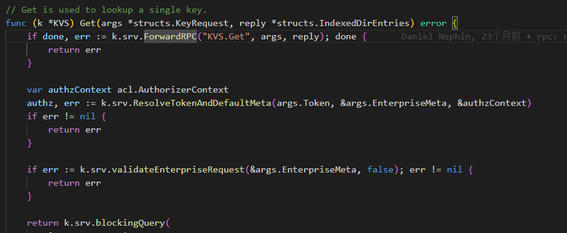
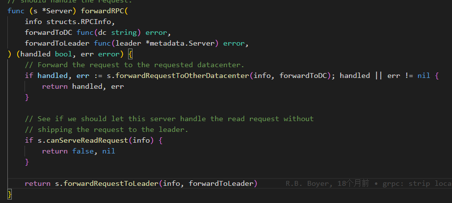
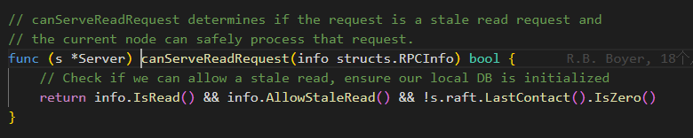
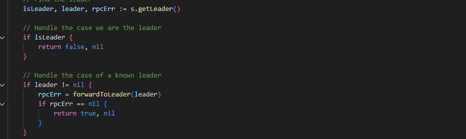
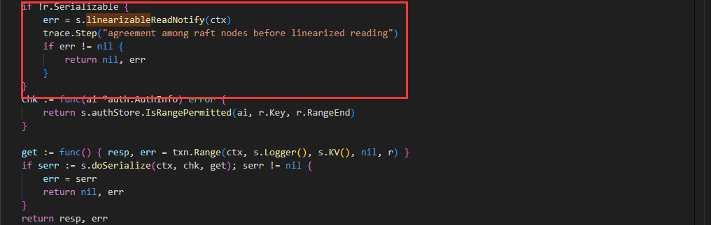
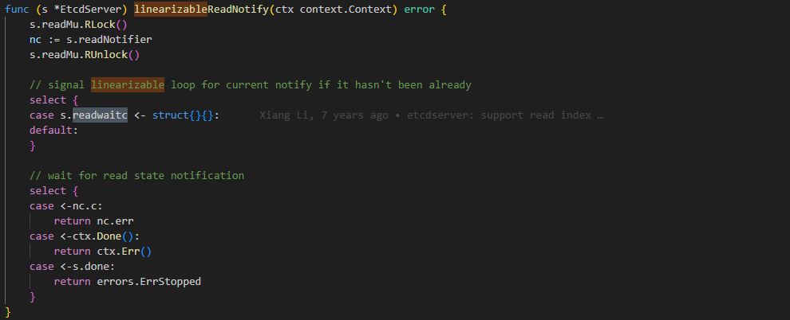
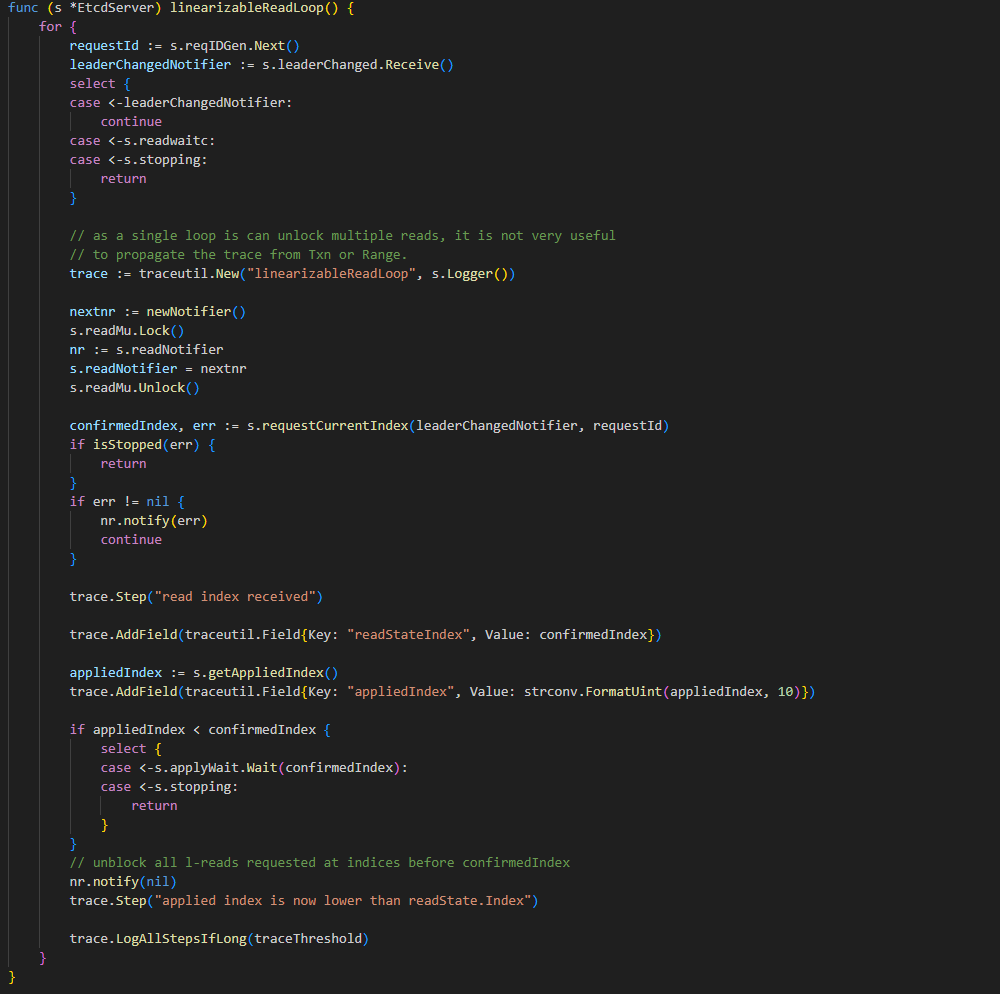

# 技术分享 | etcd 与 Consul 的一致性读对比

**原文链接**: https://opensource.actionsky.com/%e6%8a%80%e6%9c%af%e5%88%86%e4%ba%ab-etcd-%e4%b8%8e-consul-%e7%9a%84%e4%b8%80%e8%87%b4%e6%80%a7%e8%af%bb%e5%af%b9%e6%af%94/
**分类**: 技术干货
**发布时间**: 2023-12-06T00:03:47-08:00

---

本文分享和对比了 etcd 和 Consul 这两个存储的一致性读的实现。
> 作者：戴岳兵，爱可生研发中心工程师，负责项目的需求开发与维护工作。
爱可生开源社区出品，原创内容未经授权不得随意使用，转载请联系小编并注明来源。
本文约 900 字，预计阅读需要 3 分钟。
[etcd](https://etcd.io/) 和 [Consul](https://www.consul.io/) 是现在比较流行的分布式一致性 KV 存储，本文就来分享和对比一下这两个存储的一致性读的实现。
# Consul 一致性读的实现
Consul 有三种读模式：
- default
- consistent
- stale
其中 stale 是非一致性的读模式，而 default 和 consistent 是一致性的。
consistent 和 default 的区别在于 consistent 在读之前还会向各个节点确认自己是否还是 Leader，以防止在读之前的一瞬间变为 Follower，导致读取到旧值。
接下来我们看看具体实现的代码：

在 `Get` 方法的一开始 Consul 就调用了 `ForwardRPC` 方法来转发 RPC 请求，如果转发请求成功就直接返回。
如果转发请求没完成，就会取调用 `blockingQuery` 来查询本地的存储返回结果。
我们再来看一下 `ForwardRPC` 内部的实现。
.png)

可以看到 `ForwardRPC` 方法内部主要做了三件事情：
- 如果需要，转发请求给其他 DC
- 判断当前节点是否能处理这个读请求
- 如果不能处理，转发请求给 Leader
我们再来看看第 2 步 Consul 是如何判断的。

其中 `info.IsRead` 用来判断是不是一个读请求，`info.AllowStaleRead` 判断 HTTP 请求参数中的 `AllowStale`，为 `false` 时即为一致性的读请求，而最后判断是否已经跟 Leader 交互过。
所以当一个请求是一致性读请求时就会走到第 3 步将请求转发到 Leader 上。

而在转发 Leader 时会判断自身是不是 Leader，如果不是才会转发。
## 小结
从这几段逻辑可以看出，Consul 的一致性读是通过转发读请求给 Leader 来实现的。
# etcd 一致性读的实现
etcd 的读分为串行读（Serialize）和线性读（Linearizable）两种模式。其中线性读是一致性的读模式。
同样的我们来看下一致性读的实现：

可以看到串行读和线性读的区别只是在串行读之前调用了 `linearizableReadNotify` 方法。

而 `linearizableReadNotify` 中也只是简单的给 `s.readwaitc` 发信号然后等待结果。
这个信号将会在 `linearizableReadLoop` 方法中处理。

可以看到 `linearizableReadLoop` 方法中通过 `requestCurrentIndex` 方法获得了一个叫做 `confirmedIndex` 的 `index`。
`requestCurrentIndex` 会向 Leader 节点发送 `MsgReadIndex` 消息，以获取 Leader 节点当前提交的最新的 `index`。然后再用本地的 `appliedIndex` 和 `confirmedIndex` 进行对比，如果本地已应用的 index 小于 `confirmedIndex` 则进行等待，直到追上 `confirmedIndex` 才会调用 `nr.notify` 发送通知信号解除 `linearizableReadNotify` 的等待进行后续的串行读操作。
也就是说 etcd 在做一致性读时，会先从 Leader 节点获取 Leader 节点当前最新的 `commited index`，然后和本地的 `applied index` 进行对比，等到本地应用的日志追上 Leader 时，才进行后续的串行读操作。
# 总结
从实现上来说 Consul 的一致性读的实现更加简单直接，但是可能会对 Leader 节点的性能造成一些影响。
而相对来说 etcd 的实现更加复杂但是讨巧，也充分利用到了每个节点的资源。