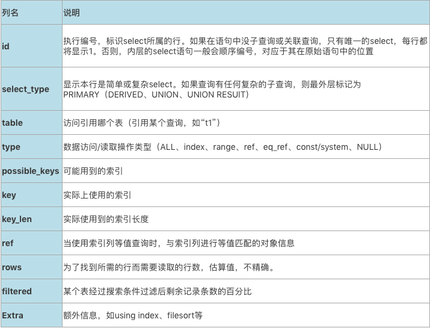
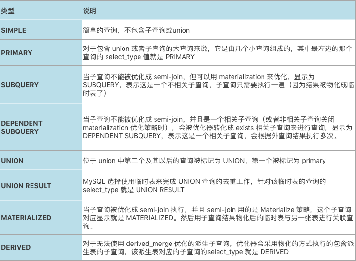
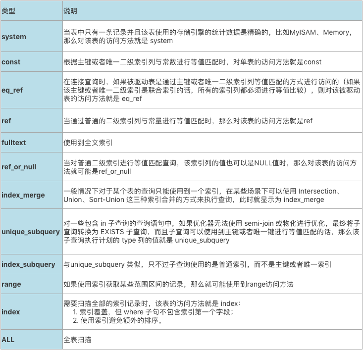
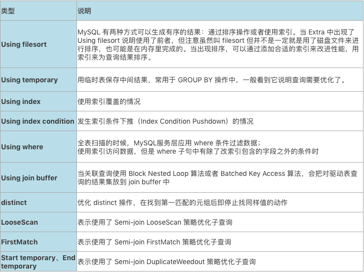

# 技术分享 | explain 执行计划详解（1）

**原文链接**: https://opensource.actionsky.com/20210202-explain/
**分类**: 技术干货
**发布时间**: 2021-02-02T00:36:10-08:00

---

作者：胡呈清
爱可生 DBA 团队成员，擅长故障分析、性能优化，个人博客：https://www.jianshu.com/u/a95ec11f67a8，欢迎讨论。
本文来源：原创投稿*爱可生开源社区出品，原创内容未经授权不得随意使用，转载请联系小编并注明来源。
## 执行计划字段概要说明
											
#### id
查询语句中每出现一个 SELECT 关键字，MySQL 就会为它分配一个唯一的 id 值。也有例外，比如优化器对子查询做了 semi-join 优化时，和关联查询一样两个查询的 id 是一样的：
`mysql> explain select * from t1 where a in (select b from t2 where t2.b=100);
+----+-------------+-------+------------+------+---------------+------+---------+-------+------+----------+--------------------------------------------------------------------+
| id | select_type | table | partitions | type | possible_keys | key  | key_len | ref   | rows | filtered | Extra                                                              |
+----+-------------+-------+------------+------+---------------+------+---------+-------+------+----------+--------------------------------------------------------------------+
|  1 | SIMPLE      | t1    | NULL       | ref  | a             | a    | 5       | const |    1 |   100.00 | NULL                                                               |
|  1 | SIMPLE      | t2    | NULL       | ALL  | NULL          | NULL | NULL    | NULL  |    1 |   100.00 | Using where; FirstMatch(t1); Using join buffer (Block Nested Loop) |
+----+-------------+-------+------------+------+---------------+------+---------+-------+------+----------+--------------------------------------------------------------------+`
另外一个比较特殊的是 id 为 NULL，比如：
`mysql> explain select * from t1 union select * from t2;
+----+--------------+------------+------------+------+---------------+------+---------+------+------+----------+-----------------+
| id | select_type  | table      | partitions | type | possible_keys | key  | key_len | ref  | rows | filtered | Extra           |
+----+--------------+------------+------------+------+---------------+------+---------+------+------+----------+-----------------+
|  1 | PRIMARY      | t1         | NULL       | ALL  | NULL          | NULL | NULL    | NULL | 1000 |   100.00 | NULL            |
|  2 | UNION        | t2         | NULL       | ALL  | NULL          | NULL | NULL    | NULL |    1 |   100.00 | NULL            |
| NULL | UNION RESULT | <union1,2> | NULL       | ALL  | NULL          | NULL | NULL    | NULL | NULL |     NULL | Using temporary |
+----+--------------+------------+------------+------+---------------+------+---------+------+------+----------+-----------------+
`这是因为 union 结果是要去重的，内部创建了一个 <union1,2> 名字的临时表，把查询 1 和查询 2 的结果集都合并到这个临时表中，利用唯一键进行去重，这种情况下查询 id 就为 NULL。
#### select_type
表示查询的类型,
											
**1. SIMPLE**
查询语句中不包含 UNION 或者子查询的查询都算作是 SIMPLE 类型，比方说下边这个单表查询的 select_type 的值就是 SIMPLE：
`mysql> explain select * from t1 where b=1 order by a;
+----+-------------+-------+------------+------+---------------+-------+---------+-------+------+----------+---------------------------------------+
| id | select_type | table | partitions | type | possible_keys | key   | key_len | ref   | rows | filtered | Extra                                 |
+----+-------------+-------+------------+------+---------------+-------+---------+-------+------+----------+---------------------------------------+
|  1 | SIMPLE      | t1    | NULL       | ref  | idx_b         | idx_b | 5       | const |    1 |   100.00 | Using index condition; Using filesort |
+----+-------------+-------+------------+------+---------------+-------+---------+-------+------+----------+---------------------------------------+
`关联查询也是 SIMPLE 类型：
`mysql> explain select * from t1 join t2 on t1.a=t2.a;
+----+-------------+-------+------------+------+---------------+------+---------+-----------+------+----------+-------------+
| id | select_type | table | partitions | type | possible_keys | key  | key_len | ref       | rows | filtered | Extra       |
+----+-------------+-------+------------+------+---------------+------+---------+-----------+------+----------+-------------+
|  1 | SIMPLE      | t2    | NULL       | ALL  | a             | NULL | NULL    | NULL      |    1 |   100.00 | Using where |
|  1 | SIMPLE      | t1    | NULL       | ref  | a             | a    | 5       | hucq.t2.a |    1 |   100.00 | NULL        |
+----+-------------+-------+------------+------+---------------+------+---------+-----------+------+----------+-------------+`
**2. PRIMARY**
对于包含 union 或者子查询的大查询来说，它是由几个小查询组成的，其中最左边的那个查询的 select_type 值就是 PRIMARY，比如：
`mysql> explain select * from t1 union select * from t2;
+----+--------------+------------+------------+------+---------------+------+---------+------+------+----------+-----------------+
| id | select_type  | table      | partitions | type | possible_keys | key  | key_len | ref  | rows | filtered | Extra           |
+----+--------------+------------+------------+------+---------------+------+---------+------+------+----------+-----------------+
|  1 | PRIMARY      | t1         | NULL       | ALL  | NULL          | NULL | NULL    | NULL | 1000 |   100.00 | NULL            |
|  2 | UNION        | t2         | NULL       | ALL  | NULL          | NULL | NULL    | NULL |    1 |   100.00 | NULL            |
| NULL | UNION RESULT | <union1,2> | NULL       | ALL  | NULL          | NULL | NULL    | NULL | NULL |     NULL | Using temporary |
+----+--------------+------------+------------+------+---------------+------+---------+------+------+----------+-----------------+`
**3. UNION**
位于 union 或者 union all 查询中第二个及其以后的查询被标记为 UNION，第一个被标记为 primary ，可以对比上一个例子的效果。
**4. UNION RESULT**
MySQL 选择使用临时表来完成 UNION 查询的去重工作，针对该临时表的查询的 select_type 就是 UNION RESULT，跟上一个例子一样。
**5. SUBQUERY**
当子查询不能被优化成 semi-join，但可以用 materialization 来优化，显示为 SUBQUERY，表示这是一个不相关子查询，子查询只需要执行一遍（因为结果被物化成临时表了），举例：
`mysql> SELECT * FROM t1 WHERE t1.a IN (SELECT t2.b FROM t2 WHERE id < 10);
+----+-------------+-------+-------+---------+------+------+-------------+
| id | select_type | table | type  | key     | ref  | rows | Extra       |
+----+-------------+-------+-------+---------+------+------+-------------+
|  1 | PRIMARY     | t1    | ALL   | NULL    | NULL |  100 | Using where |
|  2 | SUBQUERY    | t2    | range | PRIMARY | NULL |    9 | Using where |
+----+-------------+-------+-------+---------+------+------+-------------+`
**6. DEPENDENT SUBQUERY**
当子查询不能被优化成 semi-join，并且是一个相关子查询（或者非相关子查询关闭 materialization 优化策略时），会被优化器转化成 exists 相关子查询来进行查询，显示为 DEPENDENT SUBQUERY，表示这是一个相关子查询，会根据外查询结果执行多次。举例：
`mysql> SELECT * FROM t1 WHERE t1.a IN (SELECT t2.b FROM t2 WHERE id < 10);
+----+--------------------+-------+-------+---------+------+----------+-------------+
| id | select_type        | table | type  | key     | rows | filtered | Extra       |
+----+--------------------+-------+-------+---------+------+----------+-------------+
|  1 | PRIMARY            | t1    | ALL   | NULL    |  100 |   100.00 | Using where |
|  2 | DEPENDENT SUBQUERY | t2    | range | PRIMARY |    9 |    10.00 | Using where |
+----+--------------------+-------+-------+---------+------+----------+-------------+`
**7. MATERIALIZED**
当子查询被优化成 semi-join 执行，并且 semi-join 用的是 Materialize 策略，这个子查询对应显示就是 MATERIALIZED，然后用子查询结果物化后的临时表与另一张表进行关联查询。举例：
`mysql> SELECT * FROM t1 WHERE t1.a IN (SELECT t2.b FROM t2 WHERE id < 10);
+----+--------------+-------------+-------+---------+---------------+------+-------------+
| id | select_type  | table       | type  | key     | ref           | rows | Extra       |
+----+--------------+-------------+-------+---------+---------------+------+-------------+
|  1 | SIMPLE       | <subquery2> | ALL   | NULL    | NULL          | NULL | Using where |
|  1 | SIMPLE       | t1          | ref   | a       | <subquery2>.b |    1 | NULL        |
|  2 | MATERIALIZED | t2          | range | PRIMARY | NULL          |    9 | Using where |
+----+--------------+-------------+-------+---------+---------------+------+-------------+`
**8. DERIVED**
对于无法使用 derived_merge 优化的派生子查询，优化器会采用物化的方式执行的包含派生表的子查询，该派生表对应的子查询的 select_type 就是 DERIVED，举例：
`mysql> explain select * from t1 join (select distinct a from t2) as derived_t2 on t1.a=derived_t2.a; 
+----+-------------+------------+------------+-------+---------------+-------------+---------+----------------+------+----------+-------------+
| id | select_type | table      | partitions | type  | possible_keys | key         | key_len | ref            | rows | filtered | Extra       |
+----+-------------+------------+------------+-------+---------------+-------------+---------+----------------+------+----------+-------------+
|  1 | PRIMARY     | t1         | NULL       | ALL   | a             | NULL        | NULL    | NULL           |  100 |   100.00 | Using where |
|  1 | PRIMARY     | <derived2> | NULL       | ref   | <auto_key0>   | <auto_key0> | 5       | join_test.t1.a |   10 |   100.00 | Using index |
|  2 | DERIVED     | t2         | NULL       | index | a             | a           | 5       | NULL           | 1000 |   100.00 | Using index |
+----+-------------+------------+------------+-------+---------------+-------------+---------+----------------+------+----------+-------------+
`关于子查询和派生表的优化策略，可具体查看对应的文章：MySQL 子查询优化、SQL 优化：derived 派生表优化。
#### type
type 显示的是访问类型，是较为重要的一个指标，结果值从好到坏依次是：system > const > eq_ref > ref > fulltext > ref_or_null > index_merge > unique_subquery > index_subquery > range > index > ALL ，一般来说，得保证查询至少达到 range 级别，最好能达到 ref。
											
**1. system**
当表中只有一条记录并且该表使用的存储引擎的统计数据是精确的，比如 MyISAM、Memory，那么对该表的访问方法就是 system：
`mysql>  explain select * from t_myisam;
+----+-------------+----------+------------+--------+---------------+------+---------+------+------+----------+-------+
| id | select_type | table    | partitions | type   | possible_keys | key  | key_len | ref  | rows | filtered | Extra |
+----+-------------+----------+------------+--------+---------------+------+---------+------+------+----------+-------+
|  1 | SIMPLE      | t_myisam | NULL       | system | NULL          | NULL | NULL    | NULL |    1 |   100.00 | NULL  |
+----+-------------+----------+------------+--------+---------------+------+---------+------+------+----------+-------+
`InnoDB 表即使只有一行，也不是 system，而是 ALL：
`mysql> explain select * from t5;                                                                                                                               +----+-------------+-------+------------+------+---------------+------+---------+------+------+----------+-------+
| id | select_type | table | partitions | type | possible_keys | key  | key_len | ref  | rows | filtered | Extra |
+----+-------------+-------+------------+------+---------------+------+---------+------+------+----------+-------+
|  1 | SIMPLE      | t5    | NULL       | ALL  | NULL          | NULL | NULL    | NULL |    1 |   100.00 | NULL  |
+----+-------------+-------+------------+------+---------------+------+---------+------+------+----------+-------+`
**2. const**
根据主键或者唯一二级索引列与单个常数进行等值匹配时（不能有多个条件用 or 连接，这属于范围查询），对单表的访问方法就是 const，举例：
`mysql> explain select * from t1 where id=100;
+----+-------------+-------+------------+-------+---------------+---------+---------+-------+------+----------+-------+
| id | select_type | table | partitions | type  | possible_keys | key     | key_len | ref   | rows | filtered | Extra |
+----+-------------+-------+------------+-------+---------------+---------+---------+-------+------+----------+-------+
|  1 | SIMPLE      | t1    | NULL       | const | PRIMARY       | PRIMARY | 4       | const |    1 |   100.00 | NULL  |
+----+-------------+-------+------------+-------+---------------+---------+---------+-------+------+----------+-------+`
**3. eq_ref**
在连接查询时，如果被驱动表是通过主键或者唯一二级索引列等值匹配的方式进行访问的（如果该主键或者唯一二级索引是联合索引的话，所有的索引列都必须进行等值比较），则对该被驱动表的访问方法就是 eq_ref，举例：
`mysql> explain select * from t1 join t2 on t1.id=t2.id where t1.a<50;
+----+-------------+-------+------------+--------+---------------+---------+---------+------------+------+----------+-------------+
| id | select_type | table | partitions | type   | possible_keys | key     | key_len | ref        | rows | filtered | Extra       |
+----+-------------+-------+------------+--------+---------------+---------+---------+------------+------+----------+-------------+
|  1 | SIMPLE      | t2    | NULL       | ALL    | PRIMARY       | NULL    | NULL    | NULL       |    1 |   100.00 | NULL        |
|  1 | SIMPLE      | t1    | NULL       | eq_ref | PRIMARY,a     | PRIMARY | 4       | hucq.t2.id |    1 |     5.00 | Using where |
+----+-------------+-------+------------+--------+---------------+---------+---------+------------+------+----------+-------------+`
**4. ref**
当通过普通的二级索引列与常量进行等值匹配时，那么对该表的访问方法就是 ref，即使匹配到的值可能是多行，举例：
`mysql> explain select * from t11 where a=100;
+----+-------------+-------+------------+------+---------------+------+---------+-------+------+----------+-------+
| id | select_type | table | partitions | type | possible_keys | key  | key_len | ref   | rows | filtered | Extra |
+----+-------------+-------+------------+------+---------------+------+---------+-------+------+----------+-------+
|  1 | SIMPLE      | t11   | NULL       | ref  | a             | a    | 5       | const |  500 |   100.00 | NULL  |
+----+-------------+-------+------------+------+---------------+------+---------+-------+------+----------+-------+`
**5. ref_or_null**
当对普通二级索引进行等值匹配查询，该索引列的值也可以是 NULL 值时，那么对该表的访问方法就可能是 ref_or_null，举例：
`mysql> explain select * from t11 where a=100 or a is null;
+----+-------------+-------+------------+-------------+---------------+------+---------+-------+------+----------+-----------------------+
| id | select_type | table | partitions | type        | possible_keys | key  | key_len | ref   | rows | filtered | Extra                 |
+----+-------------+-------+------------+-------------+---------------+------+---------+-------+------+----------+-----------------------+
|  1 | SIMPLE      | t11   | NULL       | ref_or_null | a             | a    | 5       | const |  501 |   100.00 | Using index condition |
+----+-------------+-------+------------+-------------+---------------+------+---------+-------+------+----------+-----------------------+`
**6. index_merge**
一般情况下对于某个表的查询只能使用到一个索引，在某些场景下可以使用 Intersection、Union、Sort-Union 这三种索引合并的方式来执行查询，此时就显示为 index_merge，举例：
`mysql> explain select * from t1 where a<50 or b=50;
+----+-------------+-------+------------+-------------+---------------+---------+---------+------+------+----------+----------------------------------------+
| id | select_type | table | partitions | type        | possible_keys | key     | key_len | ref  | rows | filtered | Extra                                  |
+----+-------------+-------+------------+-------------+---------------+---------+---------+------+------+----------+----------------------------------------+
|  1 | SIMPLE      | t1    | NULL       | index_merge | a,idx_b       | a,idx_b | 5,5     | NULL |   50 |   100.00 | Using sort_union(a,idx_b); Using where |
+----+-------------+-------+------------+-------------+---------------+---------+---------+------+------+----------+----------------------------------------+`
**7. unique_subquery**
对一些包含 in 子查询的查询语句中，如果优化器无法使用 semi-join 或物化进行优化，最终将子查询转换为 EXISTS 子查询，而且子查询可以使用到主键或者唯一键进行等值匹配的话，那么该子查询执行计划的type列的值就是 unique_subquery。举例：
`mysql> explain select * from t1 where a in(select id from t2 where t1.a=t2.a) or b=100;
+----+--------------------+-------+------------+-----------------+---------------+---------+---------+------+------+----------+-------------+
| id | select_type        | table | partitions | type            | possible_keys | key     | key_len | ref  | rows | filtered | Extra       |
+----+--------------------+-------+------------+-----------------+---------------+---------+---------+------+------+----------+-------------+
|  1 | PRIMARY            | t1    | NULL       | ALL             | idx_b         | NULL    | NULL    | NULL | 1000 |   100.00 | Using where |
|  2 | DEPENDENT SUBQUERY | t2    | NULL       | unique_subquery | PRIMARY,a     | PRIMARY | 4       | func |    1 |   100.00 | Using where |
+----+--------------------+-------+------------+-----------------+---------------+---------+---------+------+------+----------+-------------+`
**8. range**
如果使用索引获取某些范围区间的记录，那么就可能使用到 range 访问方法。举例：
`mysql> explain select * from t1 where a<50 and a>20;
+----+-------------+-------+------------+-------+---------------+------+---------+------+------+----------+-----------------------+
| id | select_type | table | partitions | type  | possible_keys | key  | key_len | ref  | rows | filtered | Extra                 |
+----+-------------+-------+------------+-------+---------------+------+---------+------+------+----------+-----------------------+
|  1 | SIMPLE      | t1    | NULL       | range | a             | a    | 5       | NULL |   29 |   100.00 | Using index condition |
+----+-------------+-------+------------+-------+---------------+------+---------+------+------+----------+-----------------------+
mysql> explain select * from t1 where a in(1,2,3);
+----+-------------+-------+------------+-------+---------------+------+---------+------+------+----------+-----------------------+
| id | select_type | table | partitions | type  | possible_keys | key  | key_len | ref  | rows | filtered | Extra                 |
+----+-------------+-------+------------+-------+---------------+------+---------+------+------+----------+-----------------------+
|  1 | SIMPLE      | t1    | NULL       | range | a             | a    | 5       | NULL |    3 |   100.00 | Using index condition |
+----+-------------+-------+------------+-------+---------------+------+---------+------+------+----------+-----------------------+`
**9. index**
需要扫描全部的索引记录时，该表的访问方法就是 index，成本很高。举例：
`mysql> EXPLAIN SELECT key_part1 FROM s1 WHERE key_part3 = 'a';
+----+-------------+-------+------------+-------+---------------+--------------+---------+------+------+----------+--------------------------+
| id | select_type | table | partitions | type  | possible_keys | key          | key_len | ref  | rows | filtered | Extra                    |
+----+-------------+-------+------------+-------+---------------+--------------+---------+------+------+----------+--------------------------+
|  1 | SIMPLE      | s1    | NULL       | index | NULL          | idx_key_part | 909     | NULL | 9688 |    10.00 | Using where; Using index |
+----+-------------+-------+------------+-------+---------------+--------------+---------+------+------+----------+--------------------------+`
#### possible_keys 和 key
在 EXPLAIN 语句输出的执行计划中，possible_keys 列表示在某个查询语句中，对某个表执行单表查询时可能用到的索引有哪些，key 列表示实际用到的索引有哪些。
有些时候使用到的索引未必在 passible_keys 中，上面 type 为 index 的示例中，passible_keys 显示为 NULL，但实际 key 显示是使用到索引的。possible_keys 列中的值并不是越多越好，可能使用的索引越多，查询优化器计算查询成本时就得花费更长时间，所以如果可以的话，尽量删除那些用不到的索引。
#### key_len
key_len 列显示 MySQL 决定使用的键长度。如果键是 NULL，则长度为 NULL。使用的索引的长度。在不损失精确性的情况下，长度越短越好 。
#### ref
当使用索引列等值匹配的条件去执行查询时，也就是在访问方法是 const、eq_ref、ref、ref_or_null、unique_subquery、index_subquery 其中之一时，ref 列展示的就是与索引列作等值匹配的对象是啥。如果不是等值查询，则显示为 NULL。
比如单表查询时肯定是个常数 const：
`mysql> explain select * from t1 where a=100;
+----+-------------+-------+------------+------+---------------+------+---------+-------+------+----------+-------+
| id | select_type | table | partitions | type | possible_keys | key  | key_len | ref   | rows | filtered | Extra |
+----+-------------+-------+------------+------+---------------+------+---------+-------+------+----------+-------+
|  1 | SIMPLE      | t1    | NULL       | ref  | a             | a    | 5       | const |    1 |   100.00 | NULL  |
+----+-------------+-------+------------+------+---------------+------+---------+-------+------+----------+-------+
`而关联查询中则是驱动表的关联字段 t2.a：
`mysql> explain select * from t1 join t2 on t1.a=t2.a where t1.a<50;                                                                                            
+----+-------------+-------+------------+-------+---------------+------+---------+-----------+------+----------+-----------------------+
| id | select_type | table | partitions | type  | possible_keys | key  | key_len | ref       | rows | filtered | Extra                 |
+----+-------------+-------+------------+-------+---------------+------+---------+-----------+------+----------+-----------------------+
|  1 | SIMPLE      | t2    | NULL       | range | a             | a    | 5       | NULL      |    1 |   100.00 | Using index condition |
|  1 | SIMPLE      | t1    | NULL       | ref   | a             | a    | 5       | hucq.t2.a |    1 |   100.00 | NULL                  |
+----+-------------+-------+------------+-------+---------------+------+---------+-----------+------+----------+-----------------------+`
#### rows
如果查询优化器决定使用全表扫描的方式对某个表执行查询时，执行计划的 rows 列就代表预计需要扫描的行数；如果使用索引来执行查询时，执行计划的 rows 列就代表预计扫描的索引记录行数。
这有可能是个精确值，也可能是个估算值，计算方法有 index dive 和基于统计索引信息的估算。
#### filtered
对于单表查询来说：
- 如果是全表扫描，filtered 值代表满足 where 条件的行数占表总行数的百分比；
- 如果是使用索引来执行查询，filtered 值代表从索引上取得数据后，满足其他过滤条件的数据行数的占比。
`mysql> explain select * from t1 where a<100 and b > 100;
+----+-------------+-------+------------+-------+---------------+------+---------+------+------+----------+------------------------------------+
| id | select_type | table | partitions | type  | possible_keys | key  | key_len | ref  | rows | filtered | Extra                              |
+----+-------------+-------+------------+-------+---------------+------+---------+------+------+----------+------------------------------------+
|  1 | SIMPLE      | t1    | NULL       | range | a             | a    | 5       | NULL |   99 |    33.33 | Using index condition; Using where |
+----+-------------+-------+------------+-------+---------------+------+---------+------+------+----------+------------------------------------+
`上面示例中，从 a 索引上取得 99 行数据，优化器估算认为这 99 行数据中有 33.33% 满足 b > 100 这个条件。对于单表查询来说，这个意义不大。
对于关联查询来说，驱动表的 rows*(filtered/100) 代表优化器认为的扇出，对于关联查询的成本估算有很大的影响。举例：
`mysql> EXPLAIN SELECT * FROM s1 INNER JOIN s2 ON s1.key1 = s2.key1 WHERE s1.common_field = 'a';
+----+-------------+-------+------------+------+---------------+----------+---------+-------------------+------+----------+-------------+
| id | select_type | table | partitions | type | possible_keys | key      | key_len | ref               | rows | filtered | Extra       |
+----+-------------+-------+------------+------+---------------+----------+---------+-------------------+------+----------+-------------+
|  1 | SIMPLE      | s1    | NULL       | ALL  | idx_key1      | NULL     | NULL    | NULL              | 9688 |    10.00 | Using where |
|  1 | SIMPLE      | s2    | NULL       | ref  | idx_key1      | idx_key1 | 303     | xiaohaizi.s1.key1 |    1 |   100.00 | NULL        |
+----+-------------+-------+------------+------+---------------+----------+---------+-------------------+------+----------+-------------+
`从执行计划中可以看出来，查询优化器打算把 s1 当作驱动表，s2 当作被驱动表。我们可以看到驱动表 s1 表的执行计划的 rows 列为 9688， filtered 列为 10.00，这意味着驱动表 s1 的扇出值就是 9688 × 10.00% = 968.8，这说明还要对被驱动表执行大约 968 次查询。
## Extra
Extra 是 EXPLAIN 输出中另外一个很重要的列，该列显示 MySQL 在查询过程中的一些详细信息。
											
由于对其中几个状态有疑惑，所以这部分内容写到另一篇文章中单独讨论。
**文章推荐：**
[技术分享 | mysqlsh 命令行模式 & 密码保存](https://opensource.actionsky.com/20210126-mysqlsh/)
[技术分享 | Semi-join Materialization 子查询优化策略](https://opensource.actionsky.com/20200921-semi-join/)
[技术分享 | 讨论：MySQL 从库单表恢复](https://opensource.actionsky.com/20200914-mysql/)