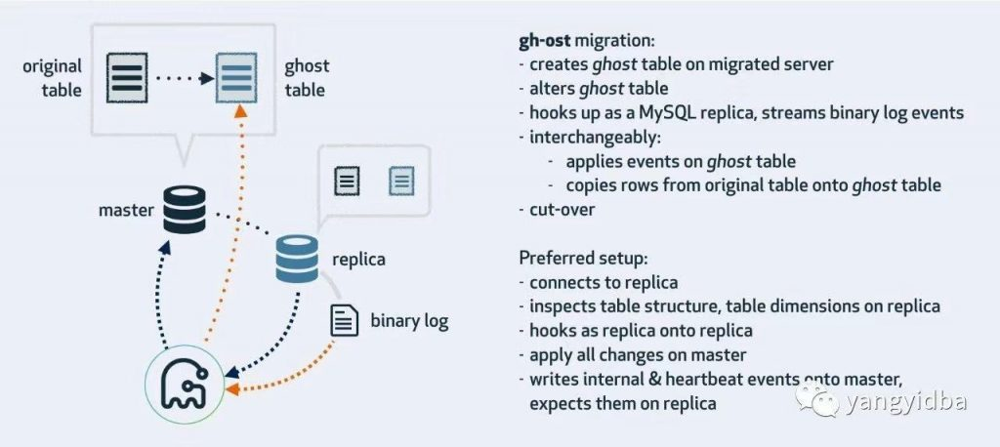
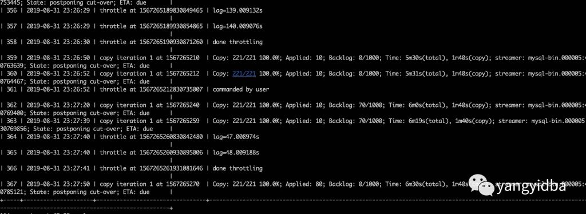

# 技术分享 | gh-ost 在线 ddl 变更工具​

**原文链接**: https://opensource.actionsky.com/20190917-mysql/
**分类**: MySQL 新特性
**发布时间**: 2019-09-17T18:52:36-08:00

---

### 一、前言
作为 MySQL DBA，相信我们大家都会对大表变更（大于10G 以上的）比较头疼，尤其是某些 DDL 会锁表，影响业务可持续性。目前通用的方案使用 Percona 公司开源的 pt-osc 工具解决导致锁表的操作，还有一款 github 基于 go 语言开发的 gh-ost。本文主要介绍 gh-ost 使用方法，其工作原理放到下一篇文章介绍。
### 二、使用
#### 2.1 gh-ost 介绍
gh-ost 作为一个伪装的备库，可以从主库/备库上拉取 binlog，过滤之后重新应用到主库上去，相当于主库上的增量操作通过 binlog 又应用回主库本身，不过是应用在幽灵表上。
											
**a. 连接到从库，在主库做迁移**这是 gh-ost 默认的工作方式。gh-ost 将会检查从库状态，找到集群结构中的主库并连接，接下来进行迁移操作：1. 行数据在主库上读写
2. 读取从库的二进制日志，将变更应用到主库
3. 在从库收集表格式，字段&索引，行数等信息
4. 在从库上读取内部的变更事件（如心跳事件）
5. 在主库切换表
如果你的主库的日志格式是 SBR，工具也可以正常工作。但从库必须启用二级制日志( `log_bin`,`log_slave_updates`) 并且设置 `binlog_format=ROW` 。
**b. 连接到主库**
直接连接到主库构造 slave，在主库上进行 copy 数据和应用 binlog，通过指定 &#8211;allow-on-master 参数即可。**当然主库的 binlog 模式必须是 row模式**。
**c. 在从库迁移/测试**该模式会在从库执行迁移操作。gh-ost 会简单的连接到主库，此后所有的操作都在从库执行，不会对主库进行任何的改动。整个操作过程中，gh-ost 将控制速度保证从库可以及时的进行数据同步> &#8211;migrate-on-replica 表示 gh-ost 会直接在从库上进行迁移操作。即使在复制运行阶段也可以进行表的切换操作。&#8211;test-on-replica 表示 迁移操作只是为了测试在切换之前复制会停止，然后会进行切换操作，然后在切换回来，你的原始表最终还是原始表。两个表都会保存下来，复制操作是停止的。你可以对这两个表进行一致性检查等测试操作。
### 三、实践
> https://github.com/github/gh-ost
#### 3.1 参数说明：
这里列出比较重要的参数，大家可以通过如下命令获取比较详细的参数以及其解释。- `gh-ost --help`
- `-allow-master-master:`
- `是否允许gh-ost运行在双主复制架构中，一般与-assume-master-host参数一起使用`
- `-allow-nullable-unique-key:`
- `允许gh-ost在数据迁移依赖的唯一键可以为NULL，默认为不允许为NULL的唯一键。如果数据迁移(migrate)依赖的唯一键允许NULL值，则可能造成数据不正确，请谨慎使用。`
- `-allow-on-master:`
- `允许gh-ost直接运行在主库上。默认gh-ost连接的从库。`
- `-alter string:`
- `DDL语句`
- `-assume-master-host string:`
- `为gh-ost指定一个主库，格式为”ip:port”或者”hostname:port”。在这主主架构里比较有用，或则在gh-ost发现不到主的时候有用。`
- `-assume-rbr:`
- `确认gh-ost连接的数据库实例的binlog_format=ROW的情况下，可以指定-assume-rbr，这样可以禁止从库上运行stop slave,start slave,执行gh-ost用户也不需要SUPER权限。`
- `-chunk-size int:`
- `在每次迭代中处理的行数量(允许范围：100-100000)，默认值为1000。`
- `-concurrent-rowcount:`
- `该参数如果为True(默认值)，则进行row-copy之后，估算统计行数(使用explain select count(*)方式)，并调整ETA时间，否则，gh-ost首先预估统计行数，然后开始row-copy。`
- `-conf string:gh-ost的配置文件路径。`
- `-critical-load string:`
- `一系列逗号分隔的status-name=values组成，当MySQL中status超过对应的values，gh-ost将会退出。-critical-load Threads_connected=20,Connections=1500，指的是当MySQL中的状态值Threads_connected>20,Connections>1500的时候，gh-ost将会由于该数据库严重负载而停止并退出。`
- `-critical-load-hibernate-seconds int :`
- `负载达到critical-load时，gh-ost在指定的时间内进入休眠状态。它不会读/写任何来自任何服务器的任何内容。`
- `-critical-load-interval-millis int:`
- `当值为0时，当达到-critical-load，gh-ost立即退出。当值不为0时，当达到-critical-load，gh-ost会在-critical-load-interval-millis秒数后，再次进行检查，再次检查依旧达到-critical-load，gh-ost将会退出。`
- `-cut-over string:`
- `选择cut-over类型:`
- `atomic/two-step，atomic(默认)类型的cut-over是github的算法，two-step采用的是facebook-OSC的算法。`
- `-cut-over-exponential-backoff`
- `-cut-over-lock-timeout-seconds int:`
- `gh-ost在cut-over阶段最大的锁等待时间，当锁超时时，gh-ost的cut-over将重试。(默认值：3)`
- `-database string:`
- `数据库名称。`
- `-default-retries int:`
- `各种操作在panick前重试次数。(默认为60)`
- `-dml-batch-size int:`
- `在单个事务中应用DML事件的批量大小（范围1-100）（默认值为10）`
- `-exact-rowcount:`
- `准确统计表行数(使用select count(*)的方式)，得到更准确的预估时间。`
- `-execute:`
- `实际执行alter&migrate表，默认为noop，不执行，仅仅做测试并退出，如果想要ALTER TABLE语句真正落实到数据库中去，需要明确指定-execute`
- `-exponential-backoff-max-interval int`
- `-force-named-cut-over:`
- `如果为true，则'unpostpone | cut-over'交互式命令必须命名迁移的表`
- `-heartbeat-interval-millis int:`
- `gh-ost心跳频率值，默认为500`
- `-initially-drop-ghost-table:`
- `gh-ost操作之前，检查并删除已经存在的ghost表。该参数不建议使用，请手动处理原来存在的ghost表。默认不启用该参数，gh-ost直接退出操作。`
- `-initially-drop-old-table:`
- `gh-ost操作之前，检查并删除已经存在的旧表。该参数不建议使用，请手动处理原来存在的ghost表。默认不启用该参数，gh-ost直接退出操作。`
- `-initially-drop-socket-file:`
- `gh-ost强制删除已经存在的socket文件。该参数不建议使用，可能会删除一个正在运行的gh-ost程序，导致DDL失败。`
- `-max-lag-millis int:`
- `主从复制最大延迟时间，当主从复制延迟时间超过该值后，gh-ost将采取节流(throttle)措施，默认值：1500s。`
- `-max-load string:`
- `逗号分隔状态名称=阈值，如：'Threads_running=100,Threads_connected=500'. When status exceeds threshold, app throttles writes`
- `-migrate-on-replica:`
- `gh-ost的数据迁移(migrate)运行在从库上，而不是主库上。`
- `-nice-ratio float:`
- `每次chunk时间段的休眠时间，范围[0.0…100.0]。0：每个chunk时间段不休眠，即一个chunk接着一个chunk执行；1：每row-copy 1毫秒，则另外休眠1毫秒；0.7：每row-copy 10毫秒，则另外休眠7毫秒。`
- `-ok-to-drop-table:`
- `gh-ost操作结束后，删除旧表，默认状态是不删除旧表，会存在_tablename_del表。`
- `-panic-flag-file string:`
- `当这个文件被创建，gh-ost将会立即退出。`
- `-password string :`
- `MySQL密码`
- `-port int ：`
- `MySQL端口，最好用从库`
- `-postpone-cut-over-flag-file string：`
- `当这个文件存在的时候，gh-ost的cut-over阶段将会被推迟，数据仍然在复制，直到该文件被删除。`
- `-skip-foreign-key-checks:`
- `确定你的表上没有外键时，设置为'true'，并且希望跳过gh-ost验证的时间-skip-renamed-columns ALTER`
- `-switch-to-rbr:`
- `让gh-ost自动将从库的binlog_format转换为ROW格式。`
- `-table string:`
- `表名`
- `-throttle-additional-flag-file string:`
- `当该文件被创建后，gh-ost操作立即停止。该参数可以用在多个gh-ost同时操作的时候，创建一个文件，让所有的gh-ost操作停止，或者删除这个文件，让所有的gh-ost操作恢复。`
- `-throttle-control-replicas string:`
- `列出所有需要被检查主从复制延迟的从库。`
- `-throttle-flag-file string:`
- `当该文件被创建后，gh-ost操作立即停止。该参数适合控制单个gh-ost操作。-throttle-additional-flag-file string适合控制多个gh-ost操作。`
- `-throttle-query string:`
- `节流查询。每秒钟执行一次。当返回值=0时不需要节流，当返回值>0时，需要执行节流操作。该查询会在数据迁移(migrated)服务器上操作，所以请确保该查询是轻量级的。`
- `-timestamp-old-table:`
- `在旧表名中使用时间戳。这会使旧表名称具有唯一且无冲突的交叉迁移。`
- `-user string :MYSQL用户`
#### 3.2 执行 ddl
测试例子对 test.b 重建表 alter table b engine=innodb；
- `/opt/gh-ost/bin/gh-ost \`
- `--max-load=Threads_running=20 \`
- `--critical-load=Threads_running=50 \`
- `--critical-load-interval-millis=5000 \`
- `--chunk-size=1000 \`
- `--user="root" \`
- `--password="" \`
- `--host='127.0.0.1' \`
- `--port=3316 \`
- `--database="test" \`
- `--table="b" \`
- `--verbose \`
- `--alter="engine=innodb" \`
- `--assume-rbr \`
- `--cut-over=default \`
- `--cut-over-lock-timeout-seconds=1 \`
- `--dml-batch-size=10 \`
- `--allow-on-master \`
- `--concurrent-rowcount \`
- `--default-retries=10 \`
- `--heartbeat-interval-millis=2000 \`
- `--panic-flag-file=/tmp/ghost.panic.flag \`
- `--postpone-cut-over-flag-file=/tmp/ghost.postpone.flag \`
- `--timestamp-old-table \`
- `--execute 2>&1 | tee  /tmp/rebuild_t1.log`
操作过程中会生成两个中间状态的表 `_b_ghc`, `_b_gho`，其中 `_b_ghc` 是记录 gh-ost 执行过程的表，其记录类似如下：
											
`_b_gho` 是目标表，也即应用 ddl 语句的幽灵表。> 特别说明，上面的命令其实是在我们的生产线上直接使用的。一般我们针对几百 G 的大表做归档删除数据之后要重建表，以便减少表空间大小。重建完，进行 cut-over 切换幽灵表和原表时，默认不删除幽灵表。因为直接删除上百 G 会对磁盘 IO 有一定的影响.其他的请各位同行根据自己的情况去调整合适的参数，注意以下两个参数。
- `--ok-to-drop-table:gh-ost操作结束后，删除旧表，默认状态是不删除旧表，会存在_tablename_del表。`
- `--timestamp-old-table 最终rename的时候表名会加上时间戳后缀，每次执行的时候都会生成一个新的表名。`
#### 3.3 gh-ost 的特性
gh-ost 拥有众多特性，比如：轻量级、可暂停、可动态控制、可审计、可测试等等，我们可以通过操作特定的文件对正在执行的 gh-ost 命令进行动态调整。**暂停/恢复******我们可以通过创建/删除 throttle-additional-flag-file 指定的文件 /tmp/gh-ost.throttle 控制 gh-ost 对 binlog 应用。**限流******gh-ost 可以通过 unix socket 文件或者 TCP 端口（可配置）的方式来监听请求，DBA 可以在命令运行后更改相应的参数，参考下面的例子：打开限流- `echo throttle | socat - /tmp/gh-ost.test.b.sock`
`_b_ghc` 中会多一条记录- `331 | 2019-08-31 23:23:00 | throttle at 1567264980930907070 | done throttling`
关闭限流- `no-throttle | socat - /tmp/gh-ost.test.b.sock`
`_b_ghc` 中会多一条记录
- `347 | 2019-08-31 23:24:09 | throttle at 1567265049830789079 | commanded by user`
改变执行参数：chunk-size= 1024, max-lag-millis=100, max-load=Thread_running=23 这些参数都可以在运行时动态调整。- `echo chunk-size=1024 | socat - /tmp/gh-ost.test.b.sock`
- `echo max-lag-millis=100 | socat - /tmp/gh-ost.test.b.sock`
- `echo max-load=Thread_running=23 | socat - /tmp/gh-ost.test.b.sock`
**终止运行******
我们通过来过创建 panic-flag-file 指定的文件，立即终止正在执行的 gh-ostmin创建文件 /tmp/ghost.panic.flag
											
gh-ost log提示- `2019-08-31 22:50:52.701 FATAL Found panic-file /tmp/ghost.panic.flag. Aborting without cleanup`
注意**停止 gh-ost 操作会有遗留表 **`xxx_ghc`**，**`xxx_gho`**还有 socket 文件，管理 cut-over 的文件，如果你需要执行两次请务必检查指定目录是否存在这些文件，并且清理掉文件和表。**
### 四、与 pt-osc 的对比
从功能，稳定性和性能上来看，两种工具各有千秋，虽然在高并发写的情况下，gh-ost 应用 binlog 会出现性能较低不如 pt-osc 的情况。不过 gh-ost 更灵活，支持我们根据实际情况动态调整。推荐两个 blog 的文章吧，大家可以根据自己的实际场景去选择使用哪个工具。https://www.cnblogs.com/zping/p/8876148.htmlhttps://blog.csdn.net/poxiaonie/article/details/75331916
### 五、总结
总体来讲 gh-ost 是一款非常出色的开源产品，感谢 github 为我们 MySQL DBA 提供了一种解决大表 ddl 的工具，欢迎还没使用的朋友试用该工具。**参考文章**
https://www.cnblogs.com/zhoujinyi/p/9187421.htmlhttps://segmentfault.com/a/1190000006158503
**社区近期动态**
**No.1**
**10.26 DBLE 用户见面会 北京站**
											
爱可生开源社区将在 2019 年 10 月 26 日迎来在北京的首场 DBLE 用户见面会，以线下**互动分享**的会议形式跟大家见面。
时间：10月26日 9:00 &#8211; 12:00 AM
地点：HomeCafe 上地店（北京市海淀区上地二街一号龙泉湖酒店对面）
重要提醒：
1. 同日下午还有 dbaplus 社群举办的沙龙：聚焦数据中台、数据架构与优化。
2. 爱可生开源社区会在每年10.24日开源一款高质量产品。本次在 dbaplus 沙龙会议上，爱可生的资深研发工程师闫阿龙，将为大家带来《金融分布式事务实践及txle概述》，并在现场开源。
**No.2**
**Mycat 问题免费诊断**
诊断范围支持：
Mycat 的故障诊断、源码分析、性能优化
服务支持渠道：
- 技术交流群，进群后可提问
QQ群（669663113）
- 社区通道，邮件&电话
osc@actionsky.com
- 现场拜访，线下实地，1天免费拜访
关注“爱可生开源社区”公众号，回复关键字“Mycat”，获取活动详情。
**No.3**
**社区技术内容征稿**
征稿内容：
- 格式：.md/.doc/.txt
- 主题：MySQL、分布式中间件DBLE、数据传输组件DTLE相关技术内容
- 要求：原创且未发布过
- 奖励：作者署名；200元京东E卡+社区周边
投稿方式：
- 邮箱：osc@actionsky.com
- 格式：[投稿]姓名+文章标题
- 以附件形式发送，正文需注明姓名、手机号、微信号，以便小编及时联系