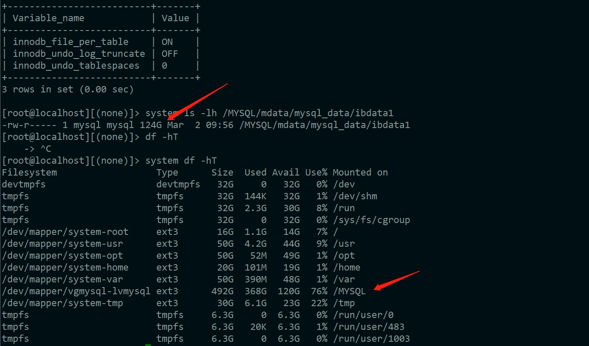

# 技术分享 | ibdata1 “减肥” 记

**原文链接**: https://opensource.actionsky.com/%e6%8a%80%e6%9c%af%e5%88%86%e4%ba%ab-ibdata1-%e5%87%8f%e8%82%a5-%e8%ae%b0/
**分类**: 技术干货
**发布时间**: 2023-06-15T00:46:47-08:00

---

夏天来了，没想到连 ibdata1 文件也要开始“减肥”了~~~
> 
作者：杨彩琳
爱可生华东交付部 DBA，主要负责 MySQL 日常问题处理及 DMP 产品支持。爱好跳舞，追剧。
本文来源：原创投稿
有句话是这么说的：“在 InnoDB 存储引擎中数据是按照表空间来组织存储的”。其实潜台词就是：**表空间是表空间文件，是实际存在的物理文件**，MySQL 中有很多[表空间](https://dev.mysql.com/doc/refman/5.7/en/innodb-system-tablespace.html)，下面一起来了解一下吧。
# 人物介绍
在说“减肥”的故事之前，让我们先了解一下需要“减肥”的文件包含哪些部分，都是什么。
## 系统表空间
首先要说的是本文的主角，系统表空间。它里面存储的有：
&#8211; InnoDB 表元数据
&#8211; doublewrite buffer
&#8211; change buffer
&#8211; undo logs
若在未配置 `innodb_file_per_table` 参数情况下有新建表的操作，那么系统表空间也会存储这些表和索引数据信息。前面有说过表空间也是实际存在的表空间文件，同样系统表空间它可以有一个或多个数据文件，默认情况下，是在数据目录中创建一个名为 `ibdata1` 文件的系统表空间数据文件，其文件大小和数量可以由参数 `innodb_data_file_path` 来定义。
## 独立表空间
由 `innodb_file_per_table` 参数定义。启用后，InnoDB 可以在 `file-per-table` 表空间中创建表，这样新创建的数据库表都单独的表空间文件。该参数在 MySQL 5.6.7 及更高版本已经默认启用了。
## 通用表空间
可以通过 `CREATE tablespace` 语法创建的共享 InnoDB 表空间。与系统表空间类似，它能存储多个表的数据，也可将数据文件放置在 MySQL 数据目录之外单独管理。
## UNDO 表空间
主要存储 `undo logs`，默认情况下 `undo logs` 是存储在系统表空间中的，可通过参数 `innodb_undo_tablespaces` 来配置 UNDO 表空间的数量，只能在初始化 MySQL 实例时才能设置该参数，并且在实例的使用寿命内是固定的，MySQL 8.0 可支持动态修改。
## 临时表空间
非压缩的、用户创建的临时表和磁盘上产生的内部临时表都是存储在共享的临时表空间存储的，可以通过配置参数 `innodb_tmp_data_file_path` 来定义临时表空间数据文件的路径、名称、大小和属性，如果没有指定，默认是在数据目录下创建一个名为 `ibtmp1`的大于 12M 的自动扩展数据文件。
# 前情提要
客户反馈 MySQL 5.7 的配置文件中没有开启 UNDO 表空间和 UNDO 回收参数，导致 `ibdata1` 文件过大，并且一直在增长。需要评估下 `ibdata1` 文件大小如何回收及 UNDO 相关参数配置。

# 制定“减肥”计划
思路：`ibdata1` 文件中包含了 InnoDB 表的元数据，change buffer，doublewrite buffer，undo logs 等数据，无法自动收缩，必须使用将数据逻辑导出，删除 `ibdata1` 文件，然后将数据导入的方式来释放 `ibdata1` 文件。
*夏天来了，没想到连 `ibdata1` 文件也要开始“减肥”了~~~*
## ”减肥“前
减肥之前的 `ibdata1` 重量是 512M。
*ps：因为是测试‘减肥计划’，所以只模拟了一个‘微胖’的 `ibdata1` 文件。*
`[root@10-186-61-119 data]# ll
total 2109496
-rw-r----- 1 mysql mysql        56 Jun 14 14:26 auto.cnf
-rw-r----- 1 mysql mysql       409 Jun 14 14:26 ib_buffer_pool
-rw-r----- 1 mysql mysql 536870912 Jun 14 14:35 ibdata1
-rw-r----- 1 mysql mysql 536870912 Jun 14 14:35 ib_logfile0
-rw-r----- 1 mysql mysql 536870912 Jun 14 14:35 ib_logfile1
-rw-r----- 1 mysql mysql 536870912 Jun 14 14:32 ib_logfile2
-rw-r----- 1 mysql mysql  12582912 Jun 14 14:26 ibtmp1
drwxr-x--- 2 mysql mysql      4096 Jun 14 14:26 mysql
-rw-r----- 1 mysql mysql         5 Jun 14 14:26 mysqld.pid
srwxrwxrwx 1 mysql mysql         0 Jun 14 14:26 mysqld.sock
-rw------- 1 mysql mysql         5 Jun 14 14:26 mysqld.sock.lock
-rw-r----- 1 mysql mysql      6675 Jun 14 14:32 mysql-error.log
-rw-r----- 1 mysql mysql       967 Jun 14 14:34 mysql-slow.log
drwxr-x--- 2 mysql mysql      8192 Jun 14 14:26 performance_schema
drwxr-x--- 2 mysql mysql      8192 Jun 14 14:26 sys
drwxr-x--- 2 mysql mysql       172 Jun 14 14:30 test
`
## 全量备份
对库做全量备份。我们使用 **mysqldump** 做全备，因为 **Xtrabackup** 会备份 `ibdata1` 文件。
`/data/mysql/3309/base/bin/mysqldump -uroot -p \
-S /data/mysql/3309/data/mysqld.sock \
--default-character-set=utf8mb4 \
--single-transaction --hex-blob \
--triggers --routines --events --master-data=2 \
--all-databases > /data/full_$(date +%F).sql
`
## 停止数据库服务
```
systemctl stop mysql_3309
```
## 删除原实例
```
[root@10-186-61-119 data]# rm -rf /data/mysql/3309
[root@10-186-61-119 data]# rm -rf /etc/systemd/system/mysql_3309.service
```
## 新建实例
重新创建一个同端口的 MySQL 实例（步骤略过），注意配置文件中需要配置下列参数：
&#8211; innodb_undo_tablespaces = 3
&#8211; innodb_max_undo_log_size = 4G
&#8211; innodb_undo_log_truncate = 1
&#8211; innodb_file_per_table = 1
新建实例数据文件如下：
`[root@10-186-61-119 ~]# ll /data/mysql/3309
total 4
drwxr-x--- 2 mysql mysql    6 Jun 14 14:51 backup
drwxr-x--- 9 mysql mysql  129 Jun 14 14:52 base
drwxr-x--- 2 mysql mysql   77 Jun 14 14:52 binlog
drwxr-x--- 5 mysql mysql  331 Jun 14 14:52 data
-rw-r--r-- 1 mysql mysql 3609 Jun 14 14:52 my.cnf.3309
drwxr-x--- 2 mysql mysql    6 Jun 14 14:51 redolog
drwxr-x--- 2 mysql mysql    6 Jun 14 14:51 relaylog
drwxr-x--- 2 mysql mysql    6 Jun 14 14:52 tmp
`
## 启动新建的数据库服务
```
[root@10-186-61-119 ~]# systemctl start mysql_3309
[root@10-186-61-119 ~]# ps -ef | grep 3309
mysql     7341     1  0 14:52 ?        00:00:01 /data/mysql/3309/base/bin/mysqld --defaults-file=/data/mysql/3309/my.cnf.3309 --daemonize
```
## 导入备份数据
```
[root@10-186-61-119 data]# /data/mysql/3309/base/bin/mysql -uroot -p \
-S /data/mysql/3309/data/mysqld.sock < full_2023-06-14.sql
```
## 验证结果
减肥前 512M，减肥后 128M。
`[root@10-186-61-119 data]# ll
total 1747000
-rw-r----- 1 mysql mysql        56 Jun 14 14:52 auto.cnf
-rw-r----- 1 mysql mysql       422 Jun 14 14:52 ib_buffer_pool
-rw-r----- 1 mysql mysql 134217728 Jun 14 14:57 ibdata1
-rw-r----- 1 mysql mysql 536870912 Jun 14 14:57 ib_logfile0
-rw-r----- 1 mysql mysql 536870912 Jun 14 14:57 ib_logfile1
-rw-r----- 1 mysql mysql 536870912 Jun 14 14:52 ib_logfile2
-rw-r----- 1 mysql mysql  12582912 Jun 14 14:52 ibtmp1
drwxr-x--- 2 mysql mysql      4096 Jun 14 14:55 mysql
-rw-r----- 1 mysql mysql         5 Jun 14 14:52 mysqld.pid
srwxrwxrwx 1 mysql mysql         0 Jun 14 14:52 mysqld.sock
-rw------- 1 mysql mysql         5 Jun 14 14:52 mysqld.sock.lock
-rw-r----- 1 mysql mysql      6841 Jun 14 14:55 mysql-error.log
-rw-r----- 1 mysql mysql       414 Jun 14 14:52 mysql-slow.log
drwxr-x--- 2 mysql mysql      8192 Jun 14 14:52 performance_schema
drwxr-x--- 2 mysql mysql      8192 Jun 14 14:52 sys
drwxr-x--- 2 mysql mysql       172 Jun 14 14:56 test
-rw-r----- 1 mysql mysql  10485760 Jun 14 14:57 undo001
-rw-r----- 1 mysql mysql  10485760 Jun 14 14:57 undo002
-rw-r----- 1 mysql mysql  10485760 Jun 14 14:57 undo003
`
**恭喜 `ibdata1` 文件减肥成功！**
# 生产环境建议
上面的“减肥”计划对于生产环境可能有点暴力，所以，对于生产环境若是遇到相同场景的，建议采用下面较温和谨慎的方法：
1. 申请一台新的服务器，部署从库。配置好 `innodb_file_per_table` 参数，UNDO 相关参数；
2. 主库进行逻辑全备；
3. 将主库备份数据恢复到新从库，并建立复制关系；
4. 主从切换，提升新从库为主库。
# UNDO 相关参数设置
> 
注意：MySQL5.7 不支持在线或者离线分离 UNDO 表空间操作，UNDO 表空间的独立必须在数据库初始化时指定。
```
## 控制 Innodb 使用的 UNDO 表空间的数据量，默认值为 0，即记录在系统表空间中。
innodb_undo_tablespaces = 3
## 控制 UNDO 表空间的阈值大小
innodb_max_undo_log_size = 4G
## 控制将超过 innodb_maxundo_log_size 定义的阈值的 UNDO 表空间被标记为 truncation
innodb_undo_log_truncate = 1
```