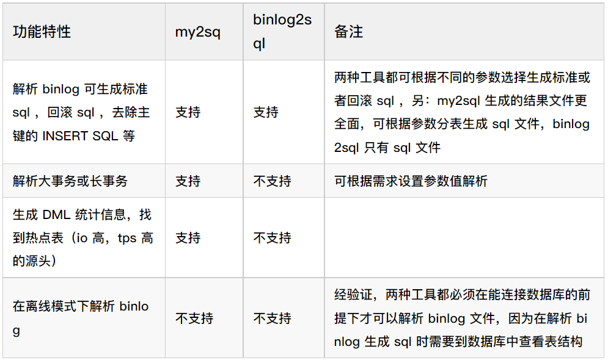

# 技术分享 | my2sql 与 binlog2sql 解析效率 battle

**原文链接**: https://opensource.actionsky.com/20220829-binlog/
**分类**: 技术干货
**发布时间**: 2022-08-31T18:21:52-08:00

---

作者：杨彩琳
爱可生华东交付部DBA，主要负责MySQL日常问题处理及DMP产品支持。爱好跳舞，追剧。
本文来源：原创投稿
*爱可生开源社区出品，原创内容未经授权不得随意使用，转载请联系小编并注明来源。
#### 前言
**大家在平时运维过程中应该都了解过或者使用过一些 binlog 解析工具，比如今天要介绍的 my2sql 和 binlog2sql 。**my2sql 是基于 my2fback 、binlog_rollback 工具二次开发而来的（go语言），binlog2sql 是 python 语言开发的 mysql binlog 解析工具，两者都可以通过解析 binlog 文件，生成原始 SQL ，回滚SQL ，去除主键的 insert sql 等，然后实现数据快速闪回，主从切换后的数据补偿等功能。
既然两个工具都可以实现解析 binlog 的功能，那么它们两个之间我们该如何来抉择呢？请跟随小编往下看“my2sql与binlog2sql之间的battle”吧。
**主要参数简介【这里只罗列了几个常用的参数，有其他需求的参数可进入链接中查看】**
#### my2sql
| 参数 | 参数解释 |
| --- | --- |
| -mode | repl：伪装成从库从主库获取 binlog 文件；file：从本地文件系统获取 binlog 文件，默认repl |
| -local-binlog-file 当指定 | 当指定-mode=file参数时，需要指定 -local-binlog-file binlog 文件相对路径或绝对路径 |
| -sql | 要解析的 sql 类型，可选参数 insert ，update ，delete ，默认全部解析 |
| -file-per-table | 为每个表生成一个 sql 文件 |
| -output-dir | 将生成的结果存放到指定目录 |
| -threads | 线程数，默认2个，支持并发 |
| -work-type | 2sql：生成原始 sql ，rollback ：生成回滚 sql ，stats：只统计 DML 、事务信息 |
#### binlog2sql
| 参数 | 参数解释 |
| --- | --- |
| &#8211;stop-never | 持续解析 binlog ，默认 false ，同步至执行命令的最新 binlog 位置 |
| -B，&#8211;flashback | 生成回滚 sql ，可解析大文件，不受内存限制，默认 false ，与 stop-never 或 no-primary-key 不能同时添加 |
| &#8211;start-file | 起始解析文件，只需文件名，无需全路径 |
| &#8211;start-position/&#8211;start-pos | 起始解析位置。默认为 start-file 的起始位置。 |
| &#8211;stop-file/&#8211;end-file | 终止解析文件。默认为 start-file 同一个文件。若解析模式为 stop-never ，此选项失效。 |
| &#8211;stop-position/&#8211;end-pos | 终止解析位置。可选。默认为 stop-file 的最末位置；若解析模式为 stop-never ，此选项失效。 |
| &#8211;sql-type | 只解析指定类型，支持 INSERT ，UPDATE ，DELETE 。多个类型用空格隔开，如&#8211;sql-type INSERT DELETE 。默认为增删改都解析。用了此参数但没填任何类型，则三者都不解析。 |
#### battle 之标准 sql 解析【解析2G大小的同一binlog文件】
##### 环境准备：
## 查看mysql的相关参数设置
mysql> select @@server_id,@@binlog_format,@@binlog_row_image,@@max_binlog_size,@@log_bin_basename;
+-------------+-----------------+--------------------+-------------------+-----------------------------------+
| @@server_id | @@binlog_format | @@binlog_row_image | @@max_binlog_size | @@log_bin_basename                |
+-------------+-----------------+--------------------+-------------------+-----------------------------------+
|       46733 | ROW             | FULL               |        1073741824 | /data/mysql/3309/binlog/mysql-bin |
+-------------+-----------------+--------------------+-------------------+-----------------------------------+
1 row in set (0.00 sec)
## 使用sysbench创建测试数据表
[root@10-186-61-119 ~]# sysbench /usr/share/sysbench/oltp_read_write.lua --mysql-host=10.186.61.119 \
--mysql-port=3309 --mysql-user=root --mysql-password=root --mysql-db=test --table-size=2000000 --tables=1  \
--threads=50 --db-ps-mode=disable --auto_inc=off --report-interval=3 --max-requests=0 --time=20 \
--percentile=95 --skip_trx=off --mysql-ignore-errors=6002,6004,4012,2013,4016,1062 --create_secondary=off prepare
sysbench 1.0.17 (using system LuaJIT 2.0.4) 
Initializing worker threads... 
Creating table 'sbtest1'...
Inserting 2000000 records into 'sbtest1'
## 使用sysbench对测试表进行压测，生成2G左右binlog数据
[root@10-186-61-119 ~]# sysbench /usr/share/sysbench/oltp_read_write.lua --mysql-host=10.186.61.119  \
--mysql-port=3309 --mysql-user=root --mysql-password=root --mysql-db=test --table-size=2000000 --tables=1  \
--threads=50 --db-ps-mode=disable --auto_inc=off --report-interval=3 --max-requests=0 --time=180  \
--percentile=95 --skip_trx=off --mysql-ignore-errors=6002,6004,4012,2013,4016,1062 --create_secondary=off run
sysbench 1.0.17 (using system LuaJIT 2.0.4)
Running the test with following options:
Number of threads: 50
Report intermediate results every 3 second(s)
Initializing random number generator from current time
Initializing worker threads...
Threads started!
## 使用my2sql与binlog2sql解析mysql-bin.000013,mysql-bin.000014
[root@10-186-61-119 binlog]# ll
total 4579116
-rw-r----- 1 mysql mysql        209 Aug  3 14:17 mysql-bin.000010
-rw-r----- 1 mysql mysql 1073760482 Aug  3 14:32 mysql-bin.000011
-rw-r----- 1 mysql mysql 1074119415 Aug  3 14:36 mysql-bin.000012
-rw-r----- 1 mysql mysql 1073822542 Aug  3 15:53 mysql-bin.000013
-rw-r----- 1 mysql mysql 1074588226 Aug  3 16:15 mysql-bin.000014
-rw-r----- 1 mysql mysql  392707488 Aug  3 16:16 mysql-bin.000015
-rw-r----- 1 mysql mysql        246 Aug  3 16:15 mysql-bin.index
#### my2sql 解析过程
## 1 thread：使用脚本实现连续解析两个binlog的功能
[root@10-186-61-119 my2sql]# cat /root/sql.sh
#! /bin/bash
date;
my2sql -user root -password root -host 10.186.61.119   -port 3309 -mode file  
-local-binlog-file /data/mysql/3309/binlog/mysql-bin.000013  -work-type 2sql \
-start-file /data/mysql/3309/binlog/mysql-bin.000013 -threads 1 \
-output-dir /data/my2sql/1thread/13 > /data/my2sql/1thread/13/output;
my2sql -user root -password root -host 10.186.61.119   -port 3309 -mode file \
-local-binlog-file /data/mysql/3309/binlog/mysql-bin.000014  -work-type 2sql \
-start-file /data/mysql/3309/binlog/mysql-bin.000014 -threads 1 \
-output-dir /data/my2sql/1thread/14 > /data/my2sql/1thread/14/output
[root@10-186-61-119 ~]# ./sql.sh
Thu Aug  4 17:17:24 CST 2022
## 查看解析结果
[root@10-186-61-119 13]# pwd
/data/my2sql/1thread/13
[root@10-186-61-119 13]# ll
total 347088
-rw-r--r-- 1 root root       107 Aug  4 17:17 biglong_trx.txt
-rw-r--r-- 1 root root      7488 Aug  4 17:24 binlog_status.txt
-rw-r--r-- 1 root root 355389762 Aug  4 17:24 forward.13.sql      ## 标准sql文件
-rw-r--r-- 1 root root      9965 Aug  4 17:24 output
[root@10-186-61-119 13]# cd ../14 && ll
total 577564
-rw-r--r-- 1 root root       107 Aug  4 17:24 biglong_trx.txt
-rw-r--r-- 1 root root      3312 Aug  4 17:28 binlog_status.txt
-rw-r--r-- 1 root root 591403854 Aug  4 17:28 forward.14.sql     ## 标准sql文件
-rw-r--r-- 1 root root      9877 Aug  4 17:28 output
## 查看mysql-bin.000014的解析输出，完成时间为17:28。my2sql单线程解析完2G左右的binlog文件大概需要11分钟
[root@10-186-61-119 14]# less output
......
[2022/08/04 17:28:35] [info] file.go:71 finish parsing binlog from local files
[2022/08/04 17:28:35] [info] stats_process.go:266 exit thread to analyze statistics from binlog
[2022/08/04 17:28:35] [info] events.go:185 exit thread 1 to generate redo/rollback sql
[2022/08/04 17:28:35] [info] events.go:274 finish writing redo/forward sql into file
[2022/08/04 17:28:35] [info] events.go:277 exit thread to write redo/rollback sql into file
## 4 thread：使用脚本实现连续解析两个binlog的功能【脚本内容与1 thread执行的一致，只需更改线程数即可，后续不再冗余展示】
# 执行解析binlog语句
[root@10-186-61-119 ~]# ./sql.sh
Thu Aug  4 17:32:52 CST 2022
# 查看mysql-bin.000014的解析输出，完成时间为17:44。my2sql 4线程并发解析完2G左右的binlog文件大概需要12分钟
[root@10-186-61-119 14]# less output
。。。。。。。。
[2022/08/04 17:44:42] [info] file.go:71 finish parsing binlog from local files
[2022/08/04 17:44:42] [info] stats_process.go:266 exit thread to analyze statistics from binlog
[2022/08/04 17:44:42] [info] events.go:185 exit thread 4 to generate redo/rollback sql
[2022/08/04 17:44:42] [info] events.go:185 exit thread 2 to generate redo/rollback sql
[2022/08/04 17:44:42] [info] events.go:185 exit thread 3 to generate redo/rollback sql
[2022/08/04 17:44:42] [info] events.go:185 exit thread 1 to generate redo/rollback sql
[2022/08/04 17:44:42] [info] events.go:274 finish writing redo/forward sql into file
[2022/08/04 17:44:42] [info] events.go:277 exit thread to write redo/rollback sql into file
## 6thread：使用脚本实现连续解析两个binlog的功能
# 执行解析binlog语句
[root@10-186-61-119 ~]# ./sql.sh
Thu Aug  4 17:46:31 CST 2022
# 查看mysql-bin.000014的解析输出，完成时间为18:00。my2sql 6线程并发解析完2G左右的binlog文件大概需要14分钟
[root@10-186-61-119 14]# less output
。。。。。。。。
[2022/08/04 18:00:11] [info] file.go:71 finish parsing binlog from local files
[2022/08/04 18:00:11] [info] events.go:185 exit thread 6 to generate redo/rollback sql
[2022/08/04 18:00:11] [info] stats_process.go:266 exit thread to analyze statistics from binlog
[2022/08/04 18:00:11] [info] events.go:185 exit thread 1 to generate redo/rollback sql
[2022/08/04 18:00:11] [info] events.go:185 exit thread 2 to generate redo/rollback sql
[2022/08/04 18:00:11] [info] events.go:185 exit thread 5 to generate redo/rollback sql
[2022/08/04 18:00:11] [info] events.go:185 exit thread 4 to generate redo/rollback sql
[2022/08/04 18:00:11] [info] events.go:185 exit thread 3 to generate redo/rollback sql
[2022/08/04 18:00:11] [info] events.go:274 finish writing redo/forward sql into file
[2022/08/04 18:00:11] [info] events.go:277 exit thread to write redo/rollback sql into file
## 8thread：使用脚本实现连续解析两个binlog的功能
# 执行解析binlog语句
[root@10-186-61-119 ~]# ./sql.sh
Thu Aug  4 18:01:54 CST 2022
# 查看mysql-bin.000014的解析输出，完成时间为18:18。my2sql 8线程并发解析完2G左右的binlog文件大概需要17分钟
[root@10-186-61-119 14]# less output
。。。。。。。。
[2022/08/04 18:18:51] [info] file.go:71 finish parsing binlog from local files
[2022/08/04 18:18:51] [info] stats_process.go:266 exit thread to analyze statistics from binlog
[2022/08/04 18:18:51] [info] events.go:185 exit thread 2 to generate redo/rollback sql
[2022/08/04 18:18:51] [info] events.go:185 exit thread 6 to generate redo/rollback sql
[2022/08/04 18:18:51] [info] events.go:185 exit thread 4 to generate redo/rollback sql
[2022/08/04 18:18:51] [info] events.go:185 exit thread 1 to generate redo/rollback sql
[2022/08/04 18:18:51] [info] events.go:185 exit thread 8 to generate redo/rollback sql
[2022/08/04 18:18:51] [info] events.go:185 exit thread 5 to generate redo/rollback sql
[2022/08/04 18:18:51] [info] events.go:185 exit thread 3 to generate redo/rollback sql
[2022/08/04 18:18:51] [info] events.go:185 exit thread 7 to generate redo/rollback sql
[2022/08/04 18:18:51] [info] events.go:274 finish writing redo/forward sql into file
[2022/08/04 18:18:51] [info] events.go:277 exit thread to write redo/rollback sql into file
#### binlog2sql 解析过程
## 使用脚本实现连续解析两个binlog的功能【--stop-never可以实现自动连续解析binlog文件，目前最新的binlog是15，
但是为了与my2sql解析效率进行对比，所以不用这个参数】
[root@10-186-61-119 ~]# cat binlog.sh
#! /bin/bash
date;
python /data/binlog2sql/binlog2sql/binlog2sql.py -h10.186.61.119 -P3309 -uroot -p'root' \
--start-file='mysql-bin.000013' > /tmp/binlog13.sql;
python /data/binlog2sql/binlog2sql/binlog2sql.py -h10.186.61.119 -P3309 -uroot -p'root' \
--start-file='mysql-bin.000014' > /tmp/binlog14.sql;
date;
# 执行解析binlog语句
[root@10-186-61-119 ~]# ./binlog.sh            binlg2sql解析完2G左右的binlog文件大概需要54分钟              
Wed Aug  3 17:53:59 CST 2022
Wed Aug  3 18:47:08 CST 2022
# 查看解析结果
[root@10-186-61-119 ~]# ll /tmp/
total 1688232
-rw-r--r-- 1 root root 859359140 Aug  3 18:27 binlog13.sql
-rw-r--r-- 1 root root 869387465 Aug  3 18:47 binlog14.sql
#### battle结果
**如下表所示，从解析效率来看，my2sql更胜一筹**

#### my2sql 与 binlog2sql 其他功能对比

#### 总结
- 从解析效率对比来看，my2sql 是优胜于 binlog2sql 的，并且 my2sql 另外还具有解析大事务或者长事务，生成 DML 统计信息的功能，是很实用一款 binlog 解析工具，但是通过实验来看，my2sql 的并发功能似乎并没有加快其解析效率，建议解析时使用默认的线程数即可。
- 虽说 my2sql 优点很多，但是使用时还是需要注意，它也有一些限制，如 my2sql 是伪装成从库去在线获取主库 binlog，然后进行解析，因此执行操作的数据库用户需要具有 SELECT，REPLICATION SALVE，REPLICATION CLIENT 的权限。
- 使用回滚/闪回功能时，binlog 格式必须为 row ，且 binlog_row_image=full ，DML 统计以及大事务分析不受影响
- 只能回滚 DML ，不能回滚 DDL
- my2sql 工具在使用时需要注意下字段的数据类型，存在解析 bug ，会导致解析的数据与原数据有差异，具体参考：https://github.com/liuhr/my2sql/issues/31 
- binlog2sql 使用时也需要注意，它也有一些限制，如 MySQL Server 必须设置 server_id ，log_bin ，max_binlog_size=1G ，binlog_format=row ，binlog_row_image=full 这些参数，
- 与 my2sql 一样，也是伪装成从库拉取 binlog ，需要连接数据库的用户有 SELECT ，REPLICATION SLAVE ，REPLICATION CLIENT 权限 
##### 学习参考链接：
[https://github.com/liuhr/my2sql](https://github.com/liuhr/my2sql)
[https://github.com/danfengcao/binlog2sql](https://github.com/danfengcao/binlog2sql)