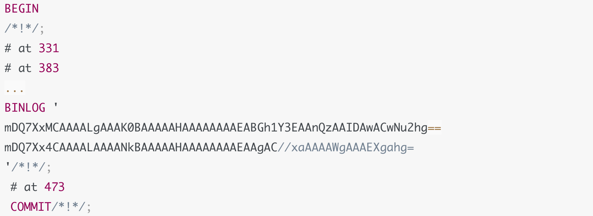
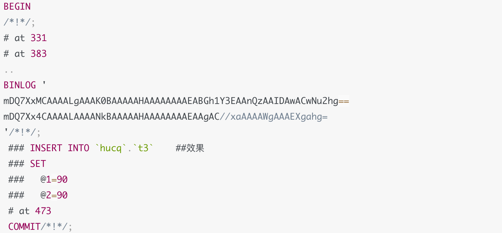
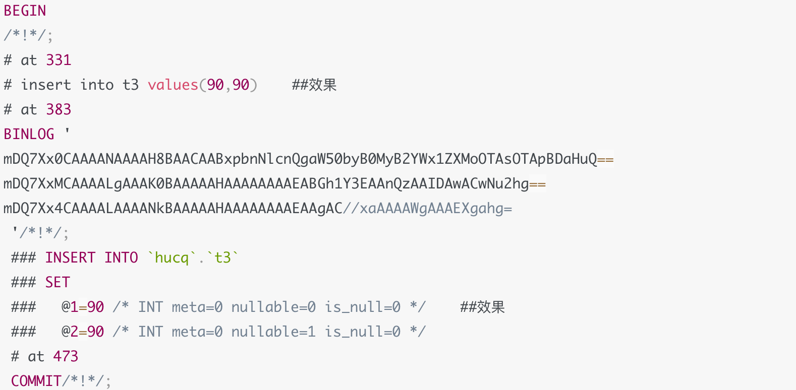
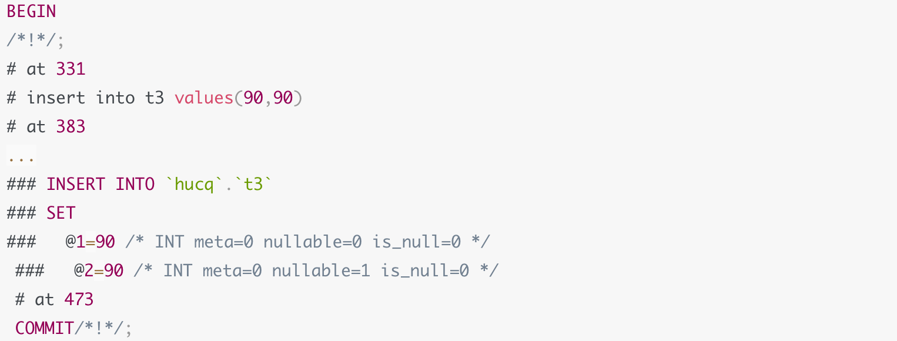
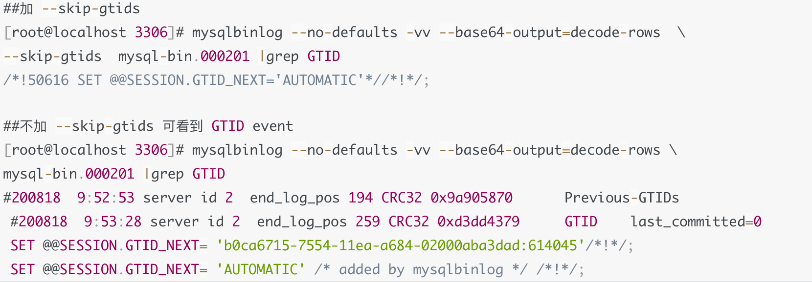

# 技术分享 | mysqlbinlog 技巧

**原文链接**: https://opensource.actionsky.com/20211228-mysqlbinlog/
**分类**: MySQL 新特性
**发布时间**: 2021-12-22T22:51:31-08:00

---

作者：胡呈清
爱可生 DBA 团队成员，擅长故障分析、性能优化，个人博客：https://www.jianshu.com/u/a95ec11f67a8，欢迎讨论。
本文来源：原创投稿
*爱可生开源社区出品，原创内容未经授权不得随意使用，转载请联系小编并注明来源。
## 常用命令
#### 1. 解析 binlog 排查问题
如果只是解析出来查看，可以加 &#8211;base64-output=decode-rows 不显示行格式的内容：`mysqlbinlog --no-defaults -vv --base64-output=decode-rows mysql-bin.000201`
#### 2. 解析指定 GTID 的事务
用来分析某个事务做了什么：`mysqlbinlog --no-defaults -vv --base64-output=decode-rows --include-gtids='b0ca6715-7554-11ea-a684-02000aba3dad:614037' mysql-bin.000199`
#### 3. 解析指定范围的 binlog
a. 时间范围
&#8211;start-datetime、&#8211;stop-datetime 解析出指定时间范围内的 binlog，这个只适合粗略的解析，不精准，因此不要用来回放 binlog。有个小技巧：如果只能确定大概的时间范围，而且不确定在哪个 binlog 中，可以直接解析多个 binlog。比如大概在 11:20-12:00 内做了个表删除操作，但这个时间内有多个 binlog，可以这样：
`mysqlbinlog --no-defaults -vv --base64-output=decode-rows --start-datetime='2020-08-18 11:20:00' --stop-datetime='2020-08-18 12:00:00' mysql-bin.000203 mysql-bin.000204 mysql-bin.000205`
b. 偏移量范围
&#8211;start-position、&#8211;stop-position 解析 binlog 指定偏移量范围内的 binlog。如果同时指定了 &#8211;start-position 和 &#8211;stop-position，并且是解析多个 binlog，则 &#8211;start-position 只对第一个 binlog 生效，&#8211;stop-position 只对最后一个 binlog 生效。
这个常用场景是：已经解析过一次 binlog 并取得目标事务的 起始 position 后，精确的解析这一段 binlog：
`mysqlbinlog --no-defaults -vv --base64-output=decode-rows  --start-position='537' --stop-position='945' mysql-bin.000204
# at 537           "起始位置是 GTID event 前的这个 position"
#200818 11:29:03 server id 3 end_log_pos 602 CRC32 0x7f07dd8c GTID last_committed=1 sequence_number=2 rbr_only=yes 
/*!50718 SET TRANSACTION ISOLATION LEVEL READ COMMITTED*//*!*/; 
SET @@SESSION.GTID_NEXT= 'b0ca6715-7554-11ea-a684-02000aba3dad:614061'/*!*/; 
...
... 
#200818 11:29:03 server id 3 end_log_pos 945 CRC32 0xedf2b011 Query thread_id=3 exec_time=0 error_code=0 SET TIMESTAMP=1597721343/*!*/; 
COMMIT /*!*/; 
# at 945          "结束位置是 COMMIT event 后的这个 position"
`
c. GTID 范围
&#8211;include-gtids、&#8211;exclude-gtids 详细看参数解释。
#### 4. 回放 binlog
- 
回放一定不能加 &#8211;base64-output=decode-rows 参数，因为不会解析出行格式（这是binlog真正有效的部分）；
- 
回放也可以用上面指定范围的参数；
- 
解析 binlog 回放到本实例，不需要修改 server id，但要注意 GTID 是否已存在；
- 
GTID 已经存在，回放不会报错，但也不会真正回放这些事务，可以通过 &#8211;skip-gtids 参数跳过 GTID 的限制；
`mysqlbinlog --no-defaults --skip-gtids mysql-bin.000203 | mysql -S /data/mysql/data/3306/mysqld.sock -proot`
#### 参数解释
**1. &#8211;no-defaults**
可以避免 my.cnf 里配了 [client] 某些 mysqlbinlog 没有的参数导致 mysqlbinlog 失败
**2. -v**
不加，只显示行格式（即那一串字符串），无法得到伪 SQL ：

加 -v，从行格式中重建伪SQL(带注释)，不显示 binlog_rows_query_log_events 参数效果：

加 -vv，从行格式中重建伪SQL并添加字段数据类型的注释，可以显示 binlog_rows_query_log_events 参数效果：

**3. 加 &#8211;base64-output=decode-rows**
不显示行格式，如果同时加 -v 参数，可以从行格式中解码为带注释的伪SQL：

**4. &#8211;skip-gtids**
不保留 GTID 事件信息，这样回放 binlog 时会跟执行新事务一样，生成新的 GTID。对比如下：

**5. &#8211;include-gtids**
只解析出指定的 GTID 的事务：
`[root@localhost 3306]# mysqlbinlog --no-defaults -vv --base64-output=decode-rows \
> --include-gtids='b0ca6715-7554-11ea-a684-02000aba3dad:614037-614040' mysql-bin.000199 |grep GTID
#200807 17:32:17 server id 2  end_log_pos 194 CRC32 0xc840be04  Previous-GTIDs
#200807 17:32:17 server id 2  end_log_pos 3818435 CRC32 0x9fdea913  GTID    last_committed=3    sequence_number=5   rbr_only=yes
SET @@SESSION.GTID_NEXT= 'b0ca6715-7554-11ea-a684-02000aba3dad:614037'/*!*/;
#200807 17:32:17 server id 2  end_log_pos 5726909 CRC32 0x51b51cc1  GTID    last_committed=4    sequence_number=6   rbr_only=yes
SET @@SESSION.GTID_NEXT= 'b0ca6715-7554-11ea-a684-02000aba3dad:614038'/*!*/;
#200807 17:32:17 server id 2  end_log_pos 5727523 CRC32 0x758852f1  GTID    last_committed=6    sequence_number=7   rbr_only=yes
SET @@SESSION.GTID_NEXT= 'b0ca6715-7554-11ea-a684-02000aba3dad:614039'/*!*/;
#200807 17:32:17 server id 2  end_log_pos 7635997 CRC32 0x47c43f83  GTID    last_committed=6    sequence_number=8   rbr_only=yes
SET @@SESSION.GTID_NEXT= 'b0ca6715-7554-11ea-a684-02000aba3dad:614040'/*!*/;
SET @@SESSION.GTID_NEXT= 'AUTOMATIC' /* added by mysqlbinlog */ /*!*/;
`
- 
&#8211;exclude-gtids
不解析指定的 GTID 的事务