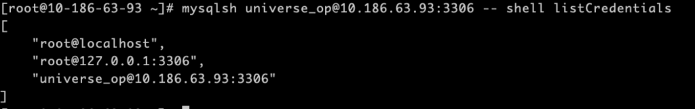
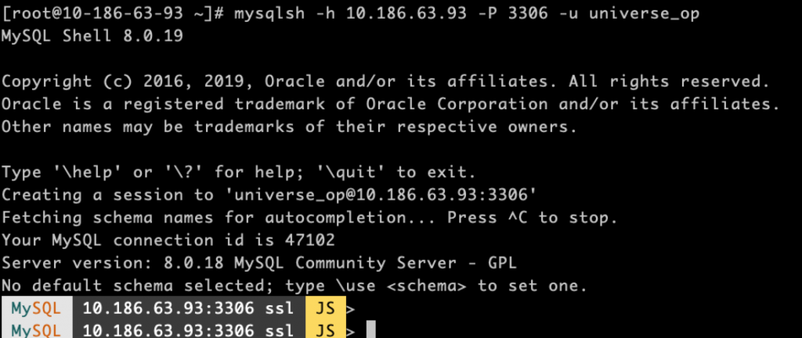

# 技术分享 | mysqlsh 命令行模式 &#038; 密码保存

**原文链接**: https://opensource.actionsky.com/20210126-mysqlsh/
**分类**: MySQL 新特性
**发布时间**: 2021-01-26T00:33:34-08:00

---

作者：胡呈清
爱可生 DBA 团队成员，擅长故障分析、性能优化，个人博客：https://www.jianshu.com/u/a95ec11f67a8，欢迎讨论。
本文来源：原创投稿*爱可生开源社区出品，原创内容未经授权不得随意使用，转载请联系小编并注明来源。
## 命令行模式
mysql shell 如何实现类似 mysql -e &#8220;show processlist;&#8221; 的效果？即执行完就退出登录，不需要交互，我们经常在脚本中这样使用。那么同样的，在维护 InnoDB Cluster 时，怎么在脚本中调用 mysql shell 查看 MGR 集群的状态或者对集群做操作呢？语法如下：
`mysqlsh [options] -- shell_object object_method [arguments]`
示例：
`mysqlsh -h172.16.22.1 -P3306 -uroot -p -- cluster status`
可以直接输出 cluster 状态信息，等同于：
`mysqlsh -h172.16.22.1 -P3306 -uroot -p
var cluster=dba.getCluster()
cluster.status()`
配合下面介绍的密码保存方法，避免在脚本中暴露密码，也可以避免交互式输入密码，可以很方便的查询状态或者做一些维护操作，比如：
											
## 配置保存密码
默认设置：
`JS > \option -l
 ...
 credentialStore.excludeFilters  []
 credentialStore.helper          default
 credentialStore.savePasswords   prompt
 ...`
#### credentialStore.helper
默认情况下，此选项设置为特殊值 default。可以设置为 <disabled> 来禁用密码存储和检索功能，注意要用 setPersist 才能在退出 mysqlsh 后的下一次生效：
`shell.options.setPersist("credentialStore.helper", "<disabled>")
`若是显示为 “<invalid>”，则无法使用密码存储和检索，通常是因为没有安装 mysql_config_editor，因为 mysql shell 的密码保存实际也是用 mysql_config_editor 实现的，下面会解释道具体用法。
#### credentialStore.savePasswords
此参数用来控制每次连接时保存密码的行为：
- prompt，默认值，交互模式下，会出现选择是否保存密码；
- always，自动保存密码，没有交互式选择；
- never，不保存密码，没有交互式选择。
这样修改：
`shell.options.setPersist("credentialStore.savePasswords","always")`
#### 查看当前保存了密码的连接串
可以在 mysqlsh 中查看：
`JS > shell.listCredentials()
[
    "root@localhost",
    "universe_op@10.186.63.93:3306",
    "root@127.0.0.1:3306"
]
`实际上是通过 mysql_config_editor 保存的密码，所以也可以用 mysql_config_editor print &#8211;all 查看 ，与上面输出的连接串一一对应：
`[root@10-186-63-93 ~]# mysql_config_editor print --all
[universe_op@10.186.63.93:3306]
user = universe_op
password = *****
host = 10.186.63.93
port = 3306
[root@localhost]
user = root
password = *****
host = localhost
[root@127.0.0.1:3306]
user = root
password = *****
host = 127.0.0.1
port = 3306`
#### 设置连接串保存密码
正常情况下每次使用 mysqlsh 连接 MySQL Server，输入密码后都会询问是否保存密码，键入 “Y” 即可保存密码：
`[root@10-186-63-93 ~]# mysqlsh universe_op@10.186.63.93:3306
Please provide the password for 'universe_op@10.186.63.93:3306': ****
Save password for 'universe_op@10.186.63.93:3306'? [Y]es/[N]o/Ne[v]er (default No):Y
`也可以通过 mysql_config_editor set 来保存指定连接串的密码：
`mysql_config_editor set --login-path="universe_op@10.186.63.93:3306" --host=10.186.63.93 \
--port=3306 --user=universe_op -p
`接下来使用 mysqlsh 登录时，不需要输入密码即可登录：
											
#### 删除连接串密码
如果要删除对应的连接串密码，用如下命令：
`mysql_config_editor remove --login-path=universe_op@10.186.63.93:3306`
**文章推荐：**
[技术分享 | Semi-join Materialization 子查询优化策略](https://opensource.actionsky.com/20200921-semi-join/)
[技术分享 | 讨论：MySQL 从库单表恢复](https://opensource.actionsky.com/20200914-mysql/)
[技术分享 | MySQL 子查询优化](https://opensource.actionsky.com/20200628-mysql/)