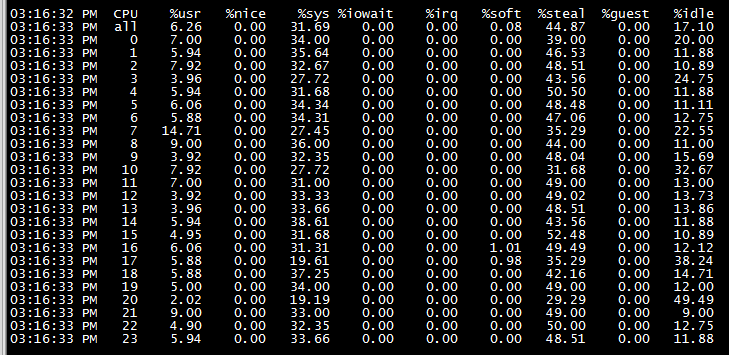
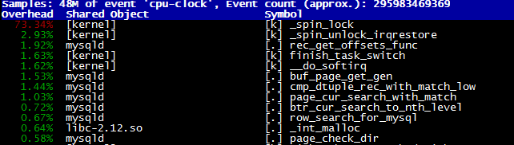
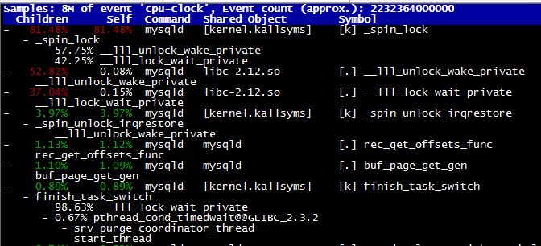
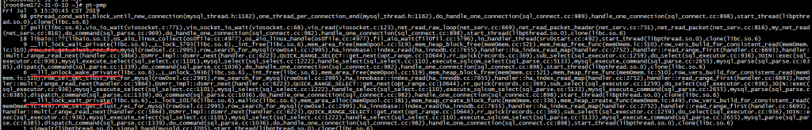
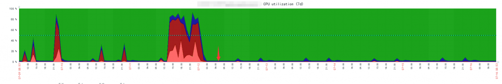

# 技术分享 | tcmalloc 解决 mysqld 实例引发的 cpu 过高问题

**原文链接**: https://opensource.actionsky.com/20190722-mysql/
**分类**: MySQL 新特性
**发布时间**: 2019-07-22T01:44:55-08:00

---

**背景**
MySQL 版本：5.6.29，普通主从
OS：CentOS 6.8
最近一段时间线上某实例频繁报警CPU飙高，每次都捕获到同一种 SQL，结构如下：
select uid from test_history where cat_id = '99999' and create_time >= '2019-07-12 19:00:00.000' and uid in (......)
其中uid一次性会传入上百个。
表结构为
Create Table: CREATE TABLE `test_history` (
`id` int(11) NOT NULL AUTO_INCREMENT COMMENT '主键ID',
`cat_id` varchar(64) NOT NULL,
`uid` varchar(128) NOT NULL,
`msg` varchar(64) NOT NULL',
`create_time` datetime NOT NULL COMMENT '创建时间',
PRIMARY KEY (`id`),
UNIQUE KEY `idx_cat_uid` (`cat_id`,`uid`,`create_time`),
KEY `idx__time` (`create_time`)
) ENGINE=InnoDB AUTO_INCREMENT=***** DEFAULT CHARSET=utf8
SQL 使用到了索引idx_msg_uid_time，单条执行可以秒级完成，但是并发执行会遭遇执行时间过长（超过1个小时）且CPU过高的问题。
**诊断思路**
mpstat -P ALL 1，查看cpu使用情况，主要消耗在sys即os系统调用上
											
perf top，cpu主要消耗在_spin_lock
											
生成perf report查看详细情况
											
CPU主要消耗在mutex争用上，说明有锁热点。
采用pt-pmp跟踪mysqld执行情况，热点主要集中在mem_heap_alloc和mem_heap_free上。
											
Pstack提供更详细的API调用栈
#0 0x0000003e0caf80cf in __lll_unlock_wake_private () from /lib64/libc.so.6
#1 0x0000003e0ca7cf6a in _L_unlock_5936 () from /lib64/libc.so.6
#2 0x0000003e0ca78bbc in _int_free () from /lib64/libc.so.6
#3 0x000000000097dcb3 in mem_area_free(void*, mem_pool_t*) ()
#4 0x000000000097d2d2 in mem_heap_block_free(mem_block_info_t*, mem_block_info_t*) ()
#5 0x00000000009e6474 in row_vers_build_for_consistent_read(unsigned char const*, mtr_t*, dict_index_t*, unsigned long**, read_view_t*, mem_block_info_t**, mem_block_info_t*, unsigned char**) ()
#6 0x00000000009dce75 in row_search_for_mysql(unsigned char*, unsigned long, row_prebuilt_t*, unsigned long, unsigned long) ()
#7 0x0000000000939c95 in ha_innobase::index_read(unsigned char*, unsigned char const*, unsigned int, ha_rkey_function) ()
Innodb在读取数据记录时的API路径为
row_search_for_mysql --》
row_vers_build_for_consistent_read --》
mem_heap_create_block_func --》
mem_area_alloc --》
malloc --》
_L_unlock_10151 --》
__lll_unlock_wait_private
row_vers_build_for_consistent_read会陷入一个死循环，跳出条件是该条记录不需要快照读或者已经从undo中找出对应的快照版本，每次循环都会调用mem_heap_alloc/free。
而该表的记录更改很频繁，导致其undo history list比较长，搜索快照版本的代价更大，就会频繁的申请和释放堆内存。
Linux原生的内存库函数为ptmalloc，malloc/free调用过多时很容易产生锁热点。
当多条 SQL 并发执行时，会最终触发os层面的spinlock，导致上述情形。
**解决方案**
将mysqld的内存库函数替换成tcmalloc，相比ptmalloc，tcmalloc可以更好的支持高并发调用。
修改my.cnf，添加如下参数并重启
[mysqld_safe]
malloc-lib=tcmalloc
上周五早上7点执行的操作，到现在超过72小时，期间该实例没有再出现cpu长期飙高的情形。
以下是修改前后cpu使用率对比
											
**近期社区动态**
